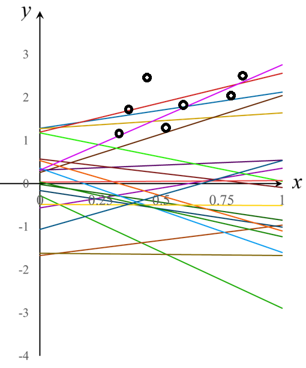

<!-- footer: "機械学習（と統計）第8回" -->

# 機械学習

## 第8回: 法則性の発見+自信のなさの見積もり: ガウス過程回帰

千葉工業大学 上田 隆一

 

This work is licensed under a [Creative Commons Attribution-ShareAlike 4.0 International License](https://creativecommons.org/licenses/by-sa/4.0/).

---

<!-- paginate: true -->

## 今日やること

- ガウス過程回帰

---

## 前回のおさらい

- 回帰を勉強した
    - けど、少ないデータでもひとつにグラフを決めてしまう
- なにが足りないか
    - 第6回のようなベイズ的な考えが抜けている
- ベイズ的な考え方をとりいれた回帰がないか?
    - ある

---

## ベイズ線型回帰

- $y = f(x)$の分布を考える
    - 関数の分布ってなに? $\Rightarrow$ パラメータの分布
    - 例: $y = w_1 x + w_0$の場合: $w_1$と$w_0$の確率分布を考える
        - 右図: $w_1, w_0$それぞれをガウス分布で分布すると考えてサンプリング
            - どちらも平均値$0$、標準偏差$1$
            - データ（黒丸）に合うように、ベイズの定理で$w_1, w_0$の分布を変更していく

---

### ベイズ線型回帰でよくなること

- データ数が少ないときに解を曖昧にしておける
- 事前分布に予測を盛り込める
- パラメータを多めにしておいても不要なものが消えるかもしれない

---

### 回帰のための数式（ややこしいので意味だけ考えましょう）

- 例: 当てはめる式: 多項式 $y = w_0 + w_1 x = f(x | w_0, w_1)$
- 仮定1: $x_i$に対して、$y_i$は$\mathcal{N}\{f(x_i | w_0,w_1), \lambda^{-1}\}$にしたがってばらついた
    - $\mathcal{N}(\mu, \sigma^2)$は平均値$\mu$、分散$\sigma^2$のガウス分布
    - 補足: 分散の逆数$\lambda$は精度と呼ばれる
- 仮定2: $w_0, w_1$も多次元のガウス分布で、最初は大きくばらついている
    - 分布$p(\boldsymbol{w}) = \mathcal{N}(\boldsymbol{w} | \boldsymbol{\mu}, \lambda^{-1}\Lambda^{-1}) \quad$$\leftarrow$これが推定対象
        - $\boldsymbol{w} = (w_0, w_1)$
        - $\boldsymbol{\mu} = (\mu_0, \mu_1)$（$w_0, w_1$の平均値）
        - $\Lambda$は$2\times 2$の行列（精度行列）
- 仮定3: $\lambda$の値も分からないので確率分布で表現（最初は大きくばらつく）
    - こういう分布: $\text{Gam}(\lambda, a, b) = \eta \lambda^{a-1}e^{-b\lambda}$（ガンマ分布）

---

### 回帰の方法

- 事前分布
    - $p_0(w_0, w_1, \lambda) = \mathcal{N}(\boldsymbol{w} | \boldsymbol{\mu}, \lambda^{-1}\Lambda^{-1})\text{Gam}(\lambda, a, b)$
- データ$(x_1, y_1)$をひとつだけ情報として入れた事後分布
