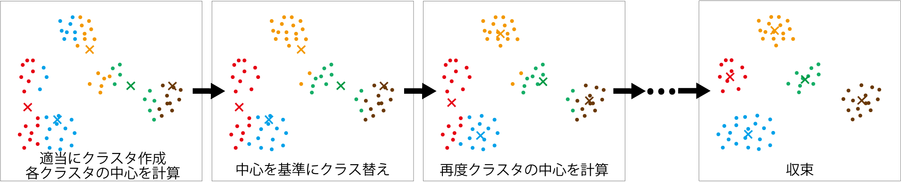

<!-- footer: "機械学習（と統計）第9回" -->

# 機械学習

## 第9回: 動物におけるクラスタリングの役割と古典的手法

千葉工業大学 上田 隆一

 

This work is licensed under a [Creative Commons Attribution-ShareAlike 4.0 International License](https://creativecommons.org/licenses/by-sa/4.0/).

---

<!-- paginate: true -->

## 今日やること

- クラスタリングの重要性
- 古典的手法

---

## クラスタリングの重要性

- 第1回のおさらい
    - 右の図は何に見えますか
    - なんで猫に見えるのか？
- たぶん丸い部分1つと三角の部分1つに点をまとめている（クラスタリングしている）
    - [研究例](chrome-extension://efaidnbmnnnibpcajpcglclefindmkaj/https://www.riken.jp/medialibrary/riken/pr/press/2001/20010727_1/20010727_1.pdf)

---

### まとめると何がわかるか

- たとえば目の前になにがあるかを知りたい場合
    - やらなければいけないこと: 視細胞の反応$\longrightarrow$認識対象（猫など）
        - 多数の刺激$\longrightarrow$「猫」という1単語
        - 「減らす」という作業が脳内で必要となる
            - 減らす=代表値（特徴量）にまとめる
- 左図: 実物の畑の作物と、茎と葉を分類した画像
    - ロボット用
    - いろんな色が3色に減っている
    - 人間は右のような分類結果を（時間をかければ）描ける

---

### 生物以外でのクラスタリングの役割

- いわゆるビッグデータというやつ
    - 膨大なデータから経営方針を決定
- ロボット
    - 動物と同じ
    - 右図: 掴みやすい面を発見するために、掴める箇所をクラスタリングして一番おおきなクラスタのところをつかむ
      - [動画](https://github.com/ryuichiueda/jrsj_color_figs/)

---

### クラスタリングの古典的手法

- ロボット分野で30年前から利用されてきたもの
    - k-means法
    - EM法
- 解く問題
    - 点が散らばっているときに、どれとどれが同じグループに属するか決める

---

## k-means法

- データを適当にクラスタに分けて、以下の繰り返しで収束させる
    - 各クラスタの中心を求める（図中の$\times$印）
    - 各データを最寄りの中心を基準に再度クラスタリング

---

## 数字をk-means法でクラスタリングしてみましょう

- 次の9個の数値を3つのクラスタに分けてみましょう
   - (8, 1, 3), (5, 5, 2), (6, 11, 7)
       - かっこは適当に分けた初期のクラス分けを表します
   - 答えは次のページ
- 注意
    - 平均値が同じになったら所属クラスタは適当に選択のこと
    - あるデータに対して近い平均値が2つ以上になったら（同じ距離になったら）
    元いたクラスを替えてみる

---

### こたえ

- 初期値: (8, 1, 3), (5, 5, 2), (6, 11, 7) $\rightarrow$ クラスタの平均値: 4, 4, 8
- 再配置: (1, 5, 2), (3, 5), (8, 6, 11, 7) $\rightarrow$ クラスタの平均値: 2.666..., 4, 8
- 再配置: (1, 2, 3), (5, 5), (8, 6, 11, 7) $\rightarrow$ クラスタの平均値: 2, 5, 8
- 再配置: (1, 2, 3), (5, 5, 6), (8, 7, 11) $\rightarrow$ クラスタの平均値: 2, 5.333..., 8.666...
- 再配置: (1, 2, 3), (5, 5, 6, 7), (8, 11) $\rightarrow$ クラスタの平均値: 2, 5.75, 9.5
- 再配置: (1, 2, 3), (5, 5, 6, 7), (8, 11) （変わらず。終了）

---

### k-means法の問題（考えてみましょう）

* 最初からクラスタ数を決めていいのか?
    - センサやロボットのプログラミングのときに特に困る
        - たとえば画像に人が何人いるかが知りたい。最初から3人と分かることはあまりない。
    - 次回解決
* クラスタがいびつだったら?
    - これはいびつさを解消するようにデータを変換するか、別の方法を用いる（サポートベクターマシーンなど）
* もっと根本的な問題: データの発生した理由を考えていない（つまり場当たり的）

---

### EM法（最尤法）

- EM: expectation maximization
（どういう意味かはあとで説明）
 
- ある確率分布のモデル（数式）を考え、データを最ももっともらしく
説明するパラメータを求める
    - なんで右図のようなデータが発生したのか?
    $\rightarrow$ データの発生源がいくつかあって、
    そのまわりにデータが発生、と考える

---

### 「データの発生源がいくつかあってそのまわりにデータが発生」

この場合の基本的なモデル: 混合ガウス分布

- 複数のガウス分布を足して、
正規化（積分して1に）したもの
    - $p(\boldsymbol{x} | \boldsymbol{\mu}_{1:n}, \Sigma_{1:n}, \pi_{1:n}) = \pi_1 \mathcal{N}(\boldsymbol{\mu}_1, \Sigma_1)$
    $\qquad+ \pi_2 \mathcal{N}(\boldsymbol{\mu}_2, \Sigma_2) + \dots + \pi_n \mathcal{N}(\boldsymbol{\mu}_n, \Sigma_n)$
        - $\pi_1 + \pi_2 + \dots + \pi_n = 1$
        （注意: 円周率ではなく、混合比率）
- 絵に描くと右図のように
（ちょっと当てはまりは悪いです）

---

### データに対する「一番尤もらしい分布」

- 次の尤度を最大化するものが「一番尤もらしい」と考える
    - $p(\boldsymbol{x}_{1:N} | \boldsymbol{\mu}_{1:n}, \Sigma_{1:n}, \pi_{1:n}) = \prod_{j=1}^N p(\boldsymbol{x}_j | \boldsymbol{\mu}_{1:n}, \Sigma_{1:n}, \pi_{1:n})$
        - 左辺: データ$\boldsymbol{x}_{1:N}$が生成した確率の密度
        - 右辺: 各データ$\boldsymbol{x}_i$の密度の掛け算
        - データは既知なので、最も尤もらしい（最尤な）パラメータ$\boldsymbol{\mu}_{1:n}, \Sigma_{1:n}, \pi_{1:n}$や、その尤度を求める問題に
    - 具体的に書くと
        - 左辺$= \prod_{j=1}^N  \sum_{i=1}^n \pi_i \mathcal{N}(\boldsymbol{x}_j | \boldsymbol{\mu}_i, \Sigma_i)$
- 対数をとって掛け算を足し算にして、対数尤度を最大化する問題にする
    - $\log_e p(\boldsymbol{x}_{1:N} | \boldsymbol{\mu}_{1:n}, \Sigma_{1:n}, \pi_{1:n}) = \sum_{j=1}^N \log_e p(\boldsymbol{x}_j | \boldsymbol{\mu}_{1:n}, \Sigma_{1:n}, \pi_{1:n})$

---

### 対数尤度が最大になるパラメータの求め方（k-means法と似ている）

1. 最初に適当にクラスタリング
2. Mステップ（maximization step）
    - 尤度が最大となる各クラスタの$\boldsymbol{\mu}_{1:n}, \Sigma_{1:n}, \pi_{1:n}$を算出
3. Eステップ（expectation step）
    - $\boldsymbol{\mu}_{1:n}, \Sigma_{1:n}, \pi_{1:n}$に基づきデータをクラスタリング
        - その時点での各データのクラスタへの所属（の期待値）を計算

---

### 潜在変数の導入と潜在変数の分布

- 各データ$\boldsymbol{x}_i$がどのクラスタに所属するかを求めたいのに変数が定義されていない
    - 変数$z_i$を導入
        - 例: $z_i = 1$: $\boldsymbol{x}_i$は1番目のクラスタに所属
- $z_i$の確率分布$q(z_i)$が考えられる
    - 例: $q(z_i = 1) =0.5, q(z_i = 2)=0.5$
        - $\boldsymbol{x}_i$はクラスタ1、2のどちらかに50%の確率で所属
- さらに全データに関する$z_i$の確率分布$q(z_{1:N})$が考えられる

---

### 潜在変数によって3ページ前の式を変形

- $p(\boldsymbol{x}_{1:N} | \boldsymbol{\mu}_{1:n}, \Sigma_{1:n}, \pi_{1:n}) = p(\boldsymbol{x}_{1:N} | \boldsymbol{\Theta})$とおくと
    - $p(\boldsymbol{x}_{1:N}, z_{1:N} | \boldsymbol{\Theta}) = p(z_{1:N} | \boldsymbol{x}_{1:N}, \boldsymbol{\Theta})p(\boldsymbol{x}_{1:N} | \boldsymbol{\Theta})$
    $\Longrightarrow \log_e p(\boldsymbol{x}_{1:N} | \boldsymbol{\Theta}) = \log_e p(\boldsymbol{x}_{1:N}, z_{1:N} | \boldsymbol{\Theta}) - \log_e p(z_{1:N} | \boldsymbol{x}_{1:N}, \boldsymbol{\Theta})$
- つまり
    - 対数尤度 $= \log_e p(\boldsymbol{x}_{1:N}, z_{1:N} | \boldsymbol{\Theta}) - \log_e p(z_{1:N} | \boldsymbol{x}_{1:N}, \boldsymbol{\Theta})$
    $\qquad\quad= \log_e p(\boldsymbol{x}_{1:N}, z_{1:N} | \boldsymbol{\mu}_{1:n}, \Sigma_{1:n}, \pi_{1:n})$
    $\qquad\quad - \log_e p(z_{1:N} | \boldsymbol{x}_{1:N}, \boldsymbol{\mu}_{1:n}, \Sigma_{1:n}, \pi_{1:n})$
