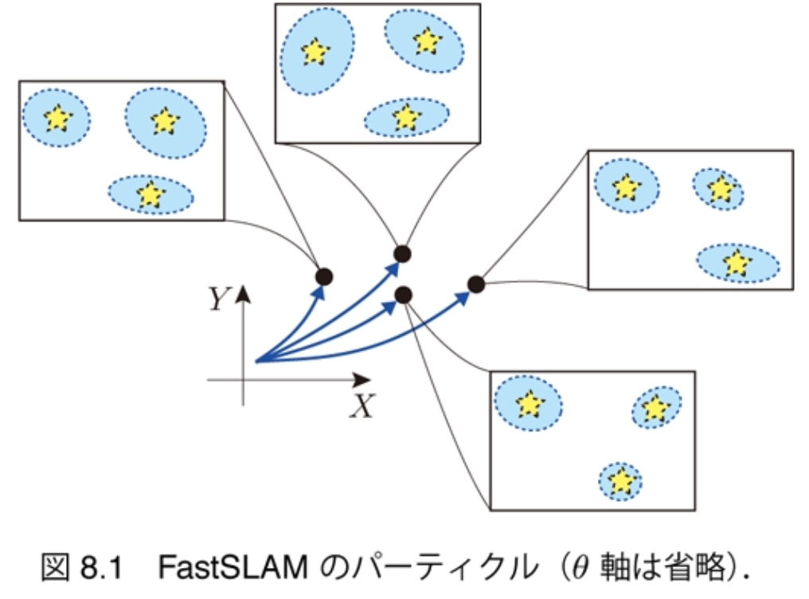
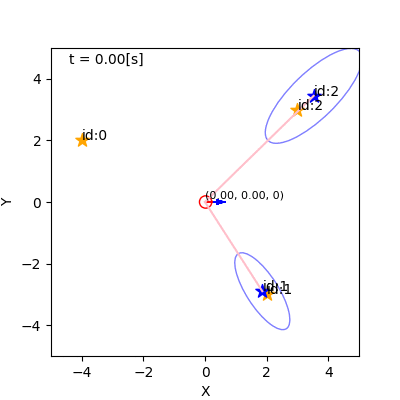
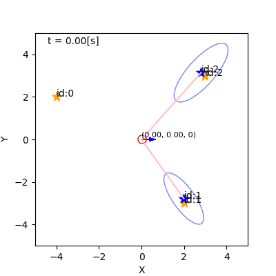

<!-- footer: 確率ロボティクス第10回 -->

# 確率ロボティクス第10回: FastSLAM

千葉工業大学 上田 隆一

図の一部は詳解確率ロボティクスから転載しています．

$$\newcommand{\V}[1]{\boldsymbol{#1}}$$
$$\newcommand{\jump}[1]{[\![#1]\!]}$$
$$\newcommand{\bigjump}[1]{\big[\!\!\big[#1\big]\!\!\big]}$$
$$\newcommand{\Bigjump}[1]{\bigg[\!\!\bigg[#1\bigg]\!\!\bigg]}$$

---

<!-- paginate: true -->

### 本章でやること

- SLAMの問題を理解
- FastSLAMの導出と実装

---

### SLAM

- simultaneous localization and mapping
    - 自己位置推定と地図生成を同時に実行すること 　
- ランドマークの位置が分からないのに自己位置推定できるのか？
    - 素直に次のようにすればできる
        1. 白地図を用意
        2. ロボットの初期姿勢を原点にして世界座標系を設定
        3. 移動して姿勢を更新し、ロボットが観測したものを世界座標系の位置に変換して白地図に書き込むことを繰り返す

ただし雑音が厄介

---

## 逐次SLAMの解き方（詳解8.1節）

- SLAM問題: $b_t(\V{x}_{1:t}, \textbf{m}) = p(\V{x}_{1:t}, \textbf{m} | \V{x}_0, \V{u}_{1:t}, \textbf{z}_{1:t})$を計算
   - ここで
       - $\V{x}_{1:t}$: ロボットの姿勢の履歴（軌跡）
       - $\textbf{m}$: 地図（全ランドマークの位置）
           - $\textbf{m} = \\{\V{m}_0, \V{m}_1, \dots, \V{m}_{N_\textbf{m}}\\}$
   - 用途
       - 地図が未知の自己位置推定
       - 地図と履歴を利用（$b_t$を最大化する$\V{x}_{1:t}, \textbf{m}$だけ求める）
       - 地図を利用（$b_t$を最大化する$\textbf{m}$だけ求める）

いずれにせよ非常に多次元の分布を求めることに

---

### Rao-Blackwellization

- 分布が多次元すぎて扱えないので変形
    - 軌跡の分布と地図の分布に分解できる（ラオ・ブラックウェル化）
$b_t(\boldsymbol{x}_{1:t}, \textbf{m}) = p(\boldsymbol{x}_{1:t},\textbf{m} | \boldsymbol{x}_{0}, \boldsymbol{u}_{1:t}, \textbf{z}_{1:t})$
$= p(\textbf{m} | \boldsymbol{x}_{1:t}, \boldsymbol{x}_0, \boldsymbol{u}_{1:t}, \textbf{z}_{1:t}) p(\boldsymbol{x}_{1:t} | \boldsymbol{x}_0, \boldsymbol{u}_{1:t}, \textbf{z}_{1:t})$（乗法定理）
$= p(\boldsymbol{x}_{1:t} | \boldsymbol{x}_0, \boldsymbol{u}_{1:t}, \textbf{z}_{1:t})
p(\textbf{m} | \boldsymbol{x}_{0:t}, \boldsymbol{u}_{1:t}, \textbf{z}_{1:t})$ （左右入れ替え）
$= p(\boldsymbol{x}_{1:t} | \boldsymbol{x}_0, \boldsymbol{u}_{1:t}, \textbf{z}_{1:t})
p(\textbf{m} | \boldsymbol{x}_{0:t}, \textbf{z}_{1:t})$ （不要な条件を削除）
    - 左の分布の軌跡をパーティクルで表す
    $\Longrightarrow$パーティクルごとに地図を推定する問題に分解される
        - Rao-Blackwellized particle filter（RBPF）
        という種類のパーティクルフィルタに

---

### ランドマークごとに問題を分解

- $\textbf{m}$をランドマークごとの式に分解
    - $b_t(\boldsymbol{x}_{1:t}, \textbf{m}) 
  = p(\boldsymbol{x}_{1:t} | \boldsymbol{x}_0, \boldsymbol{u}_{1:t}, \textbf{z}_{1:t})
  \prod_{j=0}^{N_\textbf{m}-1} p(\boldsymbol{m}_j | \boldsymbol{x}_{0:t}, \V{z}_{j, 1:t})$
        - センサ値のないランドマークについては$p(\boldsymbol{m}_j | \boldsymbol{x}_{0:t}, \V{z}_{j, 1:t}) = 1$とする　
- 確率分布$p(\boldsymbol{m}_j | \boldsymbol{x}_{0:t}, \V{z}_{j,1:t})$の計算: 単なる測量
    - 軌跡$\boldsymbol{x}_{0:t}$が分かっている前提でセンサ値の履歴$\V{z}_{j,1:t}$から求めた$\boldsymbol{m}_j$の分布　
- 残っている問題
    - $p(\boldsymbol{x}_{1:t} | \boldsymbol{x}_0, \boldsymbol{u}_{1:t}, \textbf{z}_{1:t})$をパーティクルでどう計算するか
    - 履歴を使うとリアルタイム性が保てない

---

## 逐次式への変換（ただし未遂）（詳解8.1.2項）

- やること
    - 履歴を式から追い出す
    - $b_{t-1}$から$\hat{b}_t$、$\hat{b}_t$から$b_t$を計算する方法を考案

---

### 移動後の更新

- $\textbf{z}_t$が入る前の信念分布
    - $\hat{b}_t(\V{x}_{1:t}, \textbf{m}) = p(\V{x}_{1:t} | \V{x}_0, \V{u}_{1:t}, \textbf{z}_{1:t-1}) \prod_{j=0}^{N_\textbf{m}-1} p(\V{m}_j | \V{x}_{0:t}, \V{z}_{j,1:t-1})$　
- 右辺の左側の分布を変形
    - $p(\V{x}_{1:t} | \V{x}_0, \V{u}_{1:t}, \textbf{z}_{1:t-1})$
    $\begin{align}
&=
p(\boldsymbol{x}_t | \boldsymbol{x}_0, \boldsymbol{u}_{1:t}, \textbf{z}_{1:t-1}, \boldsymbol{x}_{1:t-1})
p(\boldsymbol{x}_{1:t-1} | \boldsymbol{x}_0, \boldsymbol{u}_{1:t}, \textbf{z}_{1:t-1}) \\
&=
p(\boldsymbol{x}_t | \boldsymbol{x}_{t-1},\boldsymbol{u}_t)
p(\boldsymbol{x}_{1:t-1} | \boldsymbol{x}_0, \boldsymbol{u}_{1:t-1}, \textbf{z}_{1:t-1}) 
\end{align}$
    - 最後の式の右側の分布と、$\hat{b}_t$の$\prod$の部分をかけると$b_{t-1}$に　
- $\Longrightarrow\hat{b}_t(\V{x}_{0:t},\textbf{m}) = p(\V{x}_t | \V{x}_{t-1}, \V{u}_t)b_{t-1}(\V{x}_{0:t-1},\textbf{m})$
    - MCLと同様の逐次式に

---

### 観測後の軌跡の更新

- $\textbf{z}_t$が入ったあとの信念分布
    - $b_t(\V{x}_{1:t}, \textbf{m})= p(\V{x}_{1:t} | \V{x}_0, \V{u}_{1:t}, \textbf{z}_{1:t}) \prod_{j=0}^{N_\textbf{m}-1} p(\V{m}_j | \V{x}_{0:t}, \V{z}_{j,1:t})$　
- ベイズの定理で右辺の左側の分布を変形
    - $p(\V{x}_{1:t} | \V{x}_0, \V{u}_{1:t}, \textbf{z}_{1:t})$
    $= \eta p(\textbf{z}_t | \V{x}_0, \V{u}_{1:t}, \textbf{z}_{1:t-1}, \V{x}_{1:t}) p(\V{x}_{1:t} | \V{x}_0, \V{u}_{1:t}, \textbf{z}_{1:t-1})$
    $= \eta p(\textbf{z}_t | \V{x}_{0:t}, \V{u}_{1:t}, \textbf{z}_{1:t-1}) p(\V{x}_{1:t} | \V{x}_0, \V{u}_{1:t}, \textbf{z}_{1:t-1})$
        - 左側の分布: 今までの履歴からセンサ値を占う分布
        - 右側の分布: 今までの履歴から軌跡を占う分布

地図がないので逐次化できない

---

### 観測後の地図の更新

- $\textbf{z}_t$が入ったあとの信念分布（再掲）
    - $b_t(\V{x}_{1:t}, \textbf{m}) = p(\V{x}_{1:t} | \V{x}_0, \V{u}_{1:t}, \textbf{z}_{1:t}) \prod_{j=0}^{N_\textbf{m}-1} p(\V{m}_j | \V{x}_{0:t}, \V{z}_{j,1:t})$　
- ベイズの定理で右辺の右側の分布を変形
    - $p(\V{m}_j | \V{x}_{0:t}, \V{z}_{j,1:t})$
    $= \eta_j  p(\V{z}_{j,t} | \V{m}_j, \V{x}_{0:t}, \V{z}_{j,1:t-1}) p(\V{m}_j | \V{x}_{0:t}, \V{z}_{j,1:t-1})$
    $= \eta_j  p(\V{z}_{j,t} | \V{m}_j, \V{x}_t) p(\V{m}_j | \V{x}_{0:t}, \V{z}_{j,1:t-1})$
    $= \eta_j  p(\V{z}_{j,t} | \V{m}_j, \V{x}_t) p(\V{m}_j | \V{x}_{0:t-1}, \V{z}_{j,1:t-1})$
        - ただしセンサ値$\V{z}_{j,t}$が存在しないときは$p(\V{m}_j | \V{x}_{0:t}, \V{z}_{j,1:t}) = p(\V{m}_j | \V{x}_{0:t}, \V{z}_{j,1:t-1})$と解釈

地図の更新は（$\V{m}_j$が分からないけど）$p(\V{z}_{j,t} | \V{m}_j, \V{x}_t)$をかけるだけの逐次式に

---

### $\hat{b}_t$から$b_t$への更新式

- 前の2ページをまとめると
    - $b_t(\V{x}_{0:t},\textbf{m}) = \left\{\eta p(\textbf{z}_t | \V{x}_{0:t}, \V{u}_{1:t}, \textbf{z}_{1:t-1}) \prod_{\V{z}_{j,t} \in \textbf{z}_t} \eta_j p(\V{z}_{j,t}| \V{m}_j, \V{x}_t) \right\} \hat{b}_t(\V{x}_{0:t},\textbf{m})$
        - $\{\}$の中身: 前の2ページの計算で増えた因子

移動後の更新と違い、逐次式にならないし、計算方法も分からない

---

## パーティクルフィルタによる演算 （詳解8.2節）

- 次のようなパーティクルを仮に導入
    - $\xi_t^{(i)} = ( \boldsymbol{x}_{0:t}^{(i)}, w_t^{(i)}, \hat{\textbf{m}}_t^{(i)} )$
    $(i=0,1,2,\dots,N-1)$
        - $\hat{\textbf{m}}_t^{(i)}$: 地図の分布の変数
            - 各ランドマークの位置や, その不確かさを表す変数
    - 各パーティクルが軌跡の推定値と推定地図を持つ（右図）
        - 軌跡は決定論的、地図は確率的
        （RBPFのパーティクルになっている）

---

## 移動後の軌跡の更新（詳解8.2.1項）

- 手続き（MCLとほぼ同じ）
    - すべてのパーティクル$\xi_{t-1}^{(i)}$に対し
        1. $\V{x}_t \sim p(\V{x}_t | \V{x}_{t-1}, \V{u}_t)$
        2. $\V{x}_t$を$\V{x}_{0:t-1}^{(i)}$にくっつけて$\V{x}_{0:t}^{(i)}$に　
- この手続きでは時刻$t-2$以前の履歴を使わない
    - あとの手続きでも同様なら履歴を使わないで済むかもしれない

---

## 観測後の地図の更新（詳解8.2.2項）

- 各パーティクルの持つ地図の情報を次のように表現
    - $\hat{\textbf{m}}_t^{(i)} = \{ \hat{\boldsymbol{m}}_{j,t}^{(i)}, \Sigma_{j,t}^{(i)} | j=0,1,2,\dots,N_\textbf{m}-1 \}$
        - 各ランドマークの位置推定をガウス分布$\mathcal{N}(\hat{\boldsymbol{m}}_{j,t}^{(i)}, \Sigma_{j,t}^{(i)})$で表し、
        カルマンフィルタを使って計算
- ランドマークの位置推定の式をパーティクル仕様に
    - $p(\V{m}_j | \V{x}_{0:t}, \V{z}_{j,1:t}) = \eta_j  p(\V{z}_{j,t} | \V{m}_j, \V{x}_t) p(\V{m}_j | \V{x}_{0:t-1}, \V{z}_{j,1:t-1})$$\Longrightarrow$
$p(\V{m}_j | \hat{\V{m}}_{j,t}^{(i)}, \Sigma_{j,t}^{(i)}) = \eta_j  p(\V{z}_{j,t} | \V{m}_j, \V{x}_t^{(i)}) p(\V{m}_j | \hat{\V{m}}_{j,t-1}^{(i)}, \Sigma_{j,t-1}^{(i)})$
        - パーティクルごとに$\V{m}_j$を推定するためには
             - $\V{x}_{0:t}$をパーティクルの軌跡で置き換え
             - $p(\V{m}_j | \V{x}_{0:t-1}, \V{z}_{j,1:t-1})$を、パーティクルを使って計算した結果である$p(\V{m}_j | \hat{\V{m}}_{j,t-1}^{(i)}, \Sigma_{j,t-1}^{(i)})$で置き換え（どう計算するかはまだ不明）
        - 逐次式になっている

---

## 観測後の重みの更新（詳解8.2.3項）

- スライド9ページの次の式をパーティクルを使って表現
    - $p(\V{x}_{1:t} | \V{x}_0, \V{u}_{1:t}, \textbf{z}_{1:t}) = \eta p(\textbf{z}_t | \V{x}_{0:t}, \V{u}_{1:t}, \textbf{z}_{1:t-1}) p(\V{x}_{1:t} | \V{x}_0, \V{u}_{1:t}, \textbf{z}_{1:t-1})$
$\Longrightarrow w_t^{(i)} = p(\textbf{z}_t | \boldsymbol{x}_{0:t}^{(i)}, \boldsymbol{u}_{1:t}, \textbf{z}_{1:t-1}) w_{t-1}^{(i)}$
$\Longrightarrow w_t^{(i)} = p(\textbf{z}_t | \boldsymbol{x}_{0:t}^{(i)}, \textbf{z}_{1:t-1}) w_{t-1}^{(i)}$

$p(\textbf{z}_t | \boldsymbol{x}_{0:t}^{(i)}, \textbf{z}_{1:t-1})$をどう計算する？

---

### $p(\textbf{z}_t | \boldsymbol{x}_{0:t}^{(i)}, \textbf{z}_{1:t-1})$の計算

- 加法定理を使って地図を登場させる
    - $p(\textbf{z}_t | \V{x}_{0:t}^{(i)}, \textbf{z}_{1:t-1}) = \langle p(\textbf{z}_t, \textbf{m} | \V{x}_{0:t}^{(i)}, \textbf{z}_{1:t-1}) \rangle_\textbf{m}$
$= \langle p(\textbf{z}_t | \textbf{m}, \V{x}_{0:t}^{(i)}, \textbf{z}_{1:t-1}) p(\textbf{m} | \V{x}_{0:t}^{(i)}, \textbf{z}_{1:t-1}) \rangle_\textbf{m}$
$= \big\langle p(\textbf{z}_t | \textbf{m}, \V{x}_{0:t}^{(i)}, \textbf{z}_{1:t-1}) \big\rangle_{ p(\textbf{m} | \V{x}_{0:t}^{(i)}, \textbf{z}_{1:t-1}) }$
$= \big\langle p(\textbf{z}_t | \textbf{m}, \V{x}_t^{(i)}) \big\rangle_{ p(\textbf{m} | \V{x}_{0:t-1}^{(i)}, \textbf{z}_{1:t-1}) } \\ = \big\langle p(\textbf{z}_t | \textbf{m}, \V{x}_t^{(i)}) \big\rangle_{ p(\textbf{m} | \hat{\textbf{m}}_{t-1}^{(i)}) }$
        - ここで$p(\textbf{m} | \hat{\textbf{m}}_{t-1}^{(i)})$は、スライド14ページの$p(\V{m}_j | \hat{\V{m}}_{j,t-1}^{(i)}, \Sigma_{j,t-1}^{(i)})$を
全ランドマークの推定位置の同時分布にしたもの　

（どう計算するかはともかく）履歴にたよらず計算可能

---

## 8.2.4 最終的なパーティクルの定義と操作方法

- これまでの計算をまとめると履歴が不要に
    - 移動後の更新
        - $\V{x}_t^{(i)} \sim p(\V{x} | \V{x}_{t-1}^{(i)}, \V{u}_t)$
    - 観測後の更新
        - 重み: $w_t^{(i)} = w_{t-1}^{(i)} \big\langle p(\textbf{z}_t | \textbf{m}, \V{x}_t^{(i)}) \big\rangle_{	p(\textbf{m} | \hat{\textbf{m}}_{t-1}^{(i)}) }$
        - 地図: $p(\V{m}_j | \hat{\V{m}}_{j,t}^{(i)}, \Sigma_{j,t}^{(i)})\approx \eta_j p(\V{z}_{j,t}| \V{m}_j, \V{x}_t^{(i)}) p(\V{m}_j | \hat{\V{m}}_{j,t-1}^{(i)}, \Sigma_{j,t-1}^{(i)})$
            - カルマンフィルタを使うので近似　
- パーティクルから履歴を追い出して再定義
    - $\xi_t^{(i)} = ( \V{x}_t^{(i)}, w_t^{(i)}, \hat{\textbf{m}}_t^{(i)} )\quad$$(i=0,1,2,\dots,N-1)$
        - ただし、姿勢については$\V{x}_t$でなく$\V{x}_{0:t}$を推定していることに注意

---

## 8.3 パーティクルの実装

- 本書のシミュレータではMCLのクラスを継承して作成
    - 各パーティクルに全ランドマークの推定位置と共分散行列を追加　
- 下図
    - 姿勢推定に関しては今のところMCLなのでそのまま動作
        - 移動時の処理は変更の必要すらない
        - 観測時の処理は以後のスライドで書き換え
    - 地図はまだ推定できないので描画は適当

---

## 8.4 ランドマークの位置推定の実装

- やること
    - 実装レベルまで次の更新式を変形
        - 地図: $p(\V{m}_j | \hat{\V{m}}_{j,t}^{(i)}, \Sigma_{j,t}^{(i)})\approx \eta_j p(\V{z}_{j,t}| \V{m}_j, \V{x}_t^{(i)}) p(\V{m}_j | \hat{\V{m}}_{j,t-1}^{(i)}, \Sigma_{j,t-1}^{(i)})$
        - 重み: $w_t^{(i)} = w_{t-1}^{(i)} \big\langle p(\textbf{z}_t | \textbf{m}, \V{x}_t^{(i)}) \big\rangle_{	p(\textbf{m} | \hat{\textbf{m}}_{t-1}^{(i)}) }$

---

## 8.4.1 更新則の導出

- 地図の推定の式を実装できるように変形していく
    - パーティクルとランドマークのIDを表す添字は省略
    - $p(\V{m} | \hat{\V{m}}_{t}, \Sigma_{t}) = \eta p(\V{z}_{t}| \V{m}, \V{x}_t) p(\V{m} | \hat{\V{m}}_{t-1}, \Sigma_{t-1}) \\ = \eta \exp\big\{ -\frac{1}{2} \big[ \V{z}_t - \V{h}(\V{m}) \big]^\top Q_{\V{m}}^{-1} \big[ \V{z}_t - \V{h}(\V{m}) \big]  \\ \qquad -\frac{1}{2} ( \V{m} - \hat{\V{m}}_{t-1})^\top \Sigma_{t-1}^{-1} ( \V{m} - \hat{\V{m}}_{t-1}) \big\}$
        - 6章のカルマンフィルタでセンサ値の反映に使った式と同じような式だが、姿勢が定数でランドマークの位置が変数に逆転

---

### 線形化

- $p(\V{m} | \hat{\V{m}}_{t}, \Sigma_{t}) = \eta \exp\big\{ -\frac{1}{2} \big[ \V{z}_t - \V{h}(\V{m}) \big]^\top Q_{\V{m}}^{-1} \big[ \V{z}_t - \V{h}(\V{m}) \big]$$ -\frac{1}{2} ( \V{m} - \hat{\V{m}}_{t-1})^\top \Sigma_{t-1}^{-1} ( \V{m} - \hat{\V{m}}_{t-1}) \big\}$を$\V{m}$のガウス分布に　
- 手順
    1. $\V{h}$を線形化して$\V{m}$の多項式に
        - $\V{h}(\V{m}) \approx \V{h}(\hat{\V{m}}_{t-1}) + H (\V{m} - \hat{\V{m}}_{t-1})$
            - $H = \dfrac{\partial \V{h}}{\partial \V{m}}\Big|_{\V{m} = \hat{\V{m}}_{t-1}}$
    2. $Q_{\V{m}}$を定数に
        - $Q(\V{m})$を$Q(\hat{\V{m}}_{t-1})$で代用（以後、$Q$と表記）　
- これで指数部が$\V{m}$の多項式に（次のスライド）

---

### ランドマーク位置推定の更新式

- $p(\V{m} | \hat{\V{m}}_{t}, \Sigma_{t})$の指数部
    - $-\frac{1}{2} \big[ \V{z}_t - \V{h}(\hat{\V{m}}_{t-1}) - H(\V{m} - \hat{\V{m}}_{t-1} )  \big]^\top Q_{\hat{\V{m}}_{t-1}}^{-1} \big[（略）\big] \\ -\frac{1}{2} ( \V{m} - \hat{\V{m}}_{t-1})^\top \Sigma_{t-1}^{-1} ( \V{m} - \hat{\V{m}}_{t-1})$　
- 1次、2次の項を整理して分布の更新式を算出
    - $\hat{\V{m}}_t = K \left[\V{z}_t - \V{h}(\hat{\V{m}}_{t-1}) \right] + \hat{\V{m}}_{t-1}$
        - $K = \Sigma_{t-1} H^\top ( Q + H \Sigma_{t-1} H^\top )^{-1}$
        - センサ値で求まるズレ$[\V{z}_t - \V{h}(\hat{\V{m}}_{t-1})]$の$K$倍だけ位置を修正
    - $\Sigma_t = (I - KH ) \Sigma_{t-1}$
        - 割合にして$KH$だけ共分散行列が縮小　

各パーティクルの各ランドマーク位置推定に適用

---

## 8.4.2 初期値の設定方法の導出

- ガウス分布$\mathcal{N}(\V{m} | \hat{\V{m}}_{t}, \Sigma_{t})$をいつ準備するか
    - 本書では最初に得られたセンサ値で初期化
    - センサ値が得られる前に初期化してもよさそうだが線形化による悪影響が心配　
- センサ値$\V{z}_t$が得られたときに、尤度で初期化
    - $p(\V{m} | \V{z}_t) = \eta p(\V{z}_t|\V{m},\V{x}_t) = \eta \exp\left\{ -\frac{1}{2} \left[ \V{z}_t - \V{h}(\V{m}) \right]^\top Q(\V{m})^{-1} \left[ \V{z}_t - \V{h}(\V{m}) \right] \right\}$
         - $\V{x}_t$はパーティクルの姿勢
         - パーティクルごとにランドマーク位置推定を初期化することに
         - 線形化しないとガウス分布にならないので線形化

---

### 線形化と初期の分布の導出

- 分布の指数部
    - $-\frac{1}{2} \left[ \V{z}_t - \V{h}(\V{m}) \right]^\top Q(\V{m})^{-1} \left[ \V{z}_t - \V{h}(\V{m}) \right]$　
- $\V{h}$を近似して$\V{m}$の多項式に
    - $\V{h}(\V{m}) \approx \hat{\V{m}} + H (\V{m} - \hat{\V{m}})$
        - $\hat{\V{m}}$はパーティクルの姿勢とセンサ値から計算されるランドマークの位置
- $Q(\V{m})$を定数に
    - $\V{m}$の代わりに$\hat{\V{m}}$を使用（$Q(\V{m})$を以後$Q$と表記）　
- 得られる共分散行列
    - $\Sigma_t = ( H^\top Q^{-1} H )^{-1}$
    - $\hat{\V{m}}$と$\Sigma_t$で初期化すればよい

---

## 8.4.3 実装

- ここまでを実装すると一応動くように
    - 重みの計算がまだ
- 図
    - 地図はPythonのリストの先頭にいるパーティクルのもの
        - 本当はパーティクルの数だけ地図が存在することに注意
    - ランドマーク位置推定について、初期化と更新の様子が見られる

---

## 8.5 重みの更新の実装

- 重みの式を変形して個々のランドマークの尤度の掛け算に
    - $w_t^{(i)} = w_{t-1}^{(i)} \big\langle p(\textbf{z}_t | \textbf{m}, \V{x}_t^{(i)}) \big\rangle_{	p(\textbf{m} | \hat{\textbf{m}}_{t-1}^{(i)}) } \\ = w_{t-1}^{(i)} \prod_{\boldsymbol{z}_{j,t} \in \textbf{z}_t} \big\langle p(\boldsymbol{z}_{j,t} | \boldsymbol{m}_j, \boldsymbol{x}_t^{(i)}) \big\rangle_{ p(\boldsymbol{m}_j | \hat{\boldsymbol{m}}_{j,t-1}^{(i)}, \Sigma_{j,t-1}) }$　
- 個々のランドマークの尤度をさらに変形（添字は省略）
    - $\big\langle p(\V{z}_t | \V{m}, \V{x}_t) \big\rangle_{ p(\V{m} | \hat{\V{m}}_{t-1}, \Sigma_{t-1}) } = \eta \Big[\!\!\Big[ \exp\big\{ -\frac{1}{2} \big[ \V{z}_t - \V{h}(\V{m}) \big]^\top Q({\V{m}})^{-1} \big[ \V{z}_t - \V{h}(\V{m}) \big] \\ \qquad\qquad\qquad\qquad\qquad\qquad -\frac{1}{2} ( \V{m} - \hat{\V{m}}_{t-1})^\top \Sigma_{t-1}^{-1} ( \V{m} - \hat{\V{m}}_{t-1}) \big\} \Big]\!\!\Big]_\V{m}$
        - ランドマークの位置推定のときに出てきた$p(\V{m}|\hat{\V{m}}_t, \Sigma_t)$の式と同じ
        - 今度は分布を近似するのではなく、値を求めなければならない

---

### 尤度の算出手順

- 前ページで得た式を変数$\V{z}_t$のガウス分布に近似
    - カルマンフィルタの章で移動後の分布を求める際に使ったテクニックを利用し、$\V{z}_t$の分布と$\V{m}$の分布を分離して後者を消去
        - 参考: 前ページ最後の式の積分
            - $ [\![ \exp \{ -\frac{1}{2} \big[ \V{z}_t - \V{h}(\V{m}) \big]^\top Q({\V{m}})^{-1} \big[ \V{z}_t - \V{h}(\V{m}) \big] -\frac{1}{2} ( \V{m} - \hat{\V{m}}_{t-1})^\top \Sigma_{t-1}^{-1} ( \V{m} - \hat{\V{m}}_{t-1}) \} ]\!]_\V{m}$
        - このように$\V{m}$の分布を消去
            - $\big\langle p(\V{z}_t | \V{m}, \V{x}_t) \big\rangle_{ p(\V{m} | \hat{\V{m}}_{t-1}, \Sigma_{t-1}) } = \eta \exp\{L(\V{z}_t) \} \big[\!\!\big[ L'(\V{m}) \big]\!\!\big]_\V{m} = \eta\exp \{ L(\V{z}_t) \}$
        - ここで$L(\V{z}_t)$は次のような式になる（センサ値$\V{z}_t$から値を計算可能）
            - $L(\V{z}_t) = -\frac{1}{2}[\V{z}_t -\V{h}(\hat{\V{m}}_{t-1})]^\top [H\Sigma_{t-1}H^\top + Q(\hat{\V{m}}_{t-1})]^{-1}[\V{z}_t -\V{h}(\hat{\V{m}}_{t-1})]$　
- 求まる尤度の性質
    - 時刻$t-1$の時点でのランドマーク推定位置からセンサ値$\V{z}_t$が離れていると値が小さく
    - 計算に使う分布の共分散行列は、ランドマークの推定位置の曖昧さを表す$H\Sigma_{t-1}H^\top$とセンサ値の曖昧さを表す$Q$の和

---

### FastSLAMの完成

- 重みの計算が入り、リサンプリングが働くように
- 重みは姿勢ではなくこれまでの軌跡の重み
    - MCLと異なることに注意

