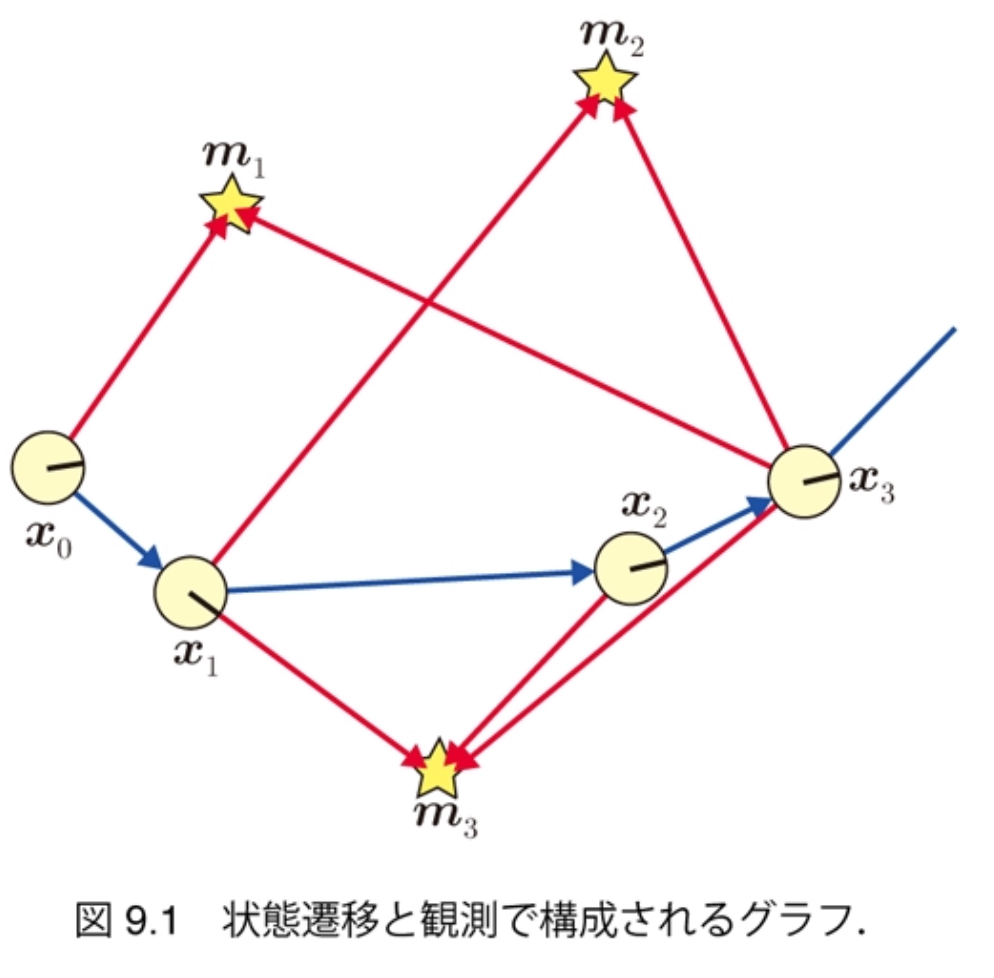
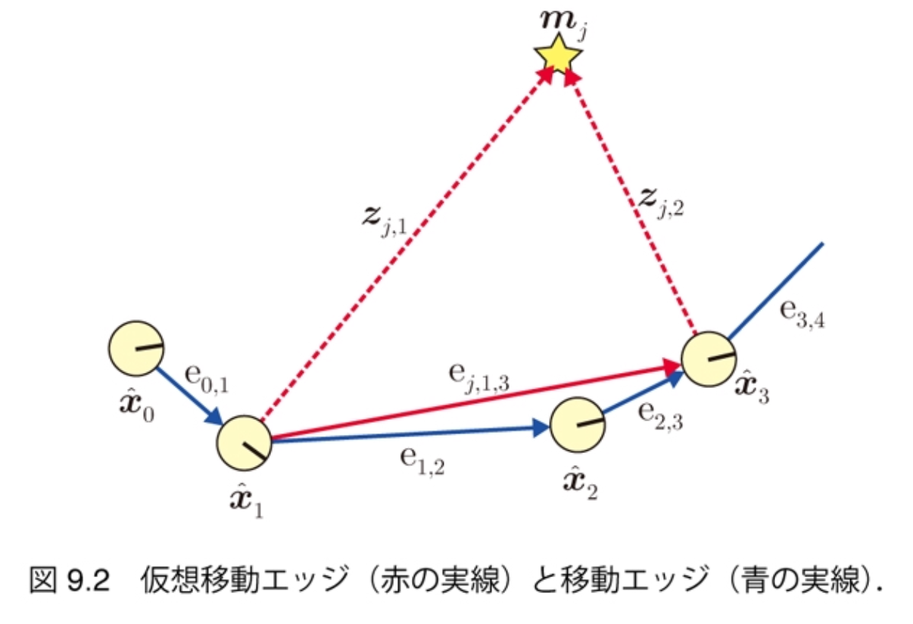
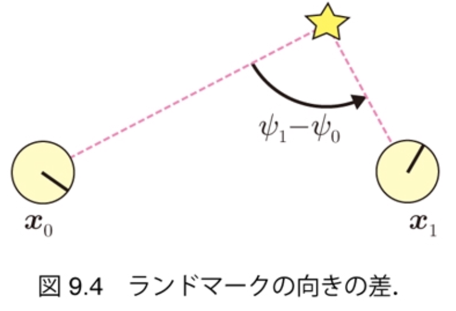
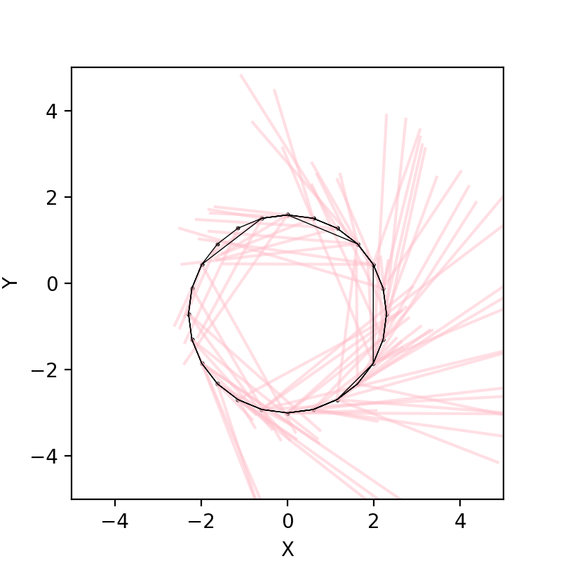

<!-- footer: 確率ロボティクス第11回 -->

# 確率ロボティクス第11回: グラフ表現によるSLAM

千葉工業大学 上田 隆一

図の一部は詳解確率ロボティクスから転載しています．

$$\newcommand{\V}[1]{\boldsymbol{#1}}$$
$$\newcommand{\jump}[1]{[\![#1]\!]}$$
$$\newcommand{\bigjump}[1]{\big[\!\!\big[#1\big]\!\!\big]}$$
$$\newcommand{\Bigjump}[1]{\bigg[\!\!\bigg[#1\bigg]\!\!\bigg]}$$

---

<!-- paginate: true -->

### グラフベースSLAM

- グラフ（グラフ理論のもの）を用いたSLAM
    - ノード（頂点）: ロボットの姿勢やランドマークの位置 
    - エッジ（辺）: ノードの相対位置情報
        - デッドレコニング、センサ値
- グラフに「歪み」
    - エッジの相対位置情報が互いに矛盾
    - 歪みを最小化するようにノードを移動$\Longrightarrow$最尤な地図と軌跡

---

## 問題の定式化（詳解9.1節）

- 8章のSLAMの式（少し改変）からスタート
    - $p(\V{x}_{1:T}, \textbf{m} | \V{x}_0, \V{u}_{1:T}, \textbf{z}_{0:T})$
        - $T$: ロボットが移動、観測を終了する時刻
        - $\textbf{z}_0$の存在を仮定（あとで不要に）　
- FastSLAM同様、軌跡の分布と地図の分布に分離
    - $p(\V{x}_{1:T}, \textbf{m} | \V{x}_0, \V{u}_{1:T}, \textbf{z}_{0:T}) = p(\V{x}_{1:T} | \V{x}_0, \V{u}_{1:T}, \textbf{z}_{0:T}) p(\textbf{m} | \V{x}_{0:T}, \textbf{z}_{0:T})$　
- FastSLAMと異なり、次の手順を踏む
    - $\V{x}_{1:T}^* = \text{argmax}_{\V{x}_{1:T}} p(\V{x}_{1:T} | \V{x}_0, \V{u}_{1:T}, \textbf{z}_{0:T})$で軌跡を算出
    - $\textbf{m}^* = \text{argmax}_{\textbf{m}} p(\textbf{m} | \V{x}_0, \V{x}_{1:T}^-, \textbf{z}_{0:T})$で地図を算出

推定というより最適化

---

## 軌跡の算出問題（詳解9.1.1項）

- 解く問題（「ポーズ調整」と呼ばれる）
    - $\V{x}_{0:T}^* = \text{argmax}_{\V{x}_{0:T}} p(\V{x}_{0:T} | \hat{\V{x}}_0, \V{u}_{1:T}, \textbf{z}_{0:T})$
        - 前ページと違って$\V{x}_0$を変数に
        - 条件にあった$\V{x}_0$を仮に$\hat{\V{x}}_0$としておく
            - $\V{x}_0$と$\hat{\V{x}}_0$は計算上の都合でちょっとだけずれる
- 解き方
    1. 初期値$\hat{\V{x}}_{0:T}$を決める
        - とりあえず$\V{u}_{1:T}$と状態方程式から雑音を考慮せずに計算
    2. 上の式の右辺の値が大きくなるように$\hat{\V{x}}_{0:T}$を動かしていく

---

### グラフの構成

- 位置情報で関係（拘束）のあるノードをエッジでつなぐ
    1. 時刻が前後するノードは状態方程式で
    互いに関係
        - 移動エッジ:$\text{e}_{t_1,t_2} = (\hat{\V{x}}_{t_1}, \hat{\V{x}}_{t_2}, \V{u}_{t_2})$
            - $t_2 = t_1 + 1$
    2. 同じランドマークが観測された2姿勢は
    センサ値を通じて互いに関係
        - 仮想移動エッジ:$\text{e}_{j,t_1,t_2} = ( \hat{\V{x}}_{t_1}, \hat{\V{x}}_{t_2}, \V{z}_{j, t_1}, \V{z}_{j, t_2})$
            - 「仮想移動エッジ」というのは
            あくまで本書の呼び方です

---

### 残差と残差関数の準備（移動エッジ）

- 移動エッジの両端のノードを動かそうとすると状態遷移関数からずれる

- 現状のズレの量（残差と呼ぶ）
    - $\hat{\V{e}}_{t_1,t_2} = \hat{\V{x}}_{t_2} - \V{f}(\hat{\V{x}}_{t_1},\V{u}_{t_2})$
        - いまのところゼロ

- ノードを動かしたときのズレの量（残差関数と呼ぶ）
    - $\V{e}_{t_1,t_2}(\V{x}_{t_1},\V{x}_{t_2}) = \V{x}_{t_2} - \V{f}(\V{x}_{t_1},\V{u}_{t_2})$

---

### 残差と残差関数の準備（仮想移動エッジ）

- 現状のズレの量（残差）
    - $\hat{\V{e}}_{j, t_1,t_2} = \V{h}^{-1}(\hat{\V{x}}_{t_1}, \V{z}_{j,t_1}) - \V{h}^{-1}(\hat{\V{x}}_{t_2}, \V{z}_{j,t_2})$
        - $\V{h}^{-1}$は姿勢とセンサ値からランドマークの位置を計算する関数　
- ノードを動かしたときのズレの量（残差関数）
    - $\V{e}_{j, t_1,t_2}(\boldsymbol{x}_{t_1}, \boldsymbol{x}_{t_2})  = \V{h}^{-1}(\V{x}_{t_1}, \V{z}_{j,t_1}) - \V{h}^{-1}(\V{x}_{t_2}, \V{z}_{j,t_2})$　
- ズレが大きいほど歪む
    - しかし、残差は起こりやすいものと起こりにくいものがある
        - 遠いものを計測した距離は誤差が出やすい$\rightarrow$この誤差をゼロにしようとすると他が歪むのでゆるく修正しないといけない

ズレに重み付けが必要

---

### 残差の確率モデルの準備

- 次のような分布で残差の発生しやすさを考える
    - $p(\V{e}) = \mathcal{N}(\V{e} | \V{0}, \Omega_\text{e}^{-1}) = \eta \exp \left( -\dfrac{1}{2} \V{e}^\top \Omega_{\text{e}} \V{e} \right)$
        - $\V{e}$: 移動エッジまたは仮想移動エッジの残差関数の値
        - $\Omega_\text{e}$: 残差に関する精度行列　
- $p(\V{e})$の性質（具体的な計算は9.2.4項で）
    - 例えばセンサ値の距離が大きいと$\V{e}$が大きくても$p(\V{e})$の値は小さくならない

残差の最小化ではなく全エッジの$p(\V{e})$の最大化を目標にノードを移動するとよい

---

### 最適化問題を作る

- 前ページの分布の掛け算で評価関数を作る
    - $f( \V{x}_{0:T}) = p_0(\V{x}_0)\big\\{ \prod_{\textbf{e}_\textbf{z} } p(\V{e}_{j,t_1,t_2}) \big\\} \big\\{ \prod_{ \textbf{e}_\textbf{x} } p(\V{e}_{t_1,t_2}) \big\\}^\lambda$
        - $\textbf{e}_\textbf{z}$: 全仮想移動エッジ
        - $\textbf{e}_\textbf{x}$: 全移動エッジ
        - $p_0(\V{x}_0)$は$\hat{\V{x}}_0$まわりの鋭いガウス分布
            - $\V{x}を\hat{\V{x}}_0$から動かすと大きなペナルティーを与えて座標系を固定
        - $\lambda$: 移動エッジをどれだけ重視するか決める定数（当面$\lambda = 1$）　
- 対数をとって整理すると次のような問題に
    - $\V{x}_{0:T}^* = \text{argmin}_{\V{x}_{0:T}} J(\V{x}_{0:T})$
        - ここで
            - $J(\V{x}_{0:T}) = (\V{x}_{0} - \hat{\V{x}}_0)^\top \Omega_0 (\V{x}_{0} - \hat{\V{x}}_0) + J_\textbf{z}(\V{x}_{0:T}) + \lambda J_\textbf{x}(\V{x}_{0:T})$
                - $J_\textbf{z}(\V{x}_{0:T}) =  \sum_{\textbf{e}_\textbf{z}} \left\\{\V{e}_{j,t_1,t_2}(\V{x}_{t_1},\V{x}_{t_2})\right\\}^\top \Omega_{j,t_1,t_2} \left\\{ \V{e}_{j,t_1,t_2}(\V{x}_{t_1},\V{x}_{t_2})\right\\}$
                - $J_\textbf{x}(\V{x}_{0:T}) =  \sum_{\textbf{e}_\textbf{x}} \left\\{\V{e}_{t_1,t_2}(\V{x}_{t_1},\V{x}_{t_2})\right\\}^\top \Omega_{t_1,t_2} \left\\{ \V{e}_{t_1,t_2}(\V{x}_{t_1},\V{x}_{t_2})\right\\}$

---

### マハラノビス距離

- 前ページの$J$の式に出てきた$\V{e}^\top \Omega \V{e}$の値の平方根
    - $\sqrt{\V{e}^\top \Omega \V{e}}$
- $\V{e}^\top \V{e}$: 誤差の内積$=$ 変数の誤差の二乗和
- $\V{e}^\top \Omega \V{e}$: 精度行列をはさんだ誤差の二乗和
    - $\V{e}$の各変数の重みが変わる
    - 確率的に起こりにくい誤差ほど大きく評価される　
- 前ページの最適化問題: マハラノビス距離の二乗和を最小化する問題

---

## 9.1.2 地図の算出問題

- $\V{x}_{0:T}^*$を使って各ランドマーク$\text{m}_j$の位置$\V{m}_j$を求める
    - 各ランドマーク$\text{m}_j$に対して独立に計算可能　
- 手続き
     1.$\text{m}_j$が観測された各姿勢と$\text{m}_j$を結んでエッジとする
        - エッジの集合を$\textbf{e}_{\V{z}_j}$とする
     2. 残差関数と残差の分布、分布の積を考える
        - 残差関数:$\V{e}_{j,t}(\V{m}_j) = \V{m}_j - \V{h}^{-1}(\V{x}_t^*, \V{z}_{j,t})$
        - 残差の分布:$p_{j,t}(\V{e}_{j,t}) = \eta \exp \left(-\dfrac{1}{2} \V{e}_{j,t}^\top \Omega_{j,t} \V{e}_{j,t} \right)$
        - 分布の積:$f(\V{m}_j ) = \prod_{\textbf{e}_{\V{z}_j}} p_{j,t}(\V{e}_{j,t})$
     3. 分布の積の対数から作った最適化の問題を解く
        - $\V{m}_j^* = \text{argmin}_{\V{m}_j} \sum_{\textbf{e}_{\V{z}_j}} \{\V{e}_{j,t}(\V{m}_j)\}^\top \Omega_{j,t} \{\V{e}_{j,t}(\V{m}_j)\}$

---

## 9.2 仮想移動エッジによる軌跡の算出

- やること
    - 仮想移動エッジだけでポーズ調整　
- 解く式
    - $\V{x}_{0:T}^* = \text{argmin}_{\V{x}_{0:T}} \left\\{ (\V{x}_{0} - \hat{\V{x}}_0)^\top \Omega_0 (\V{x}_{0} - \hat{\V{x}}_0)  \\\\ +  \sum_{\textbf{e}_\textbf{z}} \left[ \V{e}_{j,t_1,t_2}(\V{x}_{t_1},\V{x}_{t_2})\right]^\top \Omega_{j,t_1,t_2} \left[ \V{e}_{j,t_1,t_2}(\V{x}_{t_1},\V{x}_{t_2})\right]\right\\}$
        - 第一項:$\V{x}_0$を固定（アンカー項と呼ぶ。）
        - 第二項: 仮想移動エッジの歪みの評価
        - $\Omega_0$は対角成分が$\infty$であとはゼロの$3\times 3$行列
    - 姿勢が3次元、残差が2次元で解けないので、説明のために暫定的にセンサ値を3次元に（次ページ）

---

### センサ値の3次元化

※ あくまで説明のためで、あとから2次元に戻します

- $\V{m}$を3次元ベクトルに（左図）
    - 「ランドマークの位置」から「ランドマークの姿勢」にする
    - $\V{m} = (m_x \  m_y \ m_\theta)^\top$
        - $m_\theta$: ランドマークの方角
    - $\V{z} = (\ell \ \varphi \ \psi)^\top$
        - $\psi$: ランドマークのどのツラを見ているかを表す角度

- 実装では2姿勢間の$\psi$の相対値だけ必要（右図）

---

## 9.2.1 ログの記録と初期化

- シミュレータのロボットを動かして$\hat{\V{x}}_{0:T}$と$\textbf{z}_{0:T}$を記録
    - 注意: 書籍ではセンサ値が多くならないようにシミュレータの更新時間を長くしてある
    - $\hat{\V{x}}_{0:T}$は状態遷移関数を信じて記録
    - 結果、$\hat{\V{x}}_{0:T}$が実際とずれており、センサ値が指し示すランドマークの位置もばらばらに

---

## 9.2.2 仮想移動エッジの作成

- 実装なので割愛

---

## 9.2.3 残差の計算

- 残差: エッジの両側の姿勢から計算されるランドマークの姿勢の差
    - $\hat{\boldsymbol{e}}_{j,t_1,t_2} = \begin{pmatrix} \hat{x}_{t_2} + \ell_{j,t_2}\cos (\hat{\theta}_{t_2} + \varphi_{j,t_2})  \\\\ \hat{y}_{t_2} + \ell_{j,t_2}\sin (\hat{\theta}_{t_2} + \varphi_{j,t_2})  \\\\ \hat{\theta}_{t_2} + \varphi_{j,t_2} - \psi_{j,t_2} \end{pmatrix} - \begin{pmatrix} \hat{x}_{t_1} + \ell_{j,t_1}\cos (\hat{\theta}_{t_1} + \varphi_{j,t_1}) \\\\ \hat{y}_{t_1} + \ell_{j,t_1}\sin (\hat{\theta}_{t_1} + \varphi_{j,t_1}) \\\\ \hat{\theta}_{t_1} + \varphi_{j,t_1} - \psi_{j,t_1} \end{pmatrix}$
        - ただし$\theta$成分は$[-\pi,\pi)$の範囲に正規化
- 残差関数
    - $\boldsymbol{e}_{j,t_1,t_2}(\boldsymbol{x}_{t_1}, \boldsymbol{x}_{t_2}) = \begin{pmatrix} {x}_{t_2} + \ell_{j,t_2}\cos ({\theta}_{t_2} + \varphi_{j,t_2}) \\\\ {y}_{t_2} + \ell_{j,t_2}\sin ({\theta}_{t_2} + \varphi_{j,t_2}) \\\\ {\theta}_{t_2} + \varphi_{j,t_2} - \psi_{j,t_2} \end{pmatrix} - \begin{pmatrix} {x}_{t_1} + \ell_{j,t_1}\cos ({\theta}_{t_1} + \varphi_{j,t_1}) \\\\ {y}_{t_1} + \ell_{j,t_1}\sin ({\theta}_{t_1} + \varphi_{j,t_1}) \\\\ {\theta}_{t_1} + \varphi_{j,t_1} - \psi_{j,t_1} \end{pmatrix}$

---

## 9.2.4 マハラノビス距離を決める精度行列の導出

- ノード$\text{e}_{j,t_1,t_2}$の$\Omega_{j,t_1,t_2}$を求めましょう
    - センサ値$\V{z}_{t_1}, \V{z}_{t_2}$の分布$\ell\varphi\psi$空間を残差の$XY\theta$空間に写像　
- 求めかた
    - 写像につかう関数: センサ値を変数とした残差（前ページの上の式）の関数$\hat{\boldsymbol{e}}_{j,t_1,t_2}(\boldsymbol{z}_a, \boldsymbol{z}_b)$を線形化したもの
        - $\hat{\boldsymbol{e}}_{j,t_1,t_2}(\boldsymbol{z}_a, \boldsymbol{z}_b) \approx \hat{\boldsymbol{e}}_{j,t_1,t_2}( \boldsymbol{z}_{t_1}, \boldsymbol{z}_{t_2}) + R_{j,t_1} (\boldsymbol{z}_{j,a} - \boldsymbol{z}_{j,t_1} ) + R_{j,t_2} (\boldsymbol{z}_{j,b} - \boldsymbol{z}_{j,t_2} )$
            - $R_{j,t}$:$\hat{\boldsymbol{e}}_{j,t_1,t_2}$を$\V{z}_{j,t}$まわりで偏微分したヤコビ行列
    - 写像する分布:$\mathcal{N}(\V{z}_{t_1}, Q_{j,t_1}), \mathcal{N}(\V{z}_{t_2}, Q_{j,t_2})$
        - $Q_{j,t} = \begin{pmatrix} (\ell_{j,t} \sigma_\ell)^2 & 0 & 0\\\\ 0 & \sigma_\varphi^2 & 0 \\\\ 0 & 0 & \sigma_\psi^2 \end{pmatrix}$

---

### 結果

- $\Omega_{j,t_1,t_2}^{-1} = R_{j,t_1} Q_{j,t_1} R_{j,t_1}^\top + R_{j,t_1} Q_{j,t_2} R_{j,t_1}^\top$
    - ここで
        - $R_{j,t_1} = - \begin{pmatrix} \cos(\hat{\theta}_{t_1} + \varphi_{t_1}) & -\ell_{j,t_1}\sin(\hat{\theta}_{t_1} + \varphi_{t_1}) & 0\\\\ \sin(\hat{\theta}_{t_1} + \varphi_{t_1}) & \ell_{j,t_1}\cos(\hat{\theta}_{t_1} + \varphi_{t_1}) & 0\\\\ 0 & 1 & -1 \end{pmatrix}$
        - $R_{j,t_2} = \begin{pmatrix} \cos(\hat{\theta}_{t_2} + \varphi_{t_2}) & -\ell_{j,t_2}\sin(\hat{\theta}_{t_2} + \varphi_{t_2}) & 0\\\\ \sin(\hat{\theta}_{t_2} + \varphi_{t_2}) & \ell_{j,t_2}\cos(\hat{\theta}_{t_2} + \varphi_{t_2}) & 0\\\\ 0 & 1 & -1 \end{pmatrix}$

---

## 9.2.5 最適化問題の解法

- 最適化の式を満たす$\V{x}_{0:T}$を探す
    - 最適化の式:$\V{x}_{0:T}^* = \text{argmin}_{\V{x}_{0:T}} J(\V{x}_{0:T})$
        - $J(\V{x}_{0:T}) = \left\\{ (\V{x}_{0} - \hat{\V{x}}_0)^\top \Omega_0 (\V{x}_{0} - \hat{\V{x}}_0)  \\\\ \qquad\qquad +  \sum_{\textbf{e}_\textbf{z}} \left[ \V{e}_{j,t_1,t_2}(\V{x}_{t_1},\V{x}_{t_2})\right]^\top \Omega_{j,t_1,t_2} \left[ \V{e}_{j,t_1,t_2}(\V{x}_{t_1},\V{x}_{t_2})\right]\right\\}$
    - グラフ上では、ノードを動かして$J$の小さいところを探索するイメージ　
- 方法
    - $J$を、$\V{x}_{0:T}$をすべてつなげた$3(T+1)$次元のベクトル$\V{x}_{[0:T]}$の関数とみなす
    - $J$を$\V{x}_{[0:T]}$のガウス分布の指数部とみなし、ガウス分布の中心を求めると、$J$が最小になる$\V{x}_{[0:T]}$が求まる
        - すべての$\V{e}_{j,t_1,t_2}$を線形化して整理し、$\V{x}_{[0:T]}$の多項式を作る

---

###$\V{e}_{j,t_1,t_2}$の線形化

- 線形化
    - $\boldsymbol{e}_{j,t_1,t_2}(\boldsymbol{x}_{t_1}, \boldsymbol{x}_{t_2}) \approx  \boldsymbol{e}_{j,t_1,t_2}(\hat{\boldsymbol{x}}_{t_1}, \hat{\boldsymbol{x}}_{t_2}) + B_{j,t_1} (\boldsymbol{x}_{t_1} - \hat{\boldsymbol{x}}_{t_1}) + B_{j,t_2} (\boldsymbol{x}_{t_2} - \hat{\boldsymbol{x}}_{t_2})$
        - $B_{j,t_1} = \frac{\partial \boldsymbol{e}_{j,t_1,t_2} } {\partial \boldsymbol{x}_{t_1}} \Big|_{\boldsymbol{x}_{t_1} = \hat{\V{x}}_{t_1}}$、$B_{j,t_2} = \frac{\partial \boldsymbol{e}_{j,t_1,t_2} } {\partial \boldsymbol{x}_{t_2}} \Big|_{\boldsymbol{x}_{t_2} = \hat{\V{x}}_{t_2}}$　
- 差分$\Delta\V{x}_{0:T} = \V{x}_{0:T} - \hat{\V{x}}_{0:T}$の式に
    - $\boldsymbol{e}_{j,t_1,t_2}(\Delta \boldsymbol{x}_{t_1}, \Delta \boldsymbol{x}_{t_2}) \approx \hat{\boldsymbol{e}}_{j,t_1,t_2} + B_{j,t_1} \Delta \boldsymbol{x}_{t_1} + B_{j,t_2} \Delta \boldsymbol{x}_{t_2}$
        - ここで
            - $ B_{j,t_1} = - \begin{pmatrix} 1 & 0 & -\ell_{j,t_1} \sin(\theta_{t_1} + \varphi_{j,t_1}) \\\\ 0 & 1 & \ell_{j,t_1} \cos(\theta_{t_1} + \varphi_{j,t_1})\\\\ 0 & 0  & 1\\\\ \end{pmatrix}$,$\quad B_{j,t_2} = \begin{pmatrix} 1 & 0 & -\ell_{j,t_2} \sin(\theta_{t_2} + \varphi_{j,t_2}) \\\\ 0 & 1 & \ell_{j,t_2} \cos(\theta_{t_2} + \varphi_{j,t_2})\\\\ 0 & 0  & 1\\\\ \end{pmatrix}$
    - これで$J$が$\Delta\V{x}_{0:T}$内のそれぞれの$\V{x}_t$の多項式で表される

まだ$\Delta\V{x}_{[0:T]}$の式ではない

---

###$\Delta\V{x}_{[0:T]}$の多項式への変換

- 次のような形式にする
    - $J(\Delta\V{x}_{[0:T]}) = (\Delta\V{x}_{[0:T]} - \Delta\V{x}_{[0:T]}^*)^\top \Omega (\Delta\V{x}_{[0:T]} - \Delta\V{x}_{[0:T]}^*) +$定数
   $ = \Delta\V{x}_{[0:T]}^\top \Omega \Delta\V{x}_{[0:T]} - 2 \Delta\V{x}_{[0:T]}^\top \V{\xi}+$ 定数
        - $\Omega$:$3(T+1)\times 3(T+1)$行列、$\V{\xi}$:$3(T+1)$ベクトル　
    - $J$を最小にする$\Delta\V{x}_{[0:T]}^*$は、上の式の中辺と右辺を比較すると
$$\Delta\V{x}_{[0:T]}^* = \Omega^{-1}\V{\xi}$$
- $J(\Delta\V{x}_{0:T})$からの変形のしかた
    - 線形化した$J$の各ノードの項（下の式）を$\Delta\V{x}_{[0:T]}$を変数にして変形
        - $(\hat{\boldsymbol{e}}_{j,t_1,t_2} + B_{j,t_1}\Delta\boldsymbol{x}_{t_1} + B_{j,t_2}\Delta\boldsymbol{x}_{t_2} )^\top \Omega_{j,t_1,t_2} (\hat{\boldsymbol{e}}_{j,t_1,t_2} + B_{j,t_1}\Delta\boldsymbol{x}_{t_1} + B_{j,t_2}\Delta\boldsymbol{x}_{t_2} )$
    - そうすると係数が$3(T+1)\times3(T+1)$行列と$3(T+1)$次元ベクトルに（次のページ）$\rightarrow$合計すると$\Omega, \V{\xi}$に

---

###$\Omega, \V{\xi}$の計算

- 各ノードの係数を求める
    - $\Omega^-_{j,t_1,t_2} = \begin{pmatrix} \ddots \&  \&  \&  \&  \\\\ \& B_{j,t_1}^\top\Omega_{j,t_1,t_2}B_{j,t_1} \& \cdots \& B_{j,t_1}^\top\Omega_{j,t_1,t_2}B_{j,t_2} \&  \\\\ \& \vdots \& \ddots \& \vdots \\\\ \& B_{j,t_2}^\top\Omega_{j,t_1,t_2}B_{j,t_1} \& \cdots \& B_{j,t_2}^\top\Omega_{j,t_1,t_2}B_{j,t_2} \&  \\\\ \& \& \& \& \ddots \end{pmatrix}$、${\boldsymbol{\xi}}^\\ast_{j,t_1,t_2} = - \begin{pmatrix} \vdots \\\\ B_{j,t_1}^\top \\\\ \vdots \\\\ B_{j,t_2}^\top \\\\ \vdots \end{pmatrix} \Omega_{j,t_1,t_2} \hat{\boldsymbol{e}}_{j,t_1,t_2}$
        - 省略されているところは全てゼロが埋まる　
- あとは足して、前のページの式を適用するとノードの移動量$\Delta\V{x}_{[0:T]}$が求まる
    - $\Omega = \sum_{\textbf{e}_\textbf{z}}\Omega^-_{j,t_1,t_2} + \begin{pmatrix}\Omega_0 & O \\\\ O & O \end{pmatrix}$
        - 第二項はアンカー項の精度行列
    - $\V{\xi} = \sum_{\textbf{e}_\textbf{z}} {\boldsymbol{\xi}}^\\ast_{j,t_1,t_2}$

---

## 9.2.6 仮想移動エッジによる軌跡推定の実装

- ログから各行列を計算して$\Omega, \V{\xi}$に足し込むコードを記述　

- 注意点
    - 観測のない姿勢のデータは孤立したノードになるので除去
    - ノードの移動は何回か繰り返す必要がある
        - $\V{x}_{[0:T]}^* = \Delta\V{x}_{[0:T]} + \hat{\V{x}}_{[0:T]}$には線形化の影響で誤差が混入
        - $\V{x}_{[0:T]}^*$を新たな初期値$\hat{\V{x}}_{[0:T]}$として再度ノードの移動量を求める

---

### 得られた軌跡

- センサ値がランドマークの位置に揃うように軌跡が逆算される
    - 移動ノードを使っていないので軌跡が実際よりもガタガタする

