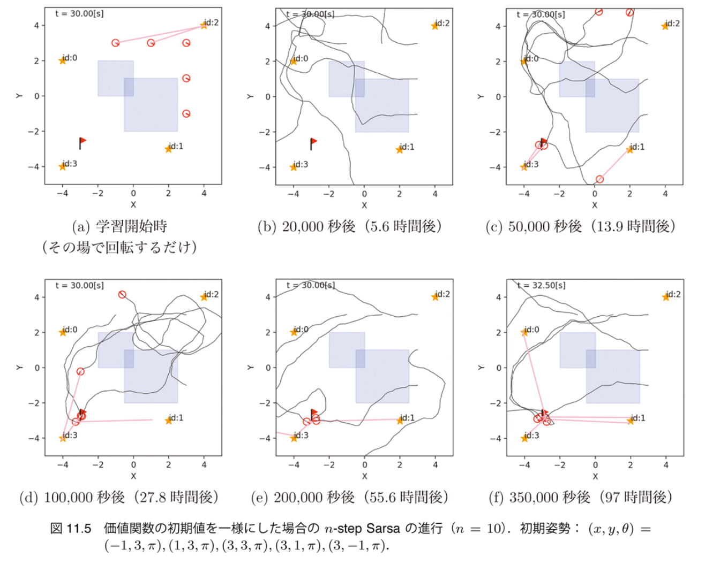
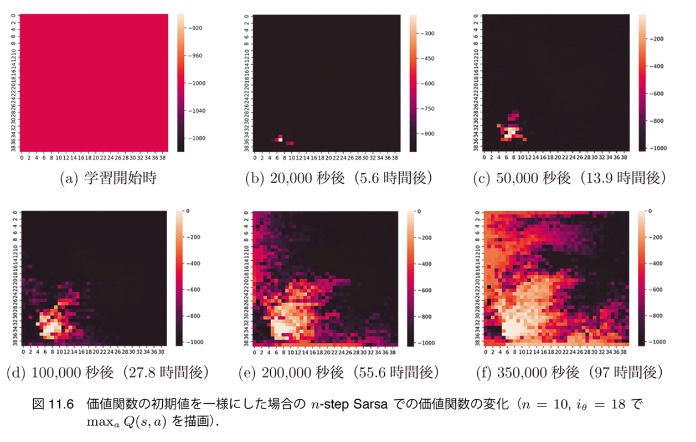
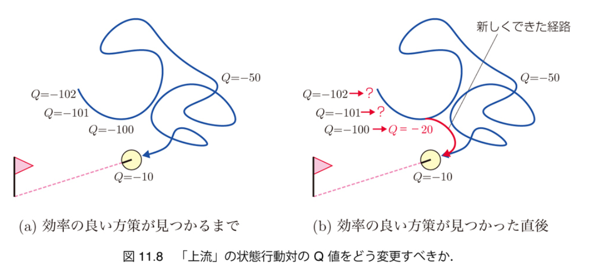
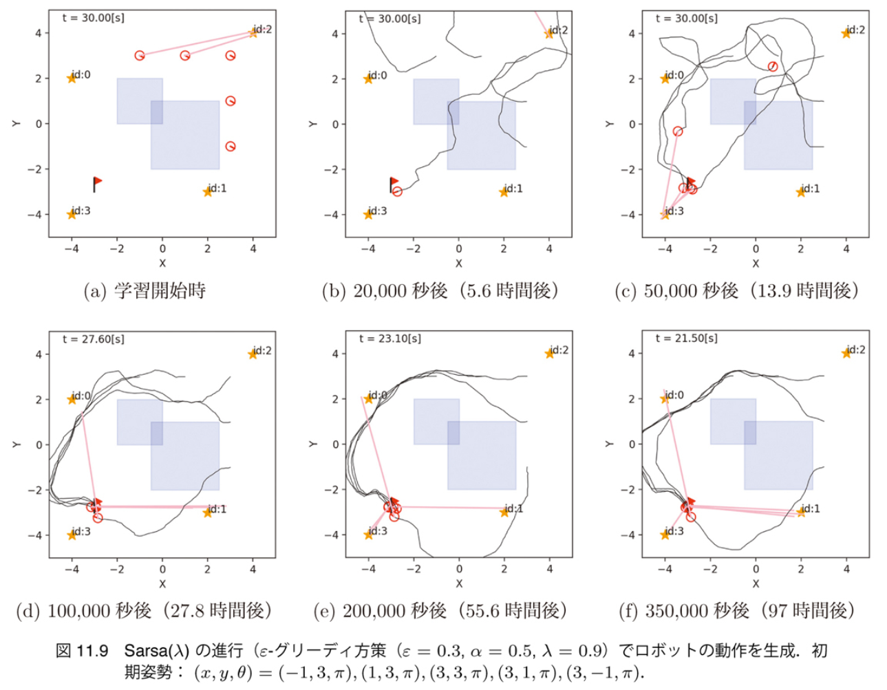
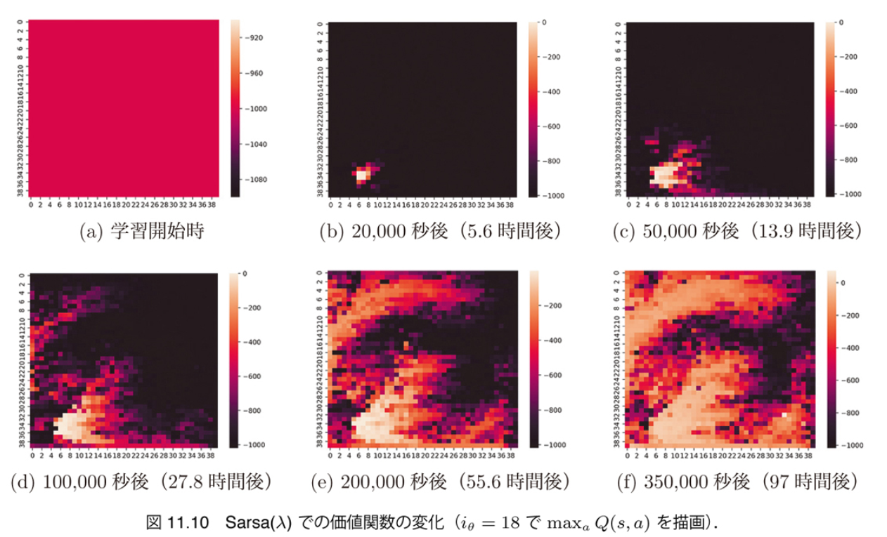

<!-- footer: 確率ロボティクス第12回 -->

# 確率ロボティクス第12回: 強化学習

千葉工業大学 上田 隆一

図の一部は詳解確率ロボティクスから転載しています．

$$\newcommand{\V}[1]{\boldsymbol{#1}}$$
$$\newcommand{\jump}[1]{[\![#1]\!]}$$
$$\newcommand{\bigjump}[1]{\big[\!\!\big[#1\big]\!\!\big]}$$
$$\newcommand{\Bigjump}[1]{\bigg[\!\!\bigg[#1\bigg]\!\!\bigg]}$$

---

<!-- paginate: true -->

### 強化学習

- MDPにおいて以下の情報だけで方策を得る
    -  現在時刻までのエピソード: $\\{\V{x}_0, a_1, \V{x}_1, r_1, a_2, \V{x}_2, r_2, \dots, a_t, \V{x}_t, r_t \\}$
        - 報酬$r_t$は$a_t,\V{x}_t$の後にエージェントに知らされる
    -  終端状態に着いたこと, およびそのときに得られる価値$v_\text{f}$
    -  評価: $J(\V{x}_{0:T}, a_{1:T}) = \sum_{t=1}^T r_t + v_\text{f}$

エージェントを動かして状態遷移や報酬の統計をとらないと解けない
$\Longrightarrow$強化学習の問題

---

### 強化学習の手法

- 古典的なものだけでいろいろある
    - 例
        - Q, Sarsa, $n$-step Sarsa, Sarsa$(\lambda)$, ...
    - 原理はほぼ同じで、学習する方策の違いと価値関数の更新方法が違う
        - 方策の違い: $V^\Pi$（$Q^\Pi$）なのか$V^*$（$Q^*$）なのか

---

## Q学習（詳解11.1節）

- ロボットが一回状態遷移した後に得られる情報から、行動価値関数を更新するアルゴリズムの一種 　
- 行動価値関数（おさらい）
    - $Q^\Pi(s, a)  = \Big\langle R(s, a, s') + V^\Pi(s') \Big\rangle_{ P(s' | s, a) }$
    - $R(s,a,s')$や$P(s'|s,a)$が分かれば$Q^\Pi(s,a)$は遷移先の$V^\Pi$の値から計算可能（でも分からない） 　
- 学習前の$Q^\Pi(s, a)$を、$P(s'|s,a)$ではなく、一度の状態遷移から修正するにはどうすればよいか
    - 統計の考え方: 分布が分からないときは統計をとる（サンプリング）
    - $\Rightarrow$1回の状態遷移（$s$から$a$を選んで$s'$に行き、報酬$r$をもらう）をドローイングと考える

---

## Q学習の更新則（詳解11.1.1項）

- 行動価値関数を変形
    - $Q^\Pi(s, a)$
    $= \Big\langle R(s,a,s') + V^\Pi(s') \Big\rangle_{ P(s' | s, a) }= \Big\langle r + \max_{a'}Q^\Pi(s',a') \Big\rangle_{ P(s' | s, a) }$
        - 報酬は状態遷移で分かった$r$を用いる
        - $V^\Pi(s)$というのは$Q^\Pi(s,a)$が最大となるように$a$を選んだときの値 　
- ドローイングに基づく式に変形（$\Pi$は省略）
    - $s' \sim P(s'|s,a)$
    - $Q(s, a) \longleftarrow r + \max_{a'}Q(s',a')$
        - $Q(s,a)$は適当に初期化しておく
        - 方策（$a$の選び方）はあとで考える

---

### Q学習の更新則（続き）

- $Q(s, a) \longleftarrow r + \max_{a'}Q(s',a')$では学習できない
    - $a$が一か八かの行動の場合には値が安定しない
    - 本来は何回も統計をとる必要がある 　
- 妥協して更新前の値との折衷案に
    - $Q(s, a) \longleftarrow (1-\alpha)Q(s,a) + \alpha \big[ r + \max_{a'}Q(s',a')\big]$
    - $\alpha$を小さくするほど過去を忘れにくい
        - 詳解確率ロボティクスでは$\alpha = 0.5$

ロボットをなんらかの方策で動かしながら$Q(s, a)$を更新していき、（だいたいの）収束を目論む

---

## 例（詳解11.1.2項）

- puddle ignore policyを改善してみましょう
   - puddle ignore policyで得られる方策、状態価値関数からスタート

---

## 行動価値関数の設定（詳解11.1.3項）

- 状態価値関数から行動価値関数を設定
    - $a$が最適な行動 or $s$が終端状態の場合: $Q(s,a) = V(s)$
    - $a$が最適な行動でない場合: $Q(s,a) = V(s) - 0.1$
        - 少し価値を下げておく

これで$Q(s,a)$が最大となる$a$を選ぶとpuddle ignore policyになる

---

## $\varepsilon$-グリーディ方策（詳解11.1.4項）

- 学習のためには、同じ状態で別の行動を選択する機会が必要
    - puddle ignore policyだけだともっと良い行動に気づけない　
- 例: 次のような$\varepsilon$-グリーディ方策を実装
    - 確率$\varepsilon$で、ランダムに行動選択
    - 確率$1-\varepsilon$で、$Q(s,a)$が最大になる行動を選択
        - 詳解確率ロボティクスでは$\varepsilon = 0.3$

ある状態$s$で$Q(s,a)$の値が逆転すると方策が変わる

---

## Q学習の結果（詳解11.1.6項）

- 図: 学習中の$Q(s,a)$から最大の$a$を選択して得た行動
    - ただしロボットが左右回転を交互に選んだときは強制的に前進
    - ゴールに近い初期姿勢から水たまり回避行動の学習が進行

---

### 状態価値関数の変化

- 図: 最良の行動価値関数から作った状態価値関数
    - 水たまり回避ルートが開拓されていく
        - 一回の状態遷移で一個の$Q(s,a)$しか変更できないので少しずつ

---

## Sarsa（詳解11.2節）

- Q学習の式を少し変える
    - Q学習: $Q(s, a) \longleftarrow (1-\alpha)Q(s,a) + \alpha \big[ r + \max_{a'}Q(s',a')\big]$
    - 変更: $\  Q(s, a) \longleftarrow (1-\alpha)Q(s,a) + \alpha \big[ r + Q(s',a')\big]$
        - $a'$には実際に選ぶものを使う
        - $s,a,r,s',a'$を使うのでSarsaと呼ばれる手法になる
- Sarsaの性質
    - 価値反復の近似ではなくなる
    - 最適方策ではなく$\varepsilon$-グリーディ方策の価値関数を求めることに
    （on-policyという）
        - Q学習はoff-policy

---

### Sarsaによって得られる方策

- （このタスクでは）Q学習よりも水たまりを早い段階から回避
    - $a'$が最適であることを期待しないので水たまりのリスクを大きく評価
- （このタスクでは）経路が蛇行
    - $\varepsilon$-グリーディ方策の価値を学習するため、最初のうちはゴールへ向かう行動の価値が悪化

---

### ここまでのまとめ

- Q学習
    - 価値反復から導出可能
    - 離散状態に対して実装することは簡単
        - ただし、状態数$\times$行動の種類だけメモリを消費　
- Sarsa
    - 次のステップで最適な行動をとることを期待しない
    - Q学習との優劣は単純に議論できない
    - 拡張するときにQ学習より楽（後半）　
- Q学習、Sarsa共通の問題
    - あるときに画期的な行動選択が行われても、1ステップ分しか価値が更新されない
        - その前の経緯も重要なのに、価値は更新されない

---

## $n$-step Sarsa（詳解11.3節）

- 画期的な行動選択があったときに、過去にさかのぼって価値を更新できないか？ 　
- 考えられる方法
    - Sarsaで、もうちょっと後まで行動選択してから価値を更新
        - Sarsa: $s, a, r, s', a'$で$Q(s,a)$を更新
        - 改良: $s, a, r, s', a', s'', a''$で$Q(s,a)$を更新
        - さらに改良: $s, a, r, s', a', s'', a'', s''', a'''$で$Q(s,a)$を更新
        - さらにさらに改良: ... 　
- $n$ステップだけ評価を先延ばしにする $= n$ステップ過去の状態行動対の価値を更新

---

### 更新式の導出

- $s,a,r,s',a'$の$r,s',a'$を1ステップ後ということで $r^{(1)},s^{(1)},a^{(1)}$と書き直し
    - Sarsaの式: $Q(s,a) \longleftarrow (1 - \alpha)Q(s,a) + \alpha \left[ r^{(1)} + Q(s^{(1)},a^{(1)}) \right]$ 　
- $a^{(2)}$まで評価を先延ばし
    - $Q(s,a) \longleftarrow (1 - \alpha)Q(s,a) + \alpha \left[ r^{(1)} + r^{(2)} + Q(s^{(2)},a^{(2)}) \right]$ 
    - Q学習では簡単に先延ばしできない
- $a^{(n)}$まで評価を先延ばし
    - $Q(s,a) \longleftarrow (1 - \alpha)Q(s,a) + \alpha \left[ \sum_{i=1}^n r^{(i)} + Q(s^{(n)},a^{(n)}) \right]$ 　
- 実装のため、$n$ステップ前の行動価値関数を更新する式に
    - $Q(s^{(-n)},a^{(-n)}) \longleftarrow (1 - \alpha)Q(s^{(-n)},a^{(-n)}) + \alpha \left[ \sum_{i=0}^{n-1} r^{(-i)} + Q(s,a) \right]$

---

### $n$-step Sarsaの学習結果

- ランダムな方策から、5万秒後には水たまりの反対側からゴールに到達可能に
    - Q学習の場合は20万秒後でも無理

---

### $n$-step Sarsaで得られた状態価値関数

- ランダムな方策から学習が進んでいる
    - まだ収束には遠い
- （些末な話だが）環境の端の離散状態が大きい（図で示した範囲外も領域に含めている）ので通る機会が多く学習が早く進行

---

## 11.4 Sarsa$(\lambda)$

- 評価を遅らせるのではなく、もっと積極的に過去の状態行動対の価値を変更
- 考え方
    - $Q(s,a)$が改善（改悪）された場合、その前の状態行動対の価値もすべて同じだけ更新すべきではないのか？
        - 例えば下図の$Q=-100 \rightarrow Q = -20$の更新

---

### Sarsa($\lambda$)の更新式の導出

- Sarsaの式を並び替え
    - $Q(s,a) \longleftarrow Q(s,a) + \alpha \left[ r + Q(s',a') - Q(s,a) \right]$　
- Q値の変化を$\Delta Q$とおく
    - $\Delta Q = r + Q(s',a') - Q(s,a)$
        - エピソードをさかのぼって価値に$\Delta Q$を足していく
        - ただし減衰させていく（過去にいくほど因果関係が薄くなるので）　
- 更新式
    - $Q(s^{(-n)}, a^{(-n)}) \longleftarrow Q(s^{(-n)}, a^{(-n)}) + \alpha \lambda^n \Delta Q \quad (n=0,1,2,\dots)$
        - $\lambda$: エリジビリティ減衰率
        - 書籍では$\lambda=0.9$

減衰するものの、エピソードの最初まで更新可能

---

### Sarsa($\lambda$)の実装と実行

- 10-step Sarsaよりも早く学習が進行（ただしタスクの性質次第）
    - ゴールに入ったときや水たまりを回避した行動が得られたときに10ステップ以上前の方策も変化していると推察できる

---

### Sarsa($\lambda$)で得られた状態価値関数

- こちらも10-step Sarsaより価値の変化が大きい

---

## まとめ

- 4種類の強化学習アルゴリズムを実装
    - Q学習
    - SarsaおよびSarsaの改良版
- Q学習は多段にしにくいが、できないことはない
    - [Sutton 2018]参照のこと　
- 本書の離散化は効率が悪い$\rightarrow$関数近似
    - 価値関数や方策をパラメータで表現してパラメータを学習
        - Tesauroのバックギャモン
        - DQNやA3C、その子孫などは人工ニューラルネットワークで価値関数や方策を近似（+特徴量抽出）
- アルゴリズム凝りすぎに注意
    - 応用ならばよいけど基礎研究だと問題に特化していないかということに

