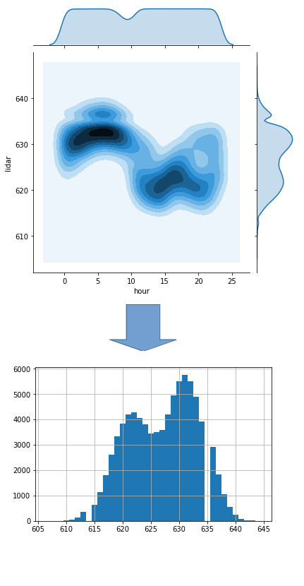
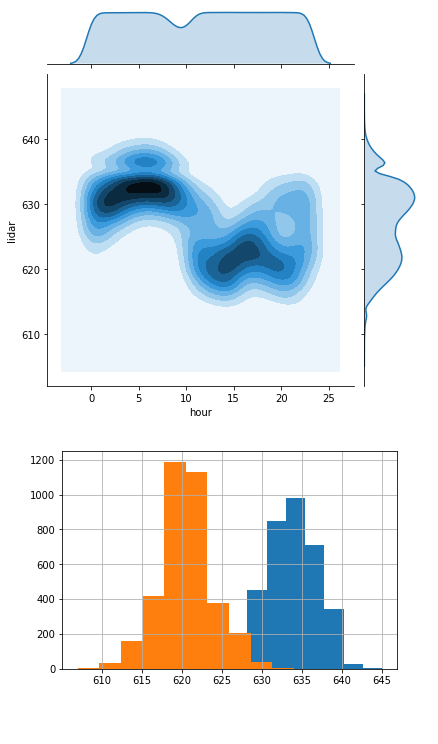

<!-- footer: 確率ロボティクス第3回 -->

# 確率ロボティクス第3回: 確率・統計の基礎II

千葉工業大学 上田 隆一

This work is licensed under a <a rel="license" href="http://creativecommons.org/licenses/by-sa/4.0/">Creative Commons Attribution-ShareAlike 4.0 International License</a>.

---

<!-- paginate: true -->

## 前回の復習

- [演習問題1](https://b.ueda.tech/?page=robot_and_stats_questions#20240927_1)
- [演習問題2](https://b.ueda.tech/?page=robot_and_stats_questions#20240927_2)

---

## 期待値（詳解2.3.3項）

- （雑な）定義: なにかばらつく値の平均値を推定、予想した値
    - 問題1: 3700円を払い、サイコロの出目に1000をかけただけお金がかえってくるギャンブルがありますが、1回の試行で儲かるお金の期待値は？
    - 問題2: 問題1の計算について、サイコロに細工がしてあり、$i$の目の出る確率が$P(i)$になっているとします。このときの期待値は？
        - $\sum$を使って表してみましょう。

---

## 答え

- 問題1: $1000/6 + 1000\cdot 2/6 + 1000\cdot 3/6 + 1000\cdot 4/6$
$+ 1000 \cdot 5/6 + 1000 \cdot 6/6 - 3700 = 1000(3.5) - 3700$ $= -200$
- 問題2: $1000P(1) + 1000 P(2) + 1000 P(3) + 1000 P(4)$
$+ 1000  P(5) + 1000  P(6) - 3700$ $= 1000 \sum_{i=1}^6 i P(i) - 3700$

---

## 期待値の表記と計算

- $\langle f(x) \rangle_{P(x)} = \sum_{x \in \mathcal{X}} f(x) P(x)$　　（左辺が表記で右辺が計算式）
    - $\mathcal{X}$: すべてのあり得る$x$の値（根元事象）の集合
    - 個々の$x$は期待値に影響を与えないので$\langle f \rangle_{P}$とも
- 前ページ問題2の例
   - $f$に相当する関数は？
       * $f(i)=1000i - 3700$
   - $\langle f \rangle_{P}$の式は？
       * $\langle f \rangle_{P} = 1000 \sum_{i=1}^6 iP(i) - 3700$
- 確率密度関数に対する関数$f$の期待値
    - $\langle f \rangle_{p} = \int_{-\infty}^{\infty} f(x)p(x) dx$　

---

## 期待値の性質

- 期待値の性質
    - 線形性
        - $\big\langle f(z) + \alpha g(z) \big\rangle_{p(z)} = \big\langle f(z) \big\rangle_{p(z)} + \alpha \big\langle g(z) \big\rangle_{p(z)}$
        - $\big\langle f(z) + \alpha \big\rangle_{p(z)} = \big\langle f(z) \big\rangle_{p(z)} + \alpha \big\langle 1 \big\rangle_{p(z)} = \big\langle f(z) \big\rangle_{p(z)} + \alpha$
            - 問題2に適用可能（やってみましょう）
    - 平均値
        - $\langle z \rangle_{p(z)} = \mu$、$\langle z - \mu \rangle_{p(z)} = 0$
    - 分散
        - $\langle (z - \mu)^2 \rangle_{p(z)} = \sigma^2$　

---

## 複雑な分布（詳解2.4節）

- これまでひとつのセンサの値だけを扱ってきたが、 センサの値は他の要因で変わる
    - 壁までの距離、向き、その他センサに関する変数・・・  　

ほとんどの場合、もっと多くの変数の考慮が必要

---

## 条件付き確率（詳解2.4.1項）

- センサ値のヒストグラム（距離: 600mm)
    - ピーク（統計ではモード）が2つ
        - マルチモーダル
    - 635[mm]の頻度がゼロ

今までの解析方法では解析できない

---

### 時系列で見てみる

- センサ値が得られた順に並べてグラフを描画
    - どうやら時間で値が変動しているらしい
        - もっと言うと、昼と夜で変動するなにかが原因 （光、気温、湿度、・・・）

時刻が変数に

---

### 時間別のヒストグラムを作成

- 時間で条件付けすることでガウス分布に形が近くなる
    - オレンジ: 昼の14時台
    - 青: 朝の6時台

「条件付けした分布、確率」というものがある

---

### 条件付き確率の表記

- 例えば6時台のセンサ値の確率分布を次のように表記
    - $P(z | t \in \text{6時台})$　　　（$|$の右側が条件）
        - 「$t \in \text{6時台}$」: $t$が6時台の時刻の集合に含まれる
- 条件=情報
        - 「$t$が6時台と分かったので$P(z)$をより確かにできた」とも解釈可能

---

### 一般的な条件付き確率の表記

- $P(y|x)$: 変数$x$で条件付けられる変数$y$の分布
    - $x$が$y$に「直接」影響を与えている必要はない
        - 例: 時刻はセンサ値を変動させる直接の原因ではない
- 「条件=情報」という側面から
    - $P(y|x)$は、$P(y)$に$x$という情報を加えた場合の分布

---

## 同時確率と加法定理、乗法定理 （詳解2.4.2項）

- 今度は「計測したデータをひとつ選んだとき、時刻（時間帯）$t$でセンサ値が$z$である確率」を考えてみましょう
    - 二つの事象が同時に起こる確率 $\Rightarrow$同時確率と呼ぶ　
- 同時確率の表記: $P(z, t)$
    - $\sum_z \sum_t P(z, t) =  1$
    - 右図のように確率分布は2次元に
    - $P(z)$より情報が多い

$$\newcommand{\V}[1]{\boldsymbol{#1}}$$
$$\newcommand{\indep}{\mathop{\perp\!\!\!\perp}}$$

---

### 周辺化

- $P(z)$を$P(z,t)$として見ると情報が増えた
- 逆に$t$の情報を消し去ることもできる$\Rightarrow$周辺化
    - 式: 確率の加法定理
        - $P(z) = \sum_{t=-\infty}^{\infty} P(z,t)$
        - $p(z) = \int_{-\infty}^{\infty} p(z,t) dt$
    - 下図: 水平方向の確率を足すと$P(z)$に
        - この操作における$P(z)$のことを周辺分布、その数値を周辺確率と言う

---

### 同時確率と条件付き確率の関係

- $P(z,t)$をある時間帯で切り出す$\Rightarrow P(z|t)$と同じ形
    - 正規化前の大きさは$P(t)$に比例
    - 次のような関係がある（確率の乗法定理）
        - $P(z,t) = P(z|t)P(t)$
            - $P$は質量関数、密度関数どちらでも
- 乗法/加法定理と周辺化
    - $P(z) = \langle P(z|t)\rangle_{P(t)}$
        - 乗法定理から（導出してみましょう）
        - 質量関数、密度関数どちらでも成立

---

### 確率の乗法定理・加法定理のまとめ

- ふたつの定理（確率の計算のルールはこれしかない）
    - 乗法定理
        - $p(x,y) = p(x|y)p(y) = p(y|x)p(x)$　　（$p$は連続・離散どちらでもよい）
    - 加法定理
        - $P(x) = \sum_{y=-\infty}^{\infty} P(x,y)$
        - $p(x) = \int_{-\infty}^{\infty} p(x,y) dy$
- 乗法定理・加法定理を利用した周辺化（$\sum$と$\int$の除去）
    - $p(x) = \langle p(x|y) \rangle_{p(y)}$　　　　　　 　 　　　　（$p$は連続・離散どちらでもよい）

---

### 3変数以上の乗法定理

- $p(x,y|z) = p(x|y,z)p(y|z)$
    - 解き方: 下のふたつの式の右辺から$p(z)$を割る
        - $p(x,y,z) = p(x,y|z)p(z)$
        - $p(x,y,z) = p(x|y,z)p(y,z) = p(x|y,z)p(y|z)p(z)$
    - 隠れている条件を明記したとも解釈可能
- それ以上に変数がある場合
    - 上の記号をベクトルにすると同様に成立

---

### ここまでのまとめ

- 期待値
    - 普段から投資したお金の回収額としてよく使う
    - 確率に関する諸定義や確率の演算中にもよく登場
- 条件付き確率、同時確率を理解
- 乗法定理、加法定理を理解

