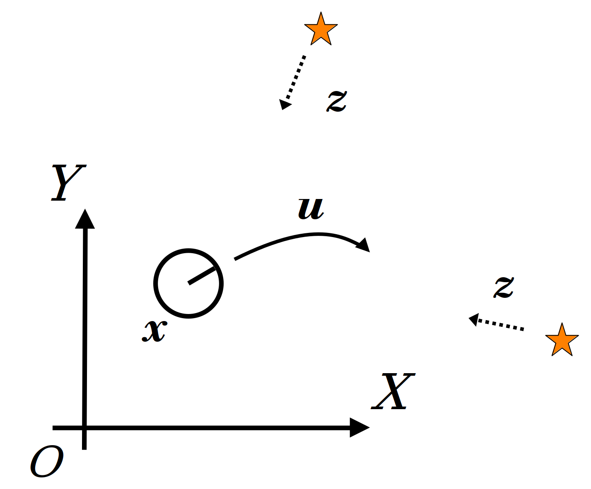
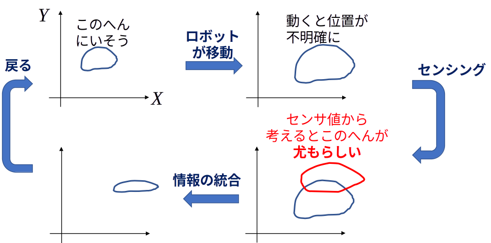

<!-- footer: 確率ロボティクス第7回 -->

# 確率ロボティクス第7回: 自己位置推定問題と ベイズフィルタ

千葉工業大学 上田 隆一

図の一部は詳解確率ロボティクスから転載しています。

$$\newcommand{\V}[1]{\boldsymbol{#1}}$$
$$\newcommand{\jump}[1]{[\![#1]\!]}$$
$$\newcommand{\bigjump}[1]{\big[\!\!\big[#1\big]\!\!\big]}$$
$$\newcommand{\Bigjump}[1]{\bigg[\!\!\bigg[#1\bigg]\!\!\bigg]}$$

---

<!-- paginate: true -->

## 自己位置推定の問題と解法（詳解5.1節）

- （確率的）自己位置推定
    - ロボットが自らの姿勢を、これまで得た情報から推定すること
    - ロボットにとって基本的な問題
        - 位置情報がないと自律でロボットを動かすのが大変
    - 今も重要な研究対象
        - 新しいセンサが出るたびに新しい課題
        - 基本的なのに未解決な問題も多数

---

## 計算すべき確率分布と利用できる情報（5.1.1項）

数式で考えていきましょう

- 記号のおさらい 
    - 位置: $(x,y)$
    - 向き: $\theta$
    - 姿勢・状態: $\V{x} = (x\ y \ \theta)^\top$　
    - 状態空間: $\mathcal{X}$
    - $\V{u} = (\nu, \omega)$: 制御指令
    - $\textbf{z} = \{ \V{z}_j | j=1,2,\dots, \}$: センサ情報
        - ここでの$j$はランドマークのID

---

### 自己位置推定に使える情報

- $\V{x}_0$: 最初の姿勢（分かっているとしましょう）　
- $\V{u}_{1:t}$: 各時刻の制御指令
    - $\V{u}_{1:t}$というのは$\V{u}_1, \V{u}_2, \dots, \V{u}_t$の略記　
- $\textbf{z}_{1:t}$: 各時刻のセンサ値のリスト
    - $\textbf{z}_{1:t}$というのは$\textbf{z}_1, \textbf{z}_2, \dots, \textbf{z}_t$の略記
        - ここでの添字は時刻
    - $\textbf{z}_t$には各ランドマークからのセンサ値（入っていないことも）　
- $p(\V{x} | \V{x}_{t-1}, \V{u}_t)$: 状態遷移分布
- $p(\textbf{z} | \V{x})$: 観測分布

数式で考えるとこれしかない

---

### 計算すべきもの

- 計算すべきは姿勢ではなく姿勢の分布
    - 姿勢だけ求めても、不確かさが表現できない　
- 計算すべき分布: $p_t(\V{x} | \V{x}_0, \V{u}_{1:t}, \textbf{z}_{1:t})$
    - 自己位置推定問題: 初期姿勢と、これまでの制御出力、センサ値から分布を計算する問題
        - 補足: $\V{u}$には、制御指令ではなく車輪の回転計などにより計測した移動量が使われることも
            - 計測した移動量: オドメトリ （オドメータによる計測（値）という意味）

---

## 信念（詳解5.1.2項）

- 「計算すべき分布」に特別に$b_t$と記号を与えましょう
    - $b_t(\V{x}) = p_t(\V{x} | \V{x}_0, \V{u}_{1:t}, \textbf{z}_{1:t})$
        - $XY\theta$空間中の確率分布（下図(a)）
        - ロボットは(b)の世界が見えない。頭の中の(a)だけ

- $b_t$を信念（信念分布）と呼ぶ
    - 自己の姿勢に対するロボットの考え
        - 姿勢だけでなく不確かさも表現（次ページ）

---

### 様々な信念と、それの意味するもの

多様な判断が可能に

---

## 信念の演算方法（詳解5.1.3項）

1. 初期の信念$b_0$を与える
2. 以後、情報が入るごとに信念を更新
    - ロボットが移動したら更新
    - ロボットがランドマークを観測したら更新

計算式を導出しましょう

---

### ロボットが移動したときの演算

- 時刻$t-1$から$t$までの移動を考える
    - $b_{t-1}$に新たに$\V{u}_t$の情報が加わる
        - $b_{t-1}(\V{x}) \rightarrow b_{t-1}(\V{x}|\V{u}_t)$　
    - $\hat{b}_t = b_{t-1}(\V{x}|\V{u}_t)$としましょう
        - $\hat{b}_t$: 移動したことを考慮した信念
        - $b_t$との違い: $\textbf{z}_t$の情報がまだない

$\qquad\qquad\qquad\hat{b}_t$を$b_{t-1}$からどう計算すればよいでしょう？

---

### $\hat{b}_t$の導出

- $\hat{b}_t = p(\V{x} | \V{x}_0, \V{u}_{1:t}, \textbf{z}_{1:t-1})$
$= \left\langle p(\V{x}, \V{x}_{t-1} | \V{x}_0, \V{u}_{1:t}, \textbf{z}_{1:t-1})\right\rangle_{\V{x}_{t-1}}$
$= \left\langle p(\V{x} | \V{x}_{t-1}, \V{x}_0, \V{u}_{1:t}, \textbf{z}_{1:t-1}) p(\V{x}_{t-1} | \V{x}_0, \V{u}_{1:t}, \textbf{z}_{1:t-1})\right\rangle_{\V{x}_{t-1}}$
$= \left\langle p(\V{x} | \V{x}_{t-1}, \V{u}_t ) p(\V{x}_{t-1} | \V{x}_0, \V{u}_{1:t-1}, \textbf{z}_{1:t-1})\right\rangle_{\V{x}_{t-1}}$
$= \left\langle p(\V{x} | \V{x}', \V{u}_t ) b_{t-1}(\V{x}')\right\rangle_{\V{x}'}$　　（$b_{t-1}$と重複するので$\V{x}_{t-1}$のほうは$\V{x}'$と表記）
$= \left\langle p(\V{x} | \V{x}', \V{u}_t ) \right\rangle_{b_{t-1}(\V{x}')}$
    - 式の名前: 筆者は「マルコフ連鎖の式」、「状態遷移の式」などと呼称
    - マルコフ性がある: 次状態が直前の姿勢と制御出力だけから決まって、それ以前の状態は情報として不要という性質を指す
        - $p(\V{x} | \V{x}', \V{u}_t)$がそうなっている

---

### $\left\langle p(\V{x} | \V{x}', \V{u}_t ) \right\rangle_{b_{t-1}(\V{x}')}$の図解

---

### ロボットがセンシングしたときの演算

- 移動で不確かになった姿勢の情報をセンサ値で修正（下図）
- $\hat{b}_t(\V{x})$に新たに$\textbf{z}_t$の情報が加わる
   - $\hat{b}_t(\V{x}) \rightarrow \hat{b}_t(\V{x} | \textbf{z}_t) = b_t(\V{x})$

---

### $b_t$の計算式

- ベイズの定理を使う
    - $b_t(\V{x}) = \hat{b}_t(\V{x} | \textbf{z}_t) = \eta p(\textbf{z}_t | \V{x}) \hat{b}_t(\V{x})$
    $= \eta \hat{b}_t(\V{x})\prod_{j=0}^{N_\textbf{m}-1} p_j(\V{z}_{j,t} | \V{x})$
    - 補足
        - 最後の式変形は各ランドマークのセンサ値が独立している場合
        - $\textbf{z}_t$内にセンサ値がない場合は$b_t(\V{x}) = \hat{b}_t(\V{x})$

これで定式化は完了

---

### まとめ 

- 次の2つの式で$b_0$を$b_1, b_2, \dots$と更新していける
    - 移動時: $\hat{b}_t(\V{x}) =  \big\langle p(\V{x} | \V{x}', \V{u}_t) \big\rangle_{b_{t-1}(\V{x}')}$ 
    - 観測時: $b_t(\V{x}) = \eta p(\textbf{z}_t | \V{x}) \hat{b}_t(\V{x})$
     $\Longrightarrow$この手続きは「ベイズフィルタ」と呼ばれる
- 残った問題: どうやって実装するの？

