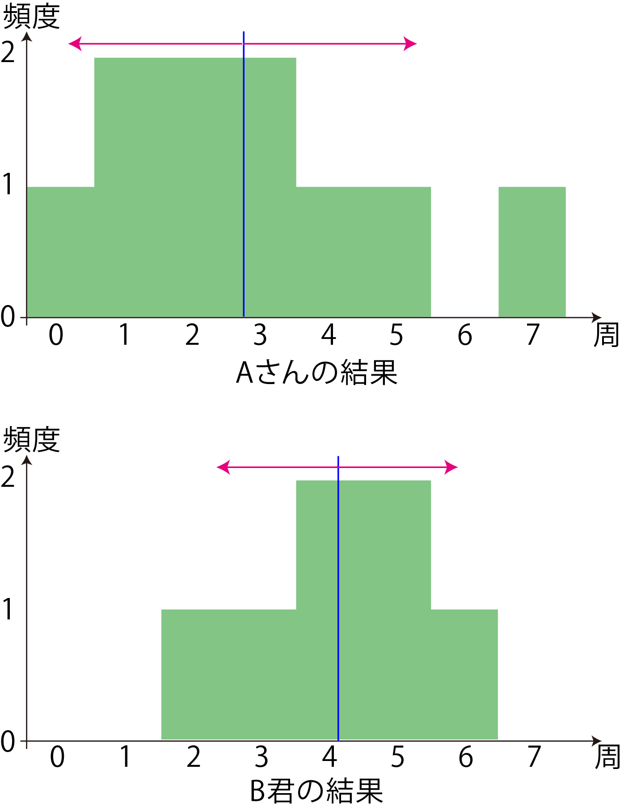

<!-- footer: Probabilistic Robotics, Lecture 1 (Part 2) -->

# Probabilistic Robotics, Lecture 1 (Part 2):  Statistical Basics and Representative Values

Ryuichi Ueda, Chiba Institute of Technology

 

This work is licensed under a <a rel="license" href="http://creativecommons.org/licenses/by-sa/4.0/">Creative Commons Attribution-ShareAlike 4.0 International License</a>.

---

<!-- paginate: true -->

## Contents

- Representative Values
- Data Variability
- Bias and Outliers

---
## Representative Values

---

### What are representative values?

- First things first: mean, median, mode
    - Anyone who's ever taken a statistics class knows them
- Don't go to sleep too soon
    - Are you using them properly?

---

### Data Representation

- Let's represent the data series as $x_{1:N} = \{x_1, x_2, x_3, \dots, x_N\}$.
   - assumed that the data is numerical tenmporary.
- Example (from the textbook): A and B challenged each other to see how many laps they could complete on a course with their homemade robot.
    - $a_{1:10} = \{2, 3, 1, 5, 0, 3, 7, 2, 4, 1\}$
    - $b_{1:7} = \{5, 3, 6, 4, 2, 5, 4\}$
- Terminology
    - Trial: Trying something to obtain one data point
   - Event: The phenomenon observed in a trial (Note: This does not necessarily have to be a numerical value.)

---

### Problem

- Which result is better in the example on the previous page?
    - $a_{1:10} = \{2, 3, 1, 5, 0, 3, 7, 2, 4, 1\}$
    - $b_{1:7} = \{5, 3, 6, 4, 2, 5, 4\}$
- Putting aside the argument that "we won't know until we try more,"
how do we compare or analyze the results? (Let's think about it.)
    * Using representative values is the first step.

---

### Representative value: A single numerical representation of the data

- Representative representative value:
    - Mean: The sum of all values divided by the number of data.
        - $\bar{x}_{1:N} = \dfrac{x_1 + x_2 + \dots + x_N}{N} = \dfrac{1}{N} \sum_{i=1}^N x_i$
    - Maximum and minimum values: The maximum and minimum values in the data (although this is a tautology).
        - Denoted as $\max{x}_{1:N} and \min{x}_{1:N}$, respectively.
    - Median: The value in the middle when sorting data by numerical size.
        - If the number of data is even, add the two middle values and divide by 2.
    - Mode: The most frequently occurring value in the data column.
        - If there are multiple data points, all of them are the mode.

---

### Question

- Let's find these values for the data of Person A and Person B on the previous page.
    - $a_{1:10} = \{2, 3, 1, 5, 0, 3, 7, 2, 4, 1\}$
    - $b_{1:7} = \{5, 3, 6, 4, 2, 5, 4\}$
* Answer
    ||Average|Maximum|Minimum|Median|Mode|
    |:--:|:--:|:--:|:--:|:--:|:--:|
    |Person A|2.8|**7**|0|2.5|1, 2, 3|
    |Person B|**4.1**|6|**2**|**4**|4, 5|
    - The math is simple, but what can we say from this?  (Let's think about it)

---

### What can be said

- Superiority or inferiority relative to a certain representative value
    - B's average value is better
    - A's maximum value is better, but A's robot has three more trials
- Hints for improvement (this is the most important)
    - A's robot can complete multiple laps with a maximum value of 7, but its average and minimum values are small. It is important to investigate the cause of early retirement.
    - B's robot appears stable in terms of its average and minimum values, but it is important to investigate why it cannot complete more than 5 or 6 laps.
- What not to say (misuse of representative values)
    - B's robot is better because its average value is better
    - A's robot is better because its maximum value is better

---

### Using representative values is difficult

- Representative values are a degraded representation of the original data
    - In information theory, this is equivalent to "lossy data compression"
    - Replacing a large amount of data with one reduces the amount of information
- Representative values are meaningful when used as a basis for judgment.
    - Rather than representative values, it's more important to consider the causes that can be inferred from them.
    - As I mentioned in the first half of the lecture, statistics are not serious.
- To determine superiority or inferiority, rules and experimental conditions must be established.
    - Even so, statistics never provides the answer to the discussion of superiority.
    - While it's often used to attack opponents, it's often inappropriate.

---

## Indicator of data variability

---

### From the previous discussion of the results of A and B

- It was pointed out that there was a large difference between A's maximum and minimum values.
- Indeed, A's number of laps differs each other more significantly than B's (varying)
    - $a_{1:10} = \{2, 3, 1, 5, 0, 3, 7, 2, 4, 1\}$
    - $b_{1:7} = \{5, 3, 6, 4, 2, 5, 4\}$
- The problem here: Can we quantify "statistical variability" using the entire data set, not just the maximum-minimum values?
    - Maximum-minimum values are easily affected by one or two extreme values.

---

### Variance (Unbiased Variance)

- The most common measure of variability
- (A value slightly larger than) the average of the squared differences between the mean and each data point.
    - $s^2 = \dfrac{1}{N-1}\sum_{i=1}^{N} ( x_i - \bar{x})^2$
        - called the unbiased variance (when the denominator is $N$, it is the sample variance).
        - "Variances" in papers are usually unbiased variances.
- Why $N-1$?
    - The mean value $\bar{x}$ is also variable and uncertain, so the value is larger accordingly (Section 3.3.4 of "Robot Probability and Statistics").
- Why square the errors?
    - It's convenient for various calculations (it follows a kind of natural law).

---

### Question

- Let's find the unbiased variance of the data for Person A and Person B.
    - Which is larger?
        - $a_{1:10} = \{2, 3, 1, 5, 0, 3, 7, 2, 4, 1\}$
        - $b_{1:7} = \{5, 3, 6, 4, 2, 5, 4\}$
    - Use any tools you like: hand calculations, spreadsheets, or shell programs.
    - Formula (reprinted): $s^2 = \dfrac{1}{N-1}\sum_{i=1}^{N} ( x_i - \bar{x})^2$
- Answer
    * Person A: $4.4$
    * Person B: $1.8$

---

### Standard deviation

- Positive square root of variance
    - Formula (just overlaying the variance formula with $\sqrt{\quad}$)
        - $s = \sqrt{\dfrac{1}{N-1}\sum_{i=1}^{N} ( x_i - \bar{x})^2}$
    - Question: If Person A's variance is $4.4$ and Person B's variance is $1.8$, what is the standard deviation?
        * Person A: $2.1$, Person B: $1.3$
- Why introduce standard deviation even though there is variance? (Let's think about this on the next page.)

---

### Reasons for introducing standard deviation

- Units are consistent with the original data
    - The unit of variance is mysteriously [circle$^2$], but standard deviation is [circle]
    - Can be plotted on graphs
- Use standard deviation when communicating with others
    - When asked, "How variable is the data?" Just answer in standard deviation
- Mean $\pm$ Standard deviation: Common notation
    - Person A: $2.8 \pm 2.1$circle
    - Person B: $4.1 \pm 1.3$circle

---

## Bias and outliers

---

### Question

- I bought two sensors, X and Z, to measure the distance to the wall and installed them on my robot. I measured a distance of 1m 10 times and got the following results.
    - Which one would you like to install?

|Trials | 1 | 2 | 3 | 4 | 5 | 6 | 7 | 8 | 9 | 10 | Mean | stdev |
|:--|:--|:--|:--|:--|:--|:--|:--|:--|:--|:--|:--|:--|
|X | 0.90 | 0.75 | 0.83 | 1.20 | 1.12 | 1.15 | 1.07 | 1.21 | 0.93 | 1.21 | 1.04 | 0.17 |
|Z | 1.21 | 1.09 | 1.23 | 1.14 | 1.19 | 1.22 | 1.20 | 1.09 | 1.13 | 1.23 | 1.17 | 0.06 |

* Answer
    - It might be possible to subtract $0.17$ from the measured value of Z.
        - It's also possible that there might be some problem with Z, so this isn't always true.

---

### Bias and Calibration

- The deviation of $0.17$ in the mean value of Z is called bias.
- It's not "variability" because it's the same deviation each time.
- Calibration
- Measuring bias and correcting the values.
- Variability is unavoidable, but bias can be corrected.
- Table below: Z measurements minus $0.17$ and recalculated.

|Trials | 1 | 2 | 3 | 4 | 5 | 6 | 7 | 8 | 9 | 10 | Mean | Standard Deviation |
|:--|:--|:--|:--|:--|:--|:--|:--|:--|:--|:--|:--:|:--:|
|Z'| 1.04 | 0.92 | 1.06 | 0.97 | 1.02 | 1.05 | 1.03 | 0.92 | 0.96 | 1.06 | 1.00 | 0.06|

---

### Robots and Calibration

- Calibration is required in many situations related to robots.
- Correcting sensor values, such as in the current example.
- Correcting camera distortion.
- Adjusting the gyro origin (failure to do so will result in a wobbly robot).
- Correcting left-right balance when a cart doesn't travel in a straight line.
- Limitations of calibration: Robots move around a lot...
- In the case of a cart: Bias trends change with road surface.
- In the case of sensors: Bias trends change with temperature, humidity, brightness, etc.

$\Rightarrow$Very Troublesome

---

### Overcalibration can be problematic.

- Time-consuming (and sometimes unrewarding).
- Have you ever continued calibrating even when it wasn't clear that bias was the cause?
- It's more productive to think about ways to avoid calibration (automate it).
- Demonstrations are important, but researchers need to focus on this.

---

### Outliers.

- Data with significantly different values ​​from others is included.
- Example: When collecting sensor value X, the 10th time I got a value of $5$[m].
- Should I treat this value on the same level as other values?
How should I summarize and communicate these results? (Let's think about it.)

|Trials | 1 | 2 | 3 | 4 | 5 | 6 | 7 | 8 | 9 | 10 | Mean | Standard Deviation |
|:--|:--|:--|:--|:--|:--|:--|:--|:--|:--|:--|:--|:--|:--:|
|X | 0.90 | 0.75 | 0.83 | 1.20 | 1.12 | 1.15 | 1.07 | 1.21 | 0.93 | 5.00 | 1.42 | 1.27|

- Concept (just one example)
* It's better to exclude this data as an outlier, calculate the mean, and standard deviation, and then add a disclaimer that "significantly outlying values ​​may occur." This will better convey the characteristics of the data.
- It's better to consider errors with clearly different causes separately.

---

### Robots and Outliers

- Like bias, this is inherent in robots.
- The unmaintained environment mentioned earlier = an environment where outliers occur.
- A person or cat crosses in front of the sensor.
- The cart gets caught on something, causing an abnormal amount of movement relative to the motor output.
- Like bias, rather than eliminating the cause, developing a mechanism to respond appropriately will make the robot smarter.

---

## Summary

- Representative Values
- Summary Statistics are simply summaries (summary statistics), not universal tools.
- Easy to calculate, but difficult to use.
- Data Variability
- Use unbiased variance (and the standard deviation calculated from unbiased variance) in papers.
- Bias and outliers
- This is what autonomous robot research is fighting.
- When participating in a competition, rather than focusing on rankings, it's better to solve problems that are slightly more difficult than the prescribed ones, which will help your research.
