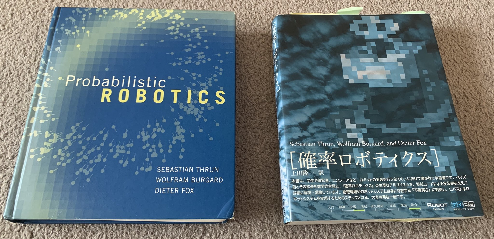

<!-- footer: 確率ロボティクス第1回 -->

# 確率ロボティクス第1回: イントロダクション/代表値

千葉工業大学 上田 隆一

 

This work is licensed under a <a rel="license" href="http://creativecommons.org/licenses/by-sa/4.0/">Creative Commons Attribution-ShareAlike 4.0 International License</a>.

---

<!-- paginate: true -->

- 今回の内容
    - イントロダクション
    - 代表値

---

## イントロダクション

---

### この講義

- 「確率ロボティクス」
    - 確率・統計をロボットで扱うための分野
    - ロボットが工場から人間の生活空間に入る上で必要となった
        - 例: 移動ロボット、唐揚げをつかむロボット
- なんで確率・統計なのか？
    - 生活空間での膨大な情報をある意味「いい加減」に扱うために必要だった

---

### 過去の研究者が考えたこと

- 「正しい情報をコンピュータに与えると賢い人工知能が作れて、それをロボットに搭載すればロボットが正しく動くはず」
    →たくさんの正しい情報から理屈をこね回して答えを出すプログラムを
    作れば人工知能ができる

いかにも頭よさそうだけどほんまか？

---

### 正しい行動ってなに？

- 質問: なぜ事故が起きるかもしれない乗り物に乗るのか？
    - 飛行機、自動車、ジェットコースター
* 真面目な答え
    - 生活のため（じゃあジェットコースターは？）
    - ◯◯だから安全
    - ◯◯だから私は乗らない
* 不真面目な答え
    * みんな乗ってるから
    * しらねー（はやくこのくだらない講義から開放してほしい）
    * うるせー（この講義終わったらどこに行こう？）

---

### もう1つの質問

- 猫ってなんで猫ってみんな呼んでるの？そもそも猫ってなに？
- 真面目な答え
    - 猫という言葉は眠った子という言葉が・・・
    - 猫はネコ科の動物で・・・
* 不真面目な答え
    * みんな猫って呼んでるから
    * あれは猫だって保育園で習った
    * 犬でもたぬきでも牛でも馬でもないから
    * しらねー（今日の夕飯はなんにしよう？）
    * うるせー（はやく先に行け）

---

### 不真面目な答えこそ知能の鍵

- 考えるのだってコストがかかる
    - 他に考えるべきことがある/答えがでるまで考えると時間に間に合わない/
    なんの得にもならない/他の人と違うことをするといろいろ面倒
- 「みんな乗ってるから」
    - これは実は「バラバラな情報から法則性を見つける」の例
    - これができるから飛行機のことを仕組みから勉強しなくてもよい
- 「猫は猫」
    - 「法則性のあるものを識別する」のいい加減な仕組みの例
    - みんな犬と区別つけてるし、猫と呼ぶから猫
       - 他の国では別の呼び方だし、下手すると区別してないかも

---

### 不真面目さを扱う良い道具: 確率・統計

- 確率・統計はとりあえず原因は横に置いて、
出てきたデータの法則性を扱う
    - 例: 右の写真を見せたら100人中95人が「餃子」、
    他が「シュウマイ」、「饅頭」、「謎の生物」と回答
    →95%の人が餃子と言ってるのだからロボットにも「餃子」と思わせておけば良い
        - 「餃子を皿に移して」と指示したらやってくれるかもしれない
        - 何が餃子なのか、餃子の定義は二の次

---

### 「確率ロボティクス」とは 

- 確率論をロボットで扱うための分野
- なぜそんなことが必要か？
    - ロボットが[工場](https://youtu.be/-QquWBX0sa0?t=83)から生活環境へ
        - 生活環境は知らないものだらけ・分からないことだらけ
    - 工場のロボットもやることが難しくなっている （[例: 唐揚げロボット](https://www.youtube.com/watch?v=Sfq81rVNyGo)）

不確かな状況で活動しなければならない

---

### 不確かな世界でロボットを動かすには

- 

---

### 不確かな状況での活動

- 例
    - 受験でどこを受けるか（将来の不確かさ）
    - 枕元のメガネを探す/なくしたものを探す（場所の不確かさ）
    - 誰かが言っていることを信じる/信じない
- 適切に行動できていると誰も自信を持って言えない
    - 特に失敗に代償が伴う場合は自信満々はかえって危険$\rightarrow$ロボットも同じ

---

### もう少しだけ「不確かさ」を考察

- 五感で直接得られない、直接の体験で得られない情報
    - 隣の部屋、下の部屋で何が起きているかは分からない
    - 変な噂が流れてきたけど自分で直接確認できない
- 未来・過去の情報
    - 過去の記録が残ってない。未来は本質的に分からない。
- 正確に計測できない
    - 駅まで何メートル？$\rightarrow$誰も正確に言えない
- 前提知識がないと分からない
    - 小学生にいきなり微積分を教えても分からない 

分からないことだらけ

---

### 「分からない」$\neq$「行動できない」

- 動物や人間はいい加減に生きている
    - 動物は言葉を知らないけど困ってもいない
    - 駅まで何メートルか分からなくても駅には行ける
    - 説明書読まないで何かを組み立て始めたけどなんとかなった （ならないこともある）
    - ブログに見当違いなことを書いていても儲かった
    - 全財産を使って起業してみた
- 実世界は「動いたもの勝ち」が結構多い

「人間のように賢くいい加減」に動くロボットは実現できないか

---

### 不確かさ、自信のなさ、いい加減な行動をロボットの中に表現

- 動機: 3〜5ページのような状況に対応できる知能をロボットに持たせたい
    - 自信満々はとにかく危なっかしい
    - 損得勘定
- 方法: 数学を使うとなると「確率・統計」が道具となる
 　

ということで確率ロボティクスという分野が存在

---

### Probabilistic ROBOTICS（確率ロボティクス）

- セバスチャン・スランらの教科書
    - 1995年頃から10年間に確立したロボット用の推論アルゴリズムを掲載
    - カルマンフィルタ、パーティクルフィルタ、FastSLAM、GraphSLAM、POMDP手法など
    - 確率ロボティクス分野
        - この教科書の範囲や周辺のアルゴリズムを研究する分野

---

### 他の分野との関連性

- 制御に対する確率ロボティクス
    - いわゆる現代制御理論を1段階抽象化したもの
- 機械学習の手法群から見た確率ロボティクス
    - 機械学習の一部
    - 機械学習のブームの前にあったブーム
 　
- 補足: 機械学習ってなに？
    - 大雑把に言うとデータから何か原因を推論する方法
    - 人工ニューラルネットワークも含まれる

---

### 講義の進め方

- 「[ロボットの確率・統計](https://www.coronasha.co.jp/np/isbn/9784339046878/)」に基づいて進行
    - より基本から応用までを幅広くカバー
    - 機械学習の範囲もカバー
- [詳解確率ロボティクス](https://www.kspub.co.jp/book/detail/5170069.html)はどうするの？
    - 興味のある人の自習用ということで

---

### 各回の内容（その1/2）

- 第1回（今回）: イントロダクション/代表値
- 第2回: 確率と信頼性工学
- 第3回: 期待値とギャンブル
- 第4回: 連続値と多変量
- 第5回: ベイズの定理と実験
- 第6回: 動く確率分布とロボット
- 第7回: センシングとベイズ推定

---

### 各回の内容（その2/2）

---

### 点数について

- テスト: 60点
- 課題: 40点
    - 締め切りは年末あたりにしていますが、応相談

---

### リポジトリ・ウェブサイト

- 講義用スライド
    - リポジトリ: [ryuichiueda/slides_marp](https://github.com/ryuichiueda/slides_marp/tree/master/prob_robotics_2025)
        - [目次](https://github.com/ryuichiueda/slides_marp/tree/master/prob_robotics_2025/README.md)
- 詳解確率ロボティクス
    - 詳解確率ロボティクス掲載のコード: [ryuichiueda/LNPR_BOOK_CODES](https://github.com/ryuichiueda/LNPR_BOOK_CODES)
    - 完成したコードだけ残したもの: [ryuichiueda/LNPR](https://github.com/ryuichiueda/LNPR) 　
    - 書籍解説スライド: [ryuichiueda/LNPR_SLIDES](https://github.com/ryuichiueda/LNPR_SLIDES) 　
    - 訂正等の情報
        - https://ueda.tech/?page=lnpr

---

## 代表値

---

### 代表値ってなに?

- まず挙がるもの: 平均値、中央値、最頻値
    - 統計の講義を受けたことがあれば誰でも知っている
- 安心して寝るのはまだ早い
    - ちゃんと使いこなしてますか?

