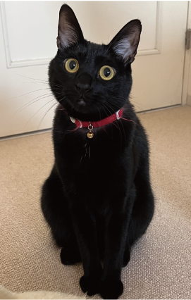
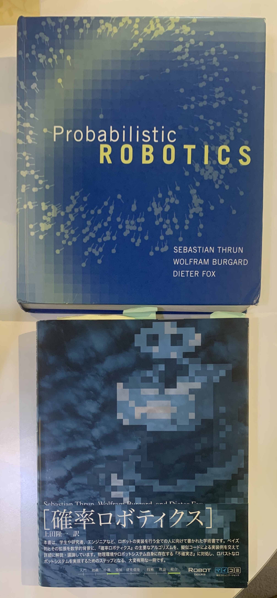

<!-- footer: Probabilistic Robotics, Lecture 1 (Part 1) -->

# Probabilistic Robotics, Lecture 1 (Part 1):  Introduction

Ryuichi Ueda, Chiba Institute of Technology

 

This work is licensed under a <a rel="license" href="http://creativecommons.org/licenses/by-sa/4.0/">Creative Commons Attribution-ShareAlike 4.0 International License</a>.

---

<!-- paginate: true -->

- Contents
    - Introduction
    - Lecture outline

---

## Introduction

---

### This Lecture

- "Probabilistic Robotics"
    - A field that aims to make robots smarter using probability and statistics
    - Robots are needed as they move out of factories and into human living spaces.
- Why Probability and Statistics?
    - Viewpoint from cotnrol theory: Conventional control cannot cope with the complexity of our living space.
    - Viewpoint from artificial intelligence: It is necessary to deal with the complexity of our living space in a somewhat "casual" manner.

---

### Viewpoint from control theory: Control and probability

- So-called modern control
    - State estimation and control of machines and plants based on state equations and observation equations.
         - State equation: $\boldsymbol{x}_t = \boldsymbol{f}(\boldsymbol{x}_{t-1}, \boldsymbol{u}_t) + \boldsymbol{\varepsilon}$
             - When a control command $\boldsymbol{u}_t$ is issued to the controlled object, state $\boldsymbol{x}_{t-1}$ changes to state $\boldsymbol{x}_t$.
             - However, Due to noise, $\boldsymbol{x}_t$ deviates by $\boldsymbol{\varepsilon}$.
         - Observation (output) equation: $\boldsymbol{z}_t = \boldsymbol{h}_t (\boldsymbol{x}) + \boldsymbol{\varepsilon}'$
             - If the state at time $t$ is $\boldsymbol{x}$, then $\boldsymbol{z}_t$ is observed.
             - However, due to noise, $\boldsymbol{z}_t$ deviates by $\boldsymbol{\varepsilon}'$.
    - Since noise is modeled probabilistically, we are actually dealing with probability.

---

### Probabilities handled in the state equation and observation equation

- The assumed noise variability is usually a normal (Gaussian) distribution.
    - Considering a stable and efficient control method based on a certain level of variability.
- Limitations of this idea
    - When noise becomes more general, it becomes difficult to handle using state/observation equations.
        - "The robot got stuck on a step and shifted direction by 90 degrees (the state warped)."
        - "A person blocked the sensor (an error too large to be handled by a Gaussian distribution)."

⇒⇒⇒A new tool (mathematical formula) is needed.

---

### Viewpoint from Artificial Intelligence: We want robots to have human-level recognition and judgment capabilities.

- Sudden question: Why would you ride a vehicle where an accident could occur?
    - Airplanes, cars, roller coasters
    - The problem of robots becoming human-level is one we need to consider.
* Serious answer
    - It's safe because of ◯◯
    - I don't ride it because of ◯◯
    - For surviving (But what about roller coasters?)
* Not serious answer
    * Because everyone rides them
    * I don't know (I just want to be released from this pointless lecture soon)

---

### One more question

- Why do people call cats that? What exactly are cats?
- Serious answer
    - The word "cat" comes from the word "sleeping child"... (in Japanese)
    - Cats are felines...
* Not serious answer
    * Because everyone calls them cats
    * Because they're not dogs, raccoons, cows, or horses
* $\Rightarrow$In fact, modern computers/robots use the latter one (NOT SERIOUS).

---

### What many researchers previously thought

- "If you provide the correct information to a computer and install it in a robot, it should function correctly."
    - By using the correct information, it should be possible to use logic to recognize and act correctly.
        - Keywords: expert system, predicate logic, fifth-generation computer
- It seems really smart, but is it really?
    - Can a cat be recognized simply by the logic that "it's a mammal with four legs..."

---

### Not serious answers are the key to intelligence

- If you think seirously everything around you, 
    - it takes energy and time (perhaps infinitely)
    - it makes it difficult to communicate with others
    - you can't say "I don't know, but let's try anyway"
- "Everyone's on board, after all."
    - Because you can say this, you don't need to study airplanes.
    - The Constitution guarantees it, so you can live without studying.
- "Cats are cats."
    - Everyone distinguishes them from dogs, and they're called cats, so they're cats.
        - They never called "cats" in other languages, and they might not even be distinguished.

---

### Good tools for dealing with frivolousness: Probability and statistics

- Probability and statistics puts aside causes and deals with the patterns of any data.
    - Airplane accident "rates": Statistics can be obtained even without understanding the mechanisms.
        - When new information is acquired and statistical predictions are revised, the calculation of probability is used.
        - It allows us to consider causes from results.
    - "Everyone calls it a cat" is also a statistical statement.
        - This is what artificial neural networks have learned.

As long as they can collect statistics, robots may not need to be physicists. In fact, we who are not physicists can go about our daily lives and work.

---

### Recent topics in artificial neural networks

- Transformer [Vaswani2017] and GPT (Generative Pre-trained Transformer) [Radford2018]: Selects and outputs the most appropriate next word at the beginning/midpoint of a sentence.
    - "Appropriate word": the word that has the highest probability of appearing next
        - taking into account the question from a person, the sentence before translation, and the sentences it has output so far...
- Diffusion models (such as Stable Diffusion [Rombach2021])
    - Learn how to remove noise from images with an assumption that the noise that follows a certain probability distribution.  $\rightarrow$ Generate images from white noise images.

Not simply learning statistical laws, but evolving through probabilistic structures and problem formulation.

---

### Summary of the Introduction

- Probability and statistics have become extremely important in both motor and intelligence, and this will likely continue for some time to come.

---

## Lecture Procedure

---

### Textbook Used in the Lecture

- Ueda: "Probability and Statistics for Robots," Corona Publishing, 2024.
- Changed from "Detailed Explanation of Probabilistic Robotics" published before 2024.
- Reason
- Please buy the book.
- 20 years after the publication of "Probabilistic Robotics,"
Robotics has further developed.
- Probability and statistics are being used beyond the original scope.
- I want to teach probability and statistics from the basics.
- The main points differ from those in general lectures.
- Some people say that "Detailed Probabilistic Robotics is difficult."
- It is written so that students can learn on their own once they have mastered the basics.

---

## Lecture Outline

- What to Do in Each Session
- How to Score

---

### Contents of Each Session (Part 1/2)

- Session 1 (This Time): Introduction/Representative Values
- Session 2: Probability and Reliability Engineering
- Session 3: Expected Value and Gambling
- Session 4: Continuous Values ​​and Multivariate Data
- Session 5: Bayes' Theorem and Interpretation of Experimental Results
- Session 6: Moving Probability Distributions and Robots
- Session 7: Localization of Moving Objects

---

### Contents of Each Session (Part 2/2)

- Session 8: Sensor-Based Estimation and Bayesian Filtering
- Session 9: Machine Learning and Variational Inference Using Bayes' Theorem
- Lesson 10: Continuation of Variational Inference and an Overview of Supervised Learning
- Lesson 11: Decision Making and Probability/Statistics
- Lesson 12: A Unified Understanding of Control and Reinforcement Learning Based on the Bellman Equation
- Lesson 13: Summary

---

### Scoring Information

- Test: 60 points
- Assignment: 40 points
- Deadline is around the end of the year, but is negotiable

---

### Reference Materials

- Lecture Slides: [ryuichiueda/slides_marp/prob_robotics_2025](https://github.com/ryuichiueda/slides_marp/tree/master/prob_robotics_2025)
- "Syokai Kakuritsu Robotics"
    - Code in the book: [ryuichiueda/LNPR_BOOK_CODES](https://github.com/ryuichiueda/LNPR_BOOK_CODES)
    - Completed code only: [ryuichiueda/LNPR](https://github.com/ryuichiueda/LNPR) 
    - Book explanation slides: [ryuichiueda/LNPR_SLIDES](https://github.com/ryuichiueda/LNPR_SLIDES) 
    - Corrections and other information: https://ueda.tech/?page=lnpr
- Probabilistic ROBOTICS
    - Read it someday to get a sense of what it was like back then.

