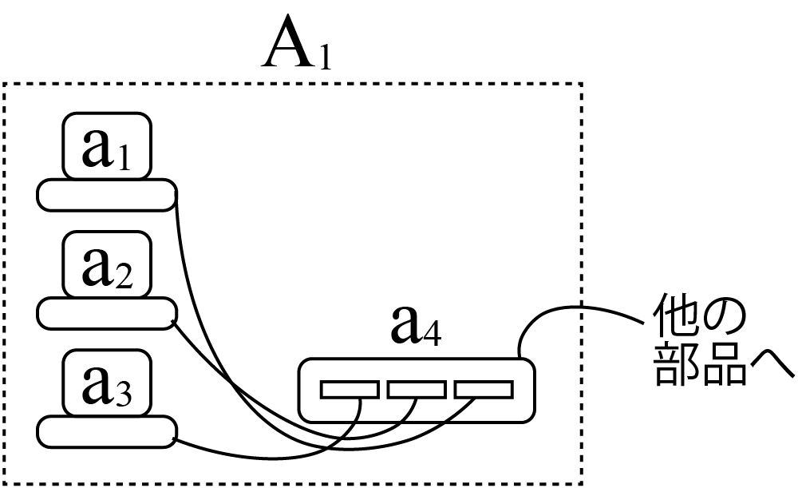
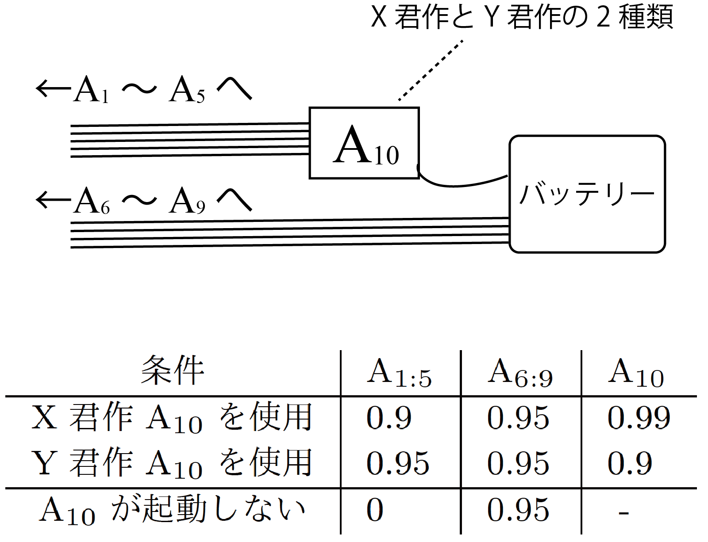

<!-- footer: Probabilistic Robotics, Lecture 2 (Part 1) -->

# Probabilistic Robotics, Lesson 2 (1/2): Probability and Reliability Engineering

Ryuichi Ueda, Chiba Institute of Technology

 

This work is licensed under a <a rel="license" href="http://creativecommons.org/licenses/by-sa/4.0/">Creative Commons Attribution-ShareAlike 4.0 International License</a>.

---

<!-- paginate: true -->

## Contents

- basics of probability + reliability engineering
    - To operate robots with probability in mind
- Contents
    - probability
    - simple probability calculations

---

### Have you ever had this experience?

- Your robot didn't start at a robotics competition.
* $\uparrow$ Have you dismissed it as "bad luck"? 
* $\uparrow$ Was it really bad luck? 
* $\uparrow$ Are you satisfied with eliminating the cause of your retirement? 
* $\uparrow$ Have you experienced something like this repeatedly? 
* People like that probably lack knowledge of reliability engineering, not robotics.
    - Let's study.
    - Since reliability engineering is based on probability, let's also get a grasp on the basics of probability.

---

## Probability

- Before getting into reliability engineering

---

### Definition of Probability (rough definition)

- When predicting whether an event will occur or not, we repeat the identical event many times under the same circumstances and calculate the rate of occurrence.
    - The rate is regarded as a probability. 
- Example: Let's consider the probability that robot part A has started up successfully only 90 times out of 100 times so far $\Rightarrow$$90/100 = 0.9$.

This is a bit naive but let's use this for our discussion.

---

### Probability Notation

- Notation: The probability of event X occurring is expressed as $\Pr\{$X$\}$
(Event X can be anything.)
    - Example from the previous page: $\Pr\{$A stands up correctly$\}=0.9$
- Difference from $P(x)$ and $P(\boldsymbol{x})$ (in this book)
    - In this notation, $x$ and $\boldsymbol{x}$ are scalars and vectors, respectively.
        - $P$ is a function whose domain is strictly determined on a number line or vector space.
    - Example: Dice
        - Although we can write $P(1) = 1/6$, we cannot write $P( x\ge 5)$.
- Since X in $\Pr\{$X$\}$ is an event, it can be written as anything.
    - Example: $\Pr\{$any number other than 5$\}$
    - It is a function over a set of events.

---

## Probability Calculation

- Using the example of calculating the activation rate of a robot

---

### Example Problem

- Consider the following simplified case.
    - Assume that the robot is composed of ten components: A$_{1:10}$.
    - After the robot's main power is turned on, A$_{1:10}$ become available.
    - If any of A$_{1:10}$ is not started up, the robot will not start up correctly.
    - The success or failure of one component does not affect the success/failure of the others.
- First Problem
    - If the probability of A$_1$ starting up correctly (startup rate) is $0.8$, and the startup rates of the other components are $0.95$, what is the probability that the robot will start up correctly?
    - I won't explain how to calculate it. please use your current knowledge.

---

### Answer

- $\Pr\{$A$_{1:10}$ is activated$\} = \prod_{i=1}^{10} \Pr\{$A$_i$ is activated$\} = 0.8\cdot 0.95^9 = 0.50$
     - We can see it will not activate once in every two attempts.
     - If you participate in something under these conditions, you will retire once in every two.
- Serial systems
    - Robots and machines that cannot function unless every component is working are called serial systems.
        - critical in factories or logistics systems
    - The probability that a serial system will operate correctly:
        - Multiplication of the probabilities that each component will operate correctly.
        - The probability of correct operation decreases due to multiplication.

---

### Another Problem

- The team operating the robot mentioned earlier was concerned about the low activation rate of part A$_1$. So they identified the cause and reduced the activation rate to $1.0$. What is the robot's activation rate?
    - The activation rate of other components remains at $0.95$.
- - Answer: $\Pr\{$A$_{1:10}$ is activated$\}=$ (omitted)$=1.0\cdot 0.95^9 = 0.63$ (Not much improvement)
    * Improvement of A$_1$ is necessary. However, other components also.
- Something I often see in students.
    * They only look what they're interested in and don't see the whole picture.
    * When they run the robot, problems occur in parts they're not interested in. In the worst cases, they put it off. $\Rightarrow$ They retire every year.
    * (Not related to robots, but) people who's good at arguing are usually like this too.

---

### One more problem

- To raise the robot's activation rate to $0.9$, how much do the activation rates of each component need to be improved? If all components are raised to the same activation rate $\alpha$, what is the value of $\alpha$?
- Answer
    * $\alpha^{10} = 0.9$
    * $\alpha = 0.99$
    * Components that "occasionally don't work, but that's okay" should not be used.

---

### Summary so far

- When calculating activation rates, you sometimes get an answer that differs from what you had in mind.
- Humans are driven by their own interests and see reality in a distorted way.
    - People who cannot calmly consider failures will make the same mistakes again.
    - If we can calculate probabilities, the distortion will be somewhat reduced.

So, let's get better at calculating probabilities.

---
## Probability calculations

---

### Why is the activation rate of a series system multiplied?

- Earlier, we calculated the activation rate of a serial system using multiplication.
    - Why multiplication?
    - Let's assume the theorem for probability calculation is correct and think about it mechanically.
        - We'll use the theorem called the multiplication theorem.

---

### Multiplication Theorem

- $\text{Pr}\{$A and B occur$\} = \text{Pr}\{$A occurs|B occurs$\}\text{Pr}\{$B occurs$\}$
    - $\text{Pr}\{$A occurs|B occurs$\}$: The probability that A occurs when we know that B will occur (conditional probability).
        - The right side of $|$ is the "condition."
    - When applied to a serial system, this is what happens.
        - $\Pr\{$A$_{1:10}$ are OK$\} = \Pr\{$A$_{2:10}$ is OK|A$_1$ is OK$\}\Pr\{$A$_1$ is OK$\}$
- Let's consider $\Pr\{$A$_{2:10}$ are OK|A$_1$ is OK$\}$.

---

### Independence

- $\Pr\{$A$_{2:10}$ are OK|A$_1$ is OK$\}$
   - The condition "A$_1$ is OK" does not affect the activation of others.
   $\Rightarrow$ The condition can be removed
- This unrelatedness of events is called independence.
- The relationship between independent events $X$ and $Y$:
    - $\Pr\{X \cap Y\} = \Pr\{X | Y\}\Pr\{Y\} = \Pr\{X\}\Pr\{Y\}$
    - $\Pr\{X \cap Y\} = \Pr\{Y | X\}\Pr\{X\} = \Pr\{X\}\Pr\{Y\}$
         - $\cap$ is the set intersection operator.
    - Notation: $X\perp\!\!\!\!\perp Y$
- If they are not independent, they are said to be dependent.
    - Notation: $X\not\perp\!\!\!\!\!\perp Y$

---

### Activation rate of a series system

- Therefore
    - $\Pr\{$A$_{1:10}$ are OK$\}$
$= \Pr\{$A$_{2:10}$ are OK|<del>A$_1$ is OK</del>$\}\Pr\{$A$_1$ is OK$\}$
$= \Pr\{$A$_{2:10}$ are OK$\}\Pr\{$A$_1$ is OK$\}$
- Similarly, by using the multiplication theorem to remove A$_2$, A$_3$, etc., and eliminating them from the condition, we obtain:
$\Pr\{$A$_{1:10}$ are OK$\} = \prod_{i=1}^{10} \Pr\{$A$_i$ is OK$\}$

---

### Redundant system

- To increase the activation rate of component A$_1$, the team replaced it with multiple components a$_{1:3}$ as shown below.
    - a$_{1:3}$ is connected to hub a$_4$.

- How do we calculate the activation rate? (This time it's not multiplication.)

---

### Addition Theorem

- Theorem on probability addition
    - $\Pr\{$one of A or B occurs, or both occur$\}$
    $= \Pr\{$A occurs$\} + \Pr\{$B occurs$\} - \Pr\{$A and B occur$\}$
- In particular, when A and B cannot occur simultaneously
    - $\Pr\{$A or B occurs$\} = \Pr\{$A occurs$\} + \Pr\{$B occurs$\}$
    - A and B cannot occur simultaneously $\Longrightarrow$ expressed as mutually exclusive.
        - Example: "Even die roll" and "odd die roll" are mutually exclusive.
        - In the case of exclusive pairs, $A \cap B = \varnothing$
            - $\varnothing$ (or $\phi$): null event (an event that cannot occur)

---

### Summary of Probability Calculation Methods

- Important: In fact, the only theorems are the multiplication theorem and the addition theorem.
    - Fewer rules than ordinary arithmetic.
- Multiplication theorem
    - $\text{Pr}\{$X$\cap$Y$\} = \text{Pr}\{$X$|$Y$\}\text{Pr}\{$Y$\}$
    - Independent case: $\text{Pr}\{$X$\cap$Y$\} = \text{Pr}\{$X$\}\text{Pr}\{$Y$\}$
    - For mutually independent X$_{1:n}$: $\text{Pr}\{\bigcap_{i=1}^n$X$\} = \prod_{i=1}^n\text{Pr}\{$X$_i\}$
- Addition theorem
    - $\Pr\{$X$\cup$Y$\} = \Pr\{$X$\} + \Pr\{$Y$\} - \Pr\{$X$\cap$Y$\}$
        - $\cup$ is the operator used to merge the left and right sets.
    - Disjoint case: $\Pr\{$X$\cup$Y$\} = \Pr\{$X$\} + \Pr\{$Y$\}$
    - For mutually exclusive X$_{1:n}$: $\text{Pr}\{\bigcup_{i=1}^n$X$\} = \sum_{i=1}^n\text{Pr}\{$X$_i\}$

---

### Startup rate of a redundant system

- Let's assume that the activation rate of a$_{1:3}$ is $0.8$.
- Calculate the probability that at least one a$_{1:3}$ will be activated, excluding a$_4$.
    - Separate "at least one activation" into mutually exclusive events.
        - a$_1$ is OK.: Probability is $0.8$.
    - a$_1$ is NG, and a$_{2}$ is OK.:
    Probability is $0.2\cdot 0.8 = 0.16$.
    - a$_{1:2}$ are NG, and a$_{3}$ is OK.:
    Probability is $0.2^2 \cdot 0.8 = 0.032$.
$\Rightarrow$ Total probability: $0.992$.

---

### Continuing the Calculation (Single Point of Failure)

- If a$_4$ does not start, the redundant A$_1$ will not start.
    - This is called a single point of failure.
- Calculation results for redundant A$_1$
    - Because the entire a$_{1:3}$ and a$_4$ are in series, multiply the result on the previous page by the activation rate of a$_4$ (let's call it $\alpha$).
- Example 1: $\alpha = 0.95$
    - answer: $0.992\cdot 0.95 = 0.94$ (> A$_1$ activation rate)
- Example 2: $\alpha = 0.8$
    - answer: $0.992\cdot 0.8 = 0.79$ (< A$_1$ activation rate)

In the end, unless the reliability of a$_4$ is extremely high, the effect of redundancy is minimal.

---

### Another calculation method: Using complementary events

- Complementary Event
   - For an event X, it is the all events (all possible events) excluding X.
   - For an event X, it is denoted as X$^c$.
   - Dice example: The complement of "rolling an even number" is "rolling an odd number."
- Calculation using complementary events
    - The complement of "at least one a$_{1:3}$ is OK" is "none of a$_{1:3}$ is OK."
    - $\Pr\{$a$_{1:3}$ activates at least one time$\} = 1 - (0.2)^3 = 0.992$

---

### When components affect each other

- Now, let's consider the following case.
    - A$_{10}$ is a power supply circuit. The team uses two, one made by X and one made by Y.
        - X's circuit has a high activation rate and slightly unstable current.
        - Y's circuit has a low activation rate and stable current.
    - The activation rates of A$_{1:5}$ differ between X's and Y's A$_{10}$.
(Table on the bottom right)

Which should I use? 

---

### Solution

- Set up the equation: $\Pr\{$Robot activates$|$Whose A$_{10}$ is$\}$
- Abbreviated because it's tedious
    - $\Pr\{$A$_{1:10}|$Z$\}$
        - "A$_{1:10}$ activates" is simply "A$_{1:10}$"
        - Let's simply write Z as the A$_{10}$ (Z is either X or Y).
- Use the multiplication theorem when there are conditions
    - $\Pr\{X \cap Y | Z \} = \Pr\{X | Y \cap Z \} \Pr\{Y | Z \}$
        - Ignore the conditions and use the multiplication theorem, then just add the conditions at the end.
        - The derivation is in the textbook.

---

### Formula Expansion

- $\Pr\{$A$_{1:10}|$Z$\}=\Pr\{$A$_{1:5}\cap$A$_{10}|$A$_{6:9}\cap$Z$\}\Pr\{$A$_{6:9}|$Z$\}$ (Move part A$_{6:9}$ to the condition)
$=\Pr\{$A$_{1:5}\cap$A$_{10}|$Z$\}\Pr\{$A$_{6:9}\}\qquad\quad\qquad\qquad\quad$ (Delete unnecessary conditions)
$=\Pr\{$A$_{1:5}|$A$_{10}\cap$Z$\}\Pr\{$A$_{10}|$Z$\}\Pr\{$A$_{6:9}\}\qquad\qquad$ (Move to condition A$_{10}$)
$=\big(\prod_{i=1}^5\Pr\{$A$_i|$A$_{10}\cap$Z$\}\big)\Pr\{$A$_{10}|$Z$\}\big(\prod_{j=6}^9\Pr\{$A$_j\}\big)$ (Decomposition based on independence)

Decomposition using the multiplication theorem and independence  (Basics of deriving algorithms for probabilistic robotics and machine learning)

---

### Value substitution

- Final equation
    - $\Pr\{$Robot launches$|$Z$\}$
$= \big(\prod_{i=1}^5\Pr\{$A$_i|$A$_{10}\cap$Z$\}\big)$
$\quad\cdot\Pr\{$A$_{10}|$Z$\}\cdot\big(\prod_{j=6}^9\Pr\{$A$_j\}\big)$
- Apply the values in the table.
    - When Z=X: $0.9^5\cdot 0.99 \cdot 0.95^4 \simeq 0.48$
    - When Z=Y: $0.95^5\cdot 0.9 \cdot 0.95^4 \simeq 0.57$

It's better to use Y's.

 (They're not so different, though.)

---

### Adding hidden conditions after the fact

- Let's try another type of problem that comes up in algorithm derivation.
- Problem
    - The team has been recording statistics on the startup rate of their robots over a certain period of time.
        - $\Pr\{$Robot Started$\} = 0.5$
    - The robots used either X's or Y's power supply circuit.
    - What percentage of the time did they use X's power supply circuit?
- Additional information: The startup rate of the robots when using X's or Y's power supply circuit.
    - X: $0.48$
    - Y: $0.57$

How do we solve this? 

---

### Solution

- Do the inverse of the addition theorem
    - $\Pr\{$Robot activates$\} =\sum_{Z = \text{X}, \text{Y}} \Pr\{$Robot activates$\cap Z\}$
        - "The power supply circuit is made by X" and "The power supply circuit is made by Y" are mutually exclusive, and
together they form the complete set of events, so this holds.
- Apply the multiplication theorem
    - $\cdots =\sum_{Z = \text{X}, \text{Y}} \Pr\{$Robot activates$| Z\}\Pr\{Z\}$
$=\Pr\{$Robot activates$|$X$\}\Pr\{$X$\} + \Pr\{$Robot activates$|$Y$\}\Pr\{$Y$\}$

---

### Solution (continued)

- The equations obtained so far
    - $\Pr\{$Robot activates$\}$
$=\Pr\{$Robot activates$|$X$\}\Pr\{$X$\} + \Pr\{$Robot activates$|$Y$\}\Pr\{$Y$\}$
- Organizing the substituted values
    - Let $x$ be the desired value (the percentage of X's power circuit used)
        - Y's percentage is $1-x$
    - The robot's startup rate when using X's power circuit: $0.48$
    - Y's (same as above): $0.57$
- Substituting
    - $0.5 = 0.48x + 0.57(1-x) \ \Longrightarrow\quad\!\!$$x=7/9$

---

### Key Points of the Problem

- Conditions not originally considered can be added later.
    - $\Pr\{$Robot activates$\}$
$=\Pr\{$Robot activates$|$X$\}\Pr\{$X$\} + \Pr\{$Robot activates$|$Y$\}\Pr\{$Y$\}$
        - X and Y that were not originally present appear.
- Even if no conditions are specified, everything is actually a condition.
    - $\Pr\{$Robot activates$\}=\Pr\{$Robot activates$|$Everything in the world$\}$
    - If we remove events independent of the robot's startup...
$= \Pr\{$Robot activates$|$Everything related to the robot$\}$
- Appears in the derivation of FastSLAM [Montemerlo 2003], etc.

---

## Summary

- Introduction to probability
    - The Symbol $\Pr\{\quad\}$
    - Multiplication theorem, addition theorem
    - Independence, disjoint
    - Null events, all events, complementary events
- Calculations using two theorems
    - There are only two theorems, but you need to think carefully about how to handle events
