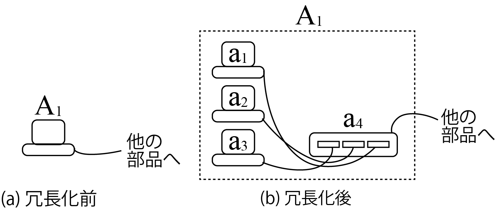

<!-- footer: Probabilistic Robotics, Lecture 2 (Part 1) -->

# Probabilistic Robotics, Part 2 (Part 1): Probability and Reliability Engineering

Ryuichi Ueda, Chiba Institute of Technology

 

This work is licensed under a <a rel="license" href="http://creativecommons.org/licenses/by-sa/4.0/">Creative Commons Attribution-ShareAlike 4.0 International License</a>.

---

<!-- paginate: true -->

## Contents

- basics of probability + reliability engineering
    - To operate robots with probability in mind
- Contents
    - probability
    - simple probability calculations

---

### Have you ever had this experience?

- Your robot didn't start at a robotics competition.
* $\uparrow$ Have you dismissed it as "bad luck"? 
* $\uparrow$ Was it really bad luck? 
* $\uparrow$ Are you satisfied with eliminating the cause of your retirement? 
* $\uparrow$ Have you experienced something like this repeatedly? 
* People like that probably lack knowledge of reliability engineering, not robotics.
    - Let's study.
    - Since reliability engineering is based on probability, let's also get a grasp on the basics of probability.

---

## Probability

- Before getting into reliability engineering

---

### Definition of Probability (rough definition)

- When predicting whether an event will occur or not, we repeat the identical event many times under the same circumstances and calculate the rate of occurrence.
    - The rate is regarded as a probability. 
- Example: Let's consider the probability that robot part A has started up successfully only 90 times out of 100 times so far $\Rightarrow$$90/100 = 0.9$.

This is a bit naive, but for now, let's use this for our discussion.

---

### Probability Notation

- Notation: The probability of event X occurring is expressed as $\Pr\{$X$\}$
(Event X can be anything.)
    - Example from the previous page: $\Pr\{$A stands up correctly$\}=0.9$
- Difference between $P(x)$ and $P(\boldsymbol{x})$ (in this book)
    - In this notation, $x$ and $\boldsymbol{x}$ are scalars and vectors, respectively.
        - $P$ is a function whose domain is strictly determined on a number line or vector space.
    - Example: Dice
        - Although we can write $P(1) = 1/6$, we cannot write $P(any number other than 5$)$.
- Since X in $\Pr\{$X$\}$ is an event, it can be written as anything.
    - Example: $\Pr\{any number other than 5$\}$
    - It is a function over a set of events.

---

## Probability Calculation

- Using the example of calculating the activation rate of a robot

---

### Example Problem

- Consider the following simplified case.
- A robot is carrying 10 parts A$_1$, Assume that the robot is composed of A$_2$, $\dots$, and A$_{10}$.
- After the robot's main power is turned on, A$_{1:10}$ becomes available for use shortly.
- Each component is referred to as "starting up."
- If any of A$_{1:10}$ is not started up, the robot will not start up correctly.
- The success or failure of one component does not affect the success or failure of the other components.
- First Problem
- If the probability of A$_1$ starting up correctly (startup rate) is $0.8$, and the startup rates of the other components are $0.95$, what is the probability that the robot will start up correctly?
- I won't explain how to calculate it, but for now, please use your current knowledge.

---

### Answer

- $\Pr\{$A$_{1:10}$ is activated$\} = \prod_{i=1}^{10} \Pr\{$A$_i$ is activated$\} = 0.8\cdot 0.95^9 = 0.50$
This results in multiplication.
- Looking at the answer, we can see that it will not activate once in every two attempts.
- If you participate in something under these conditions, you will retire once in every two attempts.
- Trivia
- Robots and machines that cannot function unless even one component is working,
factory and logistics systems, are called serial systems.
- The probability that a serial system will operate correctly:
- Multiplication of the probabilities that each component will operate correctly.
- The probability of correct operation decreases due to multiplication.

---

### Another Problem

- The team operating the robot mentioned earlier was concerned about the low activation rate of part A$_1$, so they identified the cause and reduced the activation rate to $1.0$. What is the robot's activation rate?
- The activation rate of other components remains at $0.95$. - Answer
* $\Pr\{$A$_{1:10}$ is activated$\}=$ (omitted)$=1.0\cdot 0.95^9 = 0.63$ (Not much improvement)
* Improvement of A$_1$ is necessary, but other components also need to be improved.
- Something I often see in students.
* They only look at the parts they're interested in and don't see the whole picture.
* When they run the robot, problems occur in parts they're not interested in,
and in the worst cases, they put it off and retire every year$\Rightarrow$.
* (Not related to robots, but) people who call themselves theorists are usually like this too.

---

### Another problem

- To raise the robot's activation rate to $0.9$, how much do the activation rates of each component need to be improved? If all components are raised to the same activation rate $\alpha$, what is the value of $\alpha$?
- Answer
* $\alpha^{10} = 0.9$
* $\alpha = 0.99$
* Components that "occasionally don't work, but that's okay" should generally not be used.

---

### Summary so far

- When calculating activation rates, you sometimes get an answer that differs from what you had in mind.
- Humans are driven by their own interests and see reality in a distorted way.
- People who cannot calmly consider failures will make the same mistakes again.
- If we can calculate probabilities, the distortion will be somewhat reduced.
 

So, let's get better at calculating probabilities.

---
## Probability calculations

---

### Why is the activation rate of a series system multiplied?

- Earlier, we calculated the activation rate of a serial system using multiplication.
- Why multiplication?
- Let's assume the theorem for probability calculation is correct and think about it mechanically.
- We'll use the theorem called the multiplication theorem.

---

### Multiplication Theorem

- $\text{Pr}\{$A and B occur$\} = \text{Pr}\{$A occurs|B occurs$\}\text{Pr}\{$B occurs$\}$
- $\text{Pr}\{$A occurs|B occurs$\}$: The probability that A occurs when we know that B will occur (conditional probability).
- The right side of $|$ is the "condition."
- When applied to a serial system, this is what happens.
- $\Pr\{$A$_{1:10}$ activates$\} = \Pr\{$A$_{2:10}$ is activated|A$_1$ is activated$\}\Pr\{$A$_1$ is activated$\}$
- Let's consider $\Pr\{$A$_{2:10}$ is activated|A$_1$ is activated$\}$.

---

### Independence

- $\Pr\{$A$_{2:10}$ is activated|A$_1$ is activated$\}$
- The condition was that the activation of one component does not affect the activation of other components.
The $\Rightarrow$ condition can be removed
- This unrelatedness of events is called independence.
- The relationship between independent events $X$ and $Y$:
- $\Pr\{X \cap Y\} = \Pr\{X | Y\}\Pr\{Y\} = \Pr\{X\}\Pr\{Y\}$
- $\Pr\{X \cap Y\} = \Pr\{Y | X\}\Pr\{X\} = \Pr\{X\}\Pr\{Y\}$
- $\cap$ is the set intersection operator.
- Notation: $X\perp\!\!\!\!\perp Y$
- If they are not independent, they are said to be dependent.
- Notation: $X\not\perp\!\!\!\!\perp Y$

---

### Activation rate of a series system

- Therefore
- $\Pr\{$A$_{1:10}$ is activated$\}$
$= \Pr\{$A$_{2:10}$ is activated|<del>A$_1$ is activated</del>$\}\Pr\{$A$_1$ is activated$\}$
$= \Pr\{$A$_{2:10}$ is activated$\}\Pr\{$A$_1$ is activated$\}$
- Similarly, by using the multiplication theorem to remove A$_2$, A$_3$, etc., and eliminating them from the condition, we obtain:
$\Pr\{$A$_{1:10}$ is activated$\} = \prod_{i=1}^{10} \Pr\{$A$_i$ is activated$\}$

---

### Another example: Redundant system

- To increase the activation rate of component A$_1$, we replaced it with multiple components a$_{1:3}$ as shown below,
so that it doesn't matter if any of them breaks. a$_{1:3}$ is connected to hub a$_4$.

- How do we calculate the activation rate? (This time it's not multiplication.)

---

### Addition Theorem

- Probability Addition Theorem
- $\Pr\{$A, B, or both occur$\} = \Pr\{
