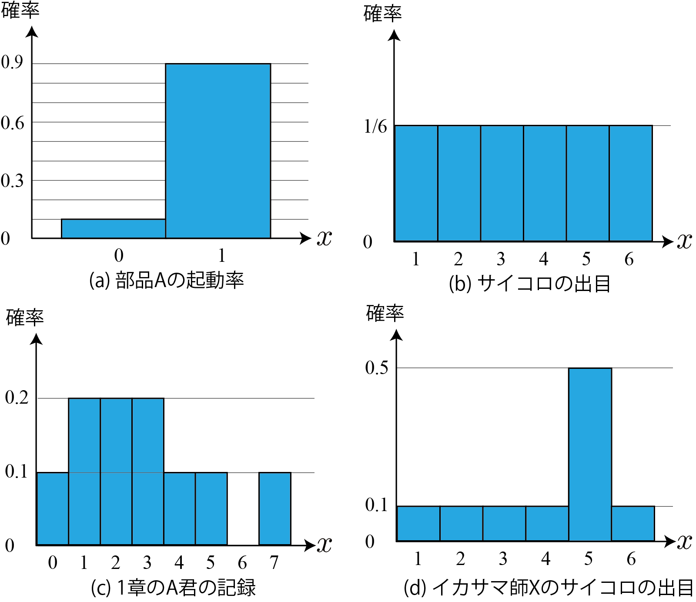

<!-- footer: 確率ロボティクス第2回（その2） -->

# 確率ロボティクス第2回（その2）:  確率変数，確率質量関数と確率分布

千葉工業大学 上田 隆一

 

This work is licensed under a <a rel="license" href="http://creativecommons.org/licenses/by-sa/4.0/">Creative Commons Attribution-ShareAlike 4.0 International License</a>.

---

<!-- paginate: true -->

## 今回の内容

- 確率変数
- 確率質量関数
- 確率分布
- 同時確率分布

---

## 確率変数

- 事象に数を対応させたもの
    - 例1: コインを投げて表が出る/裏が出るにそれぞれ$0$、$1$を割り当て
    - 例2（自然にそうなっている例）
        - サイコロを振って$n$の目が出る事象に$n$を割り当て
    - 例3（自然にそうなっている+連続的な変数の例）
        - ある人の身長が$x$[mm]であるという事象に$x$を割り当て
- 大抵は根元事象に対して数値を対応
    - 根元事象: それ以上分けられない/分けない事象（サイコロの目など）
    - 確率変数の定義域は全ての根元事象を網羅している必要がある

---

### なんで確率変数を考えるのか

- 確率分布を考えるため（後述）
- その他計算のため（期待値など。次回。）
- 事象の扱いがめんどくさい
    - いちいち「$\circ\circ$という事象が起こった」と言うのがめんどくさい
    - 根元事象やそうでない事象が入り混じってめんどくさい
- 注意: 以後、区別の不要なときは、確率変数を単に「変数」と表記

---

## 確率分布

- 確率変数を横軸にすると確率のグラフが描ける
    - 数直線上での確率の「分布」が分かる$\Longrightarrow$確率分布
- 典型的な分布には名前
    - ベルヌーイ分布（例: (a)）
        - 変数が2値だけ
    - 一様分布（例: (b)）
        - 変数のある範囲で確率が一定

---

## 確率質量関数

- 変数の値に対応する確率を返す関数
    - 表記: $P(x)$（厳密には$P$）
    - 要は確率分布のグラフの形を決める関数
    - これも確率分布と呼ばれる
- $\Pr\{$ $\}$より定義がスッキリ
    - 変数がスカラー
- 補足
    - 「$P$」という記号は、本来は$f$だろうが
    $g$だろうが別になんでもよい
    - $x$が実数のときは密度の関数になるが
    今は考えない

---

## 「確率分布に従う」

- 変数$x$が$P$で分布するとき、「$x$は$P$に従う」と表現
    - $P$がなんらかの法則性をあらわしていて、
    $x$はそれにしたがって発生するという発想
- 数式上の表記: $x \sim P$
    - 表記に関する補足
        - $P(x)$は変数の値が$x$となるときの確率
        - $P$は確率分布そのもの

---

## ドローイング

- $P$にしたがうように値をランダムに選択すること
- これも表記は$x \sim P$
- 無限に値をドローイングして確率分布を作ると$P$に一致
- 用途
    - 数値計算（モンテカルロ積分や一部のサンプリング手法）
    - シミュレーション
- 似て非なるもの: サンプリング
    - サンプリング: 統計を取るときに対象から
    一定数の標本（サンプル）を抜き取ること

---

## 独立同分布

- $x_1 \sim P$、$x_2 \sim P$とふたつ値をドローしたとき、
$x_1$と$x_2$に、$P$に従う以上の関係性がないこと
- 表記: $x_{1:n} \overset{\text{iid}}{\sim} P$
    - $x_1, x_2, \dots, x_n$が互いに独立同分布

---

{2.4.4}\SEVENjidori {確率分布と事象の関係}}{45}
{2.4.5}\SEVENjidori {同時確率質量関数，同時確率分布}}{46}
{2.5}\SEVENjidori {まとめと議論}}{47}

