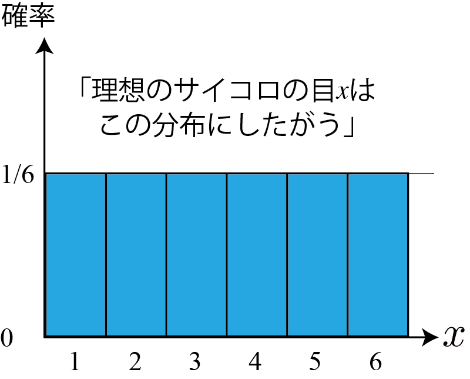
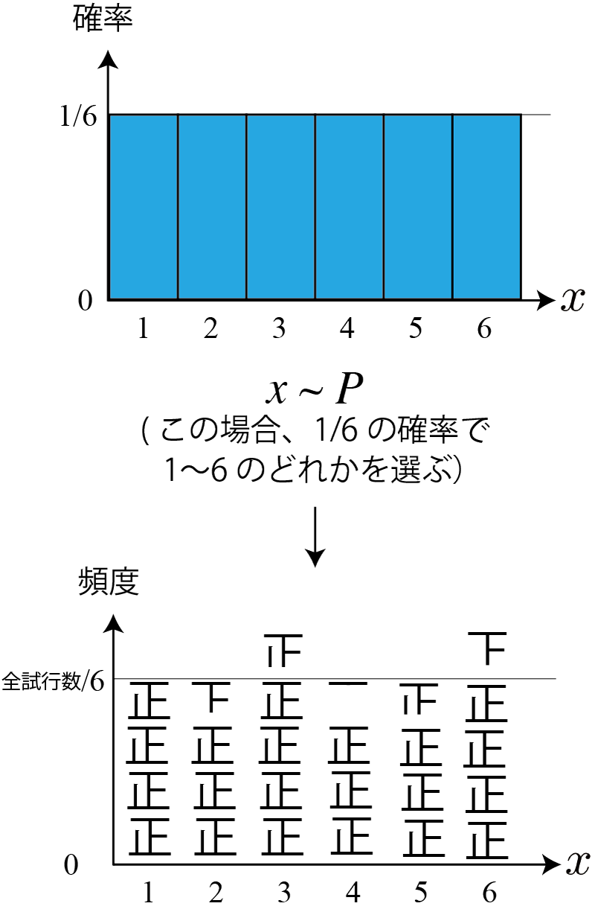
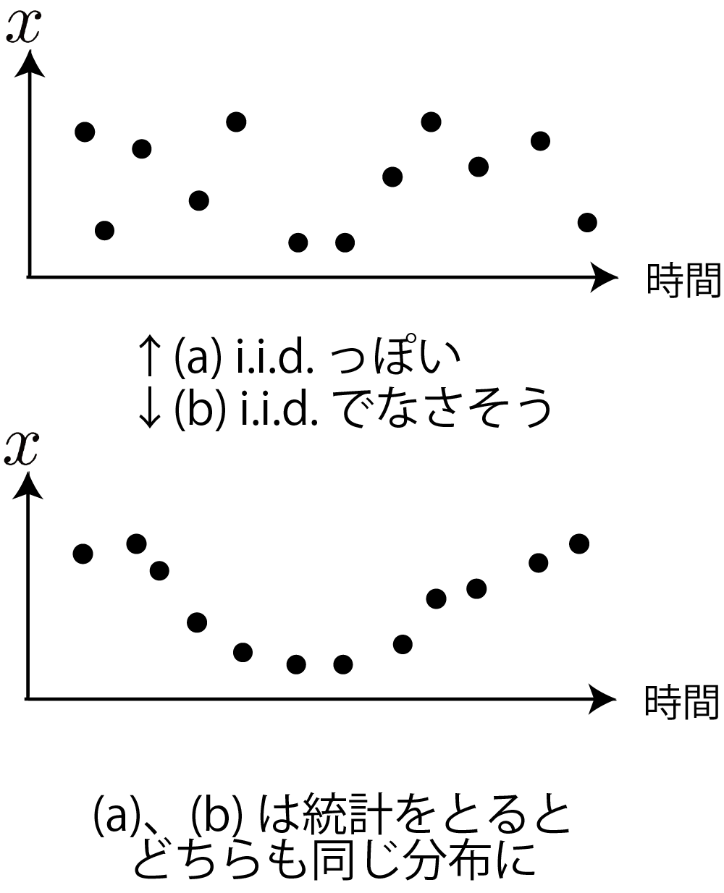

<!-- footer: Probabilistic Robotics, Part 2 -->

# Probabilistic Robotics, Lesson 2 (2/2):  Random Variables, Probability Mass Functions, and Probability Distributions

Ryuichi Ueda, Chiba Institute of Technology

 

This work is licensed under a <a rel="license" href="http://creativecommons.org/licenses/by-sa/4.0/">Creative Commons Attribution-ShareAlike 4.0 International License</a>.

---

<!-- paginate: true -->

## Topics

- Random Variables
- Probability Distributions
- Independent and Identically Distributed
- Calculating Multivariate Probability Distributions

---

## Random Variables

- Associating Numbers with Events
    - Example 1: Tossing a coin assigns $0$ and $1$ to heads and tails, respectively.
    - Example 2 (An example where this happens naturally)
        - Rolling a die assigns $n$ to the event of rolling $n$.
    - Example 3 (An example where this happens naturally + continuous variables)
        - Assigning $x$ to the event that a person's height is $x$ [mm].
- Usually, a number is associated with a elementary event.
    - Elementary event: an events that cannot be further divided (such as dice rolls)
    - The domain of a random variable must contain all elementary events.

---

### Why do we consider random variables?

- To consider probability distributions (see later).
- For calculations (such as expected value, see next time).
- Handling events is tedious.
    - It's tedious to keep saying "an event $\circ\circ$ occurred."
    - It's tedious to mix elementary and non-elementary events.
- Note: From now on, when the distinction is unnecessary, I will simply refer to random variables as "variables."

---
## Probability Distribution

- You can graph probability by plotting a random variable on the horizontal axis.
    - You can see the "distribution" of probability on a number line. $\Longrightarrow$Probability Distribution
- Names for typical distributions
    - Bernoulli Distribution (Example: (a))
        - Only two kinds of values
    - Uniform distribution (e.g., (b))
        - The probability is constant over the range of a variable

---

## Probability Mass Function

- A function that returns the probability corresponding to a value
    - Notation: $P(x)$ (strictly speaking, $P$)
    - Essentially, this is a function that determines the shape of the probability distribution graph
    - This is also called a probability distribution
- A clearer definition than $\Pr\{$ $\}$
    - The variable is a scalar
- Additional information
    - The symbol "$P$" is actually either $f$ or $g$, or whatever it is
    - When $x$ is a real number, it becomes a density function, but
we won't consider that for now

---

### Probability Mass Function and Addition Theorem

- For random variables, different values automatically result in exclusive events.
    - $\Pr\{a=x_1 \text{\ or\ } x_2 \} = P_a(x_1) + P_a(x_2)$
        - when $x_1$ and $x_2$ are different,
        - Example on the right: $P(0) + P(3) = 0.3$
    - $\Pr\{x_0 \le x \le x_1\} = \sum_{x=x_0}^{x_1} P(x)$
        - Example on the right
            - $\Pr\{1 \le x \le 3\} = 0.2\times 3 = 0.6$
            - $\Pr\{x \ge 3\} = 0.2 + 0.1\times 3 = 0.5$
    - What is being calculated: Area of a probability distribution

---

## "Follows a probability distribution"

- When a variable $x$ is distributed according to $P$, we say "$x$ follows $P$"
    - The idea is that $P$ represents some kind of law, and $x$ occurs according to that law.
- Mathematical notation: $x \sim P$
    - Additional notation information
        - $P(x)$ is the probability that the variable takes the value $x$
        - $P$ is the probability distribution itself

---

## Draw (drawing)

- Randomly selecting values of the variable that follow $P$
- This is also written as $x \sim P$
- If you draw values infinitely to create a frequency distribution, the shape will match $P$
- Uses
    - Simulation
    - Numerical calculation (Monte Carlo integration and sampling)
- Similar but different: Sampling
    - Sampling: Taking a certain number of samples from a subject when calculating statistics

---

## Independent and identically distributed (i.i.d.)

- When values $x_1, x_2, \dots, x_n$ are drawn from $P$,
there is no relationship between the values beyond the fact that they follow $P$
    - Notation: $x_{1:n} \overset{\text{iid}}{\sim} P$
- Examples of distributions that are not independent and identical distributions
    - Right image
    - Roulette wheel operated by a dealer
    - Sensor output
        - Noise factors persist for a certain period of time
        - There is no such thing as "independent and identically distributed" (I.i.d. is an adjective.)

---

## Joint Distribution

- Distribution for two or more random variables
- Example: Let $a$ be the number rolled on a blue die and $b$ be the number rolled on a red die
    - Probability distribution of the number rolls: $P_{a,b}$
    - Probability that $a=x, b=y$: $P_{a,b}(x,y)$
        - $P_{a,b}$ is called the joint probability mass function (distribution)
- When the distribution is known, the subscripts of $P_{a,b}$ are often omitted
    - $P$, $P(x,y)$
    - Students get confused when they see this in textbooks.
    - ...but subscripts are also annoying.

---

### Joint Distribution and the Multiplication Theorem

- Multiplication Theorem (holds as is)
    - $P(x, y) = P(x|y)P(y)$
        - Actually, $P_{a,b}(x, y) = P_{a|b}(x|y)P_{b}(y)$
        - $P(x|y)$ is called the conditional probability mass function (distribution).
    - Independent case: $P(x, y) = P(x)P(y)$
    - For mutually independent variables $x_{1:n}$: $P(x_1,x_2,\dots,x_n) = \prod_{i=1}^nP(x_i)$

---

### Adding and Removing Variables from a Joint Distribution

- Adding Variables
    - Add a new variable $y$ to a given $P(x)$
        - $P(x) = \sum_{y \in Y}P(x, y)$
            - Here, $Y = \{y_0, y_1, \dots, y_n\}$
    - Example: The power circuit discussion of X and Y from the first half.
        - $\Pr\{$Robot starts up$\}$
        $=\Pr\{$Robot starts up$|$X$\}\Pr\{$X$\} + \Pr\{$Robot starts up$|$Y$\}\Pr\{$Y$\}$
- Eliminate specific variables from the joint distribution.
    - The inverse of the above equation is $\sum_{y \in Y}P(x, y) = P(x)$
    - This is called marginalization and is often used in algorithm derivations.

---

## Summary

- Introduction to random variables and probability distributions
    - Mathematically easy to handle
- Multivariate probability distributions
    - Joint distributions and conditional distributions
    - Familiarizing yourself with calculations such as the multiplication theorem and marginalization will enable you to read machine learning textbooks
