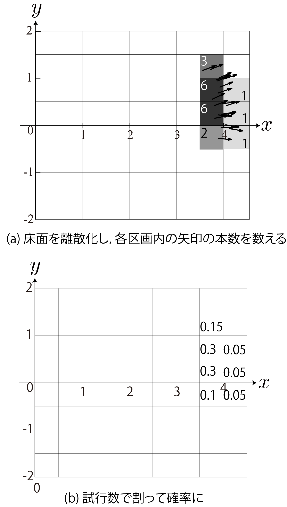
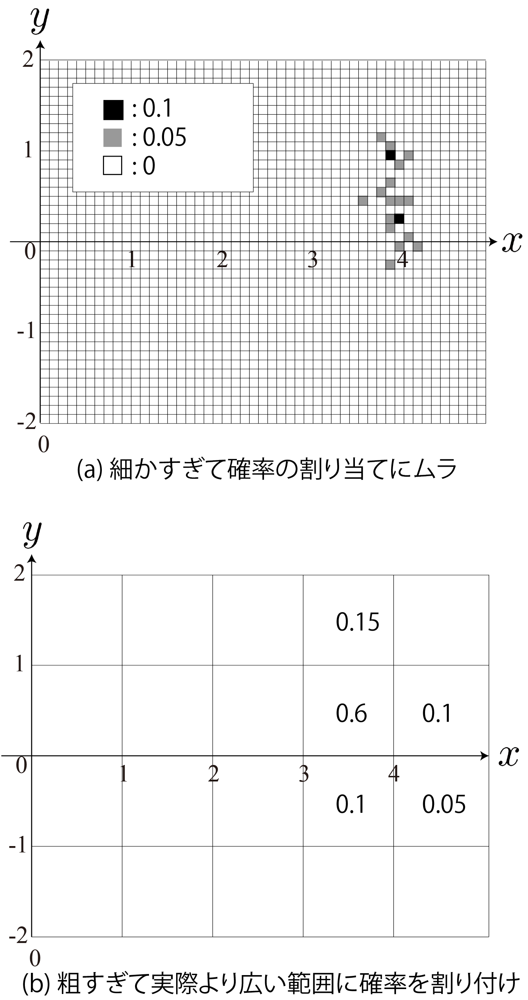
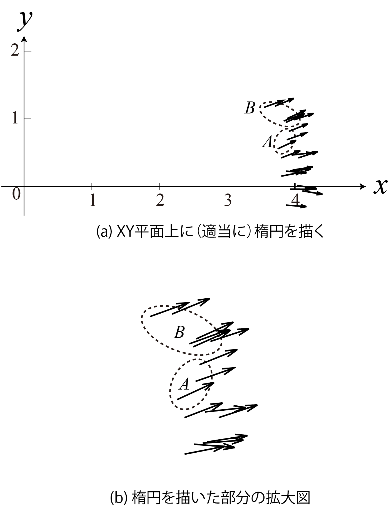
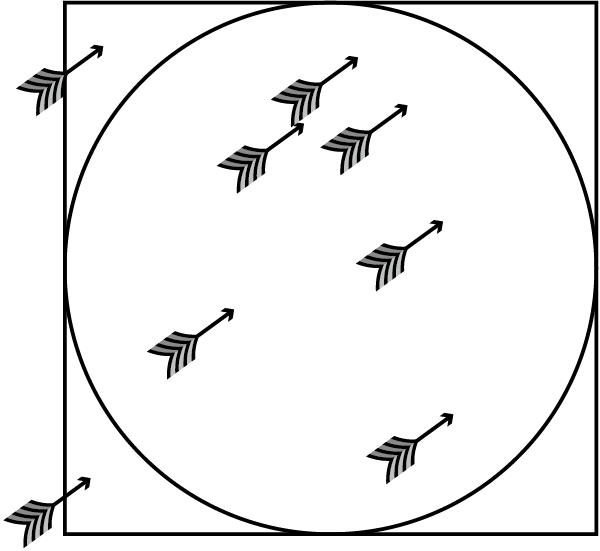
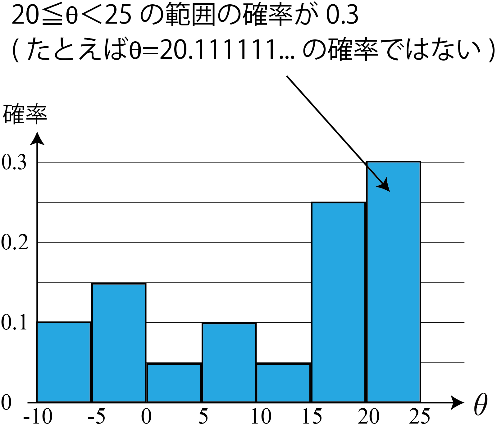
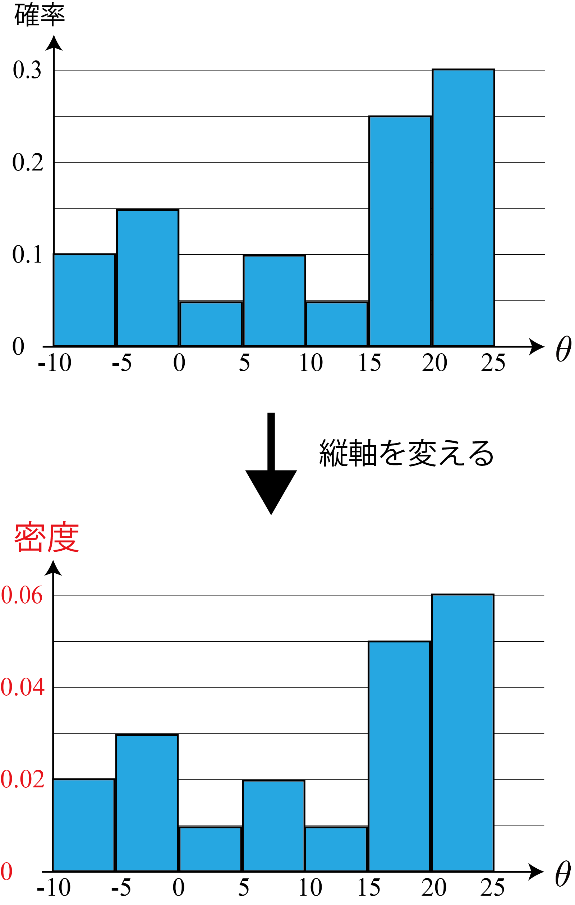
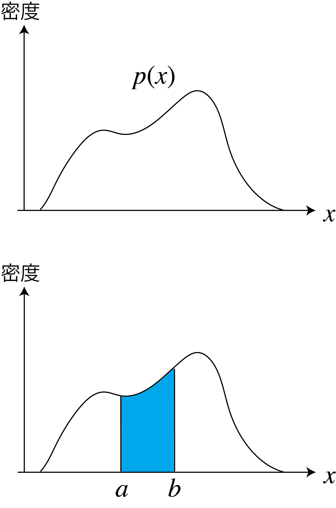

<!-- footer: 確率ロボティクス第4回（その1） -->

# 確率ロボティクス第4回: 連続値と多変量（その1）

千葉工業大学 上田 隆一

 

This work is licensed under a <a rel="license" href="http://creativecommons.org/licenses/by-sa/4.0/">Creative Commons Attribution-ShareAlike 4.0 International License</a>.

---

<!-- paginate: true -->

## 今回の内容

- 連続値に対する確率分布の定義方法
- 多変量の確率分布

教科書では数学的なあれこれがちょっとだけ書いてありますが、講義では実用面から考えましょう。

---

## ある実験

- ある位置から何度もロボットを4m前進させ、実際に到達した位置$(x,y)$と向き$\theta$の統計をとった
- 知りたいこと: ロボットの到達した座標$(x,y,\theta)$の分布は？
    - 右の図のような分布の図を描きたい
$\qquad\qquad\qquad\qquad$

---

### 困ること

- 困ること1: $x,y,\theta$が「連続的」
    - 統計をとっても点になるから前ページのようなグラフが描けない
- 困ること2: 確率変数$x,y,\theta$が3つもある
    - こういうことは前回もあったが、分布の形については扱っていない

どうしましょう？

---

## 連続的・多変量の確率変数の扱い

- ひとつずつ対処の方法を見ていきましょう
    - 離散値に近似して確率分布を求める方法
    - 空間を囲って確率を計算する方法
    - 密度・確率密度関数の導入

---

### 離散値への近似

- 実数を離散値に対応づけると点状のデータから確率分布が描ける
- 離散化や量子化などと呼ばれる
- 方法
    - 実数をどこかの桁で四捨五入
    - 実数を範囲ごとに区切る
- 例: 最初の例の$\theta$の値（単位はdegree）
    - -9.5, -9.5, -4.6, -4.0, -0.3, 4.1, 6.2, 9.0, 11.1, 18.2, 18.3, 19.3, 19.9, 19.9, 21.1, 21.8, 22.5, 23.9, 24.3, 24.7

---

### 離散値への近似（多次元の場合）

- 2次元の場合: 平面を区画化してデータの数を数えて分布に
    - 右図: 最初の例の$(x,y)$座標についてこの作業をしたもの
- より高い次元
    - 3次元空間、4次元空間・・・を同様に区画化
    - 4次元以上は想像しにくいので、リストや数式で考えたほうがいいかもしれない
        - 例: 4軸の区画の組み合わせ$(h,i,j,k)$に対し確率$P(h,i,j,k)$を計算するなど

---

### 離散値への近似（注意する点・問題点）

- データの数や利用用途に応じて適切な解像度が必要
    - 右図のように分布が元のデータやデータの性質を表さない恐れ
- 多次元になるほどデータが不足
    - 1次元で$1000$データが必要なら$n$次元だと$1000^n$必要
    - データが足りない場合、データの背景、原因を考えたほうがよりよい分布を作れるかもしれない

---

## 空間を囲って確率を計算する方法 （モンテカルロ法）

- あらかじめ離散化の方法を決めなくても、
データから確率は計算可能
    - 例（右図）
        - $\Pr\{ (x,y) \in A \} = 3/20$
        - $\Pr\{ (x,y) \in B \} = 6/20$
        - $\Pr\{ y > 3 \} = 17/20$
        - $\Pr\{ x > 3 \} = 1\qquad\qquad$ など
- 分布は作れないが、間接的に確率を計算可能
    - たとえばロボットが左にヨレやすいことを数値化できる

---

### モンテカルロ法

- 前ページの方法を使う計算方法
- 用途（けっこう重要）
    - 数値計算による積分（モンテカルロ積分）
    - 移動ロボットの自己位置推定
    （Monte Carlo localization [[Fox1999]](https://cdn.aaai.org/AAAI/1999/AAAI99-050.pdf)、[[Dellaert1999]](https://ieeexplore.ieee.org/document/772544)）
- 数値計算の例（右図）
    - 矢をランダム（一様分布）で板に刺す
    - 円周率$=4\cdot \frac{\Pr\{円の中に矢の刺さる確率\}}{\Pr\{正方形の中に矢の刺さる確率\}}$

---

### 囲う方法の問題点

- 問題: これもデータ数が不足する場合があり
    - $\Pr\{ (x,y) \in C \} = 0$となってしまうがおそらくそうではない
        - 単にデータの数が少ない
    - これも特に次元が大きい場合に問題となる
        - Monte Carlo localizationが、そのままだとドローンの自己位置推定に使いずらいなど

---

## 密度の導入

---

### 連続的な確率変数に対する「確率」

- 先述の2つの方法における確率: 区画や囲った範囲に与えられる
    - 区画中の1点（=本来の確率変数）に対する確率ではない
        - $\theta = 20.111...$などの「点」の確率はゼロ
- 点に対応する量、確率変数の範囲に対応する関数$f$みたいなものはないのか？
    - それがないと分布の定義が大変難しい

---

### 密度の導入

- こう考える: 確率を範囲の幅で割った値を確率変数に割り当て
- 例: $\theta = 20.111...$に対し、次の値を割り当て
    - 確率/区間の幅$=0.3/(25-20)=0.06$
- この値を密度と言う
    - 「確率**質量**関数」というように、確率分布を質量$1$の何かと考える
    $\rightarrow$質量を連続値で割ると「密度」

---

### 確率密度関数

- 連続的な確率変数$x$に密度が導入できたので、
右図上のような関数$p$が定義可能に
$\rightarrow$確率密度関数
- 確率密度関数の性質
    - 縦軸が密度=横軸を積分すると確率に
        - 右図下: $\Pr\{a\le x < b\} = \int_a^b p(x) \text{d}x$
- その他重要事項
    - $p$や$p$の形も「確率分布」と呼ばれる

---

### 多次元の確率密度関数

- 2次元の場合: 確率を「面積」で割ったものが密度
    - 2重積分で確率に
    - 右図: $\Pr\{x_1 \le x < x_2$ かつ $y_1 \le y < y_2 \} =$
    $\int_{y_1}^{y_2}\int_{x_1}^{x_2}p(x,y)\text{d}x\text{d}y$
- 3次元の場合: 確率を「体積」で割ったものが密度
    - 3重積分で確率に
- n次元の場合: n重積分で確率に
- ルベーグ積分での（的な）表記
    - $\Pr\{ \boldsymbol{x} \in D \} = \int_Dp(\boldsymbol{x})\text{d}\boldsymbol{x}$
        - $D$: 空間のある領域（右図の$D$: 2次元の例）

---

### 確率密度関数と周辺化

- （離散的な場合が足し算で消せるのと同じで）積分で変数を消せる
    - $p(x) = \int_{-\infty}^\infty p(x,y)\text{d}y$（右図下）
    - $p(y) = \int_{-\infty}^\infty p(x,y)\text{d}x$（右図右）
- 補足
    - そもそもこの図では最初の実験の$\theta$を省略しているので、もとから周辺化されている
        - $p(x, y) = \int_{-\pi}^\pi p(x,y,\theta)\text{d}\theta$

---

## まとめ

