<!-- footer: Probabilistic Robotics, Lesson 4 (Part 1) -->

# Probabilistic Robotics, Lecture 4: Continuous Values and Multivariate Probability Distributions (Part 1)

Ryuichi Ueda, Chiba Institute of Technology

 

This work is licensed under a <a rel="license" href="http://creativecommons.org/licenses/by-sa/4.0/">Creative Commons Attribution-ShareAlike 4.0 International License</a>.

---

<!-- paginate: true -->

## Contents

- How to define probability distributions for continuous values
- Multivariate probability distributions

The textbook covers a bit of mathematical detail. In this lecture, we'll focus on practical aspects.

---

## An experiment

- A robot was repeatedly driven 4 meters forward from a certain position, and statistics were taken of the actual position $(x,y)$ and orientation $\theta$.
- What we want to know: What is the distribution of the coordinates $(x,y,\theta)$ reached by the robot?
    - I want to plot a distribution like the one on the right.
$\qquad\qquad\qquad\qquad$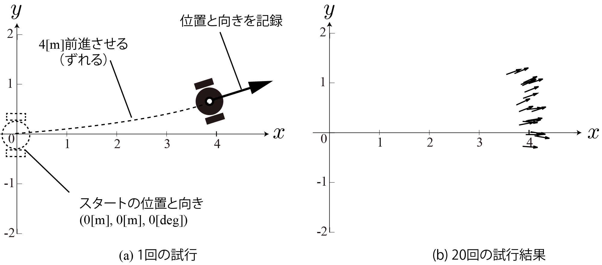

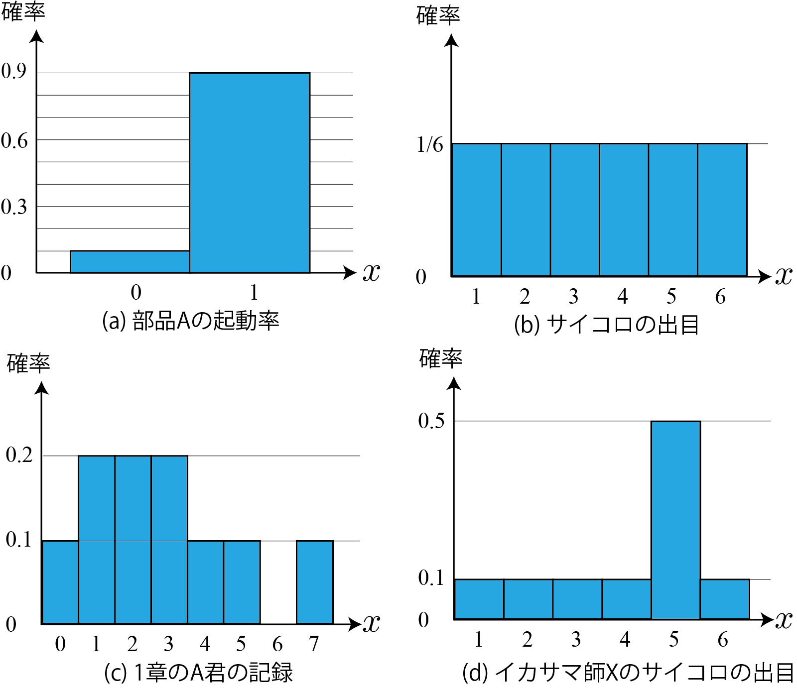

---

### Problems

- Problem 1: $x, y,$ and $\theta$ are "continuous."
    - Statistics are just points. I can't plot a graph like the one on the previous page.
- Problem 2: There are three random variables: $x, y,$ and $\theta$.
    - This issue was addressed last time, but the shape of the distribution wasn't discussed.

What should I do? 

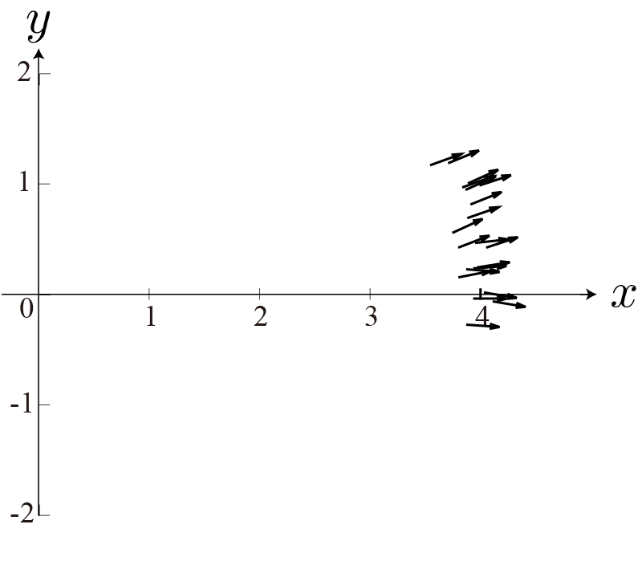

---

## Handling Continuous and Multivariate Random Variables

- Let's look at each approach one by one.
    - Approximating to discrete values to obtain probability distributions
    - Enclosing space to calculate probability
    - Introduction to density and probability density functions (pdf)

---

### Approximating to Discrete Values

- By mapping real numbers to discrete values, we can draw probability distributions from point-like data.
- This is also known as discretization or quantization.
- Method
    - Rounding real numbers to a digit
    - Dividing real numbers into ranges
- Example: The $\theta$ values ​​(units are degrees) in the first example
    - -9.5, -9.5, -4.6, -4.0, -0.3, 4.1, 6.2, 9.0, 11.1, 18.2, 18.3, 19.3, 19.9, 19.9, 21.1, 21.8, 22.5, 23.9, 24.3, 24.7

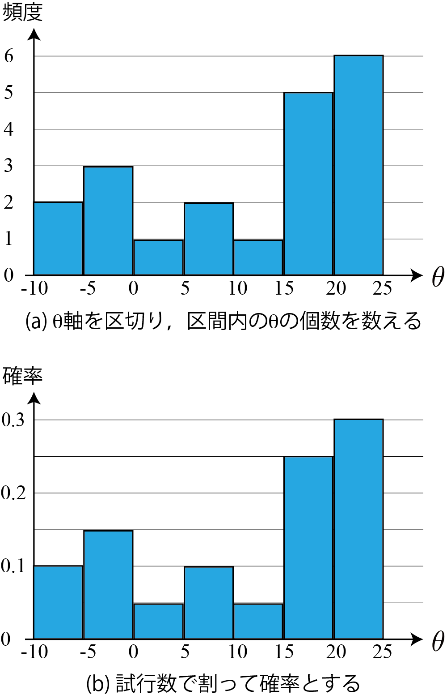

---

### Approximating to Discrete Values ​​(Multidimensional Case)

- 2-D Case: Partition the plane, count the number of data points, and create a distribution.
    - Right: This process is performed for the $(x,y)$ coordinates in the example.
- Higher Dimensions
    - Partition 3-D space, 4-D space, etc. in the same way.
    - Dimensions above 4 are difficult to imagine, so it may be better to think in terms of lists or formulas.
        - Example: Calculate the probability $P(h,i,j,k)$ for the combination of 4-axis partitions $(h,i,j,k)$.

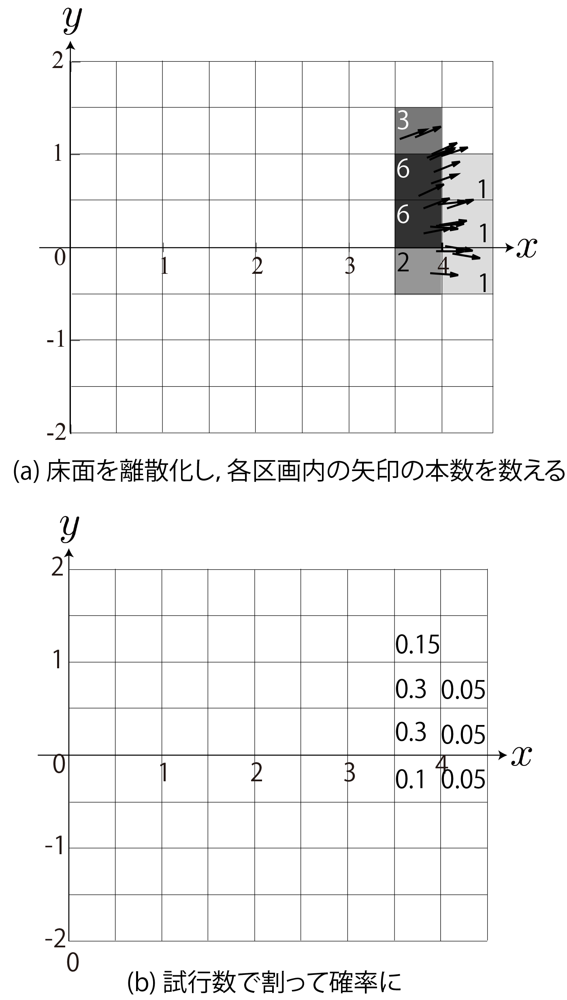

---

### Approximating to Discrete Values ​​(Points to Note and Issues)

- Appropriate resolution is required depending on the amount of data and the intended use.
- As shown in the right figure, the distribution may not represent the original data or its properties.
- The more dimensions there are, the less data there is.
- If $1000$ data points are needed in one dimension, $1000^n$ data points are needed in n dimensions.
- If there is insufficient data, considering the background and causes of the data may lead to a better distribution.

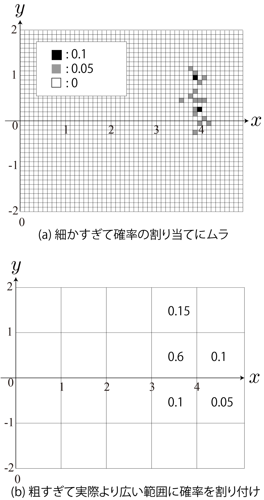

---

## How to Calculate Probability by Enclosing Space (Monte Carlo Method)

- Probability can be calculated from data without determining the discretization method in advance.
- Example (right figure)
- $\Pr\{ (x,y) \in A \} = 3/20$
- $\Pr\{ (x,y) \in B \} = 6/20$
- $\Pr\{ y > 3 \} = 17/20$
- $\Pr\{ x > 3 \} = 1\qquad\qquad$, etc.
- While it cannot create a distribution, it can indirectly calculate probability.
- For example, it can quantify a robot's tendency to veer left.

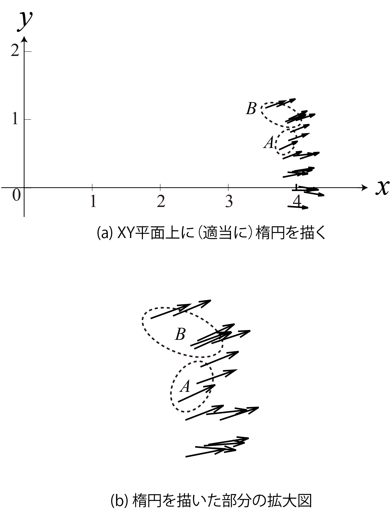

---

### Monte Carlo Method

- Calculation Method Using the Method on the Previous Page
- Applications (Quite Important)
- Numerical Integration (Monte Carlo Integration)
- Mobile Robot Localization

(Monte Carlo Localization) [[Fox1999]](https://cdn.aaai.org/AAAI/1999/AAAI99-050.pdf), [[Dellaert1999]](https://ieeexplore.ieee.org/document/772544))
- Numerical calculation example (right)
- Randomly (uniformly distributed) piercing a board with arrows
- Pi$=4\cdot \frac{\Pr\{Probability of an arrow landing in a circle\}}{\Pr\{Probability of an arrow landing in a square\}}$

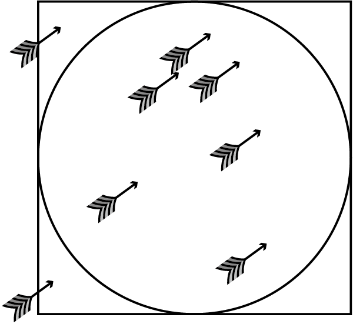

---

### Problems with the enclosure method

- Problem: This method may also result in insufficient data
- $\Pr\{ (x,y) \in C \} = 0$, but this is probably not the case
- There is simply insufficient data
- This is also problematic, especially when the dimensions are large.
- Monte Carlo localization, as is, is difficult to use for drone self-localization.

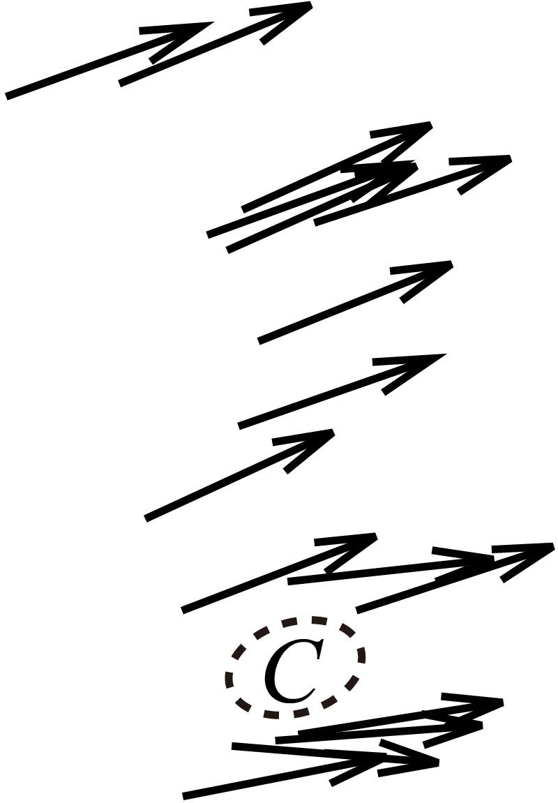

---

## Introducing Density

---

### "Probability" for Continuous Random Variables

- Probability in the two methods mentioned above: assigned to a plot or enclosed area.
- Not the probability for a single point within the plot (i.e., the actual random variable).
- The probability of a "point" such as $\theta = 20.111...$ is zero.
- Is there a quantity corresponding to a point, something like $f$, that corresponds to the range of a random variable?
- Without it, it would be very difficult to define a distribution.

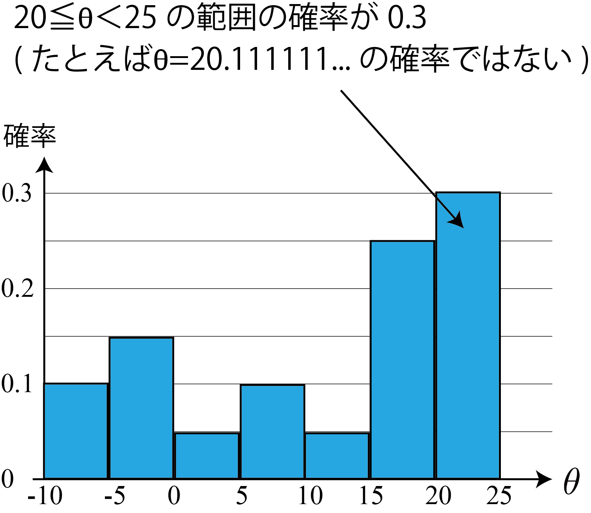

---

### Introducing density

- Think of it this way: Assign a value to a random variable by dividing the probability by the range width.
- Example: For $\theta = 20.111...$, assign the following value:
- Probability/range width$=0.3/(25-20)=0.06$
- This value is called density
- Think of a probability distribution as something with a mass of $1$, as in the "probability**mass**function."
$\rightarrow$ Dividing mass by a continuous value gives "density."

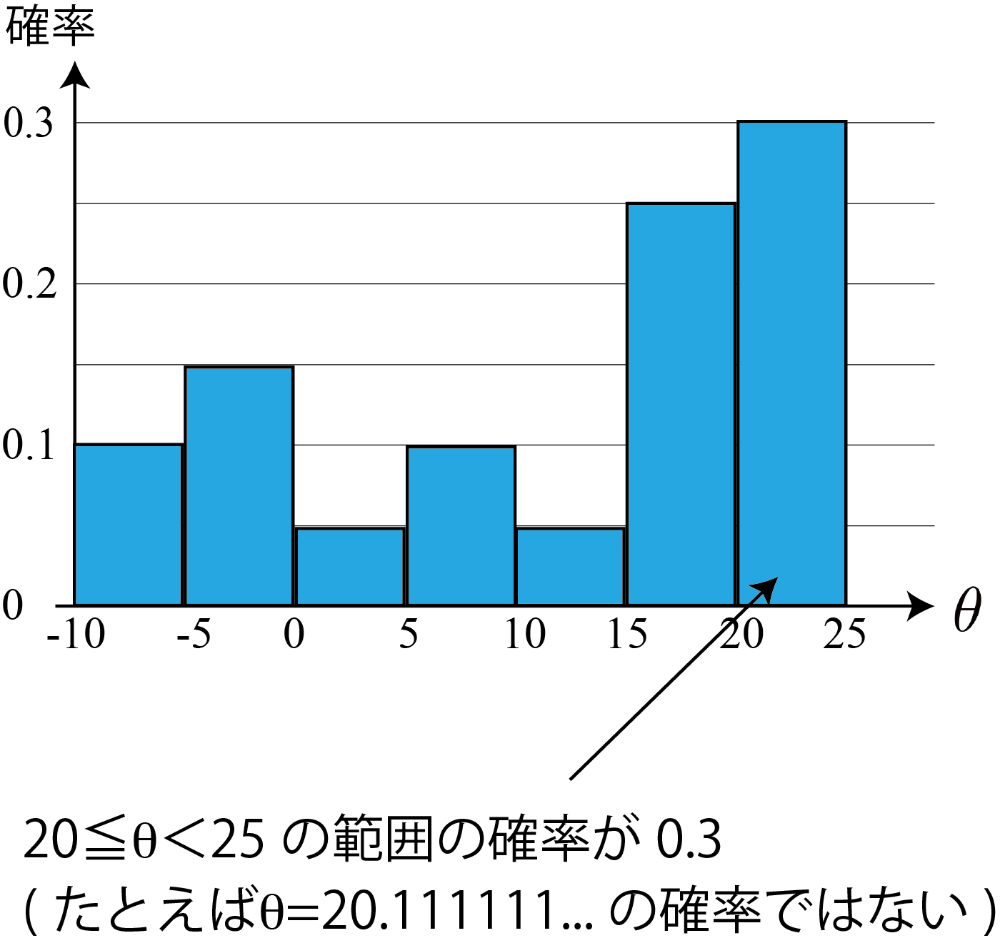

---

### Probability density function

- Now that we've introduced density to the continuous random variable $x$, we can define a function $p$ like the one shown in the top right figure.
$\rightarrow$Probability Density Function
- Properties of probability density functions
- The vertical axis is density = integrating the horizontal axis gives the probability.
- Bottom right figure: $\Pr\{a\le x < b\} = \int_a^b p(x) \text{d}x$
- Other important points
- The shapes of $p$ and $p$ are also called "probability distributions."

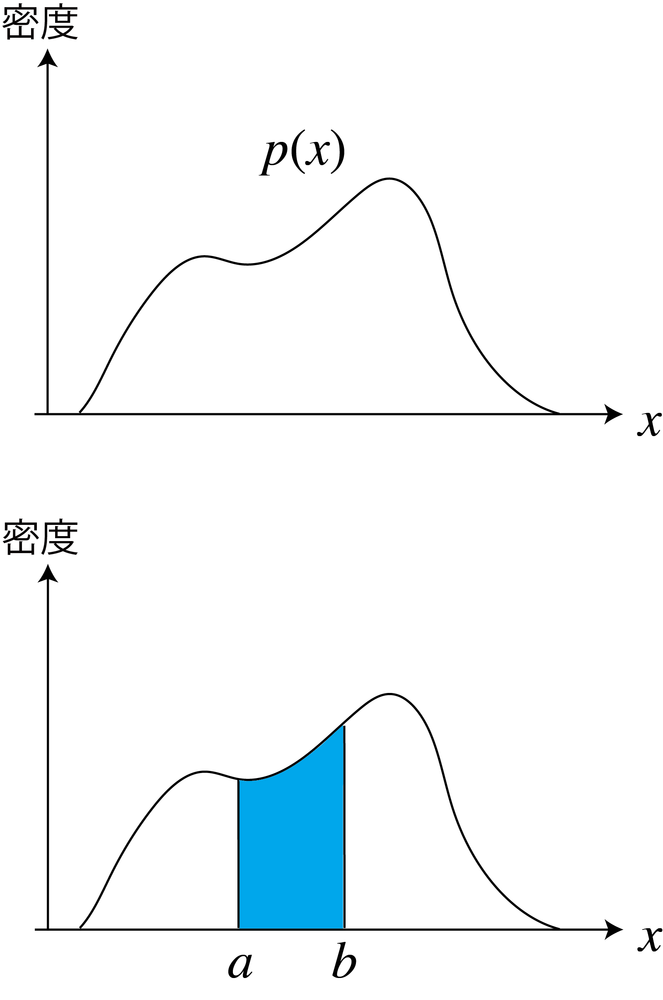

---

### Multidimensional probability density functions

- In the two-dimensional case: Probability divided by "area" gives the density.
- Probability is obtained by double integration.
- Right figure: $\Pr\{x_1 \le x < x_2$ and $y_1 \le y < y_2 \} =$
$\int_{y_1}^{y_2}\int_{x_1}^{x_2}p(x,y)\text{d}x\text{d}y$
- 3-dimensional case: Probability divided by "volume" is density
- Probability calculated using a triple integral
- n-dimensional case: Probability calculated using an n-fold integral
- Lebesgue integral (likely abbreviated)
- $\Pr\{ \boldsymbol{x} \in D \} = \int_Dp(\boldsymbol{x})\text{d}\boldsymbol{x}$
- $D$: A region of space ($D$ in the right figure: 2-dimensional example)

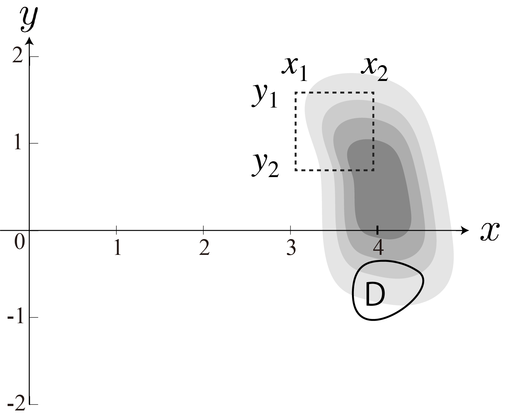

---

### Probability density function and marginalization

- Variables can be eliminated by integration (just as they can be eliminated by addition in the discrete case).
- $p(x) = \int_{-\infty}^\infty p(x,y)\text{d}y$ (bottom right figure)
- $p(y) = \int_{-\infty}^\infty p(x,y)\text{d}x$ (right right figure)
- Additional information
- Since this figure omits the $\theta$ from the first experiment, it is already marginalized.
- $p(x, y) = \int_{-\pi}^\pi p(x,y,\theta)\text{d}\theta$

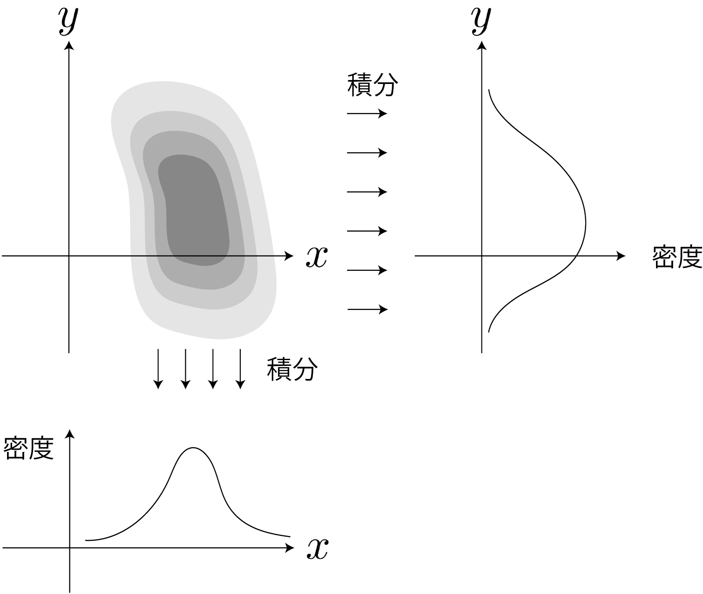

---

## Summary so far

- We have dealt with continuous and multidimensional random variables.
- Data are taken at points in space.
- Various approximation methods for creating probability distributions from data
- Introduction of density
- Definition for continuous, multidimensional random variables (vectors)
- Consider the probability density function $p$
- Integration leads to probability
- What to consider next
- Up until now, we've been doing the drastic thing of creating distributions from data
- Especially with multidimensional variables, there's not enough data
