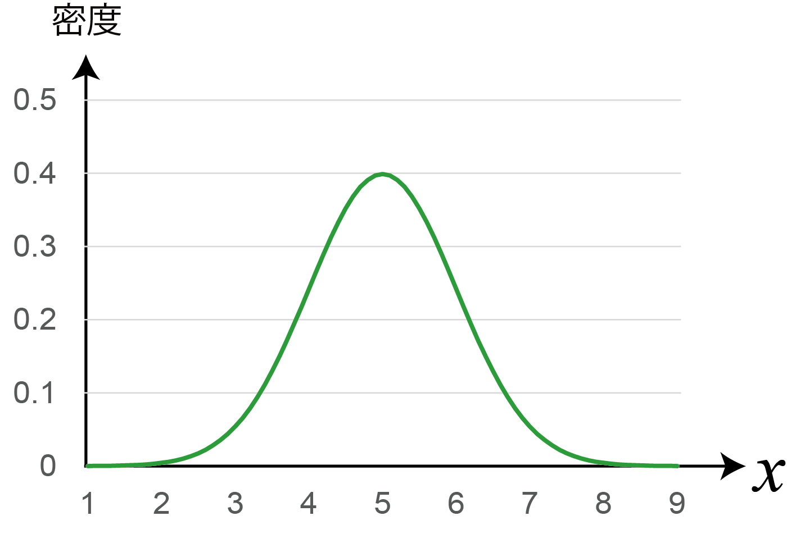
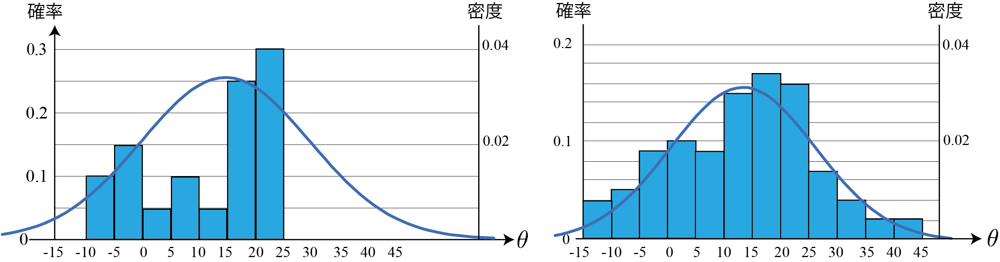
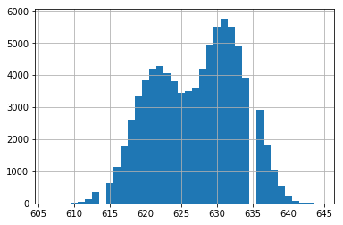
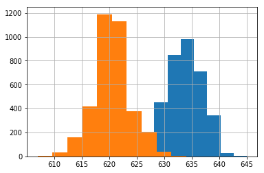

<!-- footer: 確率ロボティクス第4回（その2） -->

# 確率ロボティクス第4回: 連続値と多変量（その2）

千葉工業大学 上田 隆一

 

This work is licensed under a <a rel="license" href="http://creativecommons.org/licenses/by-sa/4.0/">Creative Commons Attribution-ShareAlike 4.0 International License</a>.

---

<!-- paginate: true -->

## 今回の内容

- ガウス分布
- 多変量ガウス分布

--- 

## ガウス分布

--- 

### 前半のおさらい

- 連続的な変数に対して確率密度関数を導入
    - 確率変数が離散でも連続でも分布が表現可能に
- 次に考えること: 分布が数式で表せないか？
    - 右図のように取得したデータだけで分布を作るのは無理がある
    - 考え方
        - データがなにかの法則にしたがって発生する
        - その法則は数式で表せるかもしれない
        $\rightarrow$実際に典型的な数式が存在

--- 

### ガウス分布（正規分布）の導入

- 式: $p(x) = \dfrac{1}{\sqrt{2\pi \sigma^2 }} \exp\left\{ -\dfrac{(x-\mu)^2}{2\sigma^2} \right\}$
    - $\mu$: 平均値
    - $\sigma^2$: 分散
        - 右図の例: $(\mu, \sigma^2) = (5, 1)$
- 典型的な数式のなかで最も代表的なもの
    - $x$がこまかくばらつく原因が多い場合にこういう形に（中心極限定理）

センサ値や前半にやったロボットの移動距離、向きの誤差は、大きなばらつきの原因がないとガウス分布に従う

--- 

### なんで典型的で代表的になるか？

- 測距センサを例にしましょう
    - 多種多様なばらつき要因: 気温、湿度、振動、外光、回路の電気的な揺らぎ・・・
    - 誤差要因別の誤差$\varepsilon_{1:n}$を考える
        - 原因が違うので互いに独立と仮定
- 誤差のない計測値$x^*$を仮定すると
    - $x = x^* + \sum_{i=1}^n \varepsilon_{i}$
- $\varepsilon_{1:n}$の各値がすべて正になったり、すべて負になったりする確率は低い
$\rightarrow \sum_{i=1}^n \varepsilon_{i}$の値は$0$に近いほど高頻度
    - $x$の分布は$x^*$を中心に釣り鐘型の分布に

--- 

### データへの当てはめの例

- ロボットの移動の例の$\theta$に対して（単位はdeg）
    - 左図: 20回の試行にガウス分布を当てはめ
        - $(\mu, \sigma^2) = (11.8, 12.0)$
    - 右図: さらに試行して100回にして当てはめ
        - $(\mu, \sigma^2) = (13.2, 12.8)$

いろいろ考察してみましょう（次ページに例）

--- 

### データへの当てはめの例（考察）

- 20回くらいの試行では分布の形は分からない
    - 100回と比べると形がかなり異なる
- 当てはめたガウス分布は20回でも100回でも大きな違いはない
    - 20回試行でも平均値と分散はおおかた収束（この場合は）
- これ以上試行を重ねていくとガウス分布になる？
    - もしかしたら大きな誤差要因がそうさせないかもしれない
        - 2つ以上のガウス分布の重ね合わせになる

--- 

### ガウス分布の重ね合わせになる例

- 詳解確率ロボティクスの、あるセンサ値の分布の例（左図）
    - 日中と日没後でセンサ値の平均値が変わる
    - 他の誤差要因による誤差を圧倒して分布が分離
- 右図
    - オレンジの分布: 昼の14時台の分布を抜き出したもの
    - 青の分布: 朝の6時台の分布を抜き出したもの

--- 

### ガウス分布の表記

- $\mathcal{N}(\mu, \sigma^2)$と表記
    - 例: $x \sim \mathcal{N}(\mu, \sigma^2)$: $x$がガウス分布$\mathcal{N}(\mu, \sigma^2)$に従う
- 変数を明示して$\mathcal{N}(x | \mu, \sigma^2)$と表記することも

--- 

### ガウス分布の性質1

- 問題: それぞれ異なるガウス分布に従う変数$x_1, x_2$の和の分布は？
    - つまり次のとき、$x_3 = x_1 + x_2$の分布$p(x_3)$は？
        - $x_1 \sim \mathcal{N}(\mu_1, \sigma^2_1)$
        - $x_2 \sim \mathcal{N}(\mu_2, \sigma^2_2)$
- 答え:
    * $x_3 \sim \mathcal{N}(\mu_1 + \mu_2, \sigma^2_1 + \sigma^2_2)$
        - 再びガウス分布に$\rightarrow$再生性と言われる性質
        - しかも平均値、分散の単純な足し算に

元気な人は証明してみましょう（次ページから証明）

--- 

### ガウス分布の性質1（証明）

- まず分布$p(x_3)$を$x_1, x_2, \mu_1, \mu_2, \sigma^2_1, \sigma^2_2$で表す
    - $p(x_3) = \int_{-\infty}^\infty p(x_3, x_1)\text{d}x_1$
    $= \int_{-\infty}^\infty p(x_3 | x_1)p(x_1)\text{d}x_1$
    $= \int_{-\infty}^\infty p(x_3 | x_1)\mathcal{N}(x_1| \mu_1, \sigma^2)\text{d}x_1$
    $= \int_{-\infty}^\infty \mathcal{N}(x_3|x_1 + \mu_2, \sigma^2_2)\mathcal{N}(x_1| \mu_1, \sigma^2_1)\text{d}x_1$
    - 最後の変形: $x_1$が固定値の$x_3$の分布: $x_2$の分布を$x_1$だけずらしたもの

--- 

### ガウス分布の性質1（証明続き）

	
- $p(x_3) = \int_{-\infty}^\infty \dfrac{1}{\sqrt{2\pi \sigma^2_2}}\exp\left\{ -\dfrac{\{x_3 - (\mu_2 + x_1)\}^2}{2\sigma^2_2}\right\}$
$\cdot \dfrac{1}{\sqrt{2\pi \sigma^2_1}}\exp\left\{ -\dfrac{(x_1 - \mu_1)^2}{2\sigma^2_1}\right\} \text{d}x_1$
$= \dfrac{1}{2\pi \sigma_1\sigma_2} \int_{-\infty}^\infty \exp\left\{ -\dfrac{\{x_3 - (\mu_2 + x_1)\}^2}{2\sigma^2_2} -\dfrac{(x_1 - \mu_1)^2}{2\sigma^2_1}\right\} \text{d}x_1$
    - 解き方: 積分を次のように分解
        - 積分内に$x_1$のガウス分布を残す（積分で$1$になる）
        - 積分の外に$x_3$の分布を出す（ガウス分布決め撃ちで）
        - 次のスライドに結果だけ示します（計算は教科書で）

--- 

### ガウス分布の性質1（証明続き）

- $p(x_3) = 
\dfrac{1}{2\pi \sigma_1\sigma_2}
	 \exp\left\{\dfrac{(x_3-\mu')^2 }{-2\sigma'^2 } \right\} 
	\int_{-\infty}^\infty \exp\left\{\dfrac{-\sigma'^{2}}{2\sigma_1^2\sigma_2^2} \left[ x_1 - h(x_3)  \right]^2 \right\}
	 \text{d}x_1$
	- ここで
	    - $\sigma_1^2 + \sigma_2^2 = \sigma'^{2}$
	    - $\mu_2 + \mu_1 = \mu'$
	    - $h(x_3) = \{ \sigma_1^2 (x_3 - \mu_2) + \sigma_2^2\mu_1 \}/\sigma'^2$
- $p(x_3) =
	 \mathcal{N}(x_3 | \mu', \sigma'^2)
	\int_{-\infty}^\infty 
	\mathcal{N}\left[x_1 \Big| h(x_3), \dfrac{\sigma_1^2\sigma_2^2}{\sigma'^{2}} \right]
	\text{d}x_1$
$= \mathcal{N}(x_3 | \mu', \sigma'^2)= \mathcal{N}(x_3 | \mu_1 + \mu_2, \sigma_1^2 + \sigma_2^2)$
