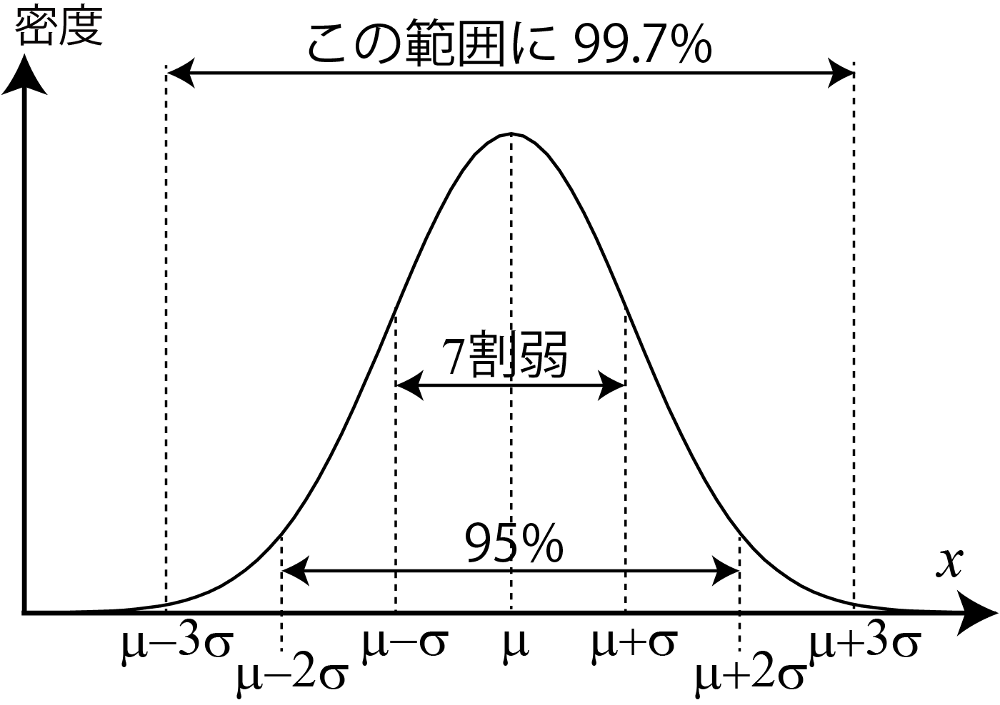
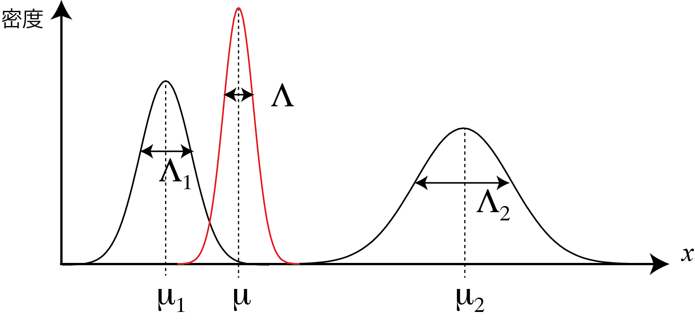

<!-- footer: 確率ロボティクス第4回（その2） -->

# 確率ロボティクス第4回: 連続値と多変量（その2）

千葉工業大学 上田 隆一

<br />

<p style="font-size:50%">
This work is licensed under a <a rel="license" href="http://creativecommons.org/licenses/by-sa/4.0/">Creative Commons Attribution-ShareAlike 4.0 International License</a>.
<a rel="license" href="http://creativecommons.org/licenses/by-sa/4.0/">
</a>
</p>

---

<!-- paginate: true -->

## 今回の内容

- ガウス分布
- 多変量ガウス分布

--- 

## ガウス分布

--- 

### 前半のおさらい

- 連続的な変数に対して確率密度関数を導入
    - 確率変数が離散でも連続でも分布が表現可能に
- 次に考えること: 分布が数式で表せないか？
    - 右図のように取得したデータだけで分布を作るのは無理がある
    - 考え方
        - データがなにかの法則にしたがって発生する
        - その法則は数式で表せるかもしれない
        $\rightarrow$<span style="color:red">実際に典型的な数式が存在</span>


--- 

### ガウス分布（正規分布）の導入

- 式: $p(x) = \dfrac{1}{\sqrt{2\pi \sigma^2 }} \exp\left\{ -\dfrac{(x-\mu)^2}{2\sigma^2} \right\}$
    - $\mu$: 平均値
    - $\sigma^2$: 分散
        - 右図の例: $(\mu, \sigma^2) = (5, 1)$
- 典型的な数式のなかで最も代表的なもの
    - $x$がこまかくばらつく原因が多い場合にこういう形に（<span style="color:red">中心極限定理</span>）

センサ値や前半にやったロボットの移動距離、向きの誤差は、大きなばらつきの原因がないとガウス分布に従う


--- 

### なんで典型的で代表的になるか？

- 測距センサを例にしましょう
    - 多種多様なばらつき要因: 気温、湿度、振動、外光、回路の電気的な揺らぎ・・・
    - 誤差要因別の誤差$\varepsilon_{1:n}$を考える
        - 原因が違うので互いに独立と仮定
- 誤差のない計測値$x^*$を仮定すると
    - $x = x^* + \sum_{i=1}^n \varepsilon_{i}$
- $\varepsilon_{1:n}$の各値がすべて正になったり、すべて負になったりする確率は低い
<span style="color:red">$\rightarrow \sum_{i=1}^n \varepsilon_{i}$の値は$0$に近いほど高頻度</span>
    - $x$の分布は$x^*$を中心に釣り鐘型の分布に


--- 

### データへの当てはめの例

- ロボットの移動の例の$\theta$に対して（単位はdeg）
    - 左図: 20回の試行にガウス分布を当てはめ
        - $(\mu, \sigma^2) = (11.8, 12.0)$
    - 右図: さらに試行して100回にして当てはめ
        - $(\mu, \sigma^2) = (13.2, 12.8)$


いろいろ考察してみましょう（次ページに例）


--- 

### データへの当てはめの例（考察）

- 20回くらいの試行では分布の形は分からない
    - 100回と比べると形がかなり異なる
- 当てはめたガウス分布は20回でも100回でも大きな違いはない
    - 20回試行でも平均値と分散はおおかた収束（この場合は）
- これ以上試行を重ねていくとガウス分布になる？
    - もしかしたら大きな誤差要因がそうさせないかもしれない
        - 2つ以上のガウス分布の重ね合わせになる


--- 

### ガウス分布の重ね合わせになる例

- 詳解確率ロボティクスの、あるセンサ値の分布の例（左図）
    - 日中と日没後でセンサ値の平均値が変わる
    - 他の誤差要因による誤差を圧倒して分布が分離
- 右図
    - オレンジの分布: 昼の14時台の分布を抜き出したもの
    - 青の分布: 朝の6時台の分布を抜き出したもの


--- 

### ガウス分布の表記

- $\mathcal{N}(\mu, \sigma^2)$と表記
    - 例: $x \sim \mathcal{N}(\mu, \sigma^2)$: $x$がガウス分布$\mathcal{N}(\mu, \sigma^2)$に従う
- 変数を明示して$\mathcal{N}(x | \mu, \sigma^2)$と表記することも

--- 

### ガウス分布の性質1

- 問題: それぞれ異なるガウス分布に従う変数$x_1, x_2$の和の分布は？
    - つまり次のとき、$x_3 = x_1 + x_2$の分布$p(x_3)$は？
        - $x_1 \sim \mathcal{N}(\mu_1, \sigma^2_1)$
        - $x_2 \sim \mathcal{N}(\mu_2, \sigma^2_2)$
- 答え:
    * $x_3 \sim \mathcal{N}(\mu_1 + \mu_2, \sigma^2_1 + \sigma^2_2)$
        - 再びガウス分布に$\rightarrow$<span style="color:red">再生性</span>と言われる性質
        - しかも平均値、分散の単純な足し算に

元気な人は証明してみましょう（次ページから証明）

--- 

### ガウス分布の性質1（証明）

- まず分布$p(x_3)$を$x_1, x_2, \mu_1, \mu_2, \sigma^2_1, \sigma^2_2$で表す
    - $p(x_3) = \int_{-\infty}^\infty p(x_3, x_1)\text{d}x_1$
    $= \int_{-\infty}^\infty p(x_3 | x_1)p(x_1)\text{d}x_1$
    $= \int_{-\infty}^\infty p(x_3 | x_1)\mathcal{N}(x_1| \mu_1, \sigma^2)\text{d}x_1$
    $= \int_{-\infty}^\infty \mathcal{N}(x_3|x_1 + \mu_2, \sigma^2_2)\mathcal{N}(x_1| \mu_1, \sigma^2_1)\text{d}x_1$
    - 最後の変形: $x_1$が固定値の$x_3$の分布: $x_2$の分布を$x_1$だけずらしたもの

--- 

### ガウス分布の性質1（証明続き）

	
- $p(x_3) = \int_{-\infty}^\infty \dfrac{1}{\sqrt{2\pi \sigma^2_2}}\exp\left\{ -\dfrac{\{x_3 - (\mu_2 + x_1)\}^2}{2\sigma^2_2}\right\}$
$\cdot \dfrac{1}{\sqrt{2\pi \sigma^2_1}}\exp\left\{ -\dfrac{(x_1 - \mu_1)^2}{2\sigma^2_1}\right\} \text{d}x_1$
$= \dfrac{1}{2\pi \sigma_1\sigma_2} \int_{-\infty}^\infty \exp\left\{ -\dfrac{\{x_3 - (\mu_2 + x_1)\}^2}{2\sigma^2_2} -\dfrac{(x_1 - \mu_1)^2}{2\sigma^2_1}\right\} \text{d}x_1$
    - 解き方: 積分を次のように分解
        - 積分内に$x_1$のガウス分布を残す（<span style="color:red">積分で$1$になる</span>）
        - 積分の外に$x_3$の分布を出す（ガウス分布決め撃ちで）
        - 次のスライドに結果だけ示します（計算は教科書で）

--- 

### ガウス分布の性質1（証明続き）

- $p(x_3) = 
\dfrac{1}{2\pi \sigma_1\sigma_2}
	 \exp\left\{\dfrac{(x_3-\mu')^2 }{-2\sigma'^2 } \right\} 
	\int_{-\infty}^\infty \exp\left\{\dfrac{-\sigma'^{2}}{2\sigma_1^2\sigma_2^2} \left[ x_1 - h(x_3)  \right]^2 \right\}
	 \text{d}x_1$
	- ここで
	    - $\sigma_1^2 + \sigma_2^2 = \sigma'^{2}$
	    - $\mu_2 + \mu_1 = \mu'$
	    - $h(x_3) = \{ \sigma_1^2 (x_3 - \mu_2) + \sigma_2^2\mu_1 \}/\sigma'^2$
- $p(x_3) =
	 \mathcal{N}(x_3 | \mu', \sigma'^2)
	\int_{-\infty}^\infty 
	\mathcal{N}\left[x_1 \Big| h(x_3), \dfrac{\sigma_1^2\sigma_2^2}{\sigma'^{2}} \right]
	\text{d}x_1$
$= \mathcal{N}(x_3 | \mu', \sigma'^2)= \mathcal{N}(x_3 | \mu_1 + \mu_2, \sigma_1^2 + \sigma_2^2)$

--- 

### ガウス分布の性質2

- 問題: $x$がガウス分布にしたがうとき、$y=ax+b$はどんな分布にしたがうか？
    - $x \sim \mathcal{N}(\mu,\sigma^2)$
    - $y \sim p \ \leftarrow$どうなる？
- 答え: 
    * $y \sim \mathcal{N} [ a \mu + b, (a\sigma)^2 ]$

--- 

### ガウス分布の性質2（証明）

- $y < y'$となる確率を考える
    - $\Pr \{ y \le y' \} = \Pr \{ x  \le (y' -b)/a \}$
	$\int_{-\infty}^{y'} p(y) \text{d}y = \int_{-\infty}^{(y' -b)/a} \dfrac{1}{\sqrt{2\pi \sigma^2}}\exp \left\{ -\dfrac{(x - \mu)^2}{2\sigma^2} \right\}\text{d}x$
- $y = ax + b$から$\text{d}x = a^{-1}\text{d}y$を右辺に代入
	- $\Pr \{ y \le y' \} = \Pr \{ x  \le (y' -b)/a \}$
	$\int_{-\infty}^{y'} p(y) \text{d}y = \int_{-\infty}^{y'} \dfrac{1}{\sqrt{2\pi \sigma^2}}\exp \left\{ -\dfrac{\{(y - b)/a - \mu\}^2}{2\sigma^2} \right\} \left( \dfrac{1}{a} \text{d}y \right)$
	$= \int_{-\infty}^{y'} \dfrac{1}{\sqrt{2\pi (a\sigma)^2}}\exp \left\{ -\dfrac{(y - b - a\mu)^2}{2(a\sigma)^2} \right\} \text{d}y$
	$= \int_{-\infty}^{y'} \mathcal{N}\big[ y | a\mu + b, (a\sigma)^2\big] \text{d}y$
        - 両辺の積分のなかから$p(y) = \mathcal{N}\big[ y | a\mu + b, (a\sigma)^2\big]$


--- 

### 正規化定数の導入

- 分布の形と関係ない係数を$\eta$で表現
    - 例: ガウス分布の形を決めているのは指数部
    （$\exp$の中）$\rightarrow$外を$\eta$で略記することがある
        - $\mathcal{N}(x| \mu, \sigma^2) = \dfrac{1}{\sqrt{2\pi \sigma^2 }} \exp\left\{ -\dfrac{(x-\mu)^2}{2\sigma^2} \right\}$
$= \eta \exp\left\{ -\dfrac{(x-\mu)^2}{2\sigma^2} \right\}$
    - $\eta$は<span style="color:red">正規化定数</span>と呼ばれる
- 正規化定数の使われ方
    - 当該部分の詳細に興味がないときに使用
    - 式変形の途中で異なる値になっても$\eta$で済まさせることがあるので注意


--- 

### マハラノビス距離

- 標準偏差で正規化した距離
    - $d(x) = | x -\mu |/\sigma$
    - 値$x$が標準偏差何個分、平均値から離れているかを表す
- ガウス分布の指数部の値はマハラノビス距離で決まる
    - $\mathcal{N}(x| \mu, \sigma^2) = \eta \exp\left\{ -\dfrac{(x-\mu)^2}{2\sigma^2} \right\} = \eta \exp\left\{ -\dfrac{1}{2}d(x)^2 \right\}$

--- 

### $n$シグマ範囲

- マハラノビス距離$n$以内の範囲に、データがどれだけ含まれるかを表したもの
（暗記しておくと便利）
- ガウス分布の場合、次が成り立つ
    - $d(x) \le 1$: 7割弱のデータが収まる
    - $d(x) \le 2$: 9割5分のデータが収まる
    - $d(x) \le 3$: 1000のうち3つのデータが外れる
- ついでに
    - 学力偏差値: $10 d'(x) + 50$
        - $d'(x) = ( x -\mu )/\sigma$



---

### ガウス分布の積

- 同じ変数$x$に関するふたつのガウス分布$\mathcal{N}(x|\mu_1, \sigma_1^2)$、$\mathcal{N}(x|\mu_2, \sigma_2^2)$の積を考えてみましょう
    - （深く考えていませんがおそらく）2人の人が別の情報から$x$を推定したので情報を統合したいという状況
    - 下準備で次のようにガウス分布を変形しておく
        - $\mathcal{N}(x|\mu, \sigma^2) = \eta \exp\left\{ -\dfrac{1}{2\sigma^2}x^2 + \dfrac{\mu}{\sigma^2} x -\dfrac{1}{2\sigma^2}\mu^2 \right\}$
        $= \eta \exp\left\{ -\dfrac{1}{2\sigma^2}x^2 + \dfrac{\mu}{\sigma^2} x \right\}$
- <span style="color:red">精度</span>（分散の逆数）を導入
    - $\mathcal{N}(x|\mu, \sigma^2) = \eta \exp\left\{ -\dfrac{1}{2}\Lambda x^2 + \mu\Lambda x \right\}$

<center>計算は次ページ</center>

---

### ガウス分布の積（計算）

- $\mathcal{N}(x | \mu_1, \sigma_1^2)\mathcal{N}(x | \mu_2, \sigma_2^2)$
$=\eta \exp\left\{ 
-\dfrac{1}{2}\Lambda_1 x^2 + \mu_1 \Lambda_1 x 
-\dfrac{1}{2}\Lambda_2 x^2 + \mu_2 \Lambda_2 x 
\right\}$
$=\eta \exp\left\{ 
-\dfrac{1}{2}(\Lambda_1 + \Lambda_2) x^2 + (\mu_1 \Lambda_1  + \mu_2 \Lambda_2) x \right\}$
- $\mathcal{N}(x|\mu, \sigma^2) = \eta \exp\left\{ -\dfrac{1}{2}\Lambda x^2 + \mu\Lambda x \right\}$と形を比較
    - $\Lambda = \Lambda_1 + \Lambda_2$
    - $\mu =(\mu_1 \Lambda_1  + \mu_2 \Lambda_2)/\Lambda = \dfrac{\mu_1 \Lambda_1  + \mu_2 \Lambda_2}{\Lambda_1 + \Lambda_2}$
        と考えると同じ形に
        - ただし上の式は積分して$1$にならないので正規化が必要

---

### ガウス分布の積（まとめ）

- ガウス分布同士の積は正規化するとガウス分布に
    - このときできるガウス分布の平均値と精度は
        - $\mu = \dfrac{\Lambda_1}{\Lambda_1 + \Lambda_2}\mu_1 + \dfrac{\Lambda_2}{\Lambda_1 + \Lambda_2}\mu_2$
            - <span style="color:red">両分布の平均値の重みつき平均。精度の良い方に寄る</span>
        - $\Lambda = \Lambda_1 + \Lambda_2$
            - <span style="color:red">精度の単純な和。必ず増加</span>
$\qquad$

---

### ガウス分布のまとめ

- 変数に様々な種類の雑音$\rightarrow$ガウス分布に
    - 普遍的
- 再生性
    - 計算が指数部の計算だけで済む場合が多い$\rightarrow$プログラムの際に便利
- 分散、精度の性質
    - 変数の和の分布の場合: 分散の単純和
    - 分布の積の場合: 精度の単純和

---

## 多変量ガウス分布

- ガウス分布に従う変数$x_{1:n}$をまとめて1つの多次元のガウス分布で表せる
- 式をまず見せます
	- $\mathcal{N}(\boldsymbol{x} | \boldsymbol{\mu}, \Sigma) = \dfrac{1}{\sqrt{(2\pi)^n |\Sigma|}}
	\exp\left\{-\dfrac{1}{2}(\boldsymbol{x} - \boldsymbol{\mu})^\top \Sigma^{-1} (\boldsymbol{x} - \boldsymbol{\mu}) \right\}$
        - ここで
	$\boldsymbol{x} = \begin{pmatrix}
		x_1 \\ x_2 \\ \vdots \\ x_n
		\end{pmatrix}, \ 
	\boldsymbol{\mu} = \begin{pmatrix}
		\mu_1 \\ \mu_2 \\ \vdots \\ \mu_n
		\end{pmatrix}, \ 
	\Sigma = \begin{pmatrix}
		\sigma^2_1 & \sigma_{12} & \dots & \sigma_{1n} \\
		\sigma_{12} & \sigma^2_2 & \dots & \sigma_{2n}  \\
		\vdots & \vdots & \ddots & \vdots \\
		\sigma_{1n} & \sigma_{2n} & \dots & \sigma^2_n  \\
	\end{pmatrix}$


---

### 分散共分散行列

- 前ページの$\Sigma$: 各変数の分散と共分散を組み合わせた行列
    - $\Sigma = \begin{pmatrix}
		\sigma^2_1 & \sigma_{12} & \dots & \sigma_{1n} \\
		\sigma_{12} & \sigma^2_2 & \dots & \sigma_{2n}  \\
		\vdots & \vdots & \ddots & \vdots \\
		\sigma_{1n} & \sigma_{2n} & \dots & \sigma^2_n  \\
	\end{pmatrix}$
         - $\sigma_{ij} = \big\langle (x_i - \mu_i )(x_j-\mu_j) \big\rangle_{\mathcal{N}(\boldsymbol{x} | \boldsymbol{\mu}, \Sigma)}$
- 普通に話す時は「共分散行列」でよい

---

### 例: 移動ロボットの実験

- 実験で得られたデータのうち、$x$と$y$について多変量ガウス分布（2次元ガウス分布）に当てはめてみましょう
- [20試行分のデータ](./misc/xy_data.txt)
    - 1列目: $x$[m]、2列目: $y$[m]
- 計算すべきパラメータ
    - $x, y$それぞれの平均値と分散
    - $x$と$y$の共分散
        - <span style="color:red">データからの共分散の計算方法</span>: $s_{ab} = \dfrac{1}{N-1}\sum_{i=1}^n (a_i - \bar{a})(b_i - \bar{b})$
	        - $N$個のデータのペア$(a,b)_{1:N}$に対して


---

### 計算結果

- `datamash`を使った例
```bash
### 平均値 ###
$ cat xy_data.txt | tr ' ' \\t | datamash mean 1 mean 2
3.8822	0.51035
### 分散 ###
$ cat xy_data.txt | tr ' ' \\t | datamash svar 1 svar 2
0.016455957894737	0.19727097631579
### 共分散 ###
$ cat xy_data.txt |tr ' ' \\t | datamash scov 1:2
-0.029138231578947
```
- これらの値からガウス分布の式を書きましょう

---

### 答え

- $\mathcal{N}(\boldsymbol{x} | \boldsymbol{\mu}, \Sigma) = \dfrac{1}{\sqrt{(2\pi)^n |\Sigma|}}
\exp\left\{-\dfrac{1}{2}(\boldsymbol{x} - \boldsymbol{\mu})^\top \Sigma^{-1} (\boldsymbol{x} - \boldsymbol{\mu}) \right\}$
    - $\Sigma 
	= \begin{pmatrix} 
		0.016 & -0.029 \\
		-0.029 & 0.197 \\
	\end{pmatrix},
	\boldsymbol{\mu} 
	= \begin{pmatrix}
		3.88 \\
		0.51 
	\end{pmatrix}$


---

### 2変量ガウス分布

- ガウス分布にしたがう2つの変数$x_1$と$x_2$の分布を1つの式にまとめるとこうなる
	- $\mathcal{N}(\boldsymbol{x} | \boldsymbol{\mu}, \Sigma) = \dfrac{1}{\sqrt{(2\pi)^2 |\Sigma|}}
	\exp\left\{-\dfrac{1}{2}(\boldsymbol{x} - \boldsymbol{\mu})^\top \Sigma^{-1} (\boldsymbol{x} - \boldsymbol{\mu}) \right\}$
        - ここで
	$\boldsymbol{x} = \begin{pmatrix}
		x_1 \\ x_2 
		\end{pmatrix}, \ 
	\boldsymbol{\mu} = \begin{pmatrix}
		\mu_1 \\ \mu_2 
		\end{pmatrix}, \ 
	\Sigma = \begin{pmatrix}
		\sigma^2_1 & \sigma_{12} \\
		\sigma_{12} & \sigma^2_2 
	\end{pmatrix}$
        - $\sigma_{12}$: 共分散
           - $\sigma_{12} = \big\langle (x_1 - \mu_1 )(x_2-\mu_2) \big\rangle_{\mathcal{N}(\boldsymbol{x} | \boldsymbol{\mu}, \Sigma)}$
	- $x_1, x_2$で積分（周辺化）すると、それぞれ$x_2, x_1$の分布に
	    - 証明はお任せします


---

### 多変量ガウス分布の性質

- 周辺化: ベクトルと行列から消したい変数を消せばよい
    - ロボットの
- ベクトル$\boldsymbol{x}$のどの変数もガウス分布にしたがう

---

