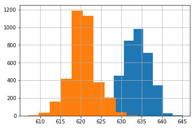

<!-- footer: Probabilistic Robotics, Lecture 4 (Part 2) -->

# Probabilistic Robotics, Lecture 4: Continuous Values ​​and Multivariate Functions (Part 2)

Ryuichi Ueda, Chiba Institute of Technology

 

This work is licensed under a <a rel="license" href="http://creativecommons.org/licenses/by-sa/4.0/">Creative Commons Attribution-ShareAlike 4.0 International License</a>.

---

<!-- paginate: true -->

## Contents

- Gaussian Distribution

---

## Gaussian Distribution

---

### Review of the First Half

- Introducing pdfs for continuous variables
    - Distributions can be expressed whether the random variable is discrete or continuous
- Next: Can the distribution be expressed mathematically?
    - It is impossible to create a distribution using only acquired data, as shown in the figure on the right.
    - Idea
        - Data emerges according to some law.
        - That law may be expressible in a mathematical formula.
$\rightarrow$A typical mathematical formula exists

---

### Introducing the Gaussian (normal) distribution

- Formula: $p(x) = \dfrac{1}{\sqrt{2\pi \sigma^2 }} \exp\left\{ -\dfrac{(x-\mu)^2}{2\sigma^2} \right\}$
    - $\mu$: Mean
    - $\sigma^2$: Variance
        - Example shown on the right: $(\mu, \sigma^2) = (5, 1)$
- The most representative pdf model
    - This shape occurs when there are many causes of small erros in $x$ (Central Limit Theorem).

Sensor values and the robot's travel distance and direction errors shown in the first half follow a Gaussian distribution if there are no significant causes of variation.

---

### Why is it typical and representative?

- Let's take a distance sensor as an example.
    - A wide variety of variability factors: temperature, humidity, vibration, external light, electrical fluctuations in the circuit, etc.
    - Consider the error $\varepsilon_{1:n}$ for each error factor.
         - Assume that they are independent of each other.
- Assume an error-free measurement value $x^*$.
    - $x = x^* + \sum_{i=1}^n \varepsilon_{i}$
- The probability that all the values of $\varepsilon_{1:n}$ are positive or negative is low.
$\rightarrow$ The closer the value of $\sum_{i=1}^n \varepsilon_{i}$ is to $0$, the higher the frequency.
    - The distribution of $x$ follows a bell-shaped distribution centered on $x^*$.

---

### Example of data fitting

- For $\theta$ in the robot movement example (units are degrees)
    - Left: Fitting a Gaussian distribution to 20 trials
        - $(\mu, \sigma^2) = (11.8, 12.0)$
    - Right: Fitting after 100 more trials
        - $(\mu, \sigma^2) = (13.2, 12.8)$

Let's consider various aspects (example on the next page)

---

### Example of Data Fitting (Discussion)

- The shape of the distribution cannot be determined from around 20 trials
    - The shape is quite different compared to 100 trials
- There is no significant difference between the fitted Gaussian distributions for 20 and 100 trials
    - Even after 20 trials, the mean and variance largely converge (in this case).
- Will further trials result in a Gaussian distribution?
    - There may be significant error factors that prevent this.
        - This results in a superposition of two or more Gaussian distributions.

---

### Example of a superposition of Gaussian distributions

- Example of a sensor value distribution from the orange book (left)
    - The average sensor value changes during the day and after sunset.
    - The distribution separates, dominating errors due to other error factors.
- Right
    - Orange distribution: Distribution extracted from 2:00 PM
    - Blue distribution: Distribution extracted from 6:00 AM

---

### Notation for Gaussian distribution

- Notated as $\mathcal{N}(\mu, \sigma^2)$
    - Example: $x \sim \mathcal{N}(\mu, \sigma^2)$: $x$ follows the Gaussian distribution $\mathcal{N}(\mu, \sigma^2)$
- You can also explicitly state the variables and write $\mathcal{N}(x | \mu, \sigma^2)$

---

### Properties of the Gaussian Distribution 1

- Problem: What is the distribution of the sum of two independent variables $x_1$ and $x_2$ that follow different Gaussian distributions?
    - In other words, what is the distribution $p(x_3)$ of $x_3 = x_1 + x_2$ in the following case?
        - $x_1 \sim \mathcal{N}(\mu_1, \sigma^2_1)$
        - $x_2 \sim \mathcal{N}(\mu_2, \sigma^2_2)$
- Answer:
    * $x_3 \sim \mathcal{N}(\mu_1 + \mu_2, \sigma^2_1 + \sigma^2_2)$
        - Again, the Gaussian distribution has a property known as $\rightarrow$regenerative.
        - Moreover, it is a simple addition of the mean and variance.

If you're feeling energetic, try proving it (proof starts on the next page).

---

### Property 1 of the Gaussian distribution (proof)

- First, express the distribution $p(x_3)$ in terms of $x_1, x_2, \mu_1, \mu_2, \sigma^2_1, \sigma^2_2$.
    - $p(x_3) = \int_{-\infty}^\infty p(x_3, x_1)\text{d}x_1$ 
$= \int_{-\infty}^\infty p(x_3 | x_1)p(x_1)\text{d}x_1$ 
$= \int_{-\infty}^\infty p(x_3 | x_1)\mathcal{N}(x_1| \mu_1, \sigma^2)\text{d}x_1$ 
$= \int_{-\infty}^\infty \mathcal{N}(x_3|x_1 + \mu_2, \sigma^2_2)\mathcal{N}(x_1| \mu_1, \sigma^2_1)\text{d}x_1$ 
    - Last: Distribution of $x_3$ with fixed $x_1$: distribution of $x_2$ shifted by $x_1$

---

### Property 1 of the Gaussian distribution (proof continued)

- $p(x_3) = \int_{-\infty}^\infty \dfrac{1}{\sqrt{2\pi \sigma^2_2}}\exp\left\{ -\dfrac{\{x_3 - (\mu_2 + x_1)\}^2}{2\sigma^2_2}\right\}$
$\cdot \dfrac{1}{\sqrt{2\pi \sigma^2_1}}\exp\left\{ -\dfrac{(x_1 - \mu_1)^2}{2\sigma^2_1}\right\} \text{d}x_1$
$= \dfrac{1}{2\pi \sigma_1\sigma_2} \int_{-\infty}^\infty \exp\left\{ -\dfrac{\{x_3 - (\mu_2 + x_1)\}^2}{2\sigma^2_2} -\dfrac{(x_1 - \mu_1)^2}{2\sigma^2_1}\right\} \text{d}x_1$
    - Solution: Decompose the integral as follows:
        - Leave the Gaussian distribution of $x_1$ within the integral (integrate to $1$).
        - Remove the distribution of $x_3$ outside the integral (use the Gaussian distribution).
        - The next slide shows the results (see the textbook for the calculations).

---

### Property of the Gaussian distribution 1 (proof continued)

- $p(x_3) =
\dfrac{1}{2\pi \sigma_1\sigma_2} 
\exp\left\{\dfrac{(x_3-\mu')^2 }{-2\sigma'^2 } \right\} 
\int_{-\infty}^\infty \exp\left\{\dfrac{-\sigma'^{2}}{2\sigma_1^2\sigma_2^2} \left[ x_1 - h(x_3) \right]^2 \right\} 
\text{d}x_1$ 
    - here 
        - $\sigma_1^2 + \sigma_2^2 = \sigma'^{2}$ 
        - $\mu_2 + \mu_1 = \mu'$ 
        - $h(x_3) = \{ \sigma_1^2 (x_3 - \mu_2) + \sigma_2^2\mu_1 \}/\sigma'^2$
- $p(x_3) = 
\mathcal{N}(x_3 | \mu', \sigma'^2) 
\int_{-\infty}^\infty 
\mathcal{N}\left[x_1 \Big| h(x_3), \dfrac{\sigma_1^2\sigma_2^2}{\sigma'^{2}} \right] 
\text{d}x_1$
$= \mathcal{N}(x_3 | \mu', \sigma'^2)= \mathcal{N}(x_3 | \mu_1 + \mu_2, \sigma_1^2 + \sigma_2^2)$

---

### Properties of Gaussian distribution 2

- Problem: If $x$ follows a Gaussian distribution, what distribution does $y=ax+b$ follow?
- $x \sim \mathcal{N}(\mu,\sigma^2)$
