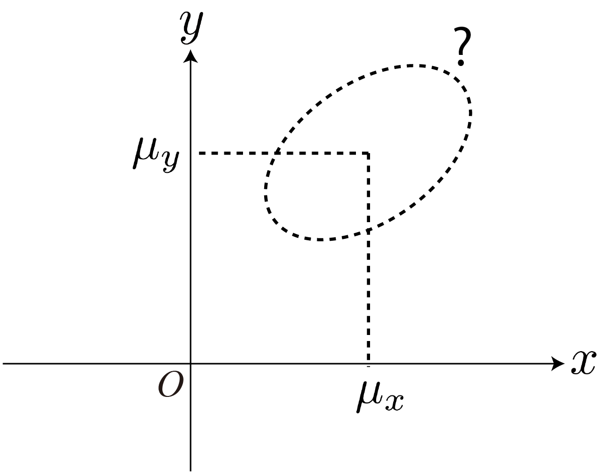
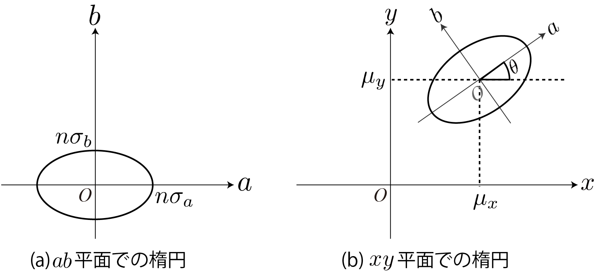

<!-- footer: 確率ロボティクス第4回（その3） -->

# 確率ロボティクス第4回: 連続値と多変量（その3）

千葉工業大学 上田 隆一

<br />

<p style="font-size:50%">
This work is licensed under a <a rel="license" href="http://creativecommons.org/licenses/by-sa/4.0/">Creative Commons Attribution-ShareAlike 4.0 International License</a>.
<a rel="license" href="http://creativecommons.org/licenses/by-sa/4.0/">
</a>
</p>

---

<!-- paginate: true -->

## 今回の内容

- 多変量ガウス分布
- 多変量ガウス分布の演算

---

## 多変量ガウス分布

- ガウス分布に従う変数$x_{1:n}$をまとめて1つの多次元のガウス分布で表せる
- 式をまず見せます
	- $\mathcal{N}(\boldsymbol{x} | \boldsymbol{\mu}, \Sigma) = \dfrac{1}{\sqrt{(2\pi)^n |\Sigma|}}
	\exp\left\{-\dfrac{1}{2}(\boldsymbol{x} - \boldsymbol{\mu})^\top \Sigma^{-1} (\boldsymbol{x} - \boldsymbol{\mu}) \right\}$
        - ここで
	$\boldsymbol{x} = \begin{pmatrix}
		x_1 \\ x_2 \\ \vdots \\ x_n
		\end{pmatrix}, \ 
	\boldsymbol{\mu} = \begin{pmatrix}
		\mu_1 \\ \mu_2 \\ \vdots \\ \mu_n
		\end{pmatrix}, \ 
	\Sigma = \begin{pmatrix}
		\sigma^2_1 & \sigma_{12} & \dots & \sigma_{1n} \\
		\sigma_{12} & \sigma^2_2 & \dots & \sigma_{2n}  \\
		\vdots & \vdots & \ddots & \vdots \\
		\sigma_{1n} & \sigma_{2n} & \dots & \sigma^2_n  \\
	\end{pmatrix}$


---

### 分散共分散行列

- 前ページの$\Sigma$: 各変数の分散と共分散を組み合わせた行列
    - $\Sigma = \begin{pmatrix}
		\sigma^2_1 & \sigma_{12} & \dots & \sigma_{1n} \\
		\sigma_{12} & \sigma^2_2 & \dots & \sigma_{2n}  \\
		\vdots & \vdots & \ddots & \vdots \\
		\sigma_{1n} & \sigma_{2n} & \dots & \sigma^2_n  \\
	\end{pmatrix}$
         - $\sigma_{ij} = \big\langle (x_i - \mu_i )(x_j-\mu_j) \big\rangle_{\mathcal{N}(\boldsymbol{x} | \boldsymbol{\mu}, \Sigma)}$
- 普通に話す時は「共分散行列」でよい

---

### 例: 移動ロボットの実験

- 実験で得られたデータのうち、$x$と$y$について多変量ガウス分布（2次元ガウス分布）に当てはめてみましょう
- [20試行分のデータ](./misc/xy_data.txt)
    - 1列目: $x$[m]、2列目: $y$[m]
- 計算すべきパラメータ
    - $x, y$それぞれの平均値と分散
    - $x$と$y$の共分散
        - <span style="color:red">データからの共分散の計算方法</span>: $s_{ab} = \dfrac{1}{N-1}\sum_{i=1}^n (a_i - \bar{a})(b_i - \bar{b})$
	        - $N$個のデータのペア$(a,b)_{1:N}$に対して


---

### 計算結果

- `datamash`を使った例
```bash
### 平均値 ###
$ cat xy_data.txt | tr ' ' \\t | datamash mean 1 mean 2
3.8822	0.51035
### 分散 ###
$ cat xy_data.txt | tr ' ' \\t | datamash svar 1 svar 2
0.016455957894737	0.19727097631579
### 共分散 ###
$ cat xy_data.txt |tr ' ' \\t | datamash scov 1:2
-0.029138231578947
```
- これらの値からガウス分布の式を書きましょう

---

### 答え

- $\mathcal{N}(\boldsymbol{x} | \boldsymbol{\mu}, \Sigma) = \dfrac{1}{\sqrt{(2\pi)^2 |\Sigma|}}
\exp\left\{-\dfrac{1}{2}(\boldsymbol{x} - \boldsymbol{\mu})^\top \Sigma^{-1} (\boldsymbol{x} - \boldsymbol{\mu}) \right\}$
    - $\Sigma 
	= \begin{pmatrix} 
		0.016 & -0.029 \\
		-0.029 & 0.197 \\
	\end{pmatrix},
	\boldsymbol{\mu} 
	= \begin{pmatrix}
		3.88 \\
		0.51 
	\end{pmatrix}$
- 式はわかったけど解釈がよくわからない
    - グラフを描いてみましょう

---

### 2変量ガウス分布の描画

- とりあえず中心からマハラノビス距離$n$になる箇所を描いてみましょう
	- マハラノビス距離: $D_\text{M}(\boldsymbol{x}) = \sqrt{
	(\boldsymbol{x} - \boldsymbol{\mu})^\top \Sigma^{-1} (\boldsymbol{x} - \boldsymbol{\mu})}$
	    - 1次元のものと比較を 
- 図形は楕円に
    - 楕円の式: $\dfrac{(x - \mu_x)^2}{a^2} + \dfrac{(y - \mu_y)^2}{b^2} = 1$
	    - $(\boldsymbol{x} - \boldsymbol{\mu})^\top \Sigma^{-1} (\boldsymbol{x} - \boldsymbol{\mu})$の部分を多項式にすると同じ形に（次のページから検証）



---

### とりあえず対角化

- 次のように$\Sigma$を分解
    - $\Sigma = R(-\theta)^\top S R(-\theta)$
        - $R(\theta) = 
	\begin{pmatrix}
		\cos\theta & -\sin\theta \\
		\sin\theta & \cos\theta 
	\end{pmatrix}$: 回転行列
        - $S =
	\begin{pmatrix}
		\sigma_a^2 & 0 \\
		0 & \sigma_b^2  \\
	\end{pmatrix}
	= \text{diag}(\sigma_a^2, \sigma_b^2)$: 対角行列
- このとき
    - $D_\text{M}(\boldsymbol{x}) 
	= \sqrt{
		(\boldsymbol{x} - \boldsymbol{\mu})^\top \{
			R(-\theta)^\top S R(-\theta)
		\}^{-1} (\boldsymbol{x} - \boldsymbol{\mu})
	}$
	$=
	 \sqrt{
		(\boldsymbol{x} - \boldsymbol{\mu})^\top 
			R(-\theta)^{-1} S^{-1} \{R(-\theta)^{\top}\}^{-1}
		 (\boldsymbol{x} - \boldsymbol{\mu})
	}$
	$=
	 \sqrt{
		(\boldsymbol{x} - \boldsymbol{\mu})^\top 
			R(-\theta)^{\top} S^{-1}R(-\theta)
		 (\boldsymbol{x} - \boldsymbol{\mu})
	}$
	$=
	 \sqrt{
		 \{R(-\theta)(\boldsymbol{x} - \boldsymbol{\mu})\}^\top 
			S^{-1} \{ R(-\theta)
		 (\boldsymbol{x} - \boldsymbol{\mu}) \}
	 }$

---

### 座標変換

- 前ページ最後の式: $D_\text{M}(\boldsymbol{x}) =
	 \sqrt{
		 \{R(-\theta)(\boldsymbol{x} - \boldsymbol{\mu})\}^\top 
			S^{-1} \{ R(-\theta)
		 (\boldsymbol{x} - \boldsymbol{\mu}) \}
	 }$
- 次を代入すると$D_\text{M}(\boldsymbol{x}) = \sqrt{ a^2/\sigma_a^2 + b^2 / \sigma_b^2}$ となる
    - $\boldsymbol{a} = (a \ \ b)^\top = R(-\theta)(\boldsymbol{x} - \boldsymbol{\mu})$
    - $S = \text{diag}(\sigma_a^2, \sigma_b^2)$
- したがって
    - マハラノビス距離が$n$になる点の描く図形:
    $ab$-座標系で$\dfrac{a^2}{\sigma_a^2} + \dfrac{b^2}{\sigma_b^2} = n^2$を満たす楕円


---

### 座標を戻す

- $ab$-座標系で$\dfrac{a^2}{\sigma_a^2} + \dfrac{b^2}{\sigma_b^2} = n^2$を満たす楕円を$xy$-座標系に
    - $\boldsymbol{a} = (a \ \ b)^\top = R(-\theta)(\boldsymbol{x} - \boldsymbol{\mu})$
- $\theta$だけ回転して$\mu$だけ移動

$\qquad\qquad\qquad$

---

### 実際の値で描画

- $\Sigma = \begin{pmatrix} 
		0.016 & -0.029 \\
		-0.029 & 0.197 \\
	\end{pmatrix}$
    $= R(-8.9$deg$)
    \begin{pmatrix}
        0.107^2 & 0 \\
        0 & 0.449^2 \\
    \end{pmatrix}R(-8.9$deg$)$
	$\boldsymbol{\mu} 
	= \begin{pmatrix}
		3.88 \\
		0.51 
	\end{pmatrix}$
- 右図: $n=1,2,3$の楕円を描画
    - <span style="color:red">誤差楕円</span>と呼ばれる


---

## 多変量ガウス分布の演算

- 再生性はあるのか


---

### 変数の和の分布

- 1次元のときと同様、再生性がある
- $\boldsymbol{x}_i \sim \mathcal{N}(\boldsymbol{\mu}_i, \Sigma_i)\ (i=1,2)$のとき、$\boldsymbol{x} = \boldsymbol{x}_1 + \boldsymbol{x}_2$の分布は？
    - $\boldsymbol{x}_1, \boldsymbol{x}_2$は独立
    - 答え（1次元のときから類推して書いてみましょう）: 
        - $\boldsymbol{x} \sim \mathcal{N}(\boldsymbol{\mu}_1 + \boldsymbol{\mu}_2,  \Sigma_1 + \Sigma_2)$

