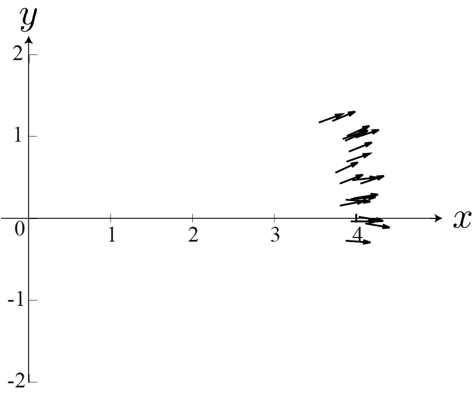

<!-- footer: 確率ロボティクス第4回 -->

# 確率ロボティクス第4回: 連続値と多変量

千葉工業大学 上田 隆一

 

This work is licensed under a <a rel="license" href="http://creativecommons.org/licenses/by-sa/4.0/">Creative Commons Attribution-ShareAlike 4.0 International License</a>.

---

<!-- paginate: true -->

## 今回の内容

- 連続値に対する確率分布の定義方法
- 多変量の確率分布

---

## ある実験

- ある位置から何度もロボットを4m前進させ、実際に到達した位置$(x,y)$と向き$\theta$の統計をとった
- 知りたいこと: ロボットの到達した座標$(x,y,\theta)$の分布は？
    - 右の図のような分布の図を描きたい
$\qquad\qquad\qquad\qquad$

---

### 困ること

- 困ること1: $x,y,\theta$が「連続的」
    - 統計をとっても点になるから前ページのようなグラフが描けない
- 困ること2: 確率変数$x,y,\theta$が3つもある
    - こういうことは前回もあったが、分布の形については扱っていない

どうしましょう？

