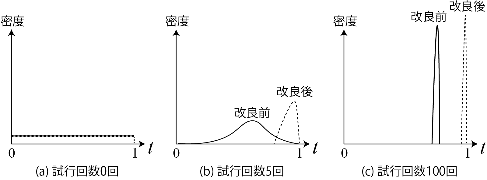
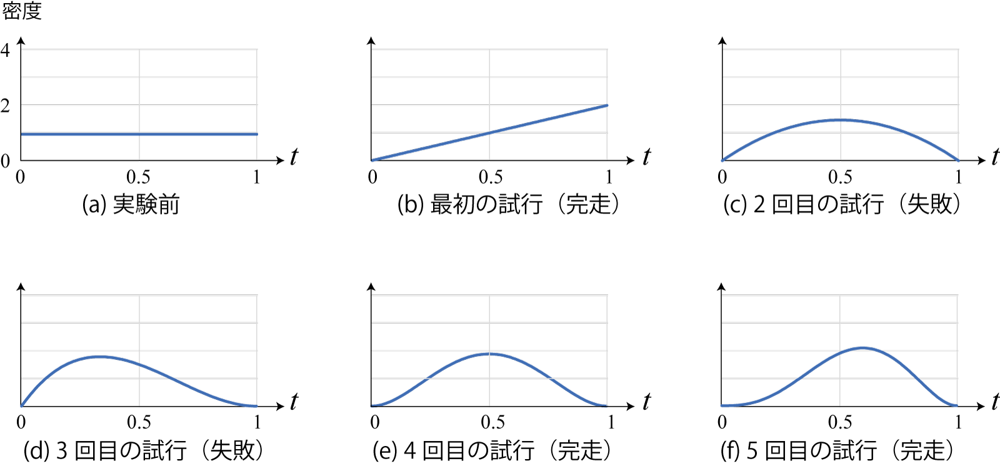
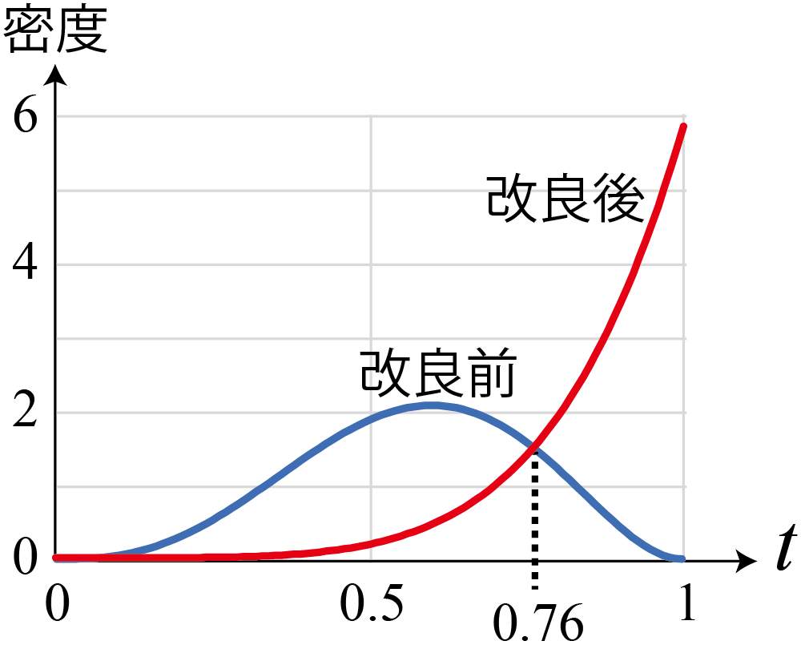
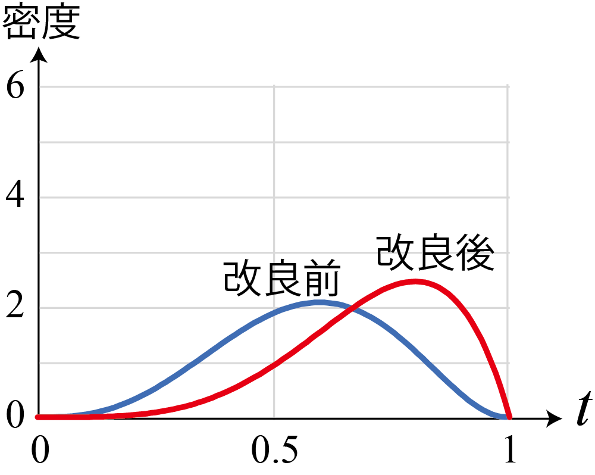
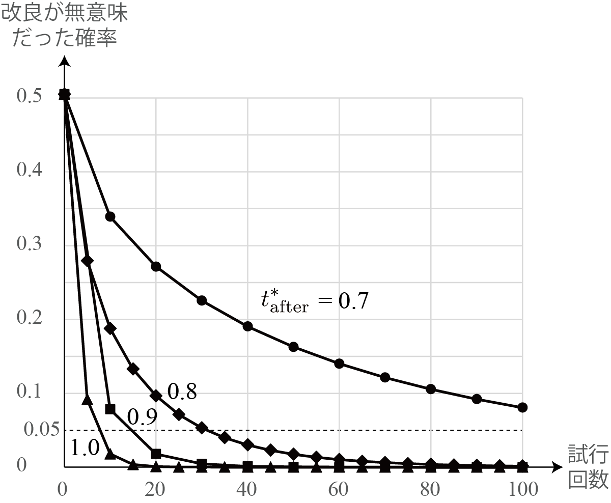

<!-- footer: 確率ロボティクス第5回 -->

# 確率ロボティクス第5回: 試行回数と信頼性

千葉工業大学 上田 隆一

 

This work is licensed under a <a rel="license" href="http://creativecommons.org/licenses/by-sa/4.0/">Creative Commons Attribution-ShareAlike 4.0 International License</a>.

---

<!-- paginate: true -->

## 今回の内容

- 実験結果の信頼性
- ベイズの定理
- 尤度

---

## 実験結果の信頼性

---

### 質問: この実験について議論してみましょう

- C君がロボットをある地点からある地点まで自動で走らせるソフトウェアを改良して、評価するために実験
- 実験内容: 改良前後のソフトウェアで5回ずつロボットを走行させる
- 実験結果: 
    - 改良前: 完走$\rightarrow$失敗$\rightarrow$失敗$\rightarrow$完走$\rightarrow$完走
    - 改良後: すべて完走
- C君の結論: 改良後のソフトウェアの方が優れている

ほんと？

---

### 実験が足りないような気がするが・・・

- このあと試行を重ねると結果が逆転するかもしれない
    - 今回はこの問題について扱う
- 問題へのアプローチ: 完走率の確率分布を推定する
    - つまり確率（完走率）自体を確率変数として扱う
    - 背景となる考え: 無限回の試行をしないと完走率はそもそも不確か
    $\rightarrow$完走率は確率的

---

### 完走率の確率分布（の予想）

- 完走率（確率変数）を$t$とすると、$p(t)$はたぶん下図のようになる
    - (a) 試行前: 一様分布に（なにも情報がない）
    - (b) 何回か試行: 「完走回数/試行回数」のところにピークが来るが、まだ曖昧
    - (c) たくさん試行: 完走率がはっきりして、分布が鋭く

$\qquad\qquad\qquad$

この分布で改良前後の結果を比較してみましょう
 （どうこの分布を計算するかはさておき）

---

### 完走率の確率分布を考えると比較ができる

- たくさん試行すると(c)のように改良前後の完走率の分布が（ほぼ）重ならない
    - どちらが優れているか（ほぼ）分かる
- 試行が5回ずつ程度だと(b)のように分布が重なっていそう
    - 改良前後の完走率が逆転している可能性が無視できないほどある

$\qquad\qquad\qquad$

どうやって計算するの？

---

### 完走率の確率分布の導出

- $p_i(t) = p(t| x_{1:i})$を定義
    - 試行結果$x_{1:i}$から推定される分布
- $p_{i-1}(t) = p(t| x_{1:i-1}) \ (i>0)$について、乗法定理から次の2つの式を考える
    - $p(t, x_i | x_{1:i-1}) = p(t | x_{1:i})p(x_i | x_{1:i-1}) = p_i(t) p(x_i | x_{1:i-1})$ ---(a)
        - $x_{1:i-1}$と$x_i$は独立同分布
    - $p(t, x_i | x_{1:i-1}) = p(x_i | t, x_{1:i-1})p(t | x_{1:i-1}) = p(x_i|t) p_{i-1}(t)$ ---(b)
        - $t$がわかれば$x_{1:i-1}$の情報は不要
- 上の2式の右辺から
    - $p_i(t) = p(x_i|t) p_{i-1}(t)/ p(x_i | x_{1:i-1})$

---

### さらに計算

- 教科書は離散化していますが、そのまま計算してみます
- $p_i(t) = p(x_i|t) p_{i-1}(t)/ p(x_i | x_{1:i-1})$の各要素を見ていきましょう
    - $p(x_i|t)$: 完走率が$t$のときに、$x_i$となる確率
        - $x_i$が完走: $t$
        - $x_i$が失敗: $1-t$
        - 上記をまとめると $p(x_i|t) = t^{x_i}(1-t)^{1-x_i}$
    - $p(x_i | x_{1:i-1}) = \int_{0}^1 p(t, x_i| x_{1:i-1}) \text{d}t = \int_{0}^1 p(x_i|t)p_{i-1}(t) \text{d}t$
    $=\langle p(x_i|t) \rangle_{p_{i-1}(t)}=\langle t^{x_i}(1-t)^{1-x_i} \rangle_{p_{i-1}(t)}$
        - 前ページの(b)から
        - $p_{i-1}$で考えたときの、$x_i$の起こりやすさの値
        - 上の式では定数扱い（$t$は積分で消える）

---

### 完走率の分布の導出（完了）

- したがって次が成立
    - $p_i(t)= \eta \ t^{x_i}(1-t)^{1-x_i} p_{i-1}(t)$
    - 意味: $x_i$が成功だと$p_{i-1}$に$t$、失敗だと$t-1$をかけて
    正規化すると$p_i$に
- これまでに$a$回成功、$b$回失敗したとすると
    - $p_{a+b}(t) = \eta \ t^a (1-t)^b p_0(t)$
- $p_0$が一様分布だとすると
    - $p(t) = \eta \ t^a (1-t)^b$ が、$a+b$回試行したあとの完走率の分布

---

### 完走率の分布の描画

- 改良前のソフトウェアの試行での分布の推移を描いてみましょう
    - 完走$\rightarrow$失敗$\rightarrow$失敗$\rightarrow$完走$\rightarrow$完走
    - $p(t) = \eta \ t^a (1-t)^b$
    * こうなる
    $\qquad\qquad\qquad$

---

### 分布の比較

- 5回ずつ試行が終わった時点での改良前後での分布の比較
    - これも余裕があれば描いてみましょう
    * こうなる
    $\qquad\qquad\qquad$
        - 改良前の完走率のほうが高い可能性はある

---

### 改良前の完走率のほうが高い確率

- $p_\text{before}(t) = \eta t^3(1-t)^2 = 60 (t^5 -2 t^4 + t^3)$
- $p_\text{after}(t) = \eta t^5 = 6t^5$
- $\Pr\{ t_\text{before} > t_\text{after} \} = \int_{t_\text{before} > t_\text{after}} p(t_\text{before}, t_\text{after})\text{d}(t_\text{before},t_\text{after})$
$= \int_{t_\text{before} > t_\text{after}} p_\text{before}(t_\text{before})p_\text{after}(t_\text{after})\text{d}(t_\text{before}, t_\text{after})\quad \because t_\text{before} \perp\!\!\!\!\perp t_\text{after}$
$= \int_0^1 p(t_\text{after})\int_{t_\text{after}}^1 p(t_\text{before})\text{d}t_\text{before}\text{d}t_\text{after}$
$= \int_0^1 p_\text{after}(t)\int_{t}^1 p_\text{before}(t')\text{d}t'\text{d}t$
$= \int_0^1 6t^5 [ 10t'^6 -24t'^5 + 15t'^4 ]_{t'}^1 \text{d}t$
$= \int_0^1 6t^5 (1 - 10 t^6 + 24 t^5 - 15t^4)\text{d}t$
$= 1/11$
$\Longrightarrow$ 9\%の確率で改良前のほうが完走率が高い

---

### もし改良後の試行で1回失敗があったら

- $p_\text{after}(t) = \eta t^4(1-t)$
- 同様に計算すると$\Pr\{ t_\text{before} > t_\text{after} \} = 0.28$
$\qquad\qquad\qquad$
- （試行回数は実験前に決めないといけないので）試行回数は全然足りない

---

### どれくらいの試行回数が必要か？

- 右のグラフ: $\Pr\{ t_\text{before} > t_\text{after} \}$の値
    - 改良が無意味な確率
    - 条件
        - 改良前の完走率: $t^*_\text{before} = 0.6$（固定）
        - 改良後の完走率: $t^*_\text{after} = 1.0, 0.9, 0.8, 0.7$のいずれか
- 無意味な確率が5\%以下になる試行回数
    - $t^*_\text{after} = 0.8$だと30回程度
    - $t^*_\text{after} = 0.7$だと100回以上
        - 100回で10\%は下回る
- （学科の学生の感覚よりも）かなり試行回数が必要

---

### ここまでのまとめ

- 試行での比較については、その信頼性が確率の計算で求められる
    - 完走率等の確率に対して、さらに確率分布を考える
- どれだけ試行しても、結果が偶然ひっくり返る可能性は0にはならない
    - 実験の評価項目、方法を工夫して少ない試行回数で済むように or たくさん試行回数を確保
    - 論文指導では「言い切れ」と言われるが、個人的にはかなり疑問
        - 他の人に追試してもらうことを前提に、できるだけ有意義な結果や付帯情報の提示を
    - 基本、論文の実験結果を鵜呑みにしてはならない
        - 自分自身に対しても常に疑いを

---

## ベイズの定理

- さっき使ったこの式変形は実はとても重要
    - $p(a, b) = p(a|b)p(b) = p(b|a)p(a)$
    $\Longrightarrow p(a|b)= \dfrac{p(b|a)p(a)}{p(b)} = \dfrac{p(b|a)p(a)}{\int_{-\infty}^\infty p(b|a')p(a') \text{d}a'}$
    - （乗法定理の変形であることはさておき）ベイズの定理と呼ばれる
- ベイズの定理の様々な表記
    - $p(a|b)= \dfrac{p(b|a)p(a)}{p(b)} = \eta p(b|a)p(a) = \dfrac{p(b|a)p(a)}{\langle p(b|a') \rangle_{p(a')}}$
        - $a,b$が連続、離散どちらでも成立
    - $\Pr \{A|B \} = \dfrac{\Pr\{B|A\}\Pr\{A\}}{\Pr\{B\}}$
