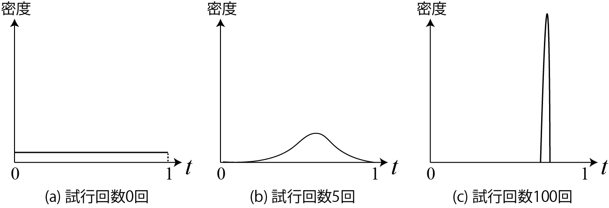

<!-- footer: 確率ロボティクス第5回 -->

# 確率ロボティクス第5回: 試行回数と信頼性

千葉工業大学 上田 隆一

 

This work is licensed under a <a rel="license" href="http://creativecommons.org/licenses/by-sa/4.0/">Creative Commons Attribution-ShareAlike 4.0 International License</a>.

---

<!-- paginate: true -->

## 今回の内容

- 実験結果の信頼性
- ベイズの定理
- 尤度

---

## 実験結果の信頼性

---

### 質問: この実験について議論してみましょう

- C君がロボットをある地点からある地点まで自動で走らせるソフトウェアを改良して、評価するために実験
- 実験内容: 改良前後のソフトウェアで5回ずつロボットを走行させる
- 実験結果: 
    - 改良前: 完走$\rightarrow$失敗$\rightarrow$失敗$\rightarrow$完走$\rightarrow$完走
    - 改良後: すべて完走
- C君の結論: 改良後のソフトウェアの方が優れている

ほんと？

---

### 実験が足りないような気がするが・・・

- このあと試行を重ねると結果が逆転するかもしれない
    - 今回はこの問題について扱う
- 問題へのアプローチ: 完走率の確率分布を推定する
    - つまり確率（完走率）自体を確率変数として扱う
    - 背景となる考え: 無限回の試行をしないと完走率はそもそも不確か
    $\rightarrow$完走率は確率的

---

### 完走率の確率分布（の予想）

- 完走率（確率変数）を$t$とすると、$p(t)$はたぶん下図のようになる
    - (a) 試行前: 一様分布に（なにも情報がない）
    - (b) 何回か試行: 「完走回数/試行回数」のところにピークが来るが、まだ曖昧
    - (c) たくさん試行: 完走率がはっきりして、分布が鋭く

$\qquad\qquad\qquad$

どうやって計算するの？

---

### 事前分布・事後分布

- 完走率の分布を求めるため、次の分布を考える
    - $i$回目の試行前の分布: $p_{i-1}$
    - $i$回目の試行後の分布: $p_{i}$
