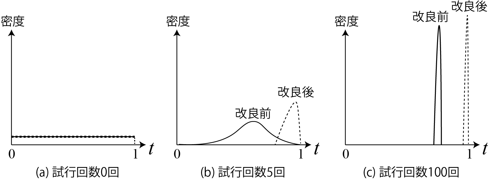
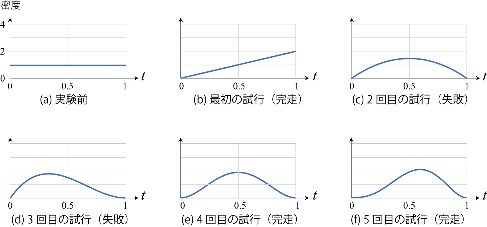
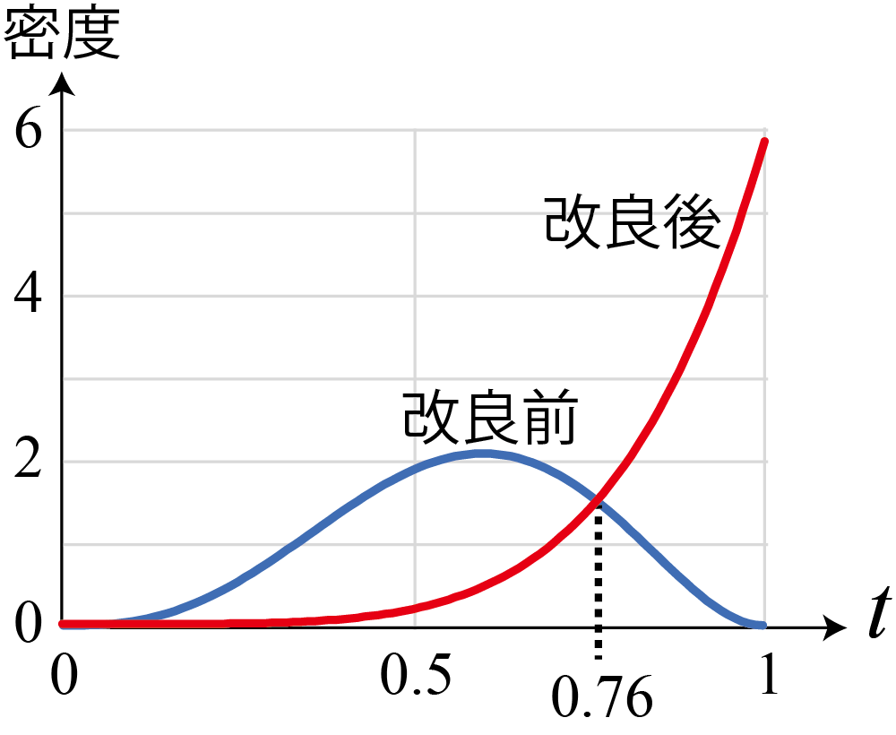
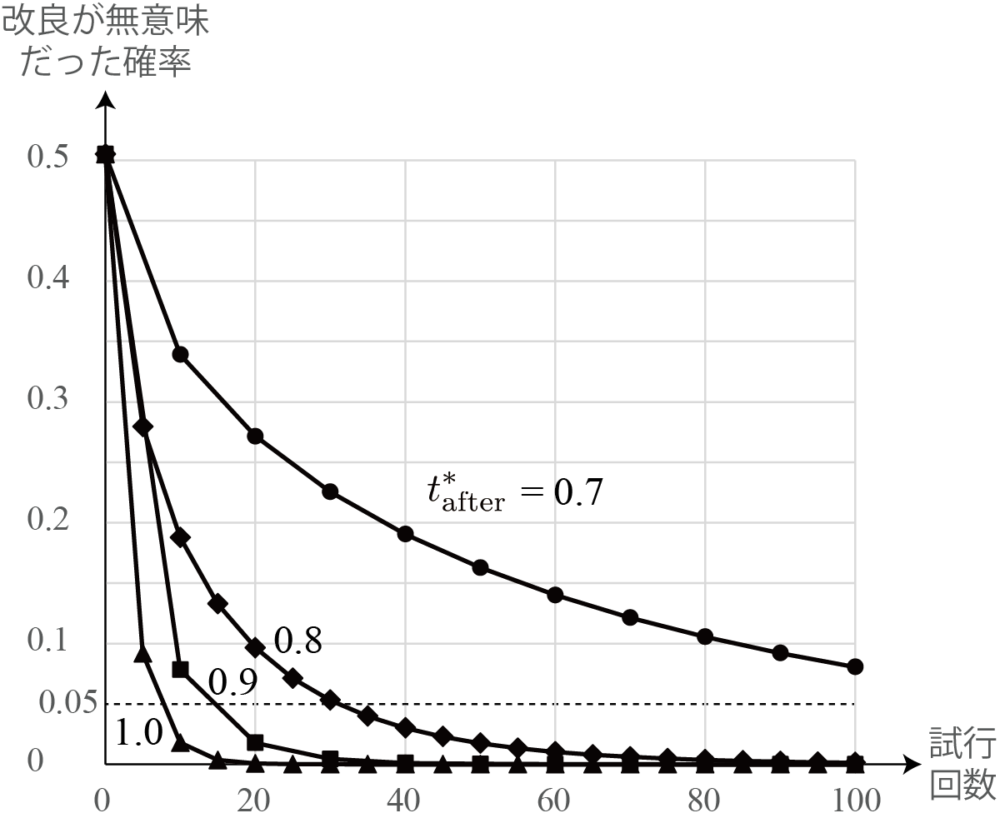

<!-- footer: Probabilistic Robotics, Lecture 5 -->

# Probabilistic Robotics, Lecture 5: Number of Trials and Reliability

Ryuichi Ueda, Chiba Institute of Technology

 

This work is licensed under a <a rel="license" href="http://creativecommons.org/licenses/by-sa/4.0/">Creative Commons Attribution-ShareAlike 4.0 International License</a>.

---

<!-- paginate: true -->

## Content

- Reliability of experimental results
- Bayes' theorem
- Supplementary information

---

## Reliability of Experimental Results

---

### Question: Let's discuss this experiment.

- Student C improved software that automatically drives a robot from one point to another and conducted an experiment to evaluate it.
- Experimental Procedure: The robot ran five times with the before and after the improvement.
- Experimental Results:
    - Before Improvement: Completed $\rightarrow$Failed $\rightarrow$Failed $\rightarrow$Completed $\rightarrow$Completed
    - After Improvement: Completed all runs.
- C's Conclusion: The improved software is superior.

Really? 

---

### We feel like he haven't done enough experiments.

- The results might be reversed if I try more trials.
    - This is the problem I'll be addressing.
- Approach to the problem: Estimate the probability distribution of the completion rate
    - In other words, treat the probability (completion rate) itself as a random variable.
    - The underlying idea: Without an infinite number of trials, the completion rate is uncertain.
$\rightarrow$Completion rate is probabilistic.

---

### (Predicted) probability distribution of the completion rate.

- If the completion rate (random variable) is $t$, then $p(t)$ will probably look like the graph below.
    - (a) Before trials: Uniform distribution (no information available).
    - (b) After several trials: A peak appears at "number of completions/number of trials," but it's still unclear.
    - (c) After many trials: The completion rate is clear and the distribution is sharp.

$\qquad\qquad\qquad$

Let's compare the results before and after the improvement using this distribution.
  (I'll leave aside the question of how to calculate this distribution.)

---

### Comparisons can be made by considering the probability distribution of the completion rate.

- With many trials, the distributions of completion rates before and after the improvement (almost) do not overlap, as in (c).
    - We can (almost) tell which is superior.
- With around five trials, the distributions appear to overlap, as in (b).
    - There is a non-negligible possibility that the completion rates before and after the improvement are reversed.

$\qquad\qquad\qquad$

How do I calculate it? 

---

### Derivation of the probability distribution of completion rate

- Define $p_i(t) = p(t| x_{1:i})$
- Distribution estimated from trial results $x_{1:i}$
- Consider the following two equations using the multiplication theorem for $p_{i-1}(t) = p(t| x_{1:i-1}) \ (i>0)$
- $p(t, x_i | x_{1:i-1}) = p(t | x_{1:i})p(x_i | x_{1:i-1}) = p_i(t) p(x_i | x_{1:i-1})$ ---(a)
- $p(t, x_i | x_{1:i-1}) = p(x_i | t, x_{1:i-1})p(t | x_{1:i-1}) = p(x_i|t) p_{i-1}(t)$ ---(b)
- If we know $t$, we don't need information about $x_{1:i-1}$.
- From the right-hand side of the above two equations:
- $p_i(t) = p(x_i|t) p_{i-1}(t)/ p(x_i | x_{1:i-1})$

---

### Further Calculations

- Although the textbook uses discretization, let's calculate it as is.
- Let's look at each element of $p_i(t) = p(x_i|t) p_{i-1}(t)/ p(x_i | x_{1:i-1})$.
- $p(x_i|t)$: Probability of $x_i$ occurring when the completion rate is $t$.
- $x_i$ completes: $t$
- $x_i$ fails: $1-t$
- To summarize the above: style="color:red">$p(x_i|t) = t^{x_i}(1-t)^{1-x_i}$
- $p(x_i | x_{1:i-1}) = \int_{0}^1 p(t, x_i| x_{1:i-1}) \text{d}t = \int_{0}^1 p(x_i|t)p_{i-1}(t) \text{d}t$
$=\langle p(x_i|t) \rangle_{p_{i-1}(t)}=\langle t^{x_i}(1-t)^{1-x_i} \rangle_{p_{i-1}(t)}$
- From (b) on the previous page
- The likelihood of $x_i$ occurring when considering $p_{i-1}$
- In the above equation, it is treated as a constant ($t$ disappears during integration).

---

### Derivation of the distribution of completion rates (complete)

- Therefore, the following holds:
- $p_i(t) = \eta \ t^{x_i}(1-t)^{1-x_i} p_{i-1}(t)$
- Meaning: If $x_i$ is a success, multiply $p_{i-1}$ by $t$; if it is a failure, multiply $t-1$.
Normalized to $p_i$.
- Suppose there have been $a$ successes and $b$ failures so far.
- $p_{a+b}(t) = \eta \ t^a (1-t)^b p_0(t)$
- Suppose $p_0$ is uniformly distributed.
- $p(t) = \eta \ t^a (1-t)^b$ However, the distribution of completion rates after $a+b$ trials.

---

### Drawing the distribution of completion rates

- Let's plot the evolution of the distribution over time for trials of the software before the improvement.
- Completed$\rightarrow$Failed$\rightarrow$Failed$\rightarrow$Completed$\rightarrow$Completed
- $p(t) = \eta \ t^a (1-t)^b$
* This is what happens.
$\qquad\qquad\qquad$

---

### Comparing distributions

- Comparing the distributions before and after the improvement after five trials.
- If you have time, try plotting this as well.
* This is what happens.
$\qquad\qquad\qquad$
- It's possible that the completion rate was higher before the improvement.

---

### Probability that the completion rate was higher before the improvement.

- $p_\text{before}(t) = \eta t^3(1-t)^2 = 60 (t^5 -2 t^4 + t^3)$
- $p_\text{after}(t) = \eta t^5 = 6t^5$
- $\Pr\{ t_\text{before} > t_\text{after} \} = \int_{t_\text{before} > t_\text{after}} p(t_\text{before}, t_\text{after})\text{d}(t_\text{before},t_\text{after})$
$= \int_{t_\text{before} > t_\text{after}} p_\text{before}(t_\text{before})p_\text{after}(t_\text{after})\text{d}(t_\text{before}, t_\text{after})\quad \because t_\text{before} \perp\!\!\!\!\perp t_\text{after}$
$= \int_0^1 p(t_\text{after})\int_{t_\text{after}}^1 p(t_\text{before})\text{d}t_\text{before}\text{d}t_\text{after}$
$= \int_0^1 p_\text{after}(t)\int_{t}^1 p_\text{before}(t')\text{d}t'\text{d}t$
$= \int_0^1 6t^5 [ 10t'^6 -24t'^5 + 15t'^4 ]_{t'}^1 \text{d}t$
$= \int_0^1 6t^5 (1 - 10 t^6 + 24 t^5 - 15t^4)\text{d}t$
$= 1/11$
$\Longrightarrow$ There is a 9% probability that the completion rate is higher before the improvement.

---

### If there is one failure in the post-improvement trial,

- $p_\text{after}(t) = \eta t^4(1-t)$
- Calculating similarly, we get $\Pr\{ t_\text{before} > t_\text{after} \} = 0.28$
$\qquad\qquad\qquad$
- (The number of trials must be determined before the experiment.) The number of trials is far from sufficient.

---

### How many trials are needed?

- Right graph: Value of $\Pr\{ t_\text{before} > t_\text{after} \}$
- Probability that improvement is meaningless
- Conditions
- Completion rate before improvement: $t^*_\text{before} = 0.6$ (fixed)
- Completion rate after improvement: $t^*_\text{after} = 1.0, 0.9, 0.8, 0.7$
- Number of trials required to reduce the probability of meaninglessness below 5%
- About 30 trials for $t^*_\text{after} = 0.8$
- More than 100 trials for $t^*_\text{after} = 0.7$
- 100 trials will reduce the probability below 10%
- A much larger number of trials is required (than what a student in the department would expect)

---

### Summary so far

- For comparisons between trials, the reliability is calculated using probability calculations.
