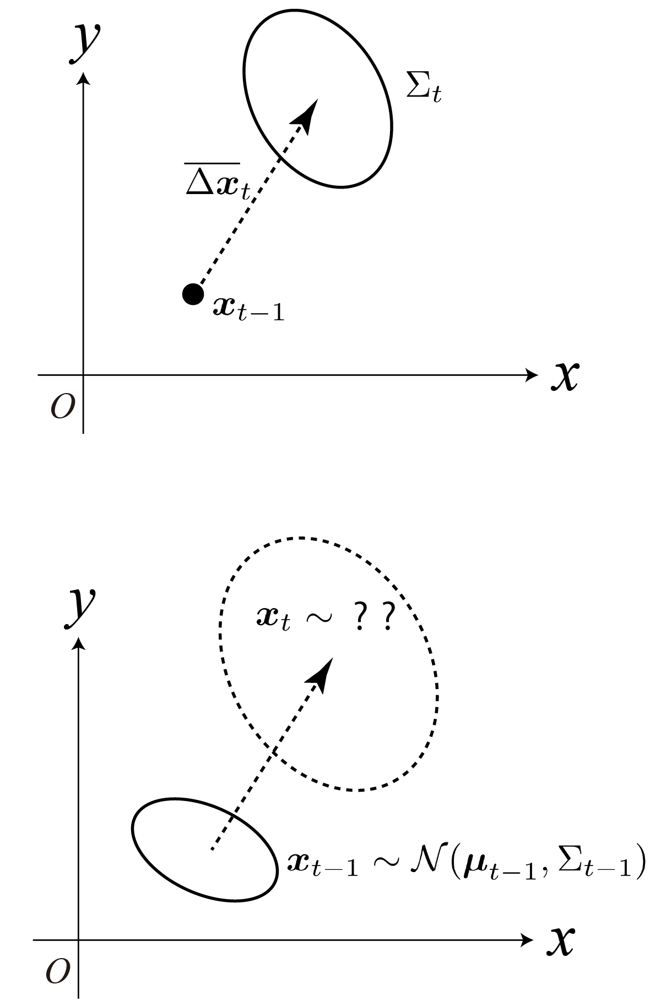

<!-- footer: 確率ロボティクス第6回 -->

# 確率ロボティクス第6回: 動く確率分布（その1）

千葉工業大学 上田 隆一

 

This work is licensed under a <a rel="license" href="http://creativecommons.org/licenses/by-sa/4.0/">Creative Commons Attribution-ShareAlike 4.0 International License</a>.

---

<!-- paginate: true -->

## 今回の内容

- 動く物体と確率
    - 台風の予報円のようなものを考える
    - ロボットも同様に予測ができないと危なくて移動できないのでなんとかする 
    - とりあえず簡単な例で考える

<a href="https://ja.wikipedia.org/wiki/%E3%83%95%E3%82%A1%E3%82%A4%E3%83%AB:2022%E5%B9%B4%E5%8F%B0%E9%A2%A814%E5%8F%B7%E3%81%AE%E4%BA%88%E5%A0%B1%E5%86%86_(%E6%B0%97%E8%B1%A1%E5%BA%81).jpg">画像: 気象庁 CC BY-SA 4.0</a>

---

## 動く物体と確率

- おさらい
    - 4章ではロボットが動いたあとの位置、向きの確率分布を考えた
- 今回考えること
    - この確率分布はロボットと一緒に動いてきた
        - ロボットが動けば中心も動く
        - ロボットの動きには雑音があるので分布が広がる

$\Longrightarrow$どんなふうに動いてきたんだろう？

---

### 準備1: 離散時間系の導入

- ロボットの「考える周期」で時間を離散化しましょう
    - 連続的な時間で確率分布の変化を考えるのは大変なので
    - 人が操作するロボットではなく自律ロボット
- 「考える周期」
    - 動きの判断をする1周期に番号をつけて時間の1単位に
        - $t=0,1,2,\dots$
- ロボットの位置の表現（下図）
    - $\boldsymbol{x}_0, \boldsymbol{x}_1, \boldsymbol{x}_2, \dots$
- 位置・向き（あわせて「姿勢」あるいは「状態」）の分布
    - $p_0, p_1, p_2, \dots$ $\Longleftarrow$これを計算したい
    - 補足: 「姿勢」はロボティクス用語、「状態」は制御用語

---

### 準備2: ロボットの移動のモデル化

- 離散時刻ごとに、ロボットはモータに送る制御指令を変えると仮定
    - 時刻$t$の制御指令を$\boldsymbol{u}_{t+1}$と表現（添え字がずれるので注意）
        - 「時刻$t+1$までの制御指令」と解釈
- $\boldsymbol{u}_{t+1}$の具体例はあとで
    - しばらく一般化して考えましょう

---

### $\boldsymbol{x}$と$\boldsymbol{u}$の関係性の表現

- 本講義では2つの表現方法を使い分け
- その1: 状態方程式
    - $\boldsymbol{x}_t = \boldsymbol{f}( \boldsymbol{x}_{t-1}, \boldsymbol{u}_t) + \boldsymbol{\varepsilon}$
        - $\boldsymbol{\varepsilon}$: 移動量の想定と実際とのズレ（雑音）
        - $\boldsymbol{f}$: 状態遷移関数
- その2: 確率分布による表現
    - $\boldsymbol{x}_t \sim p( \boldsymbol{x} | \boldsymbol{x}_{t-1}, \boldsymbol{u}_t)$
        - $p( \boldsymbol{x} | \boldsymbol{x}_{t-1}, \boldsymbol{u}_t)$: 状態遷移分布

---

### $\boldsymbol{x}$と$\boldsymbol{u}$の関係性の表現（続き）

- 前者で済む場合は前者で済ませるが、後者のほうが抽象的で扱える範囲が広い
    - 前者（現代制御的）: $\boldsymbol{x}_t = \boldsymbol{f}( \boldsymbol{x}_{t-1}, \boldsymbol{u}_t) + \boldsymbol{\varepsilon}$
    - 後者（確率ロボティクス的）: $\boldsymbol{x}_t \sim p( \boldsymbol{x} | \boldsymbol{x}_{t-1}, \boldsymbol{u}_t)$
        - 後者の利点
            - 雑音が大きくてもよい
            - 遷移後の分布が分裂してもよい
            - $\boldsymbol{\varepsilon}$と$\boldsymbol{f}$が独立していなくてもよい
            - ・・・
- 講師の個人的な見解:
確率ロボティクスとは現代制御の一般化

---

### マルコフ性

- 状態遷移の分布が遷移直前の状態（の分布）だけで決まること
- 前ページの2つの表現はどちらもマルコフ性を仮定
    - $\boldsymbol{x}_t = \boldsymbol{f}( \boldsymbol{x}_{t-1}, \boldsymbol{u}_t) + \boldsymbol{\varepsilon}$
    - $\boldsymbol{x}_t \sim p( \boldsymbol{x} | \boldsymbol{x}_{t-1}, \boldsymbol{u}_t)$
    - いずれの表現方法でも$\boldsymbol{x}_{t-2}$や$\boldsymbol{u}_{t-1}$が式中にない
    $\Longrightarrow$つぎの姿勢は$\boldsymbol{x}_{t-1}$と$\boldsymbol{u}_t$だけで決まる（あくまで仮定）
- 注意: ロボットでは必ずしも成り立たない
    - 長時間動かしてきた（状態遷移を経た）ロボットは熱で動きが悪くなる
    - 静止した状態のロボットと、すでに動いているロボットの挙動の違い
    （無視できない場合: 補正をかけたり温度や状況を表す変数を状態に組み入れたり）

---

### 状態遷移後の分布の形

- $p_{t-1}$と$p_{t}$の関係は？
    - 状態遷移分布$p( \boldsymbol{x} | \boldsymbol{x}_{t-1}, \boldsymbol{u}_t)$を使って表現してみましょう
    - 期待値を使った表現にできます
- 答え
    * $p_t(\boldsymbol{x}) = p(\boldsymbol{x} | \boldsymbol{u}_{1:t}, p_0)$
    $= \int_{X} p(\boldsymbol{x}, \boldsymbol{x}_{t-1} | \boldsymbol{u}_{1:t}, p_0)\text{d}\boldsymbol{x}_{t-1}$
    $= \int_{X} p(\boldsymbol{x}| \boldsymbol{x}_{t-1} , \boldsymbol{u}_{1:t}, p_0) p(\boldsymbol{x}_{t-1} | \boldsymbol{u}_{1:t}, p_0) \text{d}\boldsymbol{x}_{t-1}$
    $= \int_{X} p(\boldsymbol{x}| \boldsymbol{x}_{t-1} , \boldsymbol{u}_t) p(\boldsymbol{x}_{t-1} | \boldsymbol{u}_{1:t-1}, p_0) \text{d}\boldsymbol{x}_{t-1}$
    $= \int_{X} p(\boldsymbol{x}| \boldsymbol{x}_{t-1} , \boldsymbol{u}_t) p_{t-1}(\boldsymbol{x}_{t-1}) \text{d}\boldsymbol{x}_{t-1}$
    $= \big\langle p(\boldsymbol{x}| \boldsymbol{x}_{t-1} , \boldsymbol{u}_t) \big\rangle_{p_{t-1}(\boldsymbol{x}_{t-1}) }$

上式を実装$\Rightarrow$ロボットの動きが予測できる（でもどうやって？）

---

## 「線形なロボット」の位置予測

（「線形」という言葉の説明は「非線形」のところで）

- 右図のように向きがなくて$xy$平面を動き回るロボットを考える
- $\boldsymbol{u}$に対する移動量の分布$p(\Delta \boldsymbol{x} | \boldsymbol{u})$が既知でガウス分布
- $p_{t-1}$から$p_t$を導出してみましょう

---

### 計算に必要なガウス分布の定義

- 移動量の分布（上図）
    - $p(\Delta \boldsymbol{x} | \boldsymbol{u}_t) = \mathcal{N}(\Delta\boldsymbol{x} | \overline{\Delta\boldsymbol{x}}_t, S_t)$
        - $\overline{\Delta\boldsymbol{x}}_t$: $\boldsymbol{u}_t$で動いたときの平均移動量
        - $S_t$: ある点から$\boldsymbol{u}_t$で動いた時の位置のばらつきの共分散行列
       （$\boldsymbol{u}_t$は以後、使わないでおきましょう）
- 移動前の位置の分布（下図）
    - $p_{t-1} = \mathcal{N}(\boldsymbol{\mu}_{t-1}, \Sigma_{t-1})$

---

### こういう問題になる$\rightarrow$解く

- 次のとき、$\boldsymbol{x}_t = \boldsymbol{x}_{t-1} + \Delta \boldsymbol{x}_t$の分布を求めよ
    - $\boldsymbol{x}_{t-1} \sim \mathcal{N}(\boldsymbol{\mu}_{t-1}, \Sigma_{t-1})$
    - $\Delta \boldsymbol{x}_t \sim \mathcal{N}(\overline{\Delta\boldsymbol{x}}_t, S_t)$
    - $\boldsymbol{x}_{t-1}$と$\Delta \boldsymbol{x}_t$が独立
- 答え
    * ガウス分布の再生性を利用$\Rightarrow$単に平均値と共分散行列を足し合わせるだけ
         - $\boldsymbol{x}_t \sim \mathcal{N}(\boldsymbol{\mu}_t,  \Sigma_t)$
	        - $\boldsymbol{\mu}_t = \boldsymbol{\mu}_{t-1} + \overline{\Delta\boldsymbol{x}}_t$
	        - $\Sigma_t = \Sigma_{t-1} + S_t$

---

### さらに問題

- $p_0 = \mathcal{N}(\boldsymbol{\mu}_0, \Sigma_0)$のとき、$p_t$は？
    - $p_0$: ロボットの$t=0$のときの位置の分布
- 答え
   * 単に平均移動量と共分散行列を足すだけ
	    - $\boldsymbol{\mu}_t  = \boldsymbol{\mu}_0 + \sum_{i=1}^t \overline{\Delta\boldsymbol{x}}_i$ 
	    - $\Sigma_t = \Sigma_0 + \sum_{i=1}^t S_i$ 

---

### 「線形なロボット」の位置予測のまとめ

- 線形でガウス分布が想定されると、分布の予測は単なる足し算になる
- しかし現実はそうではない（非線形） 
    - つづく
