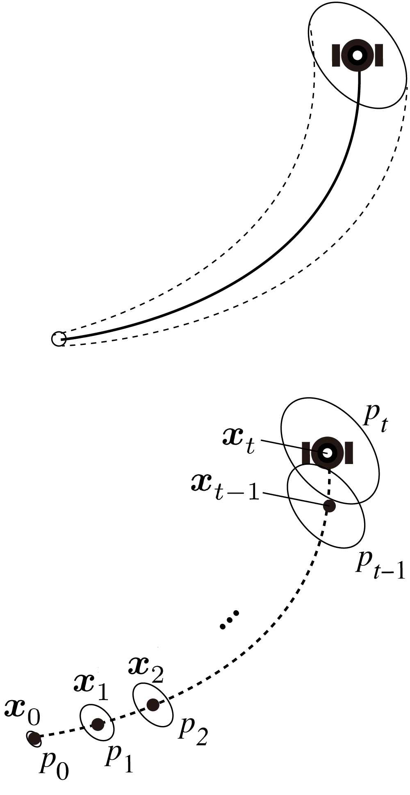
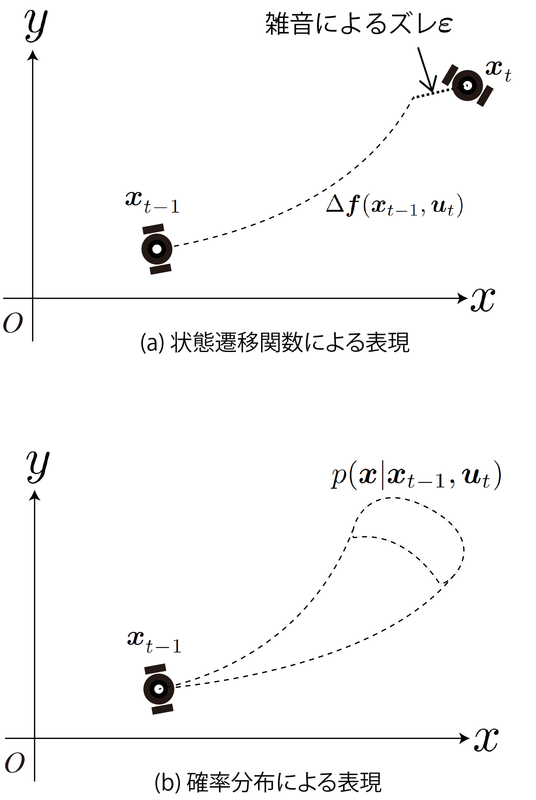
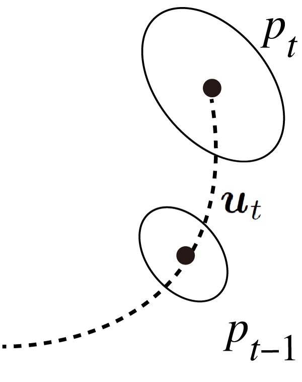
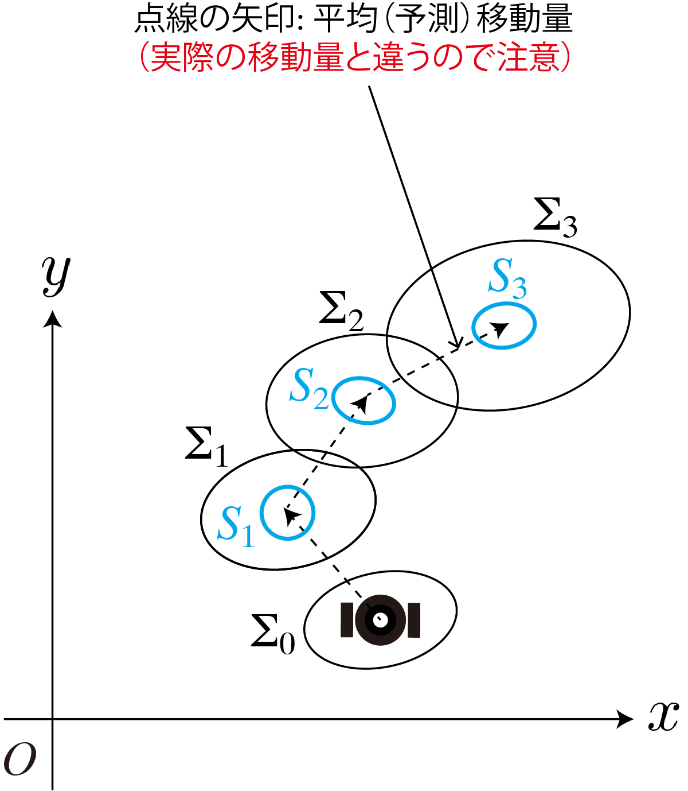

<!-- footer: Probabilistic Robotics Lecture 6 -->

# Probabilistic Robotics, Lesson 6: Motion of Probability Distribution (Part 1)

Ryuichi Ueda, Chiba Institute of Technology

 

This work is licensed under a <a rel="license" href="http://creativecommons.org/licenses/by-sa/4.0/">Creative Commons Attribution-ShareAlike 4.0 International License</a>.

---

<!-- paginate: true -->

## Contents

- Moving Objects and Probability
    - Consider something like a typhoon forecast circle
    - Robots, likewise, are in danger if their motion is unpredictable.

<a href="https://ja.wikipedia.org/wiki/%E3%83%95%E3%82%A1%E3%82%A4%E3%83%AB:2022%E5%B9%B4%E5%8F%B0%E9%A2%A814%E5%8F%B7%E3%81%AE%E4%BA%88%E5%A0%B1%E5%86%86_(%E6%B0%97%E8%B1%A1%E5%BA%81).jpg">画像: 気象庁 CC BY-SA 4.0</a>

---
## Moving Objects and Probability

- Review
    - In Chapter 4, we considered the probability distribution of the robot's position and orientation after it moves.
- What we'll consider this time
    - This probability distribution moves along with the robot.
        - When the robot moves, the center also moves.
        - Robot movements contain noise. $\rightarrow$ wide distribution of positions

$\Longrightarrow$How did it move? 

---

### Preparation 1: Introduction to Discrete-Time Systems

- Discretize time using the robot's "thinking cycle"
    - Because it is difficult to consider changes in pdfs over continuous time
    - An autonomous robot, not a human-operated robot
- "Thinking cycle" ($t=0,1,2,\dots$)
    - each cycle in which a movement decision is made and the motion is complated

---

- Representation of robot position (see diagram below)
    - $\boldsymbol{x}_0, \boldsymbol{x}_1, \boldsymbol{x}_2, \dots$
- Distribution of position and orientation (collectively referred to as "pose" or "state")
    - $p_0, p_1, p_2, \dots$ $\Longleftarrow$This is what we want to calculate
    - Note: "Pose" is a robotics term, and "state" is a control term.

---

### Preparation 2: Model of Robot Movement

- Assume that the robot changes the control commands sent to the motors at each discrete time.
    - The control command at time $t$ is expressed as $\boldsymbol{u}_{t+1}$ (note that the subscripts will shift).
        - Interpreted as "control commands up to time $t+1$."
- Specific examples of $\boldsymbol{u}_{t+1}$ will be provided later.

---

### Expressing the relationship between $\boldsymbol{x}$ and $\boldsymbol{u}$

- This lecture will use two different representations.
- 1: State equation
    - $\boldsymbol{x}_t = \boldsymbol{f}( \boldsymbol{x}_{t-1}, \boldsymbol{u}_t) + \boldsymbol{\varepsilon}$
        - $\boldsymbol{\varepsilon}$: error between expected and actual movement (noise)
        - $\boldsymbol{f}$: State transition function
- 2: Representation using a pdf
    - $\boldsymbol{x}_t \sim p( \boldsymbol{x} | \boldsymbol{x}_{t-1}, \boldsymbol{u}_t)$
         - $p( \boldsymbol{x} | \boldsymbol{x}_{t-1}, \boldsymbol{u}_t)$: State transition distribution

---

### Representing the relationship between $\boldsymbol{x}$ and $\boldsymbol{u}$ (continued)

- The former is sufficient when possible, but the latter is more abstract and has a wider range of application.
    - The former (modern control theory): $\boldsymbol{x}_t = \boldsymbol{f}( \boldsymbol{x}_{t-1}, \boldsymbol{u}_t) + \boldsymbol{\varepsilon}$
    - The latter (probabilistic robotics): $\boldsymbol{x}_t \sim p( \boldsymbol{x} | \boldsymbol{x}_{t-1}, \boldsymbol{u}_t)$
        - Advantages of the latter
            - Noise is acceptable
            - Pdfs after transitions are allowed to split
            - $\boldsymbol{\varepsilon}$ and $\boldsymbol{f}$ do not need to be independent
            - ...

---

- Instructor's personal opinion:
    - Probabilistic robotics is a generalization of modern control theory

---

### Markov property

- The distribution of state transitions is determined solely by the state (distribution) immediately before the transition
- Both of the two representations on the previous page assume Markov property
    - $\boldsymbol{x}_t = \boldsymbol{f}( \boldsymbol{x}_{t-1}, \boldsymbol{u}_t) + \boldsymbol{\varepsilon}$
    - $\boldsymbol{x}_t \sim p( \boldsymbol{x} | \boldsymbol{x}_{t-1}, \boldsymbol{u}_t)$
    - Neither expression method includes $\boldsymbol{x}_{t-2}$ or $\boldsymbol{u}_{t-1}$.
$\Longrightarrow$The next posture is determined solely by $\boldsymbol{x}_{t-1}$ and $\boldsymbol{u}_t$ (This is merely an assumption).

---

- Note: This does not necessarily hold true for robots.
    - A robot that has been in motion for a long time (that has undergone state transitions) will become less mobile due to heat.
    - The difference in behavior between a stationary robot and a robot that is already moving.
(When this cannot be ignored: incorporating variables representing temperature and conditions into the state)

---

### Distribution shape after state transition

- What is the relationship between $p_{t-1}$ and $p_{t}$?
    - Let's express it using the state transition distribution $p( \boldsymbol{x} | \boldsymbol{x}_{t-1}, \boldsymbol{u}_t)$.
    - It can be expressed using expected values.
* Answer: $p_t(\boldsymbol{x}) = p(\boldsymbol{x} | \boldsymbol{u}_{1:t}, p_0)$
$= \int_{X} p(\boldsymbol{x}, \boldsymbol{x}_{t-1} | \boldsymbol{u}_{1:t}, p_0)\text{d}\boldsymbol{x}_{t-1}$
$= \int_{X} p(\boldsymbol{x}| \boldsymbol{x}_{t-1} , \boldsymbol{u}_{1:t}, p_0) p(\boldsymbol{x}_{t-1} | \boldsymbol{u}_{1:t}, p_0) \text{d}\boldsymbol{x}_{t-1}$ 
$= \int_{X} p(\boldsymbol{x}| \boldsymbol{x}_{t-1} , \boldsymbol{u}_t) p(\boldsymbol{x}_{t-1} | \boldsymbol{u}_{1:t-1}, p_0) \text{d}\boldsymbol{x}_{t-1}$ 
$= \int_{X} p(\boldsymbol{x}| \boldsymbol{x}_{t-1} , \boldsymbol{u}_t) p_{t-1}(\boldsymbol{x}_{t-1}) \text{d}\boldsymbol{x}_{t-1}$
$= \big\langle p(\boldsymbol{x}| \boldsymbol{x}_{t-1} , \boldsymbol{u}_t) \big\rangle_{p_{t-1}(\boldsymbol{x}_{t-1}) }$

Implementing the above equation$\Rightarrow$We can predict the robot's motion (but how?)

---

## Position Prediction for a "Linear Robot"

(The term "linear" is explained in the "Nonlinear" section.)

- Consider a robot moving around the $xy$ plane without any orientation, as shown in the figure on the right.
- The distribution of displacement $p(\Delta \boldsymbol{x} | \boldsymbol{u})$ relative to $\boldsymbol{u}$ is known and is a Gaussian distribution.
- Let's derive $p_t$ from $p_{t-1}$.

---

### Definition of the Gaussian distribution needed for calculations

- Displacement distribution (figure above)
    - $p(\Delta \boldsymbol{x} | \boldsymbol{u}_t) = \mathcal{N}(\Delta\boldsymbol{x} | \overline{\Delta\boldsymbol{x}}_t, S_t)$
        - $\overline{\Delta\boldsymbol{x}}_t$: Average displacement by $\boldsymbol{u}_t$
        - $S_t$: Covariance matrix of position variance when moving by $\boldsymbol{u}_t$ from a certain point
(We won't use $\boldsymbol{u}_t$ from now on.)
- Distribution of position before movement (see figure below)
   - $p_{t-1} = \mathcal{N}(\boldsymbol{\mu}_{t-1}, \Sigma_{t-1})$

---

### This is the problem we're facing$\rightarrow$Solve

- Solve the distribution of $\boldsymbol{x}_t = \boldsymbol{x}_{t-1} + \Delta \boldsymbol{x}_t$.
    - $\boldsymbol{x}_{t-1} \sim \mathcal{N}(\boldsymbol{\mu}_{t-1}, \Sigma_{t-1})$
    - $\Delta \boldsymbol{x}_t \sim \mathcal{N}(\overline{\Delta\boldsymbol{x}}_t, S_t)$
    - $\boldsymbol{x}_{t-1}$ and $\Delta \boldsymbol{x}_t$ are independent.
- Answer
    * Use the reproducibility of the Gaussian distribution. $\Rightarrow$Simply add the mean and covariance matrices.
    - $\boldsymbol{x}_t \sim \mathcal{N}(\boldsymbol{\mu}_t, \Sigma_t)$
        - $\boldsymbol{\mu}_t = \boldsymbol{\mu}_{t-1} + \overline{\Delta\boldsymbol{x}}_t$
        - $\Sigma_t = \Sigma_{t-1} + S_t$

---

### More problems

- When $p_0 = \mathcal{N}(\boldsymbol{\mu}_0, \Sigma_0)$, what is $p_t$?
    - $p_0$: Distribution of the robot's position at $t=0$
- Answer
    * Simply add the mean movement and covariance matrix
        - $\boldsymbol{\mu}_t = \boldsymbol{\mu}_0 + \sum_{i=1}^t \overline{\Delta\boldsymbol{x}}_i$
        - $\Sigma_t = \Sigma_0 + \sum_{i=1}^t S_i$

---

### Summary of Position Prediction for a "Linear Robot"

- When Gaussian distribution is assumed, predicting the distribution becomes a simple addition
- However, this is not the case in reality 
    - To be continued
