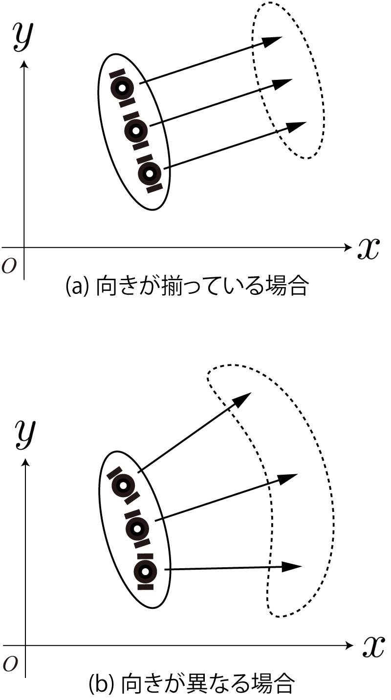
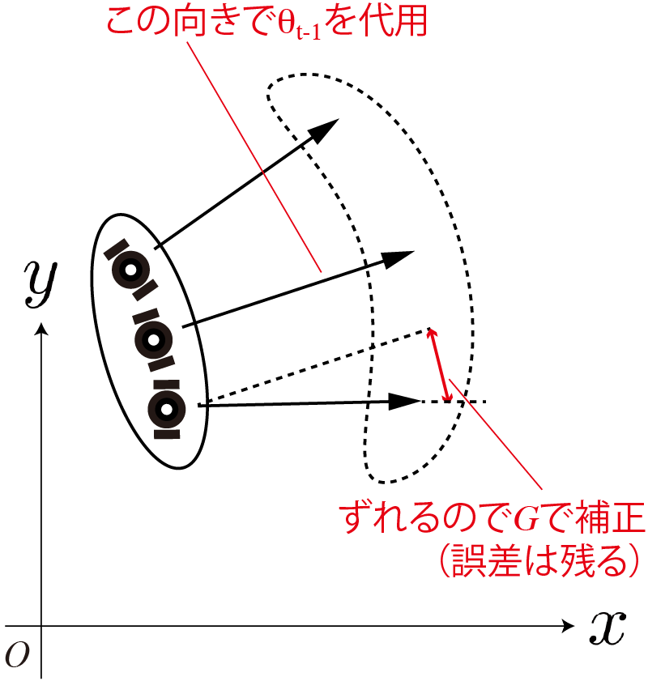

<!-- footer: 確率ロボティクス第6回 -->

# 確率ロボティクス第6回: 動く確率分布（その2）

千葉工業大学 上田 隆一

 

This work is licensed under a <a rel="license" href="http://creativecommons.org/licenses/by-sa/4.0/">Creative Commons Attribution-ShareAlike 4.0 International License</a>.

---

<!-- paginate: true -->

## 今回の内容

- 動く物体と確率
    - 「非線形なロボット」が移動するときの分布の推移、予測

<a href="https://ja.wikipedia.org/wiki/%E3%83%95%E3%82%A1%E3%82%A4%E3%83%AB:2022%E5%B9%B4%E5%8F%B0%E9%A2%A814%E5%8F%B7%E3%81%AE%E4%BA%88%E5%A0%B1%E5%86%86_(%E6%B0%97%E8%B1%A1%E5%BA%81).jpg">画像: 気象庁 CC BY-SA 4.0</a>

---

## 「非線形なロボット」の位置予測

- つまり普通のロボットの位置予測

---

### 「線形」と「非線形」

- 線形な状態方程式
    - $\boldsymbol{x}_t = A \boldsymbol{x}_{t-1} + B \boldsymbol{u}_t + \boldsymbol{\varepsilon}$ 
- ロボットには向きがあるので↑のようにならない（非線形に）
    - 例: 右の図のようなロボットの場合
    （制御指令は速度と角速度）
        - $\begin{pmatrix} x_t \\ y_t \\ \theta_t \end{pmatrix} = \begin{pmatrix} x_{t-1}  \\ y_{t-1} \\ \theta_{t-1} \end{pmatrix} + \nu_t\omega_t^{-1} \begin{pmatrix} \sin( \theta_{t-1} + \omega_t \Delta t ) - \sin\theta_{t-1} \\ -\cos( \theta_{t-1} + \omega_t \Delta t ) + \cos\theta_{t-1} \\ \omega_t \Delta t\end{pmatrix}$ 　
            - $\Delta t$: $t$と$t-1$の間の（離散でない連続の）時間

---

### 非線形な場合の難しさ

- 再生性がなくなる
    - ロボットが動くと予測の確率分布が非ガウス分布に
- 右図: 4章の実験を100回繰り返したもの
    - 向きが雑音でずれるほど$x$軸方向の進みが悪く
        $\Longrightarrow$バナナ型の分布に

とりあえずいけるところまで$p_t$を計算してみましょう

---

### ロボットの移動量の計算

- ロボット座標系$\Sigma_\text{robot}$での移動量$\Delta\boldsymbol{x}_t'$を制御指令とみなして状態方程式をたてましょう
    - $\Delta\boldsymbol{x}_t' = (\Delta x_t' \ \  \Delta y_t' \ \  \Delta \theta_t')^\top$
    - $\Sigma_\text{robot}$は移動前の姿勢が基準
- 方針
    - 世界座標系$\Sigma_\text{world}$での移動量$\Delta \boldsymbol{x}_t$を考える
        - $\Delta \boldsymbol{x}_t = (\Delta x_t \ \  \Delta y_t \ \  \Delta \theta_t)^\top$
    - $\Delta\boldsymbol{x}_t'$と$\Delta\boldsymbol{x}_t$の関係の式$\boldsymbol{x}_t = \boldsymbol{f}(\Delta \boldsymbol{x}'_t)$をたてる
    - $\boldsymbol{x}_t =\Delta \boldsymbol{x}_t + \boldsymbol{x}_{t-1}= \boldsymbol{f}(\Delta \boldsymbol{x}'_t) + \boldsymbol{x}_{t-1}$
    を状態方程式とする

答えは次のページ

---

### ロボットの移動量の計算（答え）

- $x, y$座標の関係は回転行列で表現できる
    - $\begin{pmatrix} \Delta x_t \\ \Delta y_t \end{pmatrix} = R(\theta_{t-1}) \begin{pmatrix} \Delta x'_t \\ \Delta y'_t \end{pmatrix}$
- $\theta$の変化量は両座標系で同じ $\Rightarrow \Delta \theta_t = \Delta \theta_t'$
- まとめると
	- $\Delta \boldsymbol{x}_t = T(\boldsymbol{x}_{t-1}) \Delta \boldsymbol{x}_t'$
        - ここで$T(\boldsymbol{x}_{t-1}) = 
	\begin{pmatrix}
		\cos \theta_{t-1} & -\sin \theta_{t-1} & 0 \\
		\sin \theta_{t-1} & \cos \theta_{t-1} & 0 \\
		0 & 0 & 1
	\end{pmatrix}$
    （同次変換行列）
- 状態方程式: $\boldsymbol{x}_t = T(\boldsymbol{x}_{t-1}) \Delta \boldsymbol{x}_t' + \boldsymbol{x}_{t-1}$

---

### 非線形性の確認と対策
	
- 状態方程式: $\boldsymbol{x}_t = T(\boldsymbol{x}_{t-1}) \Delta \boldsymbol{x}_t' + \boldsymbol{x}_{t-1}$
- 線形な式$\boldsymbol{x}_t = A \Delta \boldsymbol{x}_t' + B \boldsymbol{x}_{t-1}$にはならない
   - $A$のなかに$\boldsymbol{x}_t$中の$\theta_t$が紛れ込む
- $p_{t-1}(\boldsymbol{x})$（ガウス分布と想定）から$p_t(\boldsymbol{x})$を求めるときに、$p_{t-1}$の分布内の$\boldsymbol{x}$の移動が1方向に揃わないので$p_t$が歪んでガウス分布にならない
- どうやって$p_t$を求めるか？
   - 再生性を使わない（あとで）
   - 線形近似する

---

### 線形近似
	
- $\Delta \boldsymbol{x}_t = T(\boldsymbol{x}_{t-1}) \Delta \boldsymbol{x}_t'\simeq T(\boldsymbol{\mu}_{t-1}) \Delta \boldsymbol{x}_t' + G (\boldsymbol{x}_{t-1} - \boldsymbol{\mu}_{t-1})$
    と近似
    - $T(\boldsymbol{x}_{t-1})$を$T(\boldsymbol{\mu}_{t-1})$で代用
        - $\boldsymbol{\mu}_{t-1}$: $p_{t-1}$の分布の中心位置
        - $T(\boldsymbol{x}_{t-1}) = 
	\begin{pmatrix}
		R(\theta_{t-1})& \boldsymbol{0} \\
		\boldsymbol{0} & 1
	\end{pmatrix}$
        なので、$\theta_{t-1}$を$\boldsymbol{\mu}_{t-1}$の$\theta$成分で代用
    - $G (\boldsymbol{x}_{t-1} - \boldsymbol{\mu}_{t-1})$: 近似によるズレの補正
        - 中心から離れるほど大きく補正が必要に

$G$をどう求めるか？

---

### $G$の算出

- 再掲: $\Delta \boldsymbol{x}_t \simeq T(\boldsymbol{\mu}_{t-1}) \Delta \boldsymbol{x}_t' + G (\boldsymbol{x}_{t-1} - \boldsymbol{\mu}_{t-1})$
- $G$とはなにか？
    - $\boldsymbol{x}_{t-1}$が$\boldsymbol{\mu}_{t-1}$からズレたときの$\Delta \boldsymbol{x}_t$のズレの割合
    $\Longrightarrow$ヤコビ行列
	- $G = \dfrac{\partial \{ T(\boldsymbol{x}_{t-1})\Delta \boldsymbol{x}_t' - T(\boldsymbol{\mu}_{t-1})\Delta \boldsymbol{x}_t' \}}{\partial \boldsymbol{x}_{t-1}}{\huge{|}}_{\boldsymbol{x}_{t-1} = \boldsymbol{\mu}_{t-1}}
	= \dfrac{\partial T(\boldsymbol{x}_{t-1})\Delta \boldsymbol{x}_t' }{\partial \boldsymbol{x}_{t-1}}{\huge{|}}_{\boldsymbol{x}_{t-1} = \boldsymbol{\mu}_{t-1}}$
	    - 分母がズレに相当
- $\boldsymbol{g} = T(\boldsymbol{x}_{t-1}) \Delta \boldsymbol{x}_t'$とおきましょう
    - $\boldsymbol{g} = \begin{pmatrix}
		\Delta x_t' \cos \theta_{t-1}  - \Delta y_t' \sin \theta_{t-1}  \\
		\Delta x_t'\sin \theta_{t-1} + \Delta y_t' \cos \theta_{t-1}  \\
		\Delta \theta_t'
	\end{pmatrix}$
	

---

### $G$の算出（続き）

- $G= \left.
	\dfrac{\partial \boldsymbol{g} }{\partial \boldsymbol{x}_{t-1}} \right|_{\boldsymbol{x}_{t-1} = \boldsymbol{\mu}_{t-1}} = 
	\left.
	\begin{pmatrix}
		\frac{\partial g_x}{\partial x_{t-1}} & 
		\frac{\partial g_x}{\partial y_{t-1}} &
		\frac{\partial g_x}{\partial \theta_{t-1}} \\
		\frac{\partial g_y}{\partial x_{t-1}} & 
		\frac{\partial g_y}{\partial y_{t-1}} &
		\frac{\partial g_y}{\partial \theta_{t-1}} \\
		\frac{\partial g_\theta}{\partial x_{t-1}} & 
		\frac{\partial g_\theta}{\partial y_{t-1}} &
		\frac{\partial g_\theta}{\partial \theta_{t-1}} \\
\end{pmatrix} \right|_{\boldsymbol{x}_{t-1} = \boldsymbol{\mu}_{t-1}}$
$= \left.  \begin{pmatrix} 0 & 0 & - \Delta x_t' \sin \theta_{t-1} - \Delta y_t' \cos \theta_{t-1} \\ 0 & 0 & \Delta x_t' \cos \theta_{t-1} - \Delta y_t' \sin \theta_{t-1} \\ 0 & 0 &  0 \end{pmatrix} \right|_{\boldsymbol{x}_{t-1} = \boldsymbol{\mu}_{t-1}}$
	$= \begin{pmatrix}
		0 & 0 & - \Delta x_t' \sin \bar\theta_{t-1} - \Delta y_t' \cos \bar\theta_{t-1} \\
		0 & 0 & \Delta x_t' \cos \bar\theta_{t-1} - \Delta y_t' \sin \bar\theta_{t-1} \\
		0 & 0 &  0
	\end{pmatrix}$
    - $\bar\theta_{t-1}$は$\boldsymbol{\mu}_{t-1}$の$\theta$成分

---

### 近似式

- 状態方程式$\boldsymbol{x}_t = \Delta \boldsymbol{x}_t + \boldsymbol{x}_{t-1}$に
$\Delta \boldsymbol{x}_t = \simeq T(\boldsymbol{\mu}_{t-1}) \Delta \boldsymbol{x}_t' + G (\boldsymbol{x}_{t-1} - \boldsymbol{\mu}_{t-1})$を代入
- $\boldsymbol{x}_t = T(\boldsymbol{\mu}_{t-1}) \Delta \boldsymbol{x}_t' + G (\boldsymbol{x}_{t-1} - \boldsymbol{\mu}_{t-1}) + \boldsymbol{x}_{t-1}$
	$= \left\{\boldsymbol{\mu}_{t-1} + F_{t-1}( \boldsymbol{x}_{t-1} - \boldsymbol{\mu}_{t-1}) \right\} + T_{t-1} \Delta \boldsymbol{x}_t'$
    - ここで
       - $F_{t-1} = I + G = \begin{pmatrix}
		1 & 0 & - \Delta x_t' \sin \bar\theta_{t-1} - \Delta y_t' \cos \bar\theta_{t-1} \\
		0 & 1 & \Delta x_t' \cos \bar\theta_{t-1} - \Delta y_t' \sin \bar\theta_{t-1} \\
		0 & 0 &  1
	\end{pmatrix}$
       - $T_{t-1} = T(\boldsymbol{\mu}_{t-1})$（単なる略記）

---

### 線形化された式からの分布の移動の計算

- 移動前の分布と移動による雑音の分布
	- $\boldsymbol{x}_{t-1} \sim \mathcal{N}(\boldsymbol{\mu}_{t-1}, \Sigma_{t-1})$
	- $\Delta\boldsymbol{x}_t' \sim \mathcal{N}(\overline{\Delta\boldsymbol{x}'_{t}}, S_t)$
- $\boldsymbol{x}_t = \left\{ \boldsymbol{\mu}_{t-1} + F_{t-1}( \boldsymbol{x}_{t-1} - \boldsymbol{\mu}_{t-1})  \right\} + T_{t-1} \Delta \boldsymbol{x}_t'$
（前ページ求めた近似式）を次のように分解
    - $\boldsymbol{x}_t = \boldsymbol{a} + \boldsymbol{b}$
         - $\boldsymbol{a} = \boldsymbol{\mu}_{t-1} + F_{t-1}( \boldsymbol{x}_{t-1} - \boldsymbol{\mu}_{t-1})$
         - $\boldsymbol{b} = T_{t-1} \Delta \boldsymbol{x}_t'$
    - $\boldsymbol{a}$、$\boldsymbol{b}$それぞれの分布を考え、あとで$\boldsymbol{a}+\boldsymbol{b}$の分布を考える（意味は後で）

---

### $\boldsymbol{a}$、$\boldsymbol{b}$の分布

- いずれも線形変換の式$p(\boldsymbol{y}) = \mathcal{N}(\boldsymbol{y} | A\boldsymbol{\mu} + \boldsymbol{b}, A\Sigma A^\top)$を使って変換
- $\boldsymbol{a}$の分布
    - $\boldsymbol{a} = \boldsymbol{\mu}_{t-1} + F_{t-1}( \boldsymbol{x}_{t-1} - \boldsymbol{\mu}_{t-1}) = F_{t-1} \boldsymbol{x}_{t-1} + \boldsymbol{\mu}_{t-1} - F_{t-1}\boldsymbol{\mu}_{t-1}$
は$\boldsymbol{x}_{t-1} \sim \mathcal{N}(\boldsymbol{\mu}_{t-1}, \Sigma_{t-1})$の線形変換
$\Longrightarrow \boldsymbol{a} \sim \mathcal{N}(A\boldsymbol{\mu} + \boldsymbol{b}, A\Sigma A^\top)$
$= \mathcal{N}(F_{t-1}\bar{\boldsymbol{x}}_{t-1} + \boldsymbol{\mu}_{t-1} -F_{t-1}\boldsymbol{\mu}_{t-1}, F_{t-1}\Sigma_{t-1} F_{t-1}^\top)$
$= \mathcal{N}(\boldsymbol{\mu}_{t-1}, F_{t-1}\Sigma_{t-1} F_{t-1}^\top)$
- $\boldsymbol{b}$の分布
    - $\boldsymbol{b} = T_{t-1} \Delta \boldsymbol{x}_t'$は$\Delta\boldsymbol{x}_t' \sim \mathcal{N}(\overline{\Delta\boldsymbol{x}'_{t}}, S_t)$の線形変換
$\Longrightarrow \boldsymbol{b} \sim \mathcal{N}(T_{t-1}\overline{\Delta\boldsymbol{x}'_{t}}, T_{t-1}S_{t-1} T_{t-1}^\top)=\mathcal{N}(\overline{\Delta\boldsymbol{x}_{t}}, T_{t-1}S_{t-1} T_{t-1}^\top)$

---

### $\boldsymbol{x}_t = \boldsymbol{a}+\boldsymbol{b}$の分布

- ガウス分布にしたがう2変数の和の分布はガウス分布
- $\boldsymbol{x}_t \sim \mathcal{N}(\boldsymbol{\mu}_t, \Sigma_t)$
	- $\boldsymbol{\mu}_t = \boldsymbol{\mu}_{t-1} + \overline{\Delta \boldsymbol{x}}_t$
    - $\Sigma_t =  F_{t-1} \Sigma_{t-1} F_{t-1}^\top + T_{t-1} S_t T_{t-1}^\top$
- 共分散行列の意味
    - $\boldsymbol{a}$のばらつき（上図）: 非線形性（u$\theta$の向きが分布内の姿勢で違うこと）による誤差の拡大
    - $\boldsymbol{b}$のばらつき（下図）: 動き自体の雑音

---

### 「非線形なロボット」の位置予測のまとめ

- 線形近似すればガウス分布で分布の移動・変形を計算できる
    - ただし近似

---

## ガウス分布を使わない方法

