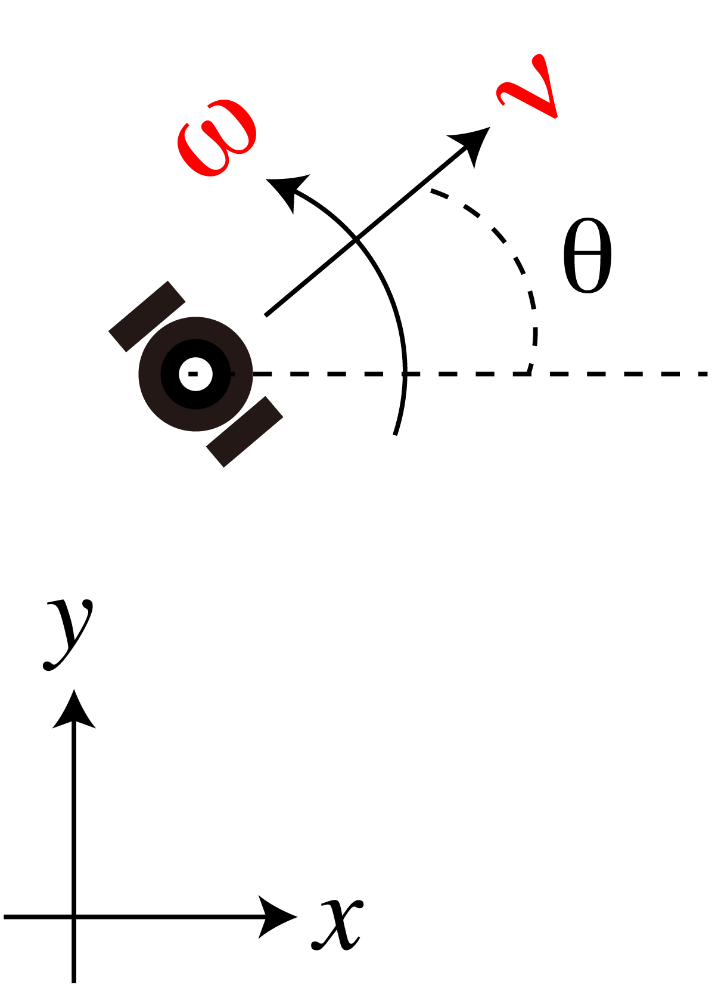

<!-- footer: Probabilistic Robotics Lecture 6 -->

# Probabilistic Robotics, Lecture 6: Motion of Probability Distribution (Part 2)

Ryuichi Ueda, Chiba Institute of Technology

 

This work is licensed under a <a rel="license" href="http://creativecommons.org/licenses/by-sa/4.0/">Creative Commons Attribution-ShareAlike 4.0 International License</a>.

---

<!-- paginate: true -->

## Contents

- Moving objects and probability
    - Distribution transitions and predictions when a "nonlinear robot" moves

<a href="https://ja.wikipedia.org/wiki/%E3%83%95%E3%82%A1%E3%82%A4%E3%83%AB:2022%E5%B9%B4%E5%8F%B0%E9%A2%A814%E5%8F%B7%E3%81%AE%E4%BA%88%E5%A0%B1%E5%86%86_(%E6%B0%97%E8%B1%A1%E5%BA%81).jpg">画像: 気象庁 CC BY-SA 4.0</a>

---

## Position Prediction for "Nonlinear Robots"

- In other words, position prediction for ordinary robots

---

### "Linear" and "Nonlinear"

- Linear state equation
   - $\boldsymbol{x}_t = A \boldsymbol{x}_{t-1} + B \boldsymbol{u}_t + \boldsymbol{\varepsilon}$
- The robot has a direction, so it doesn't look like the one above (nonlinear).
    - Example: for the robot shown on the right (Control commands are velocity and angular velocity)
        - $\begin{pmatrix} x_t \\ y_t \\ \theta_t \end{pmatrix} = \begin{pmatrix} x_{t-1} \\ y_{t-1} \\ \theta_{t-1} \end{pmatrix} + \nu_t\omega_t^{-1} \begin{pmatrix} \sin( \theta_{t-1} + \omega_t \Delta t ) - \sin\theta_{t-1} \\ -\cos( \theta_{t-1} + \omega_t \Delta t ) + \cos\theta_{t-1} \\ \omega_t \Delta t\end{pmatrix}$ 
            - $\Delta t$: The (continuous, not discrete) time between $t$ and $t-1$

---

### Difficulties in nonlinear cases

- Reproducibility disappears
    - As the robot moves, the pdf becomes non-Gaussian.
- Right: The experiment in Chapter 4 repeated 100 times.
    - The more the orientation shifts due to noise, the slower the progress along the $x$ axis becomes.
$\Longrightarrow$ Banana-shaped distribution

Let's calculate $p_t$ as far as possible.

---

### Calculating robot movement

- Consider the movement $\Delta \boldsymbol{x}_t'$ in the robot coordinate system $\Sigma_\text{robot}$ as the control command and set up the state equation.
    - $\Delta \boldsymbol{x}_t' = (\Delta x_t' \ \ \Delta y_t' \ \ \Delta \theta_t')^\top$
    - $\Sigma_\text{robot}$ is based on the pose before movement.
- Policy
     - Consider the movement $\Delta \boldsymbol{x}_t$ in the world coordinate system $\Sigma_\text{world}$.
- $\Delta \boldsymbol{x}_t = (\Delta x_t \ \ \Delta y_t \ \ \Delta \theta_t)^\top$
- Derive the equation $\boldsymbol{x}_t = \boldsymbol{f}(\Delta \boldsymbol{x}'_t)$, which relates $\Delta\boldsymbol{x}_t'$ and $\Delta\boldsymbol{x}_t$.
- $\boldsymbol{x}_t =\Delta \boldsymbol{x}_t + \boldsymbol{x}_{t-1}= \boldsymbol{f}(\Delta \boldsymbol{x}'_t) + \boldsymbol{x}_{t-1}$
As the equation of state.

The answer is on the next page.

---

### Calculating the Robot's Movement (Answer)

- The relationship between the $x$ and $y$ coordinates can be expressed using a rotation matrix.
- $\begin{pmatrix} \Delta x_t \\ \Delta y_t \end{pmatrix} = R(\theta_{t-1}) \begin{pmatrix} \Delta x'_t \\ \Delta y'_t \end{pmatrix}$
- The change in $\theta$ is the same in both coordinate systems. $\Rightarrow \Delta \theta_t = \Delta \theta_t'$
- In summary
- $\Delta \boldsymbol{x}_t = T(\boldsymbol{x}_{t-1}) \Delta \boldsymbol{x}_t'$
- Here, $T(\boldsymbol{x}_{t-1}) =
\begin{pmatrix}
\cos \theta_{t-1} & -\sin \theta_{t-1} & 0 \\
\sin \theta_{t-1} & \cos \theta_{t-1} & 0 \\
0 & 0 & 1
\end{pmatrix}$
(Homogeneous transformation matrix)
- State equation: $\boldsymbol{x}_t = T(\boldsymbol{x}_{t-1}) \Delta \boldsymbol{x}_t' + \boldsymbol{x}_{t-1}$

---

### Checking for nonlinearity and countermeasures

- State equation: $\boldsymbol{x}_t = T(\boldsymbol{x}_{t-1}) \Delta \boldsymbol{x}_t' + \boldsymbol{x}_{t-1}$
- It does not become a linear equation, $\boldsymbol{x}_t = A \Delta \boldsymbol{x}_t' + B \boldsymbol{x}_{t-1}$.
- $\theta_t$ in $\boldsymbol{x}_t$ is mixed into $A$.
- When calculating $p_t(\boldsymbol{x})$ from $p_{t-1}(\boldsymbol{x})$ (assumed to be Gaussian), the movement of $\boldsymbol{x}$ within the distribution of $p_{t-1}$ is not aligned in one direction, so $p_t$ is distorted and not a Gaussian distribution.
- How do we calculate $p_t$? - Do not use reproducibility (later)
- Linear approximation

---

### Linear approximation

- Approximate $\Delta \boldsymbol{x}_t = T(\boldsymbol{x}_{t-1}) \Delta \boldsymbol{x}_t'\simeq T(\boldsymbol{\mu}_{t-1}) \Delta \boldsymbol{x}_t' + G (\boldsymbol{x}_{t-1} - \boldsymbol{\mu}_{t-1})$

- Substitute $T(\boldsymbol{x}_{t-1})$ for $T(\boldsymbol{\mu}_{t-1})$
- $\boldsymbol{\mu}_{t-1}$: The center of the distribution of $p_{t-1}$
- $T(\boldsymbol{x}_{t-1}) =
\begin{pmatrix}
R(\theta_{t-1})& \boldsymbol{0} \\
\boldsymbol{0} & 1
\end{pmatrix}$
Therefore, $\theta_{t-1}$ is substituted with the $\theta$ component of $\boldsymbol{\mu}_{t-1}$.
- $G (\boldsymbol{x}_{t-1} - \boldsymbol{\mu}_{t-1})$: Correction of deviation due to approximation
- The further away from the center, the greater the correction required.

How do we calculate $G$? 

---

### Calculating $G$

- Reprint: $\Delta \boldsymbol{x}_t \simeq T(\boldsymbol{\mu}_{t-1}) \Delta \boldsymbol{x}_t' + G (\boldsymbol{x}_{t-1} - \boldsymbol{\mu}_{t-1})$
- What is $G$?
- The percentage of deviation of $\Delta \boldsymbol{x}_t$ when $\boldsymbol{x}_{t-1}$ deviates from $\boldsymbol{\mu}_{t-1}$.
<span style="color:red"
