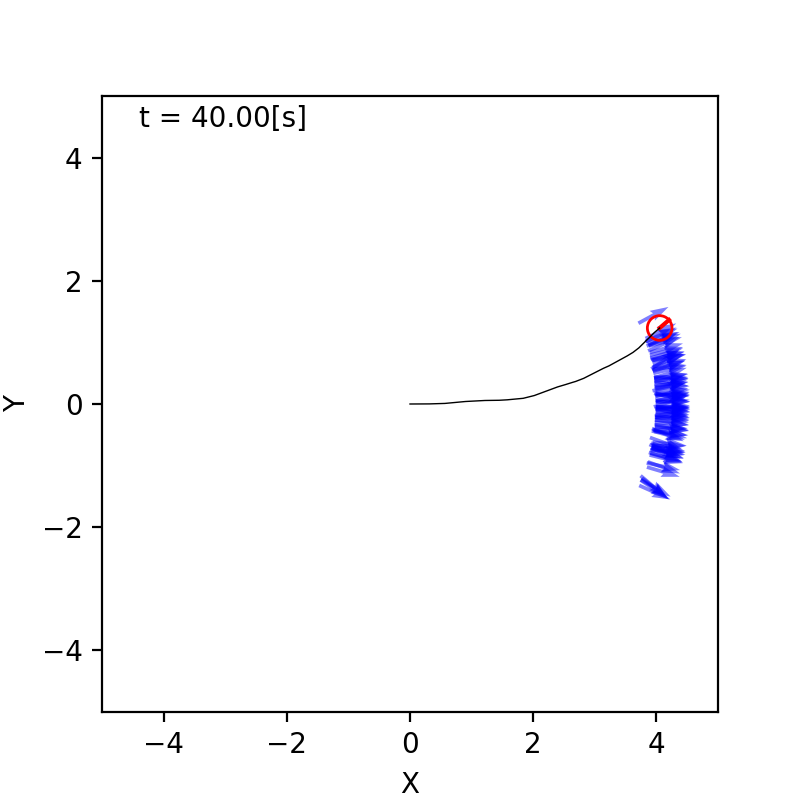
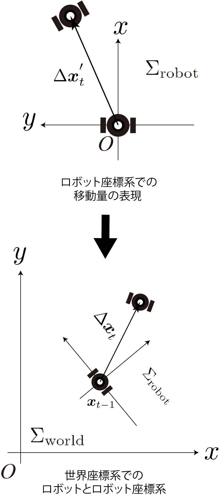

<!-- footer: Probabilistic Robotics Lecture 6 -->

# Probabilistic Robotics, Lecture 6: Motion of Probability Distribution (Part 2)

Ryuichi Ueda, Chiba Institute of Technology

 

This work is licensed under a <a rel="license" href="http://creativecommons.org/licenses/by-sa/4.0/">Creative Commons Attribution-ShareAlike 4.0 International License</a>.

---

<!-- paginate: true -->

## Contents

- Moving objects and probability
    - Distribution transitions and predictions when a "nonlinear robot" moves

<a href="https://ja.wikipedia.org/wiki/%E3%83%95%E3%82%A1%E3%82%A4%E3%83%AB:2022%E5%B9%B4%E5%8F%B0%E9%A2%A814%E5%8F%B7%E3%81%AE%E4%BA%88%E5%A0%B1%E5%86%86_(%E6%B0%97%E8%B1%A1%E5%BA%81).jpg">画像: 気象庁 CC BY-SA 4.0</a>

---

## Position Prediction for "Nonlinear Robots"

- In other words, position prediction for ordinary robots

---

### "Linear" and "Nonlinear"

- Linear state equation
   - $\boldsymbol{x}_t = A \boldsymbol{x}_{t-1} + B \boldsymbol{u}_t + \boldsymbol{\varepsilon}$
- The robot has a direction, so it doesn't look like the one above (nonlinear).
    - Example: for the robot shown on the right (Control commands are velocity and angular velocity)
        - $\begin{pmatrix} x_t \\ y_t \\ \theta_t \end{pmatrix} = \begin{pmatrix} x_{t-1} \\ y_{t-1} \\ \theta_{t-1} \end{pmatrix} + \nu_t\omega_t^{-1} \begin{pmatrix} \sin( \theta_{t-1} + \omega_t \Delta t ) - \sin\theta_{t-1} \\ -\cos( \theta_{t-1} + \omega_t \Delta t ) + \cos\theta_{t-1} \\ \omega_t \Delta t\end{pmatrix}$ 
            - $\Delta t$: The (continuous, not discrete) time between $t$ and $t-1$

---

### Difficulties in nonlinear cases

- Reproducibility disappears
    - As the robot moves, the pdf becomes non-Gaussian.
- Right: The experiment in Chapter 4 repeated 100 times.
    - The more the orientation shifts due to noise, the slower the progress along the $x$ axis becomes.
$\Longrightarrow$ Banana-shaped distribution

Let's calculate $p_t$ as far as possible.

---

### Calculating robot movement

- Consider the movement $\Delta \boldsymbol{x}_t'$ in the robot coordinate system $\Sigma_\text{robot}$ as the control command and set up the state equation.
    - $\Delta \boldsymbol{x}_t' = (\Delta x_t' \ \ \Delta y_t' \ \ \Delta \theta_t')^\top$
    - $\Sigma_\text{robot}$ is based on the pose before movement.
- How to solve
    - Consider the movement $\Delta \boldsymbol{x}_t$ in the world coordinate system $\Sigma_\text{world}$.
        - $\Delta \boldsymbol{x}_t = (\Delta x_t \ \ \Delta y_t \ \ \Delta \theta_t)^\top$
    - Derive the equation $\boldsymbol{x}_t = \boldsymbol{f}(\Delta \boldsymbol{x}'_t)$, which relates $\Delta\boldsymbol{x}_t'$ and $\Delta\boldsymbol{x}_t$.
    - State equation: $\boldsymbol{x}_t =\Delta \boldsymbol{x}_t + \boldsymbol{x}_{t-1}= \boldsymbol{f}(\Delta \boldsymbol{x}'_t) + \boldsymbol{x}_{t-1}$

The answer is on the next page.

---

### Calculation of Robot's Movement (Answer)

- The relationship between the $x$ and $y$ coordinates can be expressed using a rotation matrix.
    - $\begin{pmatrix} \Delta x_t \\ \Delta y_t \end{pmatrix} = R(\theta_{t-1}) \begin{pmatrix} \Delta x'_t \\ \Delta y'_t \end{pmatrix}$
- The change in $\theta$ is the same in both coordinate systems. $\Rightarrow \Delta \theta_t = \Delta \theta_t'$
- Answer:
    - $\Delta \boldsymbol{x}_t = T(\boldsymbol{x}_{t-1}) \Delta \boldsymbol{x}_t'$
        - Here, $T(\boldsymbol{x}_{t-1}) =
\begin{pmatrix}
\cos \theta_{t-1} & -\sin \theta_{t-1} & 0 \\
\sin \theta_{t-1} & \cos \theta_{t-1} & 0 \\
0 & 0 & 1
\end{pmatrix}$
(Homogeneous transformation matrix)
- State equation: $\boldsymbol{x}_t = T(\boldsymbol{x}_{t-1}) \Delta \boldsymbol{x}_t' + \boldsymbol{x}_{t-1}$

---

### Nonlinearity and countermeasures

- State equation: $\boldsymbol{x}_t = T(\boldsymbol{x}_{t-1}) \Delta \boldsymbol{x}_t' + \boldsymbol{x}_{t-1}$
- It does not become a linear equation, $\boldsymbol{x}_t = A \Delta \boldsymbol{x}_t' + B \boldsymbol{x}_{t-1}$.
    - $\theta_t$ in $\boldsymbol{x}_t$ is mixed into $A$.
- When calculating $p_t(\boldsymbol{x})$ from $p_{t-1}(\boldsymbol{x})$ (assumed to be Gaussian), the movement of $\boldsymbol{x}$ within the distribution of $p_{t-1}$ is not aligned in one direction, so $p_t$ is distorted and not a Gaussian distribution.
    - How do we calculate $p_t$? - Do not use reproducibility (later)
    - Linear approximation

---

### Linear approximation

- Approximate as $\Delta \boldsymbol{x}_t = T(\boldsymbol{x}_{t-1}) \Delta \boldsymbol{x}_t'\simeq T(\boldsymbol{\mu}_{t-1}) \Delta \boldsymbol{x}_t' + G (\boldsymbol{x}_{t-1} - \boldsymbol{\mu}_{t-1})$
    - Substitute $T(\boldsymbol{x}_{t-1})$ for $T(\boldsymbol{\mu}_{t-1})$
        - $\boldsymbol{\mu}_{t-1}$: The center of the distribution of $p_{t-1}$
        - $T(\boldsymbol{x}_{t-1}) =
\begin{pmatrix}
R(\theta_{t-1})& \boldsymbol{0} \\
\boldsymbol{0} & 1
\end{pmatrix}$
Therefore, $\theta_{t-1}$ is substituted with the $\theta$ component of $\boldsymbol{\mu}_{t-1}$.
    - $G (\boldsymbol{x}_{t-1} - \boldsymbol{\mu}_{t-1})$: Correction of deviation due to approximation
        - The further away from the center, the greater the correction required.

How do we calculate $G$? 

---

### Calculating $G$

- $\Delta \boldsymbol{x}_t \simeq T(\boldsymbol{\mu}_{t-1}) \Delta \boldsymbol{x}_t' + G (\boldsymbol{x}_{t-1} - \boldsymbol{\mu}_{t-1})$
- What is $G$?
    - The deviation of $\Delta \boldsymbol{x}_t$ when $\boldsymbol{x}_{t-1}$ deviates from $\boldsymbol{\mu}_{t-1}$.
$\Longrightarrow$Jacobian matrix
    - $G = \dfrac{\partial \{ T(\boldsymbol{x}_{t-1})\Delta \boldsymbol{x}_t' - T(\boldsymbol{\mu}_{t-1})\Delta \boldsymbol{x}_t' \}}{\partial \boldsymbol{x}_{t-1}}{\huge{|}}_{\boldsymbol{x}_{t-1} = \boldsymbol{\mu}_{t-1}}
= \dfrac{\partial T(\boldsymbol{x}_{t-1})\Delta \boldsymbol{x}_t' }{\partial \boldsymbol{x}_{t-1}}{\huge{|}}_{\boldsymbol{x}_{t-1} = \boldsymbol{\mu}_{t-1}}$
        - The denominator corresponds to the deviation.
- Let's say $\boldsymbol{g} = T(\boldsymbol{x}_{t-1}) \Delta \boldsymbol{x}_t'$
   - $\boldsymbol{g} = \begin{pmatrix}
\Delta x_t' \cos \theta_{t-1} - \Delta y_t' \sin \theta_{t-1} \\
\Delta x_t'\sin \theta_{t-1} + \Delta y_t' \cos \theta_{t-1} \\ 
\Delta \theta_t' 
\end{pmatrix}$

---

### Calculation of $G$ (continued)

- $G= \left. 
\dfrac{\partial \boldsymbol{g} }{\partial \boldsymbol{x}_{t-1}} \right|_{\boldsymbol{x}_{t-1} = \boldsymbol{\mu}_{t-1}} = 
\left. 
\begin{pmatrix} 
\frac{\partial g_x}{\partial x_{t-1}} & 
\frac{\partial g_x}{\partial y_{t-1}} & 
\frac{\partial g_x}{\partial \theta_{t-1}} \\ 
\frac{\partial g_y}{\partial x_{t-1}} & 
\frac{\partial g_y}{\partial y_{t-1}} & 
\frac{\partial g_y}{\partial \theta_{t-1}} \\ 
\frac{\partial g_\theta}{\partial x_{t-1}} & 
\frac{\partial g_\theta}{\partial y_{t-1}} & 
\frac{\partial g_\theta}{\partial \theta_{t-1}} \\
\end{pmatrix} \right|_{\boldsymbol{x}_{t-1} = \boldsymbol{\mu}_{t-1}}$
$= \left. \begin{pmatrix} 0 & 0 & - \Delta x_t' \sin \theta_{t-1} - \Delta y_t' \cos \theta_{t-1} \\ 0 & 0 & \Delta x_t' \cos \theta_{t-1} - \Delta y_t' \sin \theta_{t-1} \\ 0 & 0 & 0 \end{pmatrix} \right|_{\boldsymbol{x}_{t-1} = \boldsymbol{\mu}_{t-1}}$ 
$= \begin{pmatrix} 
0 & 0 & - \Delta x_t' \sin \bar\theta_{t-1} - \Delta y_t' \cos \bar\theta_{t-1} \\ 
0 & 0 & \Delta x_t' \cos \bar\theta_{t-1} - \Delta y_t' \sin \bar\theta_{t-1} \\
0 & 0 & 0
\end{pmatrix}$
    - $\bar\theta_{t-1}$ is the $\theta$ component of $\boldsymbol{\mu}_{t-1}$

---

### Approximate equation

- Substitute $\Delta \boldsymbol{x}_t = \simeq T(\boldsymbol{\mu}_{t-1}) \Delta \boldsymbol{x}_t' + G (\boldsymbol{x}_{t-1} - \boldsymbol{\mu}_{t-1})$ into the equation of state $\boldsymbol{x}_t = \Delta \boldsymbol{x}_t + \boldsymbol{x}_{t-1}$
- $\boldsymbol{x}_t = T(\boldsymbol{\mu}_{t-1}) \Delta \boldsymbol{x}_t' + G (\boldsymbol{x}_{t-1} - \boldsymbol{\mu}_{t-1}) + \boldsymbol{x}_{t-1}$ 
$= \left\{\boldsymbol{\mu}_{t-1} + F_{t-1}( \boldsymbol{x}_{t-1} - \boldsymbol{\mu}_{t-1}) \right\} + T_{t-1} \Delta \boldsymbol{x}_t'$ 
    - here 
        - $F_{t-1} = I + G = \begin{pmatrix} 
1 & 0 & - \Delta x_t' \sin \bar\theta_{t-1} - \Delta y_t' \cos \bar\theta_{t-1} \\
0 & 1 & \Delta x_t' \cos \bar\theta_{t-1} - \Delta y_t' \sin \bar\theta_{t-1} \\
0 & 0 & 1
\end{pmatrix}$
        - $T_{t-1} = T(\boldsymbol{\mu}_{t-1})$ (just an abbreviation)

---

### Calculating the shift of the distribution from the linearized equation

- Distribution before shift and noise distribution after shift
    - $\boldsymbol{x}_{t-1} \sim \mathcal{N}(\boldsymbol{\mu}_{t-1}, \Sigma_{t-1})$
    - $\Delta\boldsymbol{x}_t' \sim \mathcal{N}(\overline{\Delta\boldsymbol{x}'_{t}}, S_t)$
- $\boldsymbol{x}_t = \left\{ \boldsymbol{\mu}_{t-1} + F_{t-1}( \boldsymbol{x}_{t-1} - \boldsymbol{\mu}_{t-1}) \right\} + T_{t-1} \Delta \boldsymbol{x}_t'$
(The approximate equation obtained on the previous page) can be decomposed as follows:
    - $\boldsymbol{x}_t = \boldsymbol{a} + \boldsymbol{b}$
        - $\boldsymbol{a} = \boldsymbol{\mu}_{t-1} + F_{t-1}( \boldsymbol{x}_{t-1} - \boldsymbol{\mu}_{t-1})$
        - $\boldsymbol{b} = T_{t-1} \Delta \boldsymbol{x}_t'$
    - Consider the distributions of $\boldsymbol{a}$ and $\boldsymbol{b}$, and then consider the distribution of $\boldsymbol{a}+\boldsymbol{b}$ later (the meaning will be explained later).

---

### Distributions of $\boldsymbol{a}$ and $\boldsymbol{b}$

- Both are transformed using the linear transformation formula $p(\boldsymbol{y}) = \mathcal{N}(\boldsymbol{y} | A\boldsymbol{\mu} + \boldsymbol{b}, A\Sigma A^\top)$
- Distribution of $\boldsymbol{a}$
    - $\boldsymbol{a} = \boldsymbol{\mu}_{t-1} + F_{t-1}( \boldsymbol{x}_{t-1} - \boldsymbol{\mu}_{t-1}) = F_{t-1} \boldsymbol{x}_{t-1} + \boldsymbol{\mu}_{t-1} - F_{t-1}\boldsymbol{\mu}_{t-1}$
is the linear transformation of $\boldsymbol{x}_{t-1} \sim \mathcal{N}(\boldsymbol{\mu}_{t-1}, \Sigma_{t-1})$
$\Longrightarrow \boldsymbol{a} \sim \mathcal{N}(A\boldsymbol{\mu} + \boldsymbol{b}, A\Sigma A^\top)$
$= \mathcal{N}(F_{t-1}\bar{\boldsymbol{x}}_{t-1} + \boldsymbol{\mu}_{t-1} -F_{t-1}\boldsymbol{\mu}_{t-1}, F_{t-1}\Sigma_{t-1} F_{t-1}^\top)$
$= \mathcal{N}(\boldsymbol{\mu}_{t-1}, F_{t-1}\Sigma_{t-1} F_{t-1}^\top)$
- Distribution of $\boldsymbol{b}$ 
    - $\boldsymbol{b} = T_{t-1} \Delta \boldsymbol{x}_t'$ is the linear transformation of $\Delta\boldsymbol{x}_t' \sim \mathcal{N}(\overline{\Delta\boldsymbol{x}'_{t}}, S_t)$
$\Longrightarrow \boldsymbol{b} \sim \mathcal{N}(T_{t-1}\overline{\Delta\boldsymbol{x}'_{t}}, T_{t-1}S_{t-1} T_{t-1}^\top)=\mathcal{N}(\overline{\Delta\boldsymbol{x}_{t}}, T_{t-1}S_{t-1} T_{t-1}^\top)$

---

### Distribution of $\boldsymbol{x}_t = \boldsymbol{a}+\boldsymbol{b}$

- Two-variable Gaussian distribution
