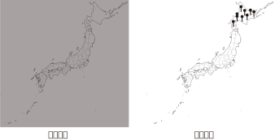

<!-- footer: 確率ロボティクス第7回 -->

# 確率ロボティクス第7回: センシングと推定（その1）

千葉工業大学 上田 隆一

 

This work is licensed under a <a rel="license" href="http://creativecommons.org/licenses/by-sa/4.0/">Creative Commons Attribution-ShareAlike 4.0 International License</a>.

---

<!-- paginate: true -->

## 今回の内容

- 情報のフィルタとしてのベイズの定理
- ベイズフィルタ

---

## 情報のフィルタとしてのベイズの定理

- 次のようなヒントから，どこのことを言っているのか考えてみましょう
	* (a) 日本では寒い場所です。
	* (b) 本州ではありません。
	* (c) 時計台があります。

---

### 質問

- 答えはいいとして、どう考えていきましたか？
    - 消去法？
    - 講師の意図は考えましたか？
    - 脳みそのどこを使いましたか？
- ロボットに実装するには？
    - たぶん今だとGPTだと思いますが、
    GPTも間接的に使っているある方法で

---

### 「消去法」について考える

- 実はベイズの定理で（アナログに）扱える
	- $p(\boldsymbol{x} | Z) = \eta L(\boldsymbol{x}| Z)p(\boldsymbol{x})$
	    - $\boldsymbol{x}$: 推定対象
	    - $Z$: ヒント（条件付き確率の「条件」）
	    - $L$: 尤度関数
            - $L(\boldsymbol{x}|Z) = \Pr\{Z | \boldsymbol{x}\}$
- 事前分布$p(\boldsymbol{x})$が情報$Z$で事後分布$p(\boldsymbol{x}|Z)$に
    - 式をよく読むと確かにそういう形になっている

---

### 尤度関数の例（さきほどのクイズの例）

- 黒いところ or ピンの刺さっているところが高い尤度
    - 講師が考えた適当なものだが機能する
- ベイズの定理で尤度関数をかけていくと北海道の時計台の場所が高確率に
    - 複数の情報があるときの式は次ページ

---

### 情報が複数得られた時の事後分布

- 式: $p(\boldsymbol{x} | Z_{1:n}) = \eta L(\boldsymbol{x}| Z_1)L(\boldsymbol{x} | Z_2)\cdots L(\boldsymbol{x}| Z_n) p(\boldsymbol{x})$
    $= \eta \prod_{i=1}^n L(\boldsymbol{x}| Z_i)p(\boldsymbol{x})$
    - 情報$Z_{1:n}$は互いに独立（独立同分布）
    - ベイズの定理から導出してみましょう
    - 事前分布は任意（なにも情報がないなら一様分布が妥当）

（注意: 厳密に計算したものではありません）

---

## ベイズフィルタと自己位置推定

- ロボットにいまの話を適用すると、複数の情報から
ロボットの位置が推定可能$\Rightarrow$ベイズフィルタによる自己位置推定の原理
- 今の話と異なること
    - ロボットが動く
    - 考えるのはロボット（ちゃんとプログラムしないといけない）

---

### 情報のモデル化

- ロボットは離散時刻ごとに位置に関して
（しばしば間接的な）情報$Z_t$を得る: 観測
    - $t=1,2,\dots$
    - 「間接的な」: 直接「お前はここにいる」という
    情報でない情報
        - 例
            - 東京タワーや東京スカイツリーや富士山や時計台が見える
            - LiDARのセンサ値（絶対位置は与えない）
        - ベイズの定理で位置情報に変換可能
- $Z_t$: 事象でも確率変数でもよい

---

### ロボットの位置の分布

- 時刻$t$におけるロボットの位置$\boldsymbol{x}$の分布: $p_t(\boldsymbol{x}|$条件$)$と書く
    - 問題: 「条件」には何が入る？（既知の情報）
        - 時刻$t=0$の$\boldsymbol{x}$の分布は$p_0$としましょう
        - 答え
            * $p_t(\boldsymbol{x}|p_0, \boldsymbol{u}_{1:t}, Z_{1:t})$
- ロボット自身がこの条件付き分布を求める=自己位置推定

---

### 信念分布

- 自己位置推定しているロボットの頭の中はどうなっているか？
    - 暗闇（←↑比喩多めでよくないですが）
        - 自身の真の位置は分かっていない
        - センサの値はベイズの定理を通さないと意味をなさない
    $\Longrightarrow$実は人間も同じだが自身が高性能すぎて気付いていない
- 手がかり
    - $p_t(\boldsymbol{x}|p_0, \boldsymbol{u}_{1:t}, Z_{1:t})$の条件の部分
    - ベイズの定理の尤度関数
- 条件と尤度関数から自身の分布$p_t(\boldsymbol{x}|p_0, \boldsymbol{u}_{1:t}, Z_{1:t})$を頭の中に構築
    $\Longrightarrow$構築した分布は信念分布と呼ばれる
     - ちゃんとした用語です

---

### 信念 = 主観

- 動物の場合
    - 尤度関数は個体によって異なる$\Longrightarrow$信念分布も異なる
        - 実は正解がない
        - 信念分布が現実と合っていて、正しい行動の判断ができればよい
- ロボットの場合
    - 基本的には動物と同じ
    - 条件がきっちり定まっていれば「正解」は存在するが、条件から外れたことが起こった場合は必ずしもそうではない
    $\rightarrow$精度を追及してもあまり意味がなくて、どこまで実世界の理不尽さに耐えられるかが重要
    $\rightarrow$尤度関数の設計にはかなりの自由度

---

### 信念分布の計算1

- 準備
    - $b_t(\boldsymbol{x}) = p_t(\boldsymbol{x}|p_0, \boldsymbol{u}_{1:t}, Z_{1:t})$と表記
- ベイズの定理により
	- $b_t(\boldsymbol{x}) = p(\boldsymbol{x} | p_0, \boldsymbol{u}_{1:t}, Z_{1:t})$
	$= \eta p(Z_t | \boldsymbol{x}, p_0, \boldsymbol{u}_{1:t}, Z_{1:t-1} ) p(\boldsymbol{x} | p_0, \boldsymbol{u}_{1:t}, Z_{1:t-1} )$
	$= \eta p(Z_t | \boldsymbol{x} ) p(\boldsymbol{x} | p_0, \boldsymbol{u}_{1:t}, Z_{1:t-1} )\qquad$（$Z_t$の分布は$\boldsymbol{x}$だけで決まる）
	$= \eta L(\boldsymbol{x} | Z_t) \hat{b}_t(\boldsymbol{x})$
        - $L$: 尤度関数
        - $\hat{b}_t$: 時刻$t$において、ロボットが$Z_t$を知る直前の信念分布

---

### 信念分布の計算2

- $\hat{b}_t$を$b_{t-1}$から求めてみましょう
    - 第6回（その1）で求めた式がそのまま成立
        - $p_t(\boldsymbol{x}) = \big\langle p(\boldsymbol{x}| \boldsymbol{x}_{t-1} , \boldsymbol{u}_t) \big\rangle_{p_{t-1}(\boldsymbol{x}_{t-1}) }$
        $\Longrightarrow \hat{b}_t(\boldsymbol{x}) = \big\langle p(\boldsymbol{x}| \boldsymbol{x}_{t-1} , \boldsymbol{u}_t) \big\rangle_{b_{t-1}(\boldsymbol{x}_{t-1}) }$

