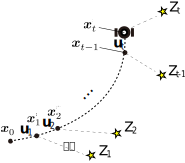

<!-- footer: 確率ロボティクス第7回 -->

# 確率ロボティクス第7回: センシングと推定（その1）

千葉工業大学 上田 隆一

 

This work is licensed under a <a rel="license" href="http://creativecommons.org/licenses/by-sa/4.0/">Creative Commons Attribution-ShareAlike 4.0 International License</a>.

---

<!-- paginate: true -->

## 今回の内容

- 情報のフィルタとしてのベイズの定理
- ベイズフィルタ

---

## 情報のフィルタとしてのベイズの定理

- 次のようなヒントから，どこのことを言っているのか考えてみましょう
	* (a) 日本では寒い場所です。
	* (b) 本州ではありません。
	* (c) 時計台があります。

---

### 質問

- 答えはいいとして、どう考えていきましたか？
    - 消去法？
    - 講師の意図は考えましたか？
    - 脳みそのどこを使いましたか？
- ロボットに実装するには？
    - たぶん今だとGPTだと思いますが、
    GPTも間接的に使っているある方法で

---

### 「消去法」について考える

- 実はベイズの定理で（アナログに）扱える
	- $p(\boldsymbol{x} | Z) = \eta L(\boldsymbol{x}| Z)p(\boldsymbol{x})$
	    - $\boldsymbol{x}$: 推定対象
	    - $Z$: ヒント（条件付き確率の「条件」）
	    - $L$: 尤度関数
            - $L(\boldsymbol{x}|Z) = \Pr\{Z | \boldsymbol{x}\}$
- 事前分布$p(\boldsymbol{x})$が情報$Z$で事後分布$p(\boldsymbol{x}|Z)$に
    - 式をよく読むと確かにそういう形になっている

---

### 尤度関数の例（さきほどのクイズの例）

- 黒いところ or ピンの刺さっているところが高い尤度
    - 講師が考えた適当なものだが機能する
- ベイズの定理で尤度関数をかけていくと北海道の時計台の場所が高確率に
    - 複数の情報があるときの式は次ページ

---

### 情報が複数得られた時の事後分布

- 式: $p(\boldsymbol{x} | Z_{1:n}) = \eta L(\boldsymbol{x}| Z_1)L(\boldsymbol{x} | Z_2)\cdots L(\boldsymbol{x}| Z_n) p(\boldsymbol{x})$
    $= \eta \prod_{i=1}^n L(\boldsymbol{x}| Z_i)p(\boldsymbol{x})$
    - 情報$Z_{1:n}$は互いに独立（独立同分布）
    - ベイズの定理から導出してみましょう
    - 事前分布は任意（なにも情報がないなら一様分布が妥当）

（注意: 厳密に計算したものではありません）

---

## ベイズフィルタと自己位置推定

- ロボットにいまの話を適用すると、複数の情報から
ロボットの位置が推定可能$\Rightarrow$ベイズフィルタによる自己位置推定の原理
- 今の話と異なること
    - ロボットが動く
    - 考えるのはロボット（ちゃんとプログラムしないといけない）

---

### 情報のモデル化

- ロボットは離散時刻ごとに位置に関して
（しばしば間接的な）情報$Z_t$を得る: 観測
    - $t=1,2,\dots$
    - 「間接的な」: 直接「お前はここにいる」という
    情報でない情報
        - 例
            - 東京タワーや東京スカイツリーや富士山や時計台が見える
            - LiDARのセンサ値（絶対位置は与えない）
- $Z_t$: 事象でも確率変数でもよい

---

### ロボットの位置の分布

- 時刻$t$におけるロボットの位置$\boldsymbol{x}$の分布: $p_t(\boldsymbol{x}|$条件$)$と書く
    - 問題: 「条件」には何が入る？（既知の情報）
        - 時刻$t=0$の$\boldsymbol{x}$の分布は$p_0$としましょう
        - 答え
            * $p_t(\boldsymbol{x}|p_0, \boldsymbol{u}_{1:t}, Z_{1:t})$
- ロボット自身がこの分布を求める=自己位置推定

---

### 信念分布

- ロボットに確率分布で「自分の位置の確率分布$b_t$」を持たせる
