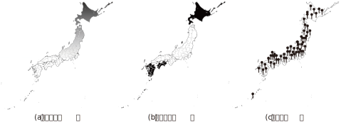
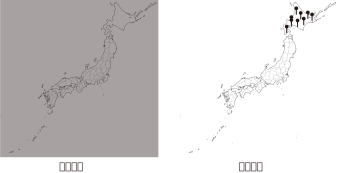
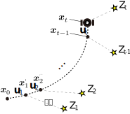

<!-- footer: Probabilistic Robotics Lesson 7 -->

# Probabilistic Robotics Lesson 7: Sensing and Estimation (Part 1)

Ryuichi Ueda, Chiba Institute of Technology

 

This work is licensed under a <a rel="license" href="http://creativecommons.org/licenses/by-sa/4.0/">Creative Commons Attribution-ShareAlike 4.0 International License</a>.

---

<!-- paginate: true -->

## Contents

- Bayes' Theorem as an Filter for Information
- Bayesian Filter

---

## Bayes' Theorem as an Filter for Information

- Consider what the following clues refer to:
    * (a) It's a cold place in Japan.
    * (b) It's not in Honshu.
    * (c) There's a clock tower.

---

### Question

- Regardless of the answer, how did you think about it?
   - Process of elimination?
   - Did you consider the instructor's intention?
   - What part of your brain did you use?
- How can you implement it in a robot?
   - We can use GPT now, but consider a method that GPT also uses.

---

### Thinking about "elimination"

- Actually, it can be handled using Bayes' theorem.
    - $p(\boldsymbol{x} | Z) = \eta L(\boldsymbol{x}| Z)p(\boldsymbol{x})$
        - $\boldsymbol{x}$: Estimation target
        - $Z$: Hint (the "condition" of conditional probability)
        - $L$: Likelihood function
            - $L(\boldsymbol{x}|Z) = \Pr\{Z | \boldsymbol{x}\}$
- The prior distribution $p(\boldsymbol{x})$ is transformed into the posterior distribution $p(\boldsymbol{x}|Z)$ using information $Z$.
    - If you read the equation carefully, you'll see that it does indeed have that form.

---

### Example of a likelihood function (example from the previous quiz)

- Black areas or areas with pins stuck in them have a high likelihood.
   - This is a function made up by the instructor, but it works.
- Applying the likelihood function using Bayes' theorem results in a high probability of finding the location of the clock tower in Hokkaido.
   - The equation for multiple pieces of information is on the next page.

---

### Posterior distribution when multiple pieces of information are available.

- Formula: $p(\boldsymbol{x} | Z_{1:n}) = \eta L(\boldsymbol{x}| Z_1)L(\boldsymbol{x} | Z_2)\cdots L(\boldsymbol{x}| Z_n) p(\boldsymbol{x})$
$= \eta \prod_{i=1}^n L(\boldsymbol{x}| Z_i)p(\boldsymbol{x})$
    - Information $Z_{1:n}$ is mutually independent (independent and identically distributed).
    - Let's derive it using Bayes' theorem.
    - The prior distribution is arbitrary (a uniform distribution is appropriate if there is no information).

(Note: This is not an exact calculation.)

---

## Bayesian filter and localization

- Applying this to a robot, the robot's position can be estimated from multiple pieces of information. $\Rightarrow$Bayesian filter - Principles of mobile robot localization.
- Differences from the previous discussion.
    - The robot moves.
    - We made robots solve the problem. It must be properly programmed.

---

### Modeling for information handling

- The robot obtains (often indirect) information $Z_t$ about its location at each discrete time instant: observation ($t=1,2,\dots$)
    - "Indirect": Information that does not directly indicate "You are here"
        - Example
           - Tokyo Tower, Tokyo Skytree, Mt. Fuji, and the Clock Tower are visible
           - LiDAR sensor values (absolute position not given)
        - Can be converted to location information using Bayes' theorem
- $Z_t$: Can be either an event or a random variable

---

### Distribution of Robot Location

- Distribution of the robot's position $\boldsymbol{x}$ at time $t$: Denoted as $p_t(\boldsymbol{x}|$condition$)$
    - Problem: What goes in the "condition"? (Known information)
        - Let's say the distribution of $\boldsymbol{x}$ at time $t=0$ is $p_0$.
        - Answer
            * $p_t(\boldsymbol{x}|p_0, \boldsymbol{u}_{1:t}, Z_{1:t})$
- The robot itself determines this conditional distribution = self-localization.

---

### Belief Distribution

- What's going on in the head of a robot estimating its location?
    - Darkness
        - It doesn't know its true location
        - Sensor values are meaningless unless they pass through Bayes' theorem
$\Longrightarrow$ Humans are actually the same, but they're so sophisticated. They don't realize it.

---

- Clues
    - The condition part of $p_t(\boldsymbol{x}|p_0, \boldsymbol{u}_{1:t}, Z_{1:t})$
    - The likelihood function of Bayes' theorem
- It constructs its own distribution $p_t(\boldsymbol{x}|p_0, \boldsymbol{u}_{1:t}, Z_{1:t})$ in its head from the condition and likelihood function
$\Longrightarrow$ The constructed distribution is called a belief distribution
- It's a proper term

---

### Belief = subjective

- In the case of animals
- The likelihood function differs for each individual, and so does the belief distribution.
- In fact, there is no correct answer.
- As long as the belief distribution matches reality and allows for correct behavioral decisions, that's all that matters.
- In the case of robots
- Basically the same as with animals.
- If the conditions are clearly defined, there is a "correct answer," but this is not necessarily the case if something deviates from those conditions.
- Pursuing accuracy is not very meaningful; what matters is how well it can tolerate the unreasonableness of the real world.
- There is a considerable degree of freedom in designing the likelihood function.
---

### Calculating Belief Distributions 1

- Preparation
- Denote $b_t(\boldsymbol{x}) = p_t(\boldsymbol{x}|p_0, \boldsymbol{u}_{1:t}, Z_{1:t})$
- By Bayes' theorem,
- $b_t(\boldsymbol{x}) = p(\boldsymbol{x} | p_0, \boldsymbol{u}_{1:t}, Z_{1:t})$ 
$= \eta p(Z_t | \boldsymbol{x}, p_0, \boldsymbol{u}_{1:t}, Z_{1:t-1} ) p(\boldsymbol{x} | p_0, \boldsymbol{u}_{1:t}, Z_{1:t-1} )$ 
$= \eta p(Z_t | \boldsymbol{x} ) p(\boldsymbol{x} | p_0, \boldsymbol{u}_{1:t}, Z_{1:t-1} )\qquad$ (the distribution of $Z_t$ is determined only by $\boldsymbol{x}$) 
$= \eta L(\boldsymbol{x} | Z_t) \hat{b}_t(\boldsymbol{x})$
- $L$: Likelihood function
- $\hat{b}_t$: Belief distribution at time $t$, just before the robot learns $Z_t$

---

### Calculating Belief Distribution 2

- Let's find $\hat{b}_t$ from $b_{t-1}$
- The equation found in Part 6 (Part 1) holds true.
- $p_t(\boldsymbol{x}) = \big\langle p(\boldsymbol{x}| \boldsymbol{x}_{t-1} , \boldsymbol{u}_t) \big\rangle_{p_{t-1}(\boldsymbol{x}_{t-1}) }$
$\Longrightarrow \hat{b}_t(\boldsymbol{x}) = \big\langle p(\boldsymbol{x}| \boldsymbol{x}_{t-1} , \boldsymbol{u}_t) \big\rangle_{b_{t-1}(\boldsymbol{x}_{t-1}) }$
- $Z_t$ is irrelevant; it is determined by the already calculated $b_{t-1}$, the movement $\boldsymbol{u}_t$, and the state transition distribution.

---

## Summary

- $b_t$ is calculated by repeating the following calculations from $b_0$.
- When the robot moves: $\hat{b}_t(\boldsymbol{x}) = \big\langle p(\boldsymbol{x}| \boldsymbol{x}_{t-1} , \boldsymbol{u}_t) \big\rangle_{b_{t-1}(\boldsymbol{x}_{t-1}) }$
- When information is available: $b_t(\boldsymbol{x}) = \eta L(\boldsymbol{x} | Z_t) \hat{b}_t(\boldsymbol{x})$
- The above two equations: Bayesian filtering
