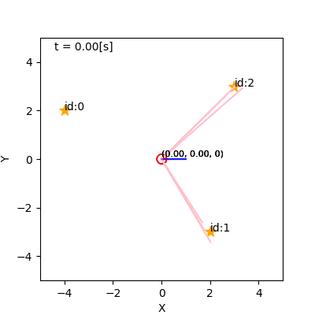
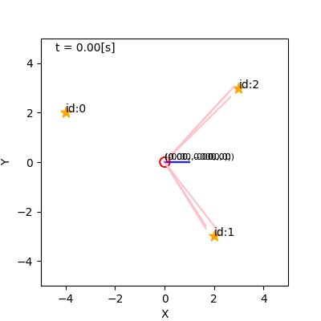
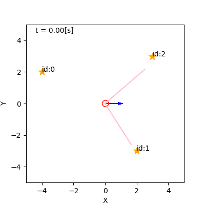

<!-- footer: 確率ロボティクス第7回 -->

# 確率ロボティクス第7回: センシングと推定（その2）

千葉工業大学 上田 隆一

 

This work is licensed under a <a rel="license" href="http://creativecommons.org/licenses/by-sa/4.0/">Creative Commons Attribution-ShareAlike 4.0 International License</a>.

---

<!-- paginate: true -->

## 今回の内容

- ベイズフィルタの実装
    - カルマンフィルタ（線形な場合）
    - カルマンフィルタ（非線形な場合。拡張カルマンフィルタと呼ばれる）
    - パーティクルフィルタ
---

### 前回のおさらい

- ベイズフィルタ
    - 次の2つの式で構成される
        - ロボットが動いたとき: $\hat{b}_t(\boldsymbol{x}) = \big\langle p(\boldsymbol{x}| \boldsymbol{x}_{t-1} , \boldsymbol{u}_t) \big\rangle_{b_{t-1}(\boldsymbol{x}_{t-1}) }$
        - 情報が得られた時: $b_t(\boldsymbol{x}) = \eta L(\boldsymbol{x} | Z_t) \hat{b}_t(\boldsymbol{x})$
    - $b_0$から次の計算の繰り返しで$b_t$が求まる
    - 動きと情報を信念分布に変換
- どうやって実装するの？

---

## カルマンフィルタ（線形な場合）

- 線形: 観測方程式が線形な形で書けること
    - $\boldsymbol{z} = H \boldsymbol{x} + \boldsymbol{c} + \boldsymbol{\varepsilon}$
        - 時刻の添え字は省略
        - $\boldsymbol{z}$: 情報（ベクトルになっていることが必要）
        - $\boldsymbol{c}$: 定数項
        - $\boldsymbol{\varepsilon}$: 雑音
        - $H$: （$\boldsymbol{c}$といっしょに）位置$\boldsymbol{x}$でどんなセンサ値が得られるかをモデル化した行列
- 確率的な観測方程式の表記（$\boldsymbol{\varepsilon}$がガウス分布に従うと仮定）
	- $\boldsymbol{z} \sim \mathcal{N}(\boldsymbol{z} | H\boldsymbol{x} + \boldsymbol{c}, Q)$
	    - $Q$: 雑音の共分散行列

---

## 線形なカルマンフィルタの適用例

次のような場合を想定

- 状態（位置・向き）: $\boldsymbol{x} = (x \  y \  \theta)^\top$
    - $x$軸、$y$軸はそれぞれ緯度、経度の方向とあわせる
- 観測: $\boldsymbol{z} = (p_\text{la} \  p_\text{lo} \  \varphi)^\top$
    - GNSSから直接、緯度$p_\text{la}$と経度$p_\text{lo}$をもらえる（誤差あり）
    - ジャイロから方角$\varphi$の情報をもらえる（誤差あり）

--- 

### 観測方程式（尤度関数）はこうなる

- $\boldsymbol{z} \sim \mathcal{N}(\boldsymbol{z} | H\boldsymbol{x} + \boldsymbol{c}, Q)$
    - $\boldsymbol{z} = (p_\text{la}, p_\text{lo},\varphi)$
	- $H = \begin{pmatrix}
		\alpha_\text{la} & 0 & 0 \\
		0 & \alpha_\text{lo} & 0 \\
		0 & 0 & 1
	\end{pmatrix}$
        - $\alpha_\text{la}, \alpha_\text{lo}$: 1mあたりの緯度、経度
     - $\boldsymbol{c} = (p_\text{la} \ p_\text{lo} \ \varphi_0)^\top$
	    - いずれも原点調整の変数
     - $Q$: 誤差の大きさを測って共分散行列にしたもの
         - この場合は対角成分（分散）にだけ数値を置けばよさそう
- 右辺が尤度関数に（計測された$\boldsymbol{z}\rightarrow \boldsymbol{x}$の尤もらしさ）

--- 

### 情報が得られたときの更新式

- $b_t(\boldsymbol{x}) = \eta L(\boldsymbol{x} | Z_t) \hat{b}_t(\boldsymbol{x})= \eta \mathcal{N}(\boldsymbol{z}_t | H\boldsymbol{x} + \boldsymbol{c}, Q) \mathcal{N}(\boldsymbol{x} | \hat{\boldsymbol{\mu}}_t, \hat\Sigma_t)$
    - $\hat{\boldsymbol{\mu}}_t, \hat{\Sigma}_t$は、それぞれ$\hat{b}_t$の平均値、共分散行列

- 第4回で出てきた式: $p(\boldsymbol{x}) = \eta \mathcal{N}(\boldsymbol{a} | A\boldsymbol{x} + \boldsymbol{b}, sB) \mathcal{N}(\boldsymbol{x} | \boldsymbol{c}, sC)$と同じ形
    - $p(\boldsymbol{x}) = \eta s^{-1/2}e^{-U/2s} \mathcal{N}(\boldsymbol{x} | \boldsymbol{d} , sD) = \eta \mathcal{N}(\boldsymbol{x} | \boldsymbol{d} , sD)$
        - $D^{-1} = A^\top B^{-1} A + C^{-1}$
        - $\boldsymbol{d} = D \left\{ A^\top B^{-1}(\boldsymbol{a}- \boldsymbol{b} ) + C^{-1}\boldsymbol{c} \right\}$
- $b_t = \mathcal{N}(\boldsymbol{\mu}_t, \Sigma_t)$として$\boldsymbol{\mu}_t, \Sigma_t$を求めてみましょう
    * $\boldsymbol{a} = \boldsymbol{z}_t$，$A = H$，$\boldsymbol{b} = \boldsymbol{c}$、$s=1$，$B = Q$，$\boldsymbol{c} = \hat{\boldsymbol{\mu}}_t$、$C=\hat\Sigma_t$を代入
	    - $\Sigma_t^{-1} = H^\top Q^{-1} H + \hat\Sigma_t^{-1}$
	    - $\boldsymbol{\mu}_t = \Sigma_t \big\{ H^\top Q^{-1}(\boldsymbol{z}_t- \boldsymbol{c} ) + \hat\Sigma_t^{-1}\hat{\boldsymbol{\mu}}_t \big\}$

---

### カルマンゲインの導入

- 前ページの最後の2つの式で、GNSS、ジャイロの値を分布に反映できた
    - ただしもっと簡単になるので計算続行
- 次の記号を導入
	- $K_t = \Sigma_t H^\top Q^{-1}$: カルマンゲイン（なんなのかは後で説明）
	- $\hat{\boldsymbol{z}}_t = H \hat{\boldsymbol{\mu}}_t + \boldsymbol{c}$: 分布$\hat{b}_t$の中心で得られるであろうセンサデータ
- $\boldsymbol{\mu}_t = \Sigma_t \big\{ H^\top Q^{-1}(\boldsymbol{z}_t- \boldsymbol{c} ) + \hat\Sigma_t^{-1}\hat{\boldsymbol{\mu}}_t \big\}$を整理（やってみましょう）
	* $= K_t (\boldsymbol{z}_t- \boldsymbol{c} ) + \Sigma_t(\Sigma_t^{-1} - H^\top Q^{-1}H)\hat{\boldsymbol{\mu}}_t$
	$= K_t (\boldsymbol{z}_t- \boldsymbol{c} ) + (I - K_t H)\hat{\boldsymbol{\mu}}_t$
	$= K_t (\boldsymbol{z}_t- \boldsymbol{c} - H \hat{\boldsymbol{\mu}}_t) + \hat{\boldsymbol{\mu}}_t$
	$= K_t (\boldsymbol{z}_t- \hat{\boldsymbol{z}}_t) + \hat{\boldsymbol{\mu}}_t$

---

### カルマンゲインの導入（続き）

- $\Sigma_t^{-1} = H^\top Q^{-1} H + \hat\Sigma_t^{-1}$を整理（これもやってみましょう）
	* $I = \Sigma_t H^\top Q^{-1} H +\Sigma_t \hat\Sigma_t^{-1}  \Longrightarrow
	I = K_t H +\Sigma_t \hat\Sigma_t^{-1}$
	$\Longrightarrow
	\hat\Sigma_t = K_t H\hat\Sigma_t +\Sigma_t   \Longrightarrow
	\Sigma_t = (I - K_t H)\hat\Sigma_t$
- まとめ
    - $\boldsymbol{\mu}_t = K_t (\boldsymbol{z}_t- \hat{\boldsymbol{z}}_t) + \hat{\boldsymbol{\mu}}_t$
	   - 新たな推定姿勢 $= K_t$(実際の情報 $-$ 元の推定姿勢で期待された情報)
       $\qquad\qquad\qquad\qquad+$ 元の推定姿勢
	- $\Sigma_t = (I - K_t H)\hat\Sigma_t$
	    - 得られた情報の分だけ共分散行列を小さく

$\Longrightarrow$カルマンゲイン: 観測が信念分布に与える影響力の強さ

---

### カルマンゲインの変形

- $K_t = \Sigma_t H^\top Q^{-1}$は右辺に$\Sigma_t$があるので計算できない
    - $\Sigma_t$を除去しましょう
	    - $\Sigma_t^{-1} = H^\top Q^{-1} H + \hat\Sigma_t^{-1}$を代入
        - ウッドベリーの公式を利用
            - $(A + BDC)^{-1} = A^{-1} - A^{-1}B(D^{-1} + CA^{-1} B)^{-1} CA^{-1}$
- 答え
    * $K_t = \{ \hat{\Sigma}_t - \hat{\Sigma}_t H^\top ( Q + H\hat{\Sigma}_t H^\top )^{-1} H\hat{\Sigma}_t \} H^\top Q^{-1}$
	$= \hat{\Sigma}_t H^\top Q^{-1}  - \hat{\Sigma}_t H^\top ( Q + H\hat{\Sigma}_t H^\top )^{-1} H\hat{\Sigma}_t H^\top Q^{-1}$
	$= \hat{\Sigma}_t H^\top Q^{-1}  - \hat{\Sigma}_t H^\top ( Q + H\hat{\Sigma}_t H^\top )^{-1} (Q + H\hat{\Sigma}_t H^\top ) Q^{-1}$ 
	$+ \hat{\Sigma}_t H^\top ( Q + H\hat{\Sigma}_t H^\top )^{-1}QQ^{-1}$
	$= \hat\Sigma_t H^\top (Q + H \hat\Sigma_t H^\top)^{-1}$

---

### カルマンフィルタ

- 以上の結果と第6回の動きの式のまとめ
    - ロボットが移動したとき
        - $\hat{\boldsymbol{\mu}}_t = \boldsymbol{\mu}_{t-1} + \overline{\Delta \boldsymbol{x}_t}$（おさらい: 元の平均位置に変位の平均値を足す）
        - $\hat{\Sigma}_{t-1} = \Sigma_t + S_t$（おさらい: 変位の不確かさを足す）
    - ロボットが観測したとき
		- $K_t = \hat\Sigma_t H^\top ( H \hat\Sigma_t H^\top +  Q )^{-1}$
        - $\boldsymbol{\mu}_t = K_t (\boldsymbol{z}_t- \hat{\boldsymbol{z}}_t) + \hat{\boldsymbol{\mu}}_t$
		- $\Sigma_t = (I - K_t H)\hat\Sigma_t$
- 上記の更新式をカルマンフィルタと呼ぶ
    - ガウス分布の演算によるベイズフィルタの実装

---

## 拡張カルマンフィルタ

- 非線形な場合にどうカルマンフィルタを適用するか？
    - 第6回と同様、線形化する
- 例題: カメラで点ランドマークを観測（カメラの位置=ロボットの位置）
    - ランドマークまでの距離$\ell$、ロボットからのランドマークの方角$\varphi$が計測可能
    - ランドマーク自身の方角$\psi$も計測可能
    - ランドマークの位置、方角: $(m_x \ m_y \ m_\psi)^\top$

$\qquad\qquad\qquad\qquad\qquad\qquad\qquad$

---

### 観測モデル・尤度関数

- 観測モデル: $\boldsymbol{z}_t \sim \mathcal{N}\left[ \boldsymbol{h}(\boldsymbol{x}_t), Q_t(\boldsymbol{x}_t) \right]$
    - 観測方程式$\boldsymbol{h}(\boldsymbol{x}_t)$: $\boldsymbol{x}_t$で得られるセンサ値のベクトルの平均値
        - 要素は$\ell, \varphi, \psi$（$\boldsymbol{z}_t$はセンサ値の空間のベクトルとなる）
    - $Q_t(\boldsymbol{x}_t)$: $\boldsymbol{x}_t$での雑音の共分散行列
        - 下準備として$Q_t(\boldsymbol{x}_t)$の近似: $\hat{b}_t$の中心$\hat{\boldsymbol{\mu}}_t$での共分散行列に近似
            - $Q_t(\boldsymbol{x}_t)\simeq Q_t(\hat{\boldsymbol{\mu}}_t)$
            - $Q_t(\hat{\boldsymbol{\mu}}_t)$は以後、単に$Q_t$と表記
- 尤度関数: $L(\boldsymbol{x}_t |\boldsymbol{z}_t) = \mathcal{N}\left[ \boldsymbol{h}(\boldsymbol{x}_t), Q_t(\boldsymbol{x}_t) \right] \simeq \mathcal{N}(\boldsymbol{h}(\boldsymbol{x}_t), Q_t)$
    - 線形化が必要に
        - $\boldsymbol{h}$を$\boldsymbol{z} = H\boldsymbol{x} + \boldsymbol{c}$のような線形な式に近似

---

### 観測方程式の線形近似

- $\boldsymbol{h}(\boldsymbol{x}) \simeq \boldsymbol{h}(\hat{\boldsymbol{\mu}}_t) + H_t (\boldsymbol{x} - \hat{\boldsymbol{\mu}}_t)$
    - 分布の中心での値 + 中心からのズレによる変化量
	- $H_t = \dfrac{\partial \boldsymbol{h}}{\partial \boldsymbol{x}}\Big|_{\boldsymbol{x} = \hat{\boldsymbol{\mu}}_t}$
	    - 例題で具体的に$H_t$がどうなるかは、あとから考えましょう
- 近似した式の整理
	- $\boldsymbol{h}(\boldsymbol{x}) \simeq H_t \boldsymbol{x} + \boldsymbol{c}_t$
        - $\boldsymbol{c}_t = \boldsymbol{h}(\hat{\boldsymbol{\mu}}_t) - H_t \hat{\boldsymbol{\mu}}_t = \hat{\boldsymbol{z}}_t - H_t \hat{\boldsymbol{\mu}}_t$

---

### 拡張カルマンフィルタの導出

- $b_t(\boldsymbol{x}) = \eta \mathcal{N}(\boldsymbol{z}_t | H_t\boldsymbol{x} + \boldsymbol{c}_t, Q_t) \mathcal{N}(\boldsymbol{x} | \hat{\boldsymbol{\mu}}_t, \hat\Sigma_t)$
    - （再掲）線形な場合のときの式: $b_t(\boldsymbol{x}) = \eta \mathcal{N}(\boldsymbol{z}_t | H\boldsymbol{x} + \boldsymbol{c}, Q) \mathcal{N}(\boldsymbol{x} | \hat{\boldsymbol{\mu}}_t, \hat\Sigma_t)$
        - [p.7](#7)とほぼ同じなので以後省略

---

### 拡張カルマンフィルタ

第6回の移動の式と合わせると次のように

- ロボットが移動したとき
    - $\hat{\boldsymbol{\mu}}_t = \boldsymbol{\mu}_{t-1} + \overline{\Delta \boldsymbol{x}}_t$
    - $\hat\Sigma_t =  F_{t-1} \Sigma_{t-1} F_{t-1}^\top + T_{t-1} S_t T_{t-1}^\top$
- ロボットが観測したとき
    - $K_t = \hat\Sigma_t H_t^\top ( H_t \hat\Sigma_t H_t^\top +  Q_t )^{-1}$
    - $\boldsymbol{\mu}_t = K_t (\boldsymbol{z}_t- \hat{\boldsymbol{z}}_t) + \hat{\boldsymbol{\mu}}_t$
    - $\Sigma_t = (I - K_t H_t)\hat\Sigma_t$

---

### 例題への適用: 観測方程式を立てる

- 得られるセンサ値を計算（詳細は省略）
    - $\varphi = \arctan \{(m_y - y_t)/(m_x - x_t)\} - \theta_t$
    - $\ell = \{(m_x - x_t)^2 + (m_y - y_t)^2 \}^{1/2}$
    - $\psi = m_\psi - \theta_t - \pi$
- 観測方程式: $\boldsymbol{h}(\boldsymbol{x}_t) =$
$\begin{pmatrix}
		\arctan \{ (m_y - y_t)/(m_x - x_t) \} - \theta_t \\
		\{(m_x - x_t)^2 + (m_y - y_t)^2 \}^{1/2} \\
		m_\psi - \theta_t - \pi
	\end{pmatrix}$

---

### 例題への適用: ヤコビ行列$H_t$の算出

- $H_t = \left. \dfrac{\partial \boldsymbol{h}}{\partial \boldsymbol{x}}\right|_{\boldsymbol{x} = \hat{\boldsymbol{\mu}}_t} = ...$（計算してみましょう）
	* $= \left.
	\begin{pmatrix}
		(m_y-y) / \ell(\boldsymbol{x_t})^2 & (x - m_x) / \ell(\boldsymbol{x_t})^2 & -1 \\
		(x - m_x) / \ell(\boldsymbol{x_t}) & (y - m_y) / \ell(\boldsymbol{x_t}) & 0 \\
		0 & 0 & -1 
	\end{pmatrix} \right|_{\boldsymbol{x} = \hat{\boldsymbol{\mu}}_t}$
	$= 
	\begin{pmatrix}
		(m_y-\hat\mu_{yt}) / \ell(\hat{\boldsymbol{\mu}}_t)^2 & (\hat\mu_{xt} - m_x) / \ell(\hat{\boldsymbol{\mu}}_t)^2 & -1 \\
		(\hat\mu_{xt} - m_x) / \ell(\hat{\boldsymbol{\mu}}_t) & (\hat\mu_{yt} - m_y) / \ell(\hat{\boldsymbol{\mu}}_t) & 0 \\
		0 & 0 & -1 
	\end{pmatrix}$
        - $\hat{\boldsymbol{\mu}}_t = (\hat\mu_{xt},\hat\mu_{yt},\hat\mu_{\theta t})$
	    - $\ell(\boldsymbol{x}) = \{(m_x - x)^2 + (m_y - y)^2 \}^{1/2}$

---

### 例題への適用: $Q_t$の決定

（教科書には記述が抜けている模様）

- $\ell, \varphi, \psi$ごとに分散を測定or見積もって作成
- 例: $Q_t = \text{diag}( \sigma_\varphi^2, \sigma_\ell^2,  \sigma_\psi^2 )$
    - $\sigma_\ell$: 距離によって値を大きくする（例: $\sigma_\ell = \sigma_\ell' \ell(\hat{\boldsymbol{\mu}}_t)$）
    - $\sigma_\varphi, \sigma_\psi$は定数

---

### 例（詳解確率ロボティクスから）

- 左: 観測なし。右: 観測あり。
- $\psi$は無い
    - $H_t$や$Q_t$は$2\times 2$行列になるが問題ない
    - なんでそれで$(x, y, \theta)$を推定できるか考えてみましょう

---

## パーティクルフィルタ

- モンテカルロ法を利用したベイズフィルタ
- 移動ロボットではカルマンフィルタより用いられる
    - 第6回の例のように、壁にぶつかるなどのシミュレーションに適する
        （ただし、あまり真面目にやっている実装はない）
    - 雑音がガウス分布に従わない場合が多い
        - LiDARのデータ: 物体までの距離を遠く測ることは少ないが、人が横切って短く計測することは多い

$\qquad\qquad\qquad$

---

### パーティクル（再定義）

- 右図: おさらい
- 第6回のパーティクルに「重み」という変数を追加
	- $\xi_t^{(i)} = (\boldsymbol{x}_t^{(i)}, w_t^{(i)}) = (x_t^{(i)},y_t^{(i)},\theta_t^{(i)}, w_t^{(i)})$
    $(i=1,2,\dots,N)$
        - 右図の矢印がそれぞれ重みを持つ
    - 集合: $\xi_t^{(1:N)} = \{\xi_t^{(1)}, \xi_t^{(2)}, \dots, \xi_t^{(N)}\}$
- 真の姿勢$\boldsymbol{x}^*$が$X$内にある確率の近似方法を定義
	- $\text{Pr}\{ \boldsymbol{x}^* \in X \} \simeq \sum_{i=1}^N w_t^{(i)} \delta(\boldsymbol{x}_t^{(i)} \in X)$
	    - $\delta(\cdot)$: かっこの中がtrueなら1、falseなら0
- センサ情報を反映する前のパーティクルの集合: $\hat{\xi}_t^{(1:N)}$

---

### センサ情報を反映するときのパーティクルの処理

- $\hat{\xi}_t^{(1:N)}$に情報$Z_t$を反映して$\xi_t^{(1:N)}$に
- 尤度関数の値を重みにする
	- $w_t^{(i)} = \eta L(\boldsymbol{x}_t^{(i)} | Z_t)$
	- 姿勢はそのまま（$\hat{\boldsymbol{x}}_t^{(i)} \rightarrow \boldsymbol{x}_t^{(i)}$）
- $w_t^{(i)}$がモンテカルロ法で受け持つ確率に
    - $\eta$の計算は省略して次の操作で辻褄を合わせることもある

---

### ロボットが動いた時のパーティクルの処理

- $\xi_t^{(1:N)}$に制御指令$\boldsymbol{u}_t$を反映して$\hat{\xi}_{t+1}^{(1:N)}$に
- 単に各パーティクルを動かすのではなく、リサンプリングする
    - 重みが偏っていくのを防ぎ、重みの大きいパーティクルを増殖
- 例
    - 左: リサンプリングなし（重みに尤度をかけていく）
    - 右: リサンプリングあり

---

### リサンプリングの手続き（素朴なもの）

- 以下を繰り返して$\hat{\xi}_{t+1}^{(i)} \  (i=1,2,\dots,N)$を作成
    - 1: $\xi_t^{(1:N)}$から重みに比例する確率でひとつパーティクル$\xi' = (\boldsymbol{x}', w')$を選択
    - 2: $\hat{\boldsymbol{x}}_{t+1}^{(i)} \sim p(\boldsymbol{x} | \boldsymbol{u}_t, \boldsymbol{x}')$
    - 3: $\hat{w}_{t+1}^{(i)} = 1/N$
- 上記の方法は計算量が大きく、選択に偏りが発生するので、実装ではもっとよい方法（系統サンプリング）が使用される

---

### パーティクルフィルタのまとめ

- センサ情報の反映: 
    - $i=1,2,\dots,N$に対し
	    - $w_t^{(i)} = \eta L(\boldsymbol{x}_t^{(i)} | Z_t)$
- 移動の反映: 
    - $i=1,2,\dots,N$に対し
        - $\xi' = (\boldsymbol{x}', w') \sim \xi_t^{(1:N)}$（重みを選択される確率に）
        - $\hat{\boldsymbol{x}}_{t+1}^{(i)} \sim p(\boldsymbol{x} | \boldsymbol{u}_t, \boldsymbol{x}')$

これでベイズフィルタの近似になっている

---

### パーティクルフィルタの応用例

（実例はYouTube等で）

- レーザースキャナを用いた移動ロボットでよく用いられる
- 尤度関数: 次のような「占有格子地図」との比較で設計（尤度場）
    - スキャンの先が障害物の記録された格子にヒットすると尤度が上がる
    - 実際にはグレーゾーンを設けるが、基本、この簡単なモデルがよく機能する
        - いくつか地図にない障害物があっても点数が大きく下がらない

---

## まとめ

- ベイズフィルタの実装をみてきた
    - カルマンフィルタ、拡張カルマンフィルタ、パーティクルフィルタ
- カルマンフィルタはいまでも機械の制御によく用いられる
- 移動ロボットについてはパーティクルフィルタがいまでもよく用いられる
   - ただしもっと新しい方法もあるので流行は気にしておきましょう
