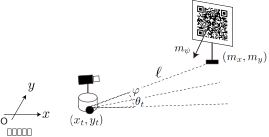

<!-- footer: 確率ロボティクス第7回 -->

# 確率ロボティクス第7回: センシングと推定（その2）

千葉工業大学 上田 隆一

 

This work is licensed under a <a rel="license" href="http://creativecommons.org/licenses/by-sa/4.0/">Creative Commons Attribution-ShareAlike 4.0 International License</a>.

---

<!-- paginate: true -->

## 今回の内容

- ベイズフィルタの実装
    - カルマンフィルタ（線形な場合）
    - カルマンフィルタ（非線形な場合。拡張カルマンフィルタと呼ばれる）
    - パーティクルフィルタ
---

### 前回のおさらい

- ベイズフィルタ
    - 次の2つの式で構成される
        - ロボットが動いたとき: $\hat{b}_t(\boldsymbol{x}) = \big\langle p(\boldsymbol{x}| \boldsymbol{x}_{t-1} , \boldsymbol{u}_t) \big\rangle_{b_{t-1}(\boldsymbol{x}_{t-1}) }$
        - 情報が得られた時: $b_t(\boldsymbol{x}) = \eta L(\boldsymbol{x} | Z_t) \hat{b}_t(\boldsymbol{x})$
    - $b_0$から次の計算の繰り返しで$b_t$が求まる
    - 動きと情報を信念分布に変換
- どうやって実装するの？

---

## カルマンフィルタ（線形な場合）

- 線形: 観測方程式が線形な形で書けること
    - $\boldsymbol{z} = H \boldsymbol{x} + \boldsymbol{c} + \boldsymbol{\varepsilon}$
        - 時刻の添え字は省略
        - $\boldsymbol{z}$: 情報（ベクトルになっていることが必要）
        - $\boldsymbol{c}$: 定数項
        - $\boldsymbol{\varepsilon}$: 雑音
        - $H$: （$\boldsymbol{c}$といっしょに）位置$\boldsymbol{x}$でどんなセンサ値が得られるかをモデル化した行列
- 確率的な観測方程式の表記（$\boldsymbol{\varepsilon}$がガウス分布に従うと仮定）
	- $\boldsymbol{z} \sim \mathcal{N}(\boldsymbol{z} | H\boldsymbol{x} + \boldsymbol{c}, Q)$
	    - $Q$: 雑音の共分散行列

---

## 線形なカルマンフィルタの適用例

次のような場合を想定

- 状態（位置・向き）: $\boldsymbol{x} = (x \  y \  \theta)^\top$
    - $x$軸、$y$軸はそれぞれ緯度、経度の方向とあわせる
- 観測: $\boldsymbol{z} = (p_\text{la} \  p_\text{lo} \  \varphi)^\top$
    - GNSSから直接、緯度$p_\text{la}$と経度$p_\text{lo}$をもらえる（誤差あり）
    - ジャイロから方角$\varphi$の情報をもらえる（誤差あり）

--- 

### 観測方程式（尤度関数）はこうなる

- $\boldsymbol{z} \sim \mathcal{N}(\boldsymbol{z} | H\boldsymbol{x} + \boldsymbol{c}, Q)$
    - $\boldsymbol{z} = (p_\text{la}, p_\text{lo},\varphi)$
	- $H = \begin{pmatrix}
		\alpha_\text{la} & 0 & 0 \\
		0 & \alpha_\text{lo} & 0 \\
		0 & 0 & 1
	\end{pmatrix}$
        - $\alpha_\text{la}, \alpha_\text{lo}$: 1mあたりの緯度、経度
     - $\boldsymbol{c} = (p_\text{la} \ p_\text{lo} \ \varphi_0)^\top$
	    - いずれも原点調整の変数
     - $Q$: 誤差の大きさを測って共分散行列にしたもの
         - この場合は対角成分（分散）にだけ数値を置けばよさそう
- 右辺が尤度関数に（計測された$\boldsymbol{z}\rightarrow \boldsymbol{x}$の尤もらしさ）

--- 

### 情報が得られたときの更新式

- $b_t(\boldsymbol{x}) = \eta L(\boldsymbol{x} | Z_t) \hat{b}_t(\boldsymbol{x})= \eta \mathcal{N}(\boldsymbol{z}_t | H\boldsymbol{x} + \boldsymbol{c}, Q) \mathcal{N}(\boldsymbol{x} | \hat{\boldsymbol{\mu}}_t, \hat\Sigma_t)$
    - $\hat{\boldsymbol{\mu}}_t, \hat{\Sigma}_t$は、それぞれ$\hat{b}_t$の平均値、共分散行列

- 第4回で出てきた式: $p(\boldsymbol{x}) = \eta \mathcal{N}(\boldsymbol{a} | A\boldsymbol{x} + \boldsymbol{b}, sB) \mathcal{N}(\boldsymbol{x} | \boldsymbol{c}, sC)$と同じ形
    - $p(\boldsymbol{x}) = \eta s^{-1/2}e^{-U/2s} \mathcal{N}(\boldsymbol{x} | \boldsymbol{d} , sD) = \eta \mathcal{N}(\boldsymbol{x} | \boldsymbol{d} , sD)$
        - $D^{-1} = A^\top B^{-1} A + C^{-1}$
        - $\boldsymbol{d} = D \left\{ A^\top B^{-1}(\boldsymbol{a}- \boldsymbol{b} ) + C^{-1}\boldsymbol{c} \right\}$
- $b_t = \mathcal{N}(\boldsymbol{\mu}_t, \Sigma_t)$として$\boldsymbol{\mu}_t, \Sigma_t$を求めてみましょう
    * $\boldsymbol{a} = \boldsymbol{z}_t$，$A = H$，$\boldsymbol{b} = \boldsymbol{c}$、$s=1$，$B = Q$，$\boldsymbol{c} = \hat{\boldsymbol{\mu}}_t$、$C=\hat\Sigma_t$を代入
	    - $\Sigma_t^{-1} = H^\top Q^{-1} H + \hat\Sigma_t^{-1}$
	    - $\boldsymbol{\mu}_t = \Sigma_t \big\{ H^\top Q^{-1}(\boldsymbol{z}_t- \boldsymbol{c} ) + \hat\Sigma_t^{-1}\hat{\boldsymbol{\mu}}_t \big\}$

---

### カルマンゲインの導入

- 前ページの最後の2つの式で、GNSS、ジャイロの値を分布に反映できた
    - ただしもっと簡単になるので計算続行
- 次の記号を導入
	- $K_t = \Sigma_t H^\top Q^{-1}$: カルマンゲイン（なんなのかは後で説明）
	- $\hat{\boldsymbol{z}}_t = H \hat{\boldsymbol{\mu}}_t + \boldsymbol{c}$: 分布$\hat{b}_t$の中心で得られるであろうセンサデータ
- $\boldsymbol{\mu}_t = \Sigma_t \big\{ H^\top Q^{-1}(\boldsymbol{z}_t- \boldsymbol{c} ) + \hat\Sigma_t^{-1}\hat{\boldsymbol{\mu}}_t \big\}$を整理（やってみましょう）
	* $= K_t (\boldsymbol{z}_t- \boldsymbol{c} ) + \Sigma_t(\Sigma_t^{-1} - H^\top Q^{-1}H)\hat{\boldsymbol{\mu}}_t$
	$= K_t (\boldsymbol{z}_t- \boldsymbol{c} ) + (I - K_t H)\hat{\boldsymbol{\mu}}_t$
	$= K_t (\boldsymbol{z}_t- \boldsymbol{c} - H \hat{\boldsymbol{\mu}}_t) + \hat{\boldsymbol{\mu}}_t$
	$= K_t (\boldsymbol{z}_t- \hat{\boldsymbol{z}}_t) + \hat{\boldsymbol{\mu}}_t$

---

### カルマンゲインの導入（続き）

- $\Sigma_t^{-1} = H^\top Q^{-1} H + \hat\Sigma_t^{-1}$を整理（これもやってみましょう）
	* $I = \Sigma_t H^\top Q^{-1} H +\Sigma_t \hat\Sigma_t^{-1}  \Longrightarrow
	I = K_t H +\Sigma_t \hat\Sigma_t^{-1}$
	$\Longrightarrow
	\hat\Sigma_t = K_t H\hat\Sigma_t +\Sigma_t   \Longrightarrow
	\Sigma_t = (I - K_t H)\hat\Sigma_t$
- まとめ
    - $\boldsymbol{\mu}_t = K_t (\boldsymbol{z}_t- \hat{\boldsymbol{z}}_t) + \hat{\boldsymbol{\mu}}_t$
	   - 新たな推定姿勢 $= K_t$(実際の情報 $-$ 元の推定姿勢で期待された情報)
       $\qquad\qquad\qquad\qquad+$ 元の推定姿勢
	- $\Sigma_t = (I - K_t H)\hat\Sigma_t$
	    - 得られた情報の分だけ共分散行列を小さく

$\Longrightarrow$カルマンゲイン: 観測が信念分布に与える影響力の強さ

---

### カルマンゲインの変形

- $K_t = \Sigma_t H^\top Q^{-1}$は右辺に$\Sigma_t$があるので計算できない
    - $\Sigma_t$を除去しましょう
	    - $\Sigma_t^{-1} = H^\top Q^{-1} H + \hat\Sigma_t^{-1}$を代入
        - ウッドベリーの公式を利用
            - $(A + BDC)^{-1} = A^{-1} - A^{-1}B(D^{-1} + CA^{-1} B)^{-1} CA^{-1}$
- 答え
    * $K_t = \{ \hat{\Sigma}_t - \hat{\Sigma}_t H^\top ( Q + H\hat{\Sigma}_t H^\top )^{-1} H\hat{\Sigma}_t \} H^\top Q^{-1}$
	$= \hat{\Sigma}_t H^\top Q^{-1}  - \hat{\Sigma}_t H^\top ( Q + H\hat{\Sigma}_t H^\top )^{-1} H\hat{\Sigma}_t H^\top Q^{-1}$
	$= \hat{\Sigma}_t H^\top Q^{-1}  - \hat{\Sigma}_t H^\top ( Q + H\hat{\Sigma}_t H^\top )^{-1} (Q + H\hat{\Sigma}_t H^\top ) Q^{-1}$ 
	$+ \hat{\Sigma}_t H^\top ( Q + H\hat{\Sigma}_t H^\top )^{-1}QQ^{-1}$
	$= \hat\Sigma_t H^\top (Q + H \hat\Sigma_t H^\top)^{-1}$

---

### カルマンフィルタ

- 以上の結果と第6回の動きの式のまとめ
    - ロボットが移動したとき
        - $\hat{\boldsymbol{\mu}}_t = \boldsymbol{\mu}_{t-1} + \overline{\Delta \boldsymbol{x}_t}$（おさらい: 元の平均位置に変位の平均値を足す）
        - $\hat{\Sigma}_{t-1} = \Sigma_t + S_t$（おさらい: 変位の不確かさを足す）
    - ロボットが観測したとき
		- $K_t = \hat\Sigma_t H^\top ( H \hat\Sigma_t H^\top +  Q )^{-1}$
        - $\boldsymbol{\mu}_t = K_t (\boldsymbol{z}_t- \hat{\boldsymbol{z}}_t) + \hat{\boldsymbol{\mu}}_t$
		- $\Sigma_t = (I - K_t H)\hat\Sigma_t$
- 上記の更新式をカルマンフィルタと呼ぶ
    - ガウス分布の演算によるベイズフィルタの実装

---

## 拡張カルマンフィルタ

- 非線形な場合にどうカルマンフィルタを適用するか？
    - 第6回と同様、線形化する
- 例題: カメラで点ランドマークを観測
    - カメラの位置=ロボットの位置
    - ランドマークまでの距離$\ell$、ロボットからのランドマークの方角$\varphi$が計測可能
    - ランドマーク自身の方角$\psi$も計測可能
    - ランドマークの位置、方角: $(m_x \ m_y \ m_\psi)^\top$

