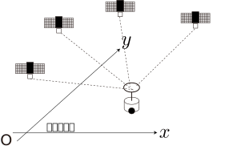

<!-- footer: 確率ロボティクス第7回 -->

# 確率ロボティクス第7回: センシングと推定（その2）

千葉工業大学 上田 隆一

 

This work is licensed under a <a rel="license" href="http://creativecommons.org/licenses/by-sa/4.0/">Creative Commons Attribution-ShareAlike 4.0 International License</a>.

---

<!-- paginate: true -->

## 今回の内容

- ベイズフィルタの実装
    - カルマンフィルタ（線形な場合）
    - カルマンフィルタ（非線形な場合。拡張カルマンフィルタと呼ばれる）
    - パーティクルフィルタ
---

### 前回のおさらい

- ベイズフィルタ
    - 次の2つの式で構成される
        - ロボットが動いたとき: $\hat{b}_t(\boldsymbol{x}) = \big\langle p(\boldsymbol{x}| \boldsymbol{x}_{t-1} , \boldsymbol{u}_t) \big\rangle_{b_{t-1}(\boldsymbol{x}_{t-1}) }$
        - 情報が得られた時: $b_t(\boldsymbol{x}) = \eta L(\boldsymbol{x} | Z_t) \hat{b}_t(\boldsymbol{x})$
    - $b_0$から次の計算の繰り返しで$b_t$が求まる
    - 動きと情報を信念分布に変換
- どうやって実装するの？

---

## カルマンフィルタ（線形な場合）

- 線形: 観測方程式が線形な形で書けること
    - $\boldsymbol{z} = H \boldsymbol{x} + \boldsymbol{c} + \boldsymbol{\varepsilon}$
        - 時刻の添え字は省略
        - $\boldsymbol{z}$: 情報（ベクトルになっていることが必要）
        - $\boldsymbol{c}$: 定数項
        - $\boldsymbol{\varepsilon}$: 雑音
        - $H$: （$\boldsymbol{c}$といっしょに）位置$\boldsymbol{x}$でどんなセンサ値が得られるかをモデル化した行列
- 確率的な観測方程式の表記（$\boldsymbol{\varepsilon}$がガウス分布に従うと仮定）
	- $\boldsymbol{z} \sim \mathcal{N}(\boldsymbol{z} | H\boldsymbol{x} + \boldsymbol{c}, Q)$
	    - $Q$: 雑音の共分散行列

---

## 線形なカルマンフィルタの適用例

次のような場合を想定

- 状態（位置・向き）: $\boldsymbol{x} = (x \  y \  \theta)^\top$
    - $x$軸、$y$軸はそれぞれ緯度、経度の方向とあわせる
- 観測: $\boldsymbol{z} = (p_\text{la} \  p_\text{lo} \  \varphi)^\top$
    - GNSSから直接、緯度$p_\text{la}$と経度$p_\text{lo}$をもらえる（誤差あり）
    - ジャイロから方角$\varphi$の情報をもらえる（誤差あり）

--- 

### 観測方程式（尤度関数）はこうなる

- $\boldsymbol{z} \sim \mathcal{N}(\boldsymbol{z} | H\boldsymbol{x} + \boldsymbol{c}, Q)$
    - $\boldsymbol{z} = (p_\text{la}, p_\text{lo},\varphi)$
	- $H = \begin{pmatrix}
		\alpha_\text{la} & 0 & 0 \\
		0 & \alpha_\text{lo} & 0 \\
		0 & 0 & 1
	\end{pmatrix}$
        - $\alpha_\text{la}, \alpha_\text{lo}$: 1mあたりの緯度、経度
     - $\boldsymbol{c} = (p_\text{la} \ p_\text{lo} \ \varphi_0)^\top$
	    - いずれも原点調整の変数
     - $Q$: 誤差の大きさを測って共分散行列にしたもの
         - この場合は対角成分（分散）にだけ数値を置けばよさそう
- 右辺が尤度関数に（計測された$\boldsymbol{z}\rightarrow \boldsymbol{x}$の尤もらしさ）

--- 

### 観測方程式（尤度関数）はこうなる

