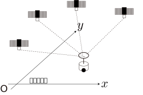

<!-- footer: Probabilistic Robotics Lesson 7 -->

# Probabilistic Robotics Lesson 7: Sensing and Estimation (Part 2)

Ryuichi Ueda, Chiba Institute of Technology

 

This work is licensed under a <a rel="license" href="http://creativecommons.org/licenses/by-sa/4.0/">Creative Commons Attribution-ShareAlike 4.0 International License</a>.

---

<!-- paginate: true -->

## Contents

- Implementing a Bayesian filter
    - Kalman filter (linear case)
    - Kalman filter (nonlinear case, also Known as an extended Kalman filter)
    - Particle filter

---

### Review of Last Time's Topic

- Bayesian Filter
    - Consists of the following two equations
        - When the robot moves: $\hat{b}_t(\boldsymbol{x}) = \big\langle p(\boldsymbol{x}| \boldsymbol{x}_{t-1} , \boldsymbol{u}_t) \big\rangle_{b_{t-1}(\boldsymbol{x}_{t-1}) }$
        - When information is obtained: $b_t(\boldsymbol{x}) = \eta L(\boldsymbol{x} | Z_t) \hat{b}_t(\boldsymbol{x})$
    - $b_t$ is calculated from $b_0$ by repeating the following calculations.
    - Converting motion and information into a belief distribution.
- How is this implemented?

---

## Kalman Filter (Linear Case)

- Linear: The observation equation can be written in linear form.
    - $\boldsymbol{z} = H \boldsymbol{x} + \boldsymbol{c} + \boldsymbol{\varepsilon}$
        - Time subscripts are omitted.
        - $\boldsymbol{z}$: Information (must be a vector).
        - $\boldsymbol{c}$: Constant term.
        - $\boldsymbol{\varepsilon}$: Noise.
        - $H$: (together with $\boldsymbol{c}$) A matrix that models the sensor values obtained at location $\boldsymbol{x}$.
- Probabilistic observation equation notation (assuming $\boldsymbol{\varepsilon}$ follows a Gaussian distribution).
    - $\boldsymbol{z} \sim \mathcal{N}(\boldsymbol{z} | H\boldsymbol{x} + \boldsymbol{c}, Q)$
        - $Q$: Noise covariance matrix

---

## Example of a Kalman filter

Assume the following case:

- State (position and orientation): $\boldsymbol{x} = (x \ y \ \theta)^\top$
    - The $x$ and $y$ axes correspond to the latitude and longitude directions, respectively.
- Observation: $\boldsymbol{z} = (p_\text{la} \ p_\text{lo} \ \varphi)^\top$
    - Latitude $p_\text{la}$ and longitude $p_\text{lo}$ are obtained directly from the GNSS (with error).
    - Direction $\varphi$ information is obtained from the gyro (with error).

---

### The observation equation (likelihood function) is as follows:

- $\boldsymbol{z} \sim \mathcal{N}(\boldsymbol{z} | H\boldsymbol{x} + \boldsymbol{c}, Q)$
    - $\boldsymbol{z} = (p_\text{la}, p_\text{lo},\varphi)$
    - $H = \begin{pmatrix}
\alpha_\text{la} & 0 & 0 \\
0 & \alpha_\text{lo} & 0 \\
0 & 0 & 1
\end{pmatrix}$
        - $\alpha_\text{la}, \alpha_\text{lo}$: Latitude and longitude per meter
    - $\boldsymbol{c} = (p_\text{la} \ p_\text{lo} \ \varphi_0)^\top$
        - Both are variables for adjusting the origin.
    - $Q$: Measured error magnitude and converted into a covariance matrix.
         - In this case, it seems appropriate to only enter values on the diagonal elements (variance).

---

- The right-hand side is the likelihood function (measured likelihood of $\boldsymbol{z}\rightarrow \boldsymbol{x}$).

---

### Update equation when information is obtained.

- $b_t(\boldsymbol{x}) = \eta L(\boldsymbol{x} | Z_t) \hat{b}_t(\boldsymbol{x})= \eta \mathcal{N}(\boldsymbol{z}_t | H\boldsymbol{x} + \boldsymbol{c}, Q) \mathcal{N}(\boldsymbol{x} | \hat{\boldsymbol{\mu}}_t, \hat{\Sigma}_t)$
- $\hat{\boldsymbol{\mu}}_t, \hat{\Sigma}_t$ are the mean and covariance matrices of $\hat{b}_t$, respectively.

- The formula from Session 4: $p(\boldsymbol{x}) = \eta \mathcal{N}(\boldsymbol{a} | A\boldsymbol{x} + \boldsymbol{b}, sB) has the same form as \mathcal{N}(\boldsymbol{x} | \boldsymbol{c}, sC)$.
- $p(\boldsymbol{x}) = \eta s^{-1/2}e^{-U/2s} \mathcal{N}(\boldsymbol{x} | \boldsymbol{d} , sD) = \eta \mathcal{N}(\boldsymbol{x} | \boldsymbol{d} , sD)$
- $D^{-1} = A^\top B^{-1} A + C^{-1}$
- $\boldsymbol{d} = D \left\{ A^\top B^{-1}(\boldsymbol{a}- \boldsymbol{b} ) + C^{-1}\boldsymbol{c} \right\}$
- Let $b_t = \mathcal{N}(\boldsymbol{\mu}_t, \Sigma_t)$, and find $\boldsymbol{\mu}_t, \Sigma_t$.
* $\boldsymbol{a} = \boldsymbol{z}_t$, $A = Substitute H$, $\boldsymbol{b} = \boldsymbol{c}$, $s=1$, $B = Q$, $\boldsymbol{c} = \hat{\boldsymbol{\mu}}_t$, $C=\hat\Sigma_t$ 
- $\Sigma_t^{-1} = H^\top Q^{-1} H + \hat\Sigma_t^{-1}$ 
- $\boldsymbol{\mu}_t = \Sigma_t \big\{ H^\top Q^{-1}(\boldsymbol{z}_t- \boldsymbol{c} ) + \hat\Sigma_t^{-1}\hat{\boldsymbol{\mu}}_t \big\}$

---

### Introducing the Kalman Gain

- The last two equations on the previous page allowed us to incorporate GNSS and gyro values ​​into the distribution.
- However, we can simplify things further, so let's continue the calculation.
- Introducing the following notation:
- $K_t = \Sigma_t H^\top Q^{-1}$: Kalman Gain (We'll explain what this is later.)
- $\hat{\boldsymbol{z}}_t = H \hat{\boldsymbol{\mu}}_t + \boldsymbol{c}$: Sensor data likely to be obtained at the center of the distribution $\hat{b}_t$
- $\boldsymbol{\mu}_t = \Sigma_t \big\{ H^\top Q^{-1}(\boldsymbol{z}_t- \boldsymbol{c} ) + \hat\Sigma_t^{-1}\hat{\boldsymbol{\mu}}_t Rearranging \big\}$ (Let's try it)
* $= K_t (\boldsymbol{z}_t- \boldsymbol{c} ) + \Sigma_t(\Sigma_t^{-1} - H^\top Q^{-1}H)\hat{\boldsymbol{\mu}}_t$
$= K_t (\boldsymbol{z}_t- \boldsymbol{c} ) + (I - K_t H)\hat{\boldsymbol{\mu}}_t$
$= K_t (\boldsymbol{z}_t- \boldsymbol{c} - H \hat{\boldsymbol{\mu}}_t) + \hat{\boldsymbol{\mu}}_t$
$= K_t (\boldsymbol{z}_t- \hat{\boldsymbol{z}}_t) + \hat{\boldsymbol{\mu}}_t$

---

### Introducing the Kalman Gain (continued)

- Streamlining $\Sigma_t^{-1} = H^\top Q^{-1} H + \hat\Sigma_t^{-1}$ (Let's try this too)
* $I = \Sigma_t H^\top Q^{-1} H +\Sigma_t \hat\Sigma_t^{-1} \Longrightarrow
I = K_t H +\Sigma_t \hat\Sigma_t^{-1}$
$\Longrightarrow
\hat\Sigma_t = K_t H\hat\Sigma_t +\Sigma_t \Longrightarrow
\Sigma_t = (I - K_t H)\hat\Sigma_t$
- Summary
