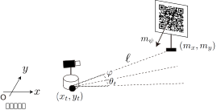
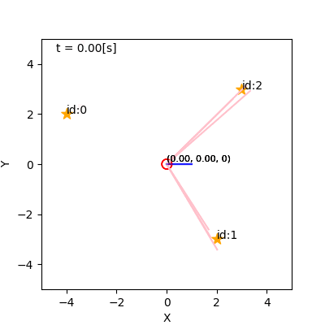
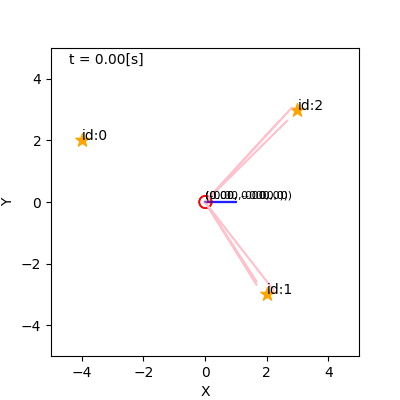
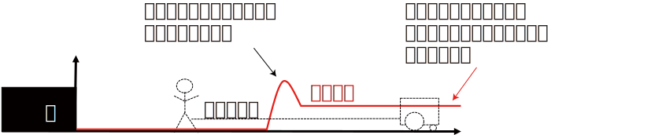
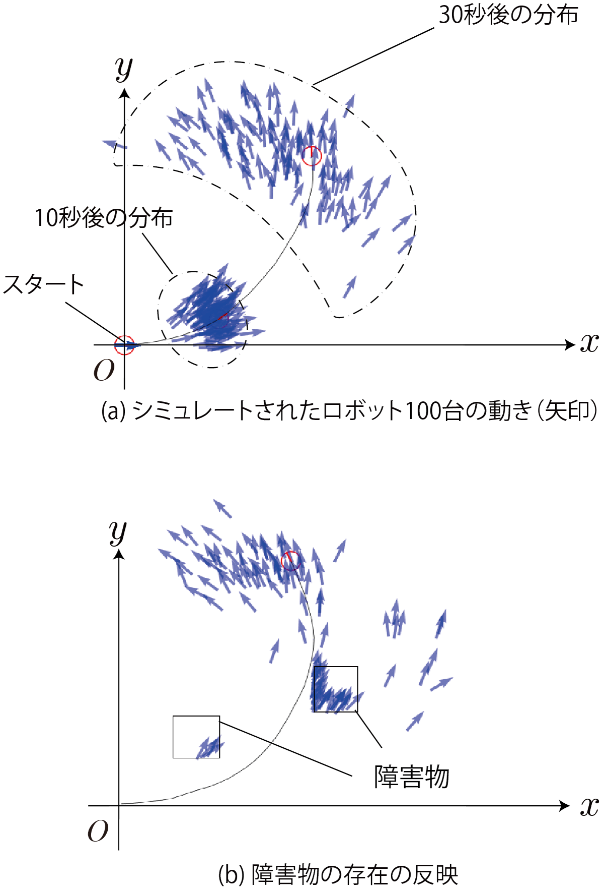
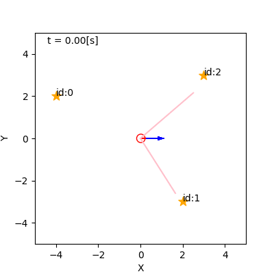
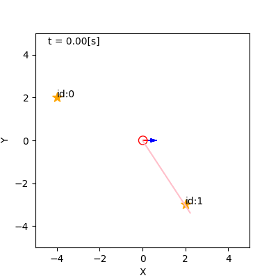
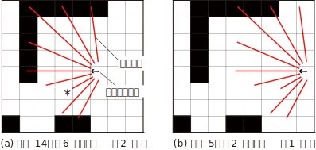

<!-- footer: Probabilistic Robotics Lesson 7 -->

# Probabilistic Robotics Lesson 7: Sensing and Estimation (Part 2)

Ryuichi Ueda, Chiba Institute of Technology

 

This work is licensed under a <a rel="license" href="http://creativecommons.org/licenses/by-sa/4.0/">Creative Commons Attribution-ShareAlike 4.0 International License</a>.

---

<!-- paginate: true -->

## Contents

- Implementing a Bayesian filter
    - Kalman filter (linear case)
    - Kalman filter (nonlinear case, also Known as an extended Kalman filter)
    - Particle filter

---

### Review of Last Time's Topic

- Bayesian Filter
    - Consists of the following two equations
        - When the robot moves: $\hat{b}_t(\boldsymbol{x}) = \big\langle p(\boldsymbol{x}| \boldsymbol{x}_{t-1} , \boldsymbol{u}_t) \big\rangle_{b_{t-1}(\boldsymbol{x}_{t-1}) }$
        - When information is obtained: $b_t(\boldsymbol{x}) = \eta L(\boldsymbol{x} | Z_t) \hat{b}_t(\boldsymbol{x})$
    - $b_t$ is calculated from $b_0$ by repeating the following calculations.
    - Converting motion and information into a belief distribution.
- How is this implemented?

---

## Kalman Filter (Linear Case)

- Linear: The observation equation can be written in linear form.
    - $\boldsymbol{z} = H \boldsymbol{x} + \boldsymbol{c} + \boldsymbol{\varepsilon}$
        - Time subscripts are omitted.
        - $\boldsymbol{z}$: Information (must be a vector).
        - $\boldsymbol{c}$: Constant term.
        - $\boldsymbol{\varepsilon}$: Noise.
        - $H$: (together with $\boldsymbol{c}$) A matrix that models the sensor values obtained at location $\boldsymbol{x}$.
- Probabilistic observation equation notation (assuming $\boldsymbol{\varepsilon}$ follows a Gaussian distribution).
    - $\boldsymbol{z} \sim \mathcal{N}(\boldsymbol{z} | H\boldsymbol{x} + \boldsymbol{c}, Q)$
        - $Q$: Noise covariance matrix

---

## Example of a Kalman filter

Assume the following case:

- State (position and orientation): $\boldsymbol{x} = (x \ y \ \theta)^\top$
    - The $x$ and $y$ axes correspond to the latitude and longitude directions, respectively.
- Observation: $\boldsymbol{z} = (p_\text{la} \ p_\text{lo} \ \varphi)^\top$
    - Latitude $p_\text{la}$ and longitude $p_\text{lo}$ are obtained directly from the GNSS (with error).
    - Direction $\varphi$ information is obtained from the gyro (with error).

---

### The observation equation (likelihood function) is as follows:

- $\boldsymbol{z} \sim \mathcal{N}(\boldsymbol{z} | H\boldsymbol{x} + \boldsymbol{c}, Q)$
    - $\boldsymbol{z} = (p_\text{la}, p_\text{lo},\varphi)$
    - $H = \begin{pmatrix}
\alpha_\text{la} & 0 & 0 \\
0 & \alpha_\text{lo} & 0 \\
0 & 0 & 1
\end{pmatrix}$
        - $\alpha_\text{la}, \alpha_\text{lo}$: Latitude and longitude per meter
    - $\boldsymbol{c} = (p_\text{la} \ p_\text{lo} \ \varphi_0)^\top$
        - Both are variables for adjusting the origin.
    - $Q$: Measured error magnitude and converted into a covariance matrix.
         - In this case, it seems appropriate to only enter values on the diagonal elements (variance).

---

- The right-hand side is the likelihood function (measured likelihood of $\boldsymbol{z}\rightarrow \boldsymbol{x}$).

---

### Update equation when information is obtained.

- $b_t(\boldsymbol{x}) = \eta L(\boldsymbol{x} | Z_t) \hat{b}_t(\boldsymbol{x})= \eta \mathcal{N}(\boldsymbol{z}_t | H\boldsymbol{x} + \boldsymbol{c}, Q) \mathcal{N}(\boldsymbol{x} | \hat{\boldsymbol{\mu}}_t, \hat{\Sigma}_t)$
    - $\hat{\boldsymbol{\mu}}_t, \hat{\Sigma}_t$ are the mean and covariance matrices of $\hat{b}_t$, respectively.
- The formula has the same form as an equation in Lecture 4: $p(\boldsymbol{x}) = \eta \mathcal{N}(\boldsymbol{a} | A\boldsymbol{x} + \boldsymbol{b}, sB)\mathcal{N}(\boldsymbol{x} | \boldsymbol{c}, sC)$.
    - $p(\boldsymbol{x}) = \eta s^{-1/2}e^{-U/2s} \mathcal{N}(\boldsymbol{x} | \boldsymbol{d} , sD) = \eta \mathcal{N}(\boldsymbol{x} | \boldsymbol{d} , sD)$
        - $D^{-1} = A^\top B^{-1} A + C^{-1}$
        - $\boldsymbol{d} = D \left\{ A^\top B^{-1}(\boldsymbol{a}- \boldsymbol{b} ) + C^{-1}\boldsymbol{c} \right\}$
- Let $b_t = \mathcal{N}(\boldsymbol{\mu}_t, \Sigma_t)$, and find $\boldsymbol{\mu}_t, \Sigma_t$.
* $\boldsymbol{a} = \boldsymbol{z}_t$, $A = H$, $\boldsymbol{b} = \boldsymbol{c}$, $s=1$, $B = Q$, $\boldsymbol{c} = \hat{\boldsymbol{\mu}}_t$, $C=\hat\Sigma_t$ 
    - $\Sigma_t^{-1} = H^\top Q^{-1} H + \hat\Sigma_t^{-1}$ 
    - $\boldsymbol{\mu}_t = \Sigma_t \big\{ H^\top Q^{-1}(\boldsymbol{z}_t- \boldsymbol{c} ) + \hat\Sigma_t^{-1}\hat{\boldsymbol{\mu}}_t \big\}$

---

### Introducing the Kalman Gain

- The last two equations on the previous page allowed us to incorporate GNSS and gyro values into the distribution.
    - However, we can simplify things further, so let's continue the calculation.
- Introducing the following notation:
    - $K_t = \Sigma_t H^\top Q^{-1}$: Kalman Gain (We'll explain what this is later.)
    - $\hat{\boldsymbol{z}}_t = H \hat{\boldsymbol{\mu}}_t + \boldsymbol{c}$: Sensor data likely to be obtained at the center of the distribution $\hat{b}_t$
- Rearranging $\boldsymbol{\mu}_t = \Sigma_t \big\{ H^\top Q^{-1}(\boldsymbol{z}_t- \boldsymbol{c} ) + \hat\Sigma_t^{-1}\hat{\boldsymbol{\mu}}_t  \big\}$ (Let's try it)
    * $= K_t (\boldsymbol{z}_t- \boldsymbol{c} ) + \Sigma_t(\Sigma_t^{-1} - H^\top Q^{-1}H)\hat{\boldsymbol{\mu}}_t$
$= K_t (\boldsymbol{z}_t- \boldsymbol{c} ) + (I - K_t H)\hat{\boldsymbol{\mu}}_t$
$= K_t (\boldsymbol{z}_t- \boldsymbol{c} - H \hat{\boldsymbol{\mu}}_t) + \hat{\boldsymbol{\mu}}_t$
$= K_t (\boldsymbol{z}_t- \hat{\boldsymbol{z}}_t) + \hat{\boldsymbol{\mu}}_t$

---

### Introducing the Kalman Gain (continued)

- Transforming $\Sigma_t^{-1} = H^\top Q^{-1} H + \hat\Sigma_t^{-1}$ (Let's try this too)
    * $I = \Sigma_t H^\top Q^{-1} H +\Sigma_t \hat\Sigma_t^{-1} \Longrightarrow
I = K_t H +\Sigma_t \hat\Sigma_t^{-1}$
$\Longrightarrow
\hat\Sigma_t = K_t H\hat\Sigma_t +\Sigma_t \Longrightarrow
\Sigma_t = (I - K_t H)\hat\Sigma_t$
- Summary
    - $\boldsymbol{\mu}_t = K_t (\boldsymbol{z}_t- \hat{\boldsymbol{z}}_t) + \hat{\boldsymbol{\mu}}_t$
        - New estimated pose $= K_t$(actual information $-$ expected information for the original estimated pose) $+$ Original estimated pose
- $\Sigma_t = (I - K_t H)\hat\Sigma_t$
- Reduce the covariance matrix by the amount of information gained.

$\Longrightarrow$Kalman gain: The strength of the influence of observations on the belief distribution

---

### Modification of the Kalman gain

- $K_t = \Sigma_t H^\top Q^{-1}$ cannot be calculated because $\Sigma_t$ is on the right-hand side.
    - Remove $\Sigma_t$
        - Substitute $\Sigma_t^{-1} = H^\top Q^{-1} H + \hat\Sigma_t^{-1}$
        - Use Woodbury's formula
           - $(A + BDC)^{-1} = A^{-1} - A^{-1}B(D^{-1} + CA^{-1} B)^{-1} CA^{-1}$
- Answer
    * $K_t = \{ \hat{\Sigma}_t - \hat{\Sigma}_t H^\top ( Q + H\hat{\Sigma}_t H^\top )^{-1} H\hat{\Sigma}_t \} H^\top Q^{-1}$
$= \hat{\Sigma}_t H^\top Q^{-1} - \hat{\Sigma}_t H^\top ( Q + H\hat{\Sigma}_t H^\top )^{-1} H\hat{\Sigma}_t H^\top Q^{-1}$
$= \hat{\Sigma}_t H^\top Q^{-1} - \hat{\Sigma}_t H^\top ( Q + H\hat{\Sigma}_t H^\top )^{-1} (Q + H\hat{\Sigma}_t H^\top ) Q^{-1}$
$+ \hat{\Sigma}_t H^\top ( Q + H\hat{\Sigma}_t H^\top )^{-1}QQ^{-1}$
$= \hat\Sigma_t H^\top (Q + H \hat\Sigma_t H^\top)^{-1}$

---

### Kalman filter

- Summary of the above results and the equation for movement in Lesson 6
    - When the robot moves
        - $\hat{\boldsymbol{\mu}}_t = \boldsymbol{\mu}_{t-1} + \overline{\Delta \boldsymbol{x}_t}$ (Recap: Add the average displacement to the original average position)
        - $\hat{\Sigma}_{t-1} = \Sigma_t + S_t$ (Recap: Add the uncertainty of the displacement)
- When the robot observes
    - $K_t = \hat\Sigma_t H^\top ( H \hat\Sigma_t H^\top + Q )^{-1}$
    - $\boldsymbol{\mu}_t = K_t (\boldsymbol{z}_t- \hat{\boldsymbol{z}}_t) + \hat{\boldsymbol{\mu}}_t$
    - $\Sigma_t = (I - K_t H)\hat\Sigma_t$
- The above update equation is called the Kalman filter.
    - Implementing a Bayesian filter using Gaussian distribution operations.

---

## Extended Kalman filter

- How do we apply the Kalman filter in nonlinear cases?
    - Linearize as in the Lesson 6.
- Example: Observe a point landmark with a camera (camera position = robot position).
    - The distance $\ell$ to the landmark and the direction $\varphi$ from the robot to the landmark can be measured.
    - The direction $\psi$ of the landmark itself can also be measured.
    - Landmark position and direction: $(m_x \ m_y \ m_\psi)^\top$

$\qquad\qquad\qquad\qquad\qquad\qquad$

---

### Observation model and likelihood function

- Observation model: $\boldsymbol{z}_t \sim \mathcal{N}\left[ \boldsymbol{h}(\boldsymbol{x}_t), Q_t(\boldsymbol{x}_t) \right]$
    - Observation equation $\boldsymbol{h}(\boldsymbol{x}_t)$: The mean value of the vector of sensor values obtained at $\boldsymbol{x}_t$
        - Elements are $\ell, \varphi, \psi$ ($\boldsymbol{z}_t$ is a vector in the space of sensor values)
    - $Q_t(\boldsymbol{x}_t)$: The noise covariance matrix at $\boldsymbol{x}_t$
        - Preliminary approximation of $Q_t(\boldsymbol{x}_t)$: Approximate the covariance matrix at the center $\hat{\boldsymbol{\mu}}_t$ of $\hat{b}_t$
           - $Q_t(\boldsymbol{x}_t)\simeq Q_t(\hat{\boldsymbol{\mu}}_t)$
           - From now on, $Q_t(\hat{\boldsymbol{\mu}}_t)$ will be simply referred to as $Q_t$.
- Likelihood function: $L(\boldsymbol{x}_t |\boldsymbol{z}_t) = \mathcal{N}\left[ \boldsymbol{h}(\boldsymbol{x}_t), Q_t(\boldsymbol{x}_t) \right] \simeq \mathcal{N}(\boldsymbol{h}(\boldsymbol{x}_t), Q_t)$
    - Linearization is required
        - Approximate $\boldsymbol{h}$ to a linear equation such as $\boldsymbol{z} = H\boldsymbol{x} + \boldsymbol{c}$

---

### Linear approximation of the observation equation

- $\boldsymbol{h}(\boldsymbol{x}) \simeq \boldsymbol{h}(\hat{\boldsymbol{\mu}}_t) + H_t (\boldsymbol{x} - \hat{\boldsymbol{\mu}}_t)$
    - Value at the center of the distribution + Variation due to deviation from the center
    - $H_t = \dfrac{\partial \boldsymbol{h}}{\partial \boldsymbol{x}}\Big|_{\boldsymbol{x} = \hat{\boldsymbol{\mu}}_t}$
        - We'll consider the specific value of $H_t$ later.
- Simplifying the approximate equation
    - $\boldsymbol{h}(\boldsymbol{x}) \simeq H_t \boldsymbol{x} + \boldsymbol{c}_t$
        - $\boldsymbol{c}_t = \boldsymbol{h}(\hat{\boldsymbol{\mu}}_t) - H_t \hat{\boldsymbol{\mu}}_t = \hat{\boldsymbol{z}}_t - H_t \hat{\boldsymbol{\mu}}_t$

---

### Derivation of the Extended Kalman Filter

- $b_t(\boldsymbol{x}) = \eta \mathcal{N}(\boldsymbol{z}_t | H_t\boldsymbol{x} + \boldsymbol{c}_t, Q_t) \mathcal{N}(\boldsymbol{x} | \hat{\boldsymbol{\mu}}_t, \hat\Sigma_t)$
    - (Recap) Linear equation: $b_t(\boldsymbol{x}) = \eta \mathcal{N}(\boldsymbol{z}_t | H\boldsymbol{x} + \boldsymbol{c}, Q) \mathcal{N}(\boldsymbol{x} | \hat{\boldsymbol{\mu}}_t, \hat\Sigma_t)$
        - Almost identical to p.7

---

### Extended Kalman Filter

Combined with the equation for movement in Lesson 6, we get the following:

- When the robot moves
    - $\hat{\boldsymbol{\mu}}_t = \boldsymbol{\mu}_{t-1} + \overline{\Delta \boldsymbol{x}}_t$
    - $\hat\Sigma_t = F_{t-1} \Sigma_{t-1} F_{t-1}^\top + T_{t-1} S_t T_{t-1}^\top$
- When the robot observes
    - $K_t = \hat\Sigma_t H_t^\top ( H_t \hat\Sigma_t H_t^\top + Q_t )^{-1}$
    - $\boldsymbol{\mu}_t = K_t (\boldsymbol{z}_t- \hat{\boldsymbol{z}}_t) + \hat{\boldsymbol{\mu}}_t$
    - $\Sigma_t = (I - K_t H_t)\hat\Sigma_t$

---

### Application to the Example Problem: Formulate the Observation Equation

- Calculate the Obtained Sensor Value (Details Omitted)
    - $\varphi = \arctan \{(m_y - y_t)/(m_x - x_t)\} - \theta_t$
    - $\ell = \{(m_x - x_t)^2 + (m_y - y_t)^2 \}^{1/2}$ 
    - $\psi = m_\psi - \theta_t - \pi$
- Observation equation: $\boldsymbol{h}(\boldsymbol{x}_t) =$
$\begin{pmatrix} 
\arctan \{ (m_y - y_t)/(m_x - x_t) \} - \theta_t \\ 
\{(m_x - x_t)^2 + (m_y - y_t)^2 \}^{1/2} \\ 
m_\psi - \theta_t - \pi 
\end{pmatrix}$

---

### Application to an Example: Calculating the Jacobian Matrix $H_t$

- $H_t = \left. \dfrac{\partial \boldsymbol{h}}{\partial \boldsymbol{x}}\right|_{\boldsymbol{x} = \hat{\boldsymbol{\mu}}_t} = ...$ (Let's calculate it.)
    * $= \left.
\begin{pmatrix}
(m_y-y) / \ell(\boldsymbol{x_t})^2 & (x - m_x) / \ell(\boldsymbol{x_t})^2 & -1 \\
(x - m_x) / \ell(\boldsymbol{x_t}) & (y - m_y) / \ell(\boldsymbol{x_t}) & 0 \\
0 & 0 & -1
\end{pmatrix} \right|_{\boldsymbol{x} = \hat{\boldsymbol{\mu}}_t}$ 
$= 
\begin{pmatrix} 
(m_y-\hat\mu_{yt}) / \ell(\hat{\boldsymbol{\mu}}_t)^2 & (\hat\mu_{xt} - m_x) / \ell(\hat{\boldsymbol{\mu}}_t)^2 & -1 \\ 
(\hat\mu_{xt} - m_x) / \ell(\hat{\boldsymbol{\mu}}_t) & (\hat\mu_{yt} - m_y) / \ell(\hat{\boldsymbol{\mu}}_t) & 0 \\ 
0 & 0 & -1 
\end{pmatrix}$ 
        - $\hat{\boldsymbol{\mu}}_t = (\hat\mu_{xt},\hat\mu_{yt},\hat\mu_{\theta t})$
        - $\ell(\boldsymbol{x}) = \{(m_x - x)^2 + (m_y - y)^2 \}^{1/2}$

---

### Application to Example Problem: Determining $Q_t$

(This seems to be missing from the textbook.)

- Create by measuring or estimating the variances for $\ell, \varphi, and \psi$
- Example: $Q_t = \text{diag}( \sigma_\varphi^2, \sigma_\ell^2, \sigma_\psi^2 )$
    - $\sigma_\ell$: Increase the value depending on the distance (e.g., $\sigma_\ell = \sigma_\ell' \ell(\hat{\boldsymbol{\mu}}_t)$)
    - $\sigma_\varphi, \sigma_\psi$ are constants

---

### Example (from the orange book)

- Left: No observation. Right: Observation.
- There is no $\psi$
    - $H_t$ and $Q_t$ are $2\times 2$ matrices, but that's not a problem.
    - Let's think about why we can use this to estimate $(x, y, \theta)$.

---

## Particle Filter

- Bayesian filter using Monte Carlo methods
- Used over Kalman filters for mobile robots
    - Suitable for simulating collisions with walls, as in the example in Part 6 (However, there are few implementations that simulate it.)
- Noise often does not follow a Gaussian distribution
    - LiDAR data: While it's rare to measure the distance to an object from a distance, it's common to measure it from a distance as a person passes by.

$\qquad\qquad\qquad$

---

### Particle (Redefinition)

- Adding a "weight" variable to the particle from Lesson 6
    - $\xi_t^{(i)} = (\boldsymbol{x}_t^{(i)}, w_t^{(i)}) = (x_t^{(i)},y_t^{(i)},\theta_t^{(i)}, w_t^{(i)})$
$(i=1,2,\dots,N)$
        - Each arrow in the right figure has a weight.
    - Set: $\xi_t^{(1:N)} = \{\xi_t^{(1)}, \xi_t^{(2)}, \dots, \xi_t^{(N)}\}$
- Defines an approximation method for the probability that the true pose $\boldsymbol{x}^*$ is within $X$.
    - $\text{Pr}\{ \boldsymbol{x}^* \in X \} \simeq \sum_{i=1}^N w_t^{(i)} \delta(\boldsymbol{x}_t^{(i)} \in X)$
        - $\delta(\cdot)$: 1 if the value in the parentheses is true, 0 if false.
- Set of particles before applying sensor info.: $\hat{\xi}_t^{(1:N)}$

---

### Particle processing when applying sensor information

- Reflect information $Z_t$ in $\hat{\xi}_t^{(1:N)}$ to get $\xi_t^{(1:N)}$.
- Use the likelihood function value as the weight.
    - $w_t^{(i)} = \eta L(\boldsymbol{x}_t^{(i)} | Z_t)$
    - Leave the posture unchanged ($\hat{\boldsymbol{x}}_t^{(i)} \rightarrow \boldsymbol{x}_t^{(i)}$).
- $w_t^{(i)}$ is the probability assigned by the Monte Carlo method.
    - The calculation of $\eta$ can be omitted and the results can be reconciled using the next step.

---

### Particle processing when the robot moves

- Reflect the control command $\boldsymbol{u}_t$ in $\xi_t^{(1:N)}$ to $\hat{\xi}_{t+1}^{(1:N)}$.
- Instead of simply moving each particle, resampling is used.
    - Prevent weight imbalance and propagate particles with high weights.
- Example
    - Left: No resampling (weights are multiplied by likelihood).
    - Right: With resampling.

---

### Resampling procedure (naive)

- Repeat the following to create $\hat{\xi}_{t+1}^{(i)} \ (i=1,2,\dots,N)$.
- 1: Select one particle $\xi' = (\boldsymbol{x}', w')$ from $\xi_t^{(1:N)}$ with a probability proportional to the weight.
- 2: $\hat{\boldsymbol{x}}_{t+1}^{(i)} \sim p(\boldsymbol{x} | \boldsymbol{u}_t, \boldsymbol{x}')$
- 3: $\hat{w}_{t+1}^{(i)} = 1/N$
- The above method is computationally intensive and biased, so a better method (systematic sampling) is used in implementation.

---

### Summary of Particle Filter

- Reflecting Sensor Information:
- For $i=1,2,\dots,N$
- $w_t^{(i)} = \eta L(\boldsymbol{x}_t^{(i)} | Z_t)$
- Reflection of movement:
- For $i=1,2,\dots,N$
- $\xi' = (\boldsymbol{x}', w') \sim \xi_t^{(1:N)}$ (weights are the probability of selection)
- $\hat{\boldsymbol{x}}_{t+1}^{(i)} \sim p(\boldsymbol{x} | \boldsymbol{u}_t, \boldsymbol{x}')$

This is an approximation of a Bayesian filter.

---

### Application of particle filters

(See YouTube for examples)

- Often used in mobile robots using laser scanners.
- Likelihood function: Designed by comparing with the following "occupancy grid map" (likelihood field).
- The likelihood increases when the tip of the scan hits a grid containing a recorded obstacle.
- In practice, a gray area is added, but this simple model works well.
- Even if there are obstacles not on the map, the score does not drop significantly.

---

## Summary

- We've looked at the implementation of Bayesian filters.
- Kalman filters, extended Kalman filters, and particle filters.
- Kalman filters are still commonly used for machine control.
- Particle filters are still commonly used for mobile robots.
- However, newer methods exist, so keep an eye on trends.
