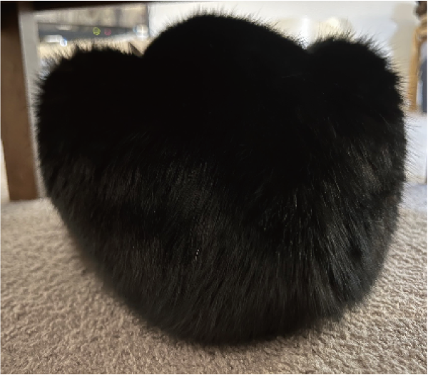

<!-- footer: 確率ロボティクス第8回 -->

# 確率ロボティクス第8回: 機械学習（その1）

千葉工業大学 上田 隆一

 

This work is licensed under a <a rel="license" href="http://creativecommons.org/licenses/by-sa/4.0/">Creative Commons Attribution-ShareAlike 4.0 International License</a>.

---

<!-- paginate: true -->

## 今回の内容

- 機械学習、深層学習

---

### 実世界のもの

- 机の上で考えたものと異なり、現実の物体や物事の「特徴量」はなにか分からない
    - そのものだけを見ても分からないこともある
    - 右図のものが猫と分かる場合、たぶんこういうこともヒントになっている
        - 背景（絨毯など）
        - 講師のプライベートに関する知識（黒猫を飼っているとか）

