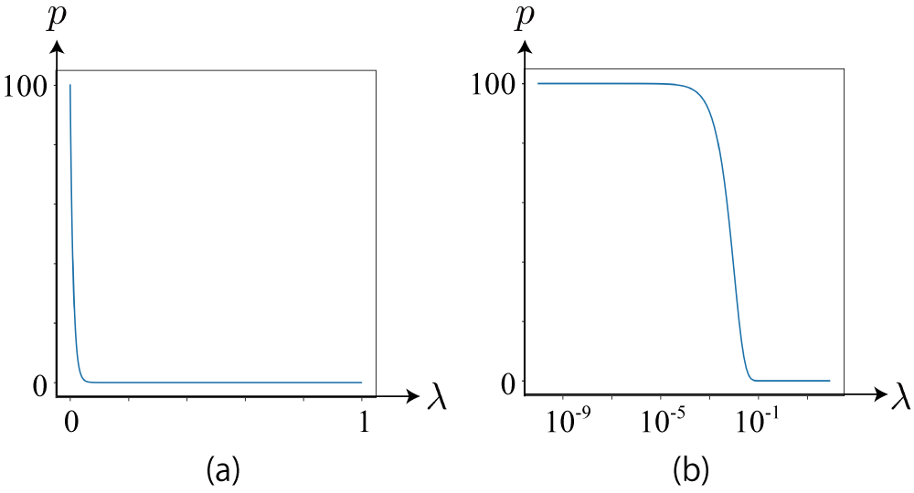

<!-- footer: 確率ロボティクス第8回 -->

# 確率ロボティクス第8回: 機械学習（その1）

千葉工業大学 上田 隆一

 

This work is licensed under a <a rel="license" href="http://creativecommons.org/licenses/by-sa/4.0/">Creative Commons Attribution-ShareAlike 4.0 International License</a>.

---

<!-- paginate: true -->

## 今回の内容

- 最小二乗法・損失関数
- 最小二乗法が解析的に解けない場合について
- ベイズ線形回帰

---

## その前に（アドバンストビジョンの第1回から）

- 神経細胞のおさらい
    （https://commons.wikimedia.org/wiki/File:Retina-diagram.svg, by S. R. Y. Cajal and Chrkl, CC-BY-SA 3.0）
    - 左から光が入って右側の視細胞（2種類、1.3億個）で受け止め電気信号に
    - 電気信号は右に向かって処理されて図の下向きの赤い線から脳へ
        - 網膜の各部分の赤い線が「視神経（100万個）」の束になって脳に
- こんな構造なので
    - 何か見ると1.3億のバラバラな信号として入る
        - 白黒の絵の場合は1.3億のスイッチのON/OFFの信号に単純化できる

なんでバラバラなのに形がわかるの？

---

### 基本的な考え方

- データはなにか原因があって発生している
    - 目の前にピンクの服を着た夫妻がいるので視細胞にピンク色の信号が多く入るなど
- 原因を数理モデルにすると、そこから観測されるデータが発生すると考えられる
    - 例1: 原因が関数$\boldsymbol{y} = f(\boldsymbol{x})$
        - データ$(\boldsymbol{x}, \boldsymbol{y})_1, (\boldsymbol{x}, \boldsymbol{y})_2,\dots,(\boldsymbol{x}, \boldsymbol{y})_N$が観測される
    - 例2: 原因が確率分布$\boldsymbol{x} \sim P$
        - データ$\boldsymbol{x}_1, \boldsymbol{x}_2, \dots, \boldsymbol{x}_N$が観測される（なんらかの特徴ある分布を作る）

$\qquad$原因$f$や$P$をデータから逆算する問題$\Rightarrow$回帰問題（自己位置推定もその一種）

---

### 回帰問題の解き方

- 最小二乗法から人工ニューラルネットワーク（ANN）まで様々
- とりあえず基本の最小二乗法から見ていきましょう
    - 話の流れ: 最小二乗法は確率的ではないので限界がある$\rightarrow$確率を導入

---

## 最小二乗法

- 横軸の値（$x$）に対して、縦軸の値の傾向$y = f(x)$を求める
    - 例（[日本病院薬剤師会](https://www.jshp.or.jp/)のデータ）
        - 知りたいこと
            - 身長に対して体重はどんな法則性があるか？
            - 血圧に対して中性脂肪の濃度はどんな法則性があるか？
        - 縦の分布が大きいが、とりあえず中心となる法則性を見つけたい
        （例として出しただけで解きませんが）

---

### 回帰を使う場面

右のデータなら確率分布を当てはめてもよさそう

- 横軸の分布を考える意味がない/興味がない
    - 意味がない場合: 時系列データなど
    （例: 株価、人口の推移）
        - 時間を分布で扱う必要はない

---

### 最小二乗法による一次方程式のあてはめ

- 点$(x, y)_{1:N}$に対し、直線$y=w_1 x + w_0$が真ん中を通る$w_1, w_0$を求める
    - $w_1$が傾き、$w_0$が切片
    - おそらくどこかで勉強した、一番基本的な回帰

 

どうやって「真ん中」を決めるか?

---

### どうやって「真ん中」を決めるか

- 線とそれぞれの点の$y$軸方向の距離を損失と考えて、距離の2乗を足して最小化
    - 損失関数$\mathcal{L}(w_{0:1}| x_{1:N}, y_{1:N}) = \{w_1 x_1 + w_0 -y_1\}^2$
    $\qquad\qquad+\{w_1 x_2 + w_0 -y_2\}^2+\dots$
    $\qquad\qquad+\{w_1 x_N + w_0 -y_N\}^2$
    $= \sum_{i=1}^N \{w_1 x_i + w_0 -y_i\}^2$の値を最小化
    - なんで2乗?: 必然性はないが分散を最小にしたいと解釈すれば自然
- 損失関数はANNでも重要
    - やっていることはあまり変わらない

---

### 損失関数を最小化するパラメータの導出

- 損失関数をパラメータで偏微分して、$0$になるパラメータを求める
    - $\nabla \mathcal{L}(w_{0:1} | x_{1:N}, y_{1:N} ) = \left( \dfrac{\partial\mathcal{L}}{\partial w_0},  \dfrac{\partial\mathcal{L}}{\partial w_1} \right) = \boldsymbol{0}$
        - $w_0$、$w_1$をどうずらしてもそれ以上$\mathcal{L}$の値が変わらない
        $\Rightarrow$ほかにそういう点がなければそのときの値が$\mathcal{L}$の最小値
- 前ページの式を解いてみましょう
    - $\mathcal{L}(w_{0:1}| x_{1:N}, y_{1:N}) = \sum_{i=1}^N \{w_1 x_i + w_0 -y_i\}^2$
        - $w_0$、$w_1$それぞれで微分したもので連立方程式をたてる

---

### 答え

 $(x,y) = (x \ y)^\top$としています

- $\nabla L(w_{0:1}) = 2 \sum_{i=1}^N \begin{pmatrix}
    \left\{ (w_1 x_i + w_0 ) - y_i  \right\} \\
    \left\{ (w_1 x_i + w_0 ) - y_i  \right\}x_i
    \end{pmatrix}$
    $= 2N \begin{pmatrix}
    w_1 \bar{x} + w_0 - \bar{y}\\
    w_1 \overline{x^2} + w_0 \bar{x} - \overline{xy}
    \end{pmatrix} = \boldsymbol{0}$（$\overline{\ }$は平均値）
$\Longrightarrow (w_0 , w_1) = \left(
\dfrac{\overline{x^2}\bar{y} - \overline{xy}\bar{x}}{\overline{x^2} - \bar{x}^2},
\dfrac{\overline{xy} - \bar{x}\bar{y}}{\overline{x^2} - \bar{x}^2}
\right)$
- 問題が数式の変形で解けてしまうのでANNを使う必要がない

---

### 計算してみましょう

- $(x,y) = (2,3), (6,2), (-3,1), (-6,2)$に対して最小二乗法を適用
- 式（さっき求めたもの）: $(w_0 , w_1) = \left(
\dfrac{\overline{x^2}\bar{y} - \overline{xy}\bar{x}}{\overline{x^2} - \bar{x}^2},
\dfrac{\overline{xy} - \bar{x}\bar{y}}{\overline{x^2} - \bar{x}^2}
\right)$

---

### 答え

- $(x,y) = (2,3), (6,2), (-3,1), (-6,2)$に対して最小二乗法を適用
    - 各種平均値を計算
        - $\overline{x}= -1/4$
        - $\overline{y}= 2$
        - $\overline{x^2}= 85/4$
        - $\overline{xy}= 3/4$
    - $w_0 = (\overline{x^2}\bar{y} - \overline{xy}\bar{x})/(\overline{x^2} - \bar{x}^2)= 2.01$
    - $w_1 = (\overline{xy} - \bar{x}\bar{y})/(\overline{x^2} - \bar{x}^2)= 0.0590$
    $\Longrightarrow y=0.0590 x + 2.01$

---

## （偏）微分方程式で解けない場合の最適化

- $n$個のパラメータで構成される損失関数の最適化を考えてみましょう
    - $\mathcal{L}(w_{1:n}| x_{1:N}, y_{1:N})$
        - どうやって$w_{1:n}$をいじって$\mathcal{L}$の値を減らすか
- ためしに$\Delta w_{1:n}$だけずらしてみる
    - $\mathcal{L}(w_{1:n}| x_{1:N}, y_{1:N})$が$\mathcal{L}(w_{1:n} + \Delta w_{1:n}| x_{1:N}, y_{1:N})$に
        - 後者の値が小さくなったら$w_{1:n}$を$w_{1:n} + \Delta w_{1:n}$に変更すると
        「よりよく」なる
    - 問題: いろいろ$\Delta w_{1:n}$を試すとよいんだけどパラメータが多いと組み合わせが多くて大変
    $\Rightarrow$計算で一番よい$\Delta w_{1:n}$を求められないだろうか?

---

### ふたたび偏微分

- $\nabla \mathcal{L}(w_{1:n} | x_{1:N}, y_{1:N} ) = \left( \dfrac{\partial\mathcal{L}}{\partial w_0},  \dfrac{\partial\mathcal{L}}{\partial w_1}, \dots, \dfrac{\partial\mathcal{L}}{\partial w_n} \right)$
    は、$w_0, w_1, \dots, w_n$それぞれを少しずらしたときの$\mathcal{L}$の変化量
- 変化量の計算
    - $\Delta \mathcal{L} = \dfrac{\partial \mathcal{L}}{\partial w_1}\Delta w_1 + \dfrac{\partial \mathcal{L}}{\partial w_2} \Delta w_2 + \dots \dfrac{\partial \mathcal{L}}{\partial w_m} \Delta w_m = \nabla \mathcal{L}(w_{1:n})^\top \Delta w_{1:n}$
- わかること
    - $|\Delta w_{1:n}| \le \alpha$という制限がある場合、最も減るのは内積が最小になる$\Delta w_{1:n} = - \alpha \nabla \mathcal{L}(w_{1:n})$のとき
        - $\nabla \mathcal{L}(w_{1:n})$: 勾配ベクトル
    - 上記の赤字の式にしたがってパラメータを更新すればよい
        - これがANNのやっていること

---

### 最小二乗法と損失関数に関するまとめ

- 損失関数を偏微分して連立方程式を解ければ、任意の式に最小二乗法（と、その他さまざまな最適化手法）を適用可能
- 連立方程式が解けない場合は勾配ベクトルにしたがって少しずつパラメータを変更していけば良いパラメータが見つかる
    - 具体例はアドバンストビジョンに
- しかし、なにか足りないんじゃないでしょうか?
    - 前回（ベイズの定理）の話を踏まえるとなにか抜けてないか?

---

### 残った問題

- 最小二乗法は1つの答えしか出さない
   - 「自信のなさ」が表現できない
   - データ4つで右上図のように当てはめしてよい?
   - $\mathcal{L}$の大小で当てはまりの良さは比較できるが、どれだけ自信がないかは分からない
- パラメータの数が多いと「過学習」
   - データを曲線でつないだグラフができる
   $\rightarrow$正しいこともあるが、単にデータが少ないだけかもしれない
   - 人間でもよくある

---

## ベイズ線形回帰

- $y = f(x)$の分布を考える
    - 関数の分布ってなに? $\Rightarrow$ パラメータの分布
- 例: $y = w_1 x + w_0$の場合
    - $w_1$と$w_0$の確率分布を考える
    - 右図: $w_1, w_0$それぞれをガウス分布で分布すると考えてサンプリング
        - どちらも平均値$0$、標準偏差$1$
        - データ（丸印）に合うように、ベイズの定理で$w_1, w_0$の分布を変更していく

データ数が少ないときに解を曖昧にしておける

---

### ベイズ線形回帰のための数式

ややこしいので意味だけ考えましょう

- 例: 当てはめる式: 多項式 $y = w_0 + w_1 x$
- いくつか仮定を置きましょう
    - 仮定1: $x_i$に対して、$y_i$は多項式の値$w_0 + w_1 x_i$を中心に、分散$\lambda^{-1}$でばらつく
        - $y_i \sim \mathcal{N}(y | w_0 + w_1 x_i, \lambda^{-1})$と表記
        - $\lambda$: 精度

---

### 回帰のための数式（続き）

- 仮定2: $w_0, w_1$も多次元のガウス分布で、最初は大きくばらついている
    - 分布$p(\boldsymbol{w}) = \mathcal{N}(\boldsymbol{w} | \boldsymbol{\mu}, \lambda^{-1}\Lambda^{-1}) \quad$$\leftarrow$これが推定対象
        - $\boldsymbol{w} = (w_0, w_1) = (w_0 \ \ w_1)^\top$
        - $\boldsymbol{\mu} = (\mu_0, \mu_1) = (\mu_0 \ \ \mu_1)^\top$（$w_0, w_1$の平均値）
        - $\Lambda$は$2\times 2$の行列
            - $\lambda\Lambda$: 「精度行列」と呼ばれるもの

---

### 回帰のための数式（続き）

- 仮定3: $\lambda$の値も分からないので確率分布で表現（最初は大きくばらつく）
    - こういう分布: $\text{Gam}(\lambda | a, b) = \eta \lambda^{a-1}e^{-b\lambda}$（ガンマ分布）
        - 下図(a): ガンマ分布の確率分布
        - 下図(b): (a)の横軸をlog尺にしたもの
    - $\lambda = 10^{-2}$で$y_i$のばらつきの標準偏差が$10$

---

### 回帰の方法

- $w_0, w_1, \lambda$の事前分布
    - $p_0(\boldsymbol{w}, \lambda) = \mathcal{N}(\boldsymbol{w} | \boldsymbol{\mu}_0, \lambda^{-1}\Lambda^{-1}_0)\text{Gam}(\lambda| a_0, b_0)$
        - $\boldsymbol{\mu}_0, \Lambda_0, a_0, b_0$は分布の形を決めるパラメータ
        （=事前分布のパラメータ）
    - 「ガウス-ガンマ分布」と呼ばれる分布

---

### 回帰の方法（続き）

- データ$(x_1, y_1)$をひとつだけ情報として入れた事後分布
    - ベイズの定理を使う
        - $p(\boldsymbol{w}, \lambda | x_1, y_1) = \eta p(x_1, y_1 | \boldsymbol{w}, \lambda)p_0(\boldsymbol{w}, \lambda)$
        $= \eta p(y_1 | x_1, \boldsymbol{w}, \lambda)p(x_1 | \boldsymbol{w}, \lambda)p_0(\boldsymbol{w}, \lambda)$
        $= \eta p(y_1 | x_1, \boldsymbol{w}, \lambda)p_0(\boldsymbol{w}, \lambda)\qquad\qquad$（$x_1$の分布は一様分布と考える）
        $= \eta \mathcal{N}(y_1 | w_1 x_1 + w_0, \lambda^{-1} ) p_0(\boldsymbol{w}, \lambda)\quad$（仮定1から）
        $= \eta \mathcal{N}(y_1 | w_1 x_1 + w_0, \lambda^{-1} )\mathcal{N}(\boldsymbol{w} | \boldsymbol{\mu}_0, \lambda^{-1}\Lambda^{-1}_0)\text{Gam}(\lambda| a_0, b_0)$

---

### 回帰の方法（続き）

- 左辺の事後分布が同じ形だとすると、こういう等式ができる
    - $\mathcal{N}(\boldsymbol{w} | \boldsymbol{\mu}_1, \lambda^{-1}\Lambda^{-1}_1)\text{Gam}(\lambda| a_1, b_1)$
    $= \eta \mathcal{N}(y_1 | w_1 x_1 + w_0, \lambda^{-1} )\mathcal{N}(\boldsymbol{w} | \boldsymbol{\mu}_0, \lambda^{-1}\Lambda^{-1}_0)\text{Gam}(\lambda| a_0, b_0)$
        - ガウス分布の積が第4回で出てきた式: $p(\boldsymbol{x}) = \eta \mathcal{N}(\boldsymbol{a} | A\boldsymbol{x} + \boldsymbol{b}, sB) \mathcal{N}(\boldsymbol{x} | \boldsymbol{c}, sC)$と同じ形
            - $\boldsymbol{a} = y_1$，$\boldsymbol{x} = (w_0 \ w_1)^\top$, $A = (1 \ x)$，$\boldsymbol{b} = 0$，$s=\lambda^{-1}$，$B=I$，$\boldsymbol{c} = \boldsymbol{\mu}_0$，$C = \Lambda_0^{-1}$

---

- 実際に左辺はガウス-ガンマ分布となり、事後分布のパラメータはこうなる
    - $\Lambda_1 = \phi(x_1)\phi(x_1)^\top + \Lambda_0\qquad\qquad$（ここで$\phi(x) = (1 \ \  x)^\top$）
    - $\boldsymbol{\mu}_1 = \Lambda_1^{-1} \{ y_1\phi(x_1) + \Lambda_0 \boldsymbol{\mu}_0 \}$
    - $a_1 = 1/2 + a_0$
    - $b_1 = \left( y_1^2 -  \boldsymbol{\mu}_1^\top \Lambda_1 \boldsymbol{\mu}_1 + \boldsymbol{\mu}_0^\top \Lambda_0\boldsymbol{\mu}_0 \right)/2 + b_0$

---

### ポイント

- 事前確率と事後確率の分布が同じ形
    - 事前確率: $p(\boldsymbol{w}, \lambda | x_0, y_0) = \mathcal{N}(\boldsymbol{w} | \boldsymbol{\mu}_0, \lambda^{-1}\Lambda^{-1}_0)\text{Gam}(\lambda, a_0, b_0)$
    - 事後確率: $p(\boldsymbol{w}, \lambda | x_1, y_1) = \mathcal{N}(\boldsymbol{w} | \boldsymbol{\mu}_1, \lambda^{-1}\Lambda^{-1}_1)\text{Gam}(\lambda, a_1, b_1)$
- $\Lambda_1, \boldsymbol{\mu}_1, a_1, b_1$は既存の数値で計算可能$\rightarrow$事後分布が計算可能
    - 講義だとどうしても原理の話になり、それは重要なのだけど、使うときは前ページの下の4つの式に事前分布のパラメータとデータの値を入力するだけ
    - まず大事なことは、使いどころがどこなのかおさえておくこと

 

今の話、結局何をやってたのか、何に役立つのかグループで議論を

---

### データが複数の場合

- 最小二乗法のように一気に計算可能
- データ$(x,y)_{1:N}$に対する事後分布:
    - $p_N( \boldsymbol{w}, \lambda) = \eta \mathcal{N}(\boldsymbol{w} | \boldsymbol{\mu}_N, \lambda^{-1}\Lambda_N^{-1} ) \text{Gam}(\lambda | a_N, b_N)$
        - $\Lambda_N = \sum_{i=1}^N \boldsymbol{\phi}(x_i) \boldsymbol{\phi}(x_i)^\top + \Lambda_0\qquad$（データが増えて精度向上）
            - ここで$\boldsymbol{\phi}(x_i) = (1 \ \ x_i )^\top$
	    - $\boldsymbol{\mu}_N = \Lambda_N^{-1}\left( \sum_{i=1}^N y_i \boldsymbol{\phi}(x_i)+ \Lambda_0\boldsymbol{\mu}_0 \right)$（パラメータの平均値の調整）
	    - $a_N = \dfrac{N}{2} + a_0\qquad\qquad\qquad\qquad\quad$（データが増えて分布が鋭く）
	    - $b_N = \dfrac{1}{2}\left( \sum_{i=1}^N y_i^2 -  \boldsymbol{\mu}_N^\top \Lambda_N \boldsymbol{\mu}_N + \boldsymbol{\mu}_0^\top \Lambda_0\boldsymbol{\mu}_0 \right) + b_0$
            - $b_N$の式の意味はよくわかりませんが$\lambda$の平均値は$a_N/b_N$

これもデータと事前分布のパラメータを当てはめるだけ

---

### さらに$y = w_0 + w_1 x$以外の曲線を当てはめることを考えてみる 

- いろんな関数に係数をかけて足したもの
    - $y = w_0 \phi_0(x) + w_1 \phi_1(x) + w_2 \phi_2(x) + \dots = \boldsymbol{w}\cdot\boldsymbol{\phi}(x)$
        - $\boldsymbol{w} = (w_0 \ \ w_1 \ \ w_2 \ \ \cdots)^\top$
        - $\boldsymbol{\phi}(x) = (\phi_0(x) \ \ \phi_1(x) \ \ \phi_2(x) \ \ \cdots)^\top$
- $y = w_0 + w_1 x$でも難しいのに大丈夫か?$\rightarrow$大丈夫
    - 実は前ページの式がそのまま使える

---

### 例: $y = w_0 + w_1 x^1 + w_2 x^2 + w_3 x^3 + w_4 x^4$

- 少しずつデータを入力して、事後分布から関数（多項式）をサンプリング
    - データが増えるにしたがって関数のばらつきが減る
    - データ（2次関数からサンプリング）にしたがい、高次のパラメータが$0$へ

---

## まとめ

- ベイズの定理で回帰がより一般的に
    - 関数の分布=パラメータの分布と考える
    - データの不足によるあいまいさをも考慮可能に
- ベイズ線形回帰の導出
    - 難しいが結果は機械的に使用可能
    - 使いどころを間違えなければ誰にでも便利な道具に

