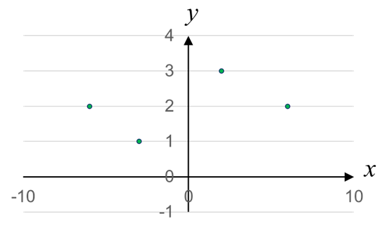

<!-- footer: 確率ロボティクス第8回 -->

# 確率ロボティクス第8回: 機械学習（その1）

千葉工業大学 上田 隆一

 

This work is licensed under a <a rel="license" href="http://creativecommons.org/licenses/by-sa/4.0/">Creative Commons Attribution-ShareAlike 4.0 International License</a>.

---

<!-- paginate: true -->

## 今回の内容

- 回帰
- 最小二乗法
- ベイズ線形回帰

---

## その前に（アドバンストビジョンの第1回から）

- 神経細胞のおさらい
    （https://commons.wikimedia.org/wiki/File:Retina-diagram.svg, by S. R. Y. Cajal and Chrkl, CC-BY-SA 3.0）
    - 左から光が入って右側の視細胞（2種類、1.3億個）で受け止め電気信号に
    - 電気信号は右に向かって処理されて図の下向きの赤い線から脳へ
        - 網膜の各部分の赤い線が「視神経（100万個）」の束になって脳に
- こんな構造なので
    - 何か見ると1.3億のバラバラな信号として入る
        - 白黒の絵の場合は1.3億のスイッチのON/OFFの信号に単純化できる

なんでバラバラなのに形がわかるの？

---

### 基本的な考え方

- データはなにか原因があって発生している
    - 目の前にピンクの服を着た夫妻がいるので視細胞にピンク色の信号が多く入るなど
- 原因を数理モデルにすると、そこから観測されるデータが発生すると考えられる
    - 例1: 原因が関数$\boldsymbol{y} = f(\boldsymbol{x})$
        - データ$(\boldsymbol{x}, \boldsymbol{y})_1, (\boldsymbol{x}, \boldsymbol{y})_2,\dots,(\boldsymbol{x}, \boldsymbol{y})_N$が観測される
    - 例2: 原因が確率分布$\boldsymbol{x} \sim P$
        - データ$\boldsymbol{x}_1, \boldsymbol{x}_2, \dots, \boldsymbol{x}_N$が観測される（なんらかの特徴ある分布を作る）

$\qquad$原因$f$や$P$をデータから逆算する問題$\Rightarrow$回帰問題（自己位置推定もその一種）

---

### 回帰問題の解き方

- 最小二乗法から人工ニューラルネットワークまで様々
- とりあえず基本の最小二乗法から見ていきましょう
    - 話の流れ: 最小二乗法は確率的ではないので限界がある$\rightarrow$確率を導入

---

## 最小二乗法

- 横軸の値（$x$）に対して、縦軸の値の傾向$y = f(x)$を求める
    - 例（[日本病院薬剤師会](https://www.jshp.or.jp/)のデータ）
        - 知りたいこと
            - 身長に対して体重はどんな法則性があるか？
            - 血圧に対して中性脂肪の濃度はどんな法則性があるか？
        - 縦の分布が大きいが、とりあえず中心となる法則性を見つけたい
        （例として出しただけで解きませんが）

---

### 回帰が適切な例

- $y=f(x)$の関係があると分かっている場合は分布の当てはめより適切
    - 時系列データなど（例: 株価、人口の推移）
        - 時間を分布で扱う必要はない
    - 実験データをナントカ方程式に当てはめてみる

---

### 最小二乗法による一次方程式のあてはめ

- 点$(x_1, y_1), (x_2, y_2), \dots, (x_N, y_N)$に対し、直線$y=w_1 x + w_0$が真ん中を通る$w_1, w_0$を求める
    - $w_1$が傾き、$w_0$が切片
    - おそらくどこかで勉強した、一番基本的な回帰

 

どうやって「真ん中」を決めるか?

---

### どうやって「真ん中」を決めるか

- 線とそれぞれの点の$y$軸方向の距離を損失と考えて、距離の2乗を足して最小化
    - 損失関数$\mathcal{L}(w_{0:1}| x_{1:N}, y_{1:N}) = \{w_1 x_1 + w_0 -y_1\}^2$
    $\qquad\qquad+\{w_1 x_2 + w_0 -y_2\}^2+\dots$
    $\qquad\qquad+\{w_1 x_N + w_0 -y_N\}^2$
    $= \sum_{i=1}^N \{w_1 x_i + w_0 -y_i\}^2$の値を最小化
    - なんで2乗?: 必然性はないが分散を最小にしたいと解釈すれば自然

---

### 損失関数を最小化するパラメータの導出

- 損失関数をパラメータで偏微分して、$0$になるパラメータを求める
    - $\nabla \mathcal{L}(w_{0:1} | x_{1:N}, y_{1:N} ) = \left( \dfrac{\partial\mathcal{L}}{\partial w_0},  \dfrac{\partial\mathcal{L}}{\partial w_1} \right) = \boldsymbol{0}$
        - $w_0$、$w_1$をどうずらしてもそれ以上$\mathcal{L}$の値が変わらない
        $\Rightarrow$ほかにそういう点がなければそのときの値が$\mathcal{L}$の最小値
- 前ページの式を解いてみましょう
    - $\mathcal{L}(w_{0:1}| x_{1:N}, y_{1:N}) = \sum_{i=1}^N \{w_1 x_i + w_0 -y_i\}^2$
        - $w_0$、$w_1$それぞれで微分したもので連立方程式をたてる

---

### 答え

 $(x,y) = (x \ y)^\top$としています

- $\nabla L(w_{0:1}) = 2 \sum_{i=1}^N \begin{pmatrix}
    \left\{ (w_1 x_i + w_0 ) - y_i  \right\} \\
    \left\{ (w_1 x_i + w_0 ) - y_i  \right\}x_i
    \end{pmatrix}$
    $= 2N \begin{pmatrix}
    w_1 \bar{x} + w_0 - \bar{y}\\
    w_1 \overline{x^2} + w_0 \bar{x} - \overline{xy}
    \end{pmatrix} = \boldsymbol{0}$（$\overline{\ }$は平均値）
$\Longrightarrow (w_0 , w_1) = \left(
\dfrac{\overline{x^2}\bar{y} - \overline{xy}\bar{x}}{\overline{x^2} - \bar{x}^2},
\dfrac{\overline{xy} - \bar{x}\bar{y}}{\overline{x^2} - \bar{x}^2}
\right)$

---

### 計算してみましょう

- $(x,y) = (2,3), (6,2), (-3,1), (-6,2)$に対して最小二乗法を適用
- 式（さっき求めたもの）: $(w_0 , w_1) = \left(
\dfrac{\overline{x^2}\bar{y} - \overline{xy}\bar{x}}{\overline{x^2} - \bar{x}^2},
\dfrac{\overline{xy} - \bar{x}\bar{y}}{\overline{x^2} - \bar{x}^2}
\right)$

---

### 答え

- $(x,y) = (2,3), (6,2), (-3,1), (-6,2)$に対して最小二乗法を適用
    - 各種平均値を計算
        - $\overline{x}= -1/4$
        - $\overline{y}= 2$
        - $\overline{x^2}= 85/4$
        - $\overline{xy}= 3/4$
    - $w_0 = (\overline{x^2}\bar{y} - \overline{xy}\bar{x})/(\overline{x^2} - \bar{x}^2)= 2.01$
    - $w_1 = (\overline{xy} - \bar{x}\bar{y})/(\overline{x^2} - \bar{x}^2)= 0.0590$
    $\Longrightarrow y=0.0590 x + 2.01$

---

## 損失関数の重要性

- ベイズの定理とともに機械学習に重要
- 「損失関数の最小化」は機械学習のほぼすべての手法で共通の考え方
    - 「最大化」の場合は符号を変えると最小化になる
    - 機械学習の一番単純な説明（1、2の繰り返し）
        - 1: なにか入力して出力を観測
        - 2: 損失関数の値が小さくなるようにパラメータを変更
    - 最小二乗法: 偏微分で最適なパラメータが分かるので学習が不要なだけ
        - 偏微分で作った連立方程式が解ければ任意の式に適用可能
        - 大規模あるいは非線形な問題では適用できない
        $\Rightarrow$様々な手法を使用

---

## 微分方程式で解けない場合の最適化

- $n$個のパラメータで構成される損失関数の最適化を考えてみましょう
    - $\mathcal{L}(w_{1:n}| x_{1:N}, y_{1:N})$
        - どうやって$w_{1:n}$をいじって$\mathcal{L}$の値を減らすか
- ためしに$\Delta w_{1:n}$だけずらしてみる
    - $\mathcal{L}(w_{1:n}| x_{1:N}, y_{1:N})$が$\mathcal{L}(w_{1:n} + \Delta w_{1:n}| x_{1:N}, y_{1:N})$に
        - 後者の値が小さくなったら$w_{1:n}$を$w_{1:n} + \Delta w_{1:n}$に変更すると
        「よりよく」なる
    - 問題: いろいろ$\Delta w_{1:n}$を試すとよいんだけどパラメータが多いと組み合わせが多くて大変
    $\Rightarrow$計算で一番よい$\Delta w_{1:n}$を求められないだろうか?

---

### ふたたび偏微分

- $\nabla \mathcal{L}(w_{1:n} | x_{1:N}, y_{1:N} ) = \left( \dfrac{\partial\mathcal{L}}{\partial w_0},  \dfrac{\partial\mathcal{L}}{\partial w_1}, \dots, \dfrac{\partial\mathcal{L}}{\partial w_n} \right)$
    は、$w_0, w_1, \dots, w_n$それぞれを少しずらしたときの$\mathcal{L}$の変化量
- 変化量の計算
    - $\Delta \mathcal{L} = \dfrac{\partial \mathcal{L}}{\partial w_1}\Delta w_1 + \dfrac{\partial \mathcal{L}}{\partial w_2} \Delta w_2 + \dots \dfrac{\partial \mathcal{L}}{\partial w_m} \Delta w_m = \nabla \mathcal{L}(w_{1:n})^\top \Delta w_{1:n}$
- わかること
    - $|\Delta w_{1:n}| \le \alpha$という制限がある場合、最も減るのは
    $\Delta w_{1:n} = - \alpha \nabla \mathcal{L}(w_{1:n})$のとき
        - 内積が最小になる
    - 上記の赤字の式にしたがってパラメータを更新すればよい

---

## まとめ

- 最小二乗法を題材にして回帰を勉強
- 損失関数を偏微分して連立方程式を解ければ、任意の式に最小二乗法（と、その他さまざまな最適化手法）を適用可能
- 連立方程式が解けない場合は偏微分した値にしたがって少しずつパラメータを変更していけば良いパラメータが見つかる
    - 具体例は人工ニューラルネットワークのところで
- しかし、なにか足りないんじゃないでしょうか?
    - 前回（ベイズの定理）の話を踏まえるとなにか抜けてないか?

---

### 残った問題

- 1つの答えしか出さない
   - 「自信のなさ」が表現できない
   - データ4つで右上図のように当てはめしてよい?
   - $\mathcal{L}$の大小で当てはまりの良さは比較できるが、どれだけ自信がないかは分からない
- パラメータの数が多いと「過学習」
   - データを曲線でつないだグラフができる
   $\rightarrow$正しいこともあるが、単にデータが少ないだけかもしれない
   - 人間でもよくある

