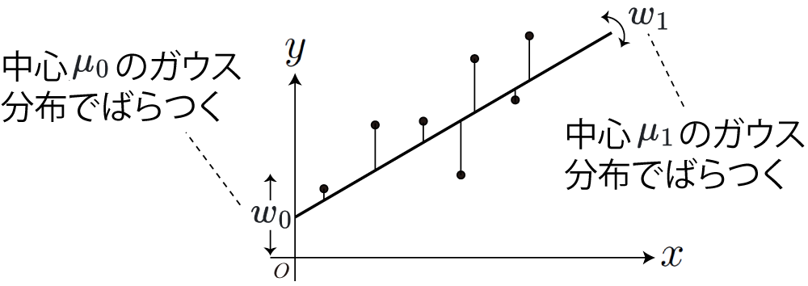

<!-- footer: Probabilistic Robotics Lecture 8 -->

# Probabilistic Robotics Lecture 8: Machine Learning (Part 1)

Ryuichi Ueda, Chiba Institute of Technology

 

This work is licensed under a <a rel="license" href="http://creativecommons.org/licenses/by-sa/4.0/">Creative Commons Attribution-ShareAlike 4.0 International License</a>.

---

<!-- paginate: true -->

## Contents

- Least squares method and loss function
- When the least squares Method cannot be analytically solved
- Bayesian linear regression

---

## Before That (From the First Advanced Vision Lesson)

- Review of Neurons
    (https://commons.wikimedia.org/wiki/File:Retina-diagram.svg, by S. R. Y. Cajal and Chrkl, CC-BY-SA 3.0)
    - Light enters from the left and is received by the photoreceptor cells (two types, 130 million) on the right, converting them into electrical signals.
    - The electrical signals are processed to the right and then sent to the brain via the downward red line in the diagram.
        - The red lines in each part of the retina form a bundle of 1 million optic nerves and reach the brain.

---

- Because of this structure,
    - when we look at something, 130 million individual signals are received.
        - In the case of a black-and-white image, this can be simplified to 130 million ON/OFF switch signals.

How can we see the shape even though the signals are so individual? 

---

### Basic Idea

- Data is generated due to some cause.
    - For example, if a couple wearing pink clothes is standing in front of you, a lot of pink signals will be received by your photoreceptor cells.
- If the cause is modeled mathematically, the observed data is thought to arise from it.
    - Example 1: The cause is the function $\boldsymbol{y} = f(\boldsymbol{x})$
        - Data $(\boldsymbol{x}, \boldsymbol{y})_1, (\boldsymbol{x}, \boldsymbol{y})_2,\dots,(\boldsymbol{x}, \boldsymbol{y})_N$ is observed.
    - Example 2: The cause is the probability distribution $\boldsymbol{x} \sim P$
        - Data $\boldsymbol{x}_1, \boldsymbol{x}_2, \dots, \boldsymbol{x}_N$ is observed (creating some characteristic distribution)

A problem of calculating the cause $f$ and $P$ from data. $\Rightarrow$ Regression problem (self-localization is one example)

---

### How to solve regression problems

- Various methods, from least squares to artificial neural networks (ANNs)
- Let's start with the basic least squares method.
    - Flow of story: Least squares is not probabilistic, so it has limitations. $\rightarrow$ Introducing probability.

---
## Least squares method

- Finding the trend $y = f(x)$ of the vertical axis values ​​relative to the horizontal axis values ​​($x$)
    - Example (data from the [Japan Society of Hospital Pharmacists](https://www.jshp.or.jp/))
        - What I want to know
            - What is the relationship between height and weight?
            - What is the relationship between blood pressure and triglyceride concentration?
        - The vertical distribution is large, but I want to find a central pattern for now. (This is just an example, not a solution.)

---

### Situations for using Regression

For the data on the right, it seems reasonable to apply a probability distribution, but...

- There's no point/interest in considering the horizontal distribution.
    - When it's meaningless: Time series data, etc.
(e.g., stock prices, population trends)
         - There's no need to treat time as a distribution.

---

### Fitting a Linear Equation using the Least Squares Method

- For the points $(x, y)_{1:N}$, find $w_1, w_0$, where the line $y=w_1 x + w_0$ passes through the middle.
    - $w_1$ is the slope, and $w_0$ is the intercept.
    - The most basic regression you've probably studied somewhere.

 

How do we determine the "center"?

---

### How do we determine the "center"?

- Consider the distance between the line and each point along the y-axis as the loss, and minimize it by adding the square of the distance.
    - Loss function: minimize the value of 
$\mathcal{L}(w_{0:1}| x_{1:N}, y_{1:N}) = \{w_1 x_1 + w_0 -y_1\}^2$
$\qquad\qquad+\{w_1 x_2 + w_0 -y_2\}^2+\dots$
$\qquad\qquad+\{w_1 x_N + w_0 -y_N\}^2$
$= \sum_{i=1}^N \{w_1 x_i + w_0 -y_i\}^2$
    - Why square it?: It's not necessary, but it makes sense if you interpret it as minimizing variance.
- The loss function is also important in ANNs.
    - The process is not very different.

---

### Derive parameters to minimize the loss function

- Partially differentiate the loss function with respect to the parameters to find the parameters that make $0$.
    - $\nabla \mathcal{L}(w_{0:1} | x_{1:N}, y_{1:N} ) = \left( \dfrac{\partial\mathcal{L}}{\partial w_0}, \dfrac{\partial\mathcal{L}}{\partial w_1} \right) = \boldsymbol{0}$
        - No matter how $w_0$ and $w_1$ are shifted, the value of $\mathcal{L}$ does not change.
$\Rightarrow$If there are no other such points, the value at that point is the minimum value of $\mathcal{L}$.
- Let's try solving the equation on the previous page.
    - $\mathcal{L}(w_{0:1}| x_{1:N}, y_{1:N}) = \sum_{i=1}^N \{w_1 x_i + w_0 -y_i\}^2$
        - Set simultaneous equations by differentiating with respect to $w_0$ and $w_1$.

---

### Answer

We set $(x,y) = (x \ y)^\top$.

- $\nabla L(w_{0:1}) = 2 \sum_{i=1}^N \begin{pmatrix} 
\left\{ (w_1 x_i + w_0 ) - y_i \right\} \\ 
\left\{ (w_1 x_i + w_0 ) - y_i \right\}x_i 
\end{pmatrix}$ 
$= 2N \begin{pmatrix} 
w_1 \bar{x} + w_0 - \bar{y}\\ 
w_1 \overline{x^2} + w_0 \bar{x} - \overline{xy} 
\end{pmatrix} = \boldsymbol{0}$ ($\overline{\ }$ is the average value)
$\Longrightarrow (w_0 , w_1) = \left(
\dfrac{\overline{x^2}\bar{y} - \overline{xy}\bar{x}}{\overline{x^2} - \bar{x}^2},
\dfrac{\overline{xy} - \bar{x}\bar{y}}{\overline{x^2} - \bar{x}^2}
\right)$
- The problem can be solved by simply rearranging the equations, so there's no need to use an ANN.

---

### Let's do the calculation.

- Apply the least squares method to $(x,y) = (2,3), (6,2), (-3,1), (-6,2)$.
- Equation (found earlier): $(w_0 , w_1) = \left(
\dfrac{\overline{x^2}\bar{y} - \overline{xy}\bar{x}}{\overline{x^2} - \bar{x}^2},
\dfrac{\overline{xy} - \bar{x}\bar{y}}{\overline{x^2} - \bar{x}^2}
\right)$

---

### Answer

- Apply least squares to $(x,y) = (2,3), (6,2), (-3,1), (-6,2)$
    - Calculate various means
        - $\overline{x}= -1/4$
        - $\overline{y}= 2$
        - $\overline{x^2}= 85/4$
        - $\overline{xy}= 3/4$
    - $w_0 = (\overline{x^2}\bar{y} - \overline{xy}\bar{x})/(\overline{x^2} - \bar{x}^2)= 2.01$
    - $w_1 = (\overline{xy} - \bar{x}\bar{y})/(\overline{x^2} - \bar{x}^2)= 0.0590$
$\Longrightarrow y=0.0590 x + 2.01$

---

## Optimization when partial differential equations cannot be solved

- Consider optimizing a loss function consisting of $n$ parameters.
    - $\mathcal{L}(w_{1:n}| x_{1:N}, y_{1:N})$
        - How to reduce the value of $\mathcal{L}$ by manipulating $w_{1:n}$
- Try shifting it by $\Delta w_{1:n}$
    - $\mathcal{L}(w_{1:n}| x_{1:N}, y_{1:N})$ becomes $\mathcal{L}(w_{1:n} + \Delta w_{1:n}| x_{1:N}, y_{1:N})$
        - If the latter value becomes smaller, change $w_{1:n}$ to $w_{1:n} + \Delta w_{1:n}$. And it changes to "Better."
    - Problem: Trying various $\Delta w_{1:n}$s is good, but with a large number of parameters, the number of combinations becomes tedious.
$\Rightarrow$ Is it possible to find the best $\Delta w_{1:n}$?

---

### Partial Differentiation Again

- $\nabla \mathcal{L}(w_{1:n} | x_{1:N}, y_{1:N} ) = \left( \dfrac{\partial\mathcal{L}}{\partial w_0}, \dfrac{\partial\mathcal{L}}{\partial w_1}, \dots, \dfrac{\partial\mathcal{L}}{\partial w_n} \right)$
is the change of $\mathcal{L}$ when each $w_0, w_1, \dots, w_n$ is slightly shifted.
- Calculating the change
    - $\Delta \mathcal{L} = \dfrac{\partial \mathcal{L}}{\partial w_1}\Delta w_1 + \dfrac{\partial \mathcal{L}}{\partial w_2} \Delta w_2 + \dots \dfrac{\partial \mathcal{L}}{\partial w_m} \Delta w_m = \nabla \mathcal{L}(w_{1:n})^\top \Delta w_{1:n}$
- What we can know
    - When there is a constraint $|\Delta w_{1:n}| \le \alpha$, the greatest reduction occurs when the dot product is minimized: $\Delta w_{1:n} = - \alpha \nabla \mathcal{L}(w_{1:n})$
        - $\nabla \mathcal{L}(w_{1:n})$: gradient vector
    - Just update the parameters according to the equation in red above.
        - This is what ANNs do.

---

### Summary of least squares and loss functions

- By partially differentiating the loss function and solving the simultaneous equations, you can apply least squares (and various other optimization methods) to any equation.
- If you can't solve the simultaneous equations, you can find good parameters by gradually adjusting the parameters according to the gradient vector.
    - For specific examples, see Advanced Vision.
- But isn't something missing?
    - Considering what we discussed last time (Bayes' theorem), is there something missing?

---

### Remaining problems

- Least squares only produces one answer.
    - It can't express "lack of confidence."
    - Is it okay to fit four data points as shown in the upper right figure?
    - The size of $\mathcal{L}$ allows you to compare the goodness of fit, but it doesn't tell you how unconfident you are.
- A large number of parameters can lead to "overfitting."
    - A graph connecting the data with a curve is produced.
$\rightarrow$ Sometimes this is correct, but it may simply be due to insufficient data.
    - This is also common in humans.

---

## Bayesian Linear Regression

- Consider the distribution of $y = f(x)$
    - What is the distribution of a function? $\Rightarrow$ Distribution of parameters
- Example: $y = w_1 x + w_0$
    - Consider the probability distribution of $w_1$ and $w_0$
    - Right figure: Sampling is performed assuming that $w_1$ and $w_0$ are distributed according to a Gaussian distribution.
        - Both have a mean of $0$ and a standard deviation of $1$.
        - Using Bayes' theorem, we change the distribution of $w_1 and w_0$ to fit the data (circles).

The solution can be left vague when the amount of data is small

---

### Formula for Bayesian Linear Regression

This is complicated, so let's just think about the meaning.

- Example: Fitting formula: Polynomial $y = w_0 + w_1 x$
- Let's make some assumptions.
    - Assumption 1: For $x_i$, $y_i$ varies with variance $\lambda^{-1}$ around the polynomial value $w_0 + w_1 x_i$.
        - $y_i \sim \mathcal{N}(y | w_0 + w_1 x_i, \lambda^{-1})$
        - $\lambda$: precision

---

### Regression Formulas (continued)

- Assumption 2: $w_0, w_1$ are also multidimensional Gaussian distributions with large initial variance.
    - Distribution $p(\boldsymbol{w}) = \mathcal{N}(\boldsymbol{w} | \boldsymbol{\mu}, \lambda^{-1}\Lambda^{-1}) \quad$$\leftarrow$This is the target of estimation
        - $\boldsymbol{w} = (w_0, w_1) = (w_0 \ \ w_1)^\top$
        - $\boldsymbol{\mu} = (\mu_0, \mu_1) = (\mu_0 \ \ \mu_1)^\top$ (mean of $w_0, w_1$)
        - $\Lambda$ is a $2\times 2$ matrix
            - $\lambda\Lambda$: This is called the "precision matrix"

---

### Regression Formulas (continued)

- Assumption 3: Since the value of $\lambda$ is unknown, it is expressed as a probability distribution (large variance at first).
    - This distribution: $\text{Gam}(\lambda | a, b) = \eta \lambda^{a-1}e^{-b\lambda}$ (Gamma distribution)
         - Figure below (a): Probability distribution of the gamma distribution
         - Figure below (b): The horizontal axis of (a) is scaled by logarithm
    - When $\lambda = 10^{-2}$, the standard deviation of the variability of $y_i$ is $10$ 

---

### Regression Method

- Prior distribution of $w_0, w_1, \lambda$
- $p_0(\boldsymbol{w}, \lambda) = \mathcal{N}(\boldsymbol{w} | \boldsymbol{\mu}_0, \lambda^{-1}\Lambda^{-1}_0)\text{Gam}(\lambda| a_0, b_0)$
- $\boldsymbol{\mu}_0, \Lambda_0, a_0, b_0$ are parameters that determine the shape of the distribution
(= parameters of the prior distribution)
- A distribution called the "Gaussian-Gamma Distribution"

---

### Regression Methods (continued)

- Posterior distribution with only one piece of data, $(x_1, y_1)$, as input
- Using Bayes' theorem
- $p(\boldsymbol{w}, \lambda | x_1, y_1) = \eta p(x_1, y_1 | \boldsymbol{w}, \lambda)p_0(\boldsymbol{w}, \lambda)$
$= \eta p(y_1 | x_1, \boldsymbol{w}, \lambda)p(x_1 | \boldsymbol{w}, \lambda)p_0(\boldsymbol{w}, \lambda)$
$= \eta p(y_1 | x_1, \boldsymbol{w}, \lambda)p_0(\boldsymbol{w}, \lambda)\qquad\qquad$ (Assuming the distribution of $x_1$ is uniform)
$= \eta \mathcal{N}(y_1 | w_1 x_1 + w_0, \lambda^{-1} ) p_0(\boldsymbol{w}, \lambda)\quad$ (From Assumption 1)
$= \eta \mathcal{N}(y_1 | w_1 x_1 + w_0, \lambda^{-1} )\mathcal{N}(\boldsymbol{w} | \boldsymbol{\mu}_0, \lambda^{-1}\Lambda^{-1}_0)\text{Gam}(\lambda| a_0, b_0)$

---

### Regression Methods (continued)

- If the posterior distribution on the left side has the same shape, we can obtain the following equation:
- $\mathcal{N}(\boldsymbol{w} | \boldsymbol{\mu}_1, \lambda^{-1}\Lambda^{-1}_1)\text{Gam}(\lambda| a_1, b_1)$
$= \eta \mathcal{N}(y_1 | w_1 x_1 + w_0, \lambda^{-1} )\mathcal{N}(\boldsymbol{w} | \boldsymbol{\mu}_0, \lambda^{-1}\Lambda^{-1}_0)\text{Gam}(\lambda| a_0, b_0)$
- The formula for the product of Gaussian distributions, which appeared in the fourth lesson, is: $p(\boldsymbol{x}) = \eta \mathcal{N}(\boldsymbol{a} | A\boldsymbol{x} + \boldsymbol{b}, sB) \mathcal{N}(\boldsymbol{x} | \boldsymbol{c}, sC)= \eta s^{-1/2}e^{-U/2s} \mathcal{N}(\boldsymbol{x} | \boldsymbol{d} , Same shape as sD)$ 
- $\boldsymbol{d} = D \l
