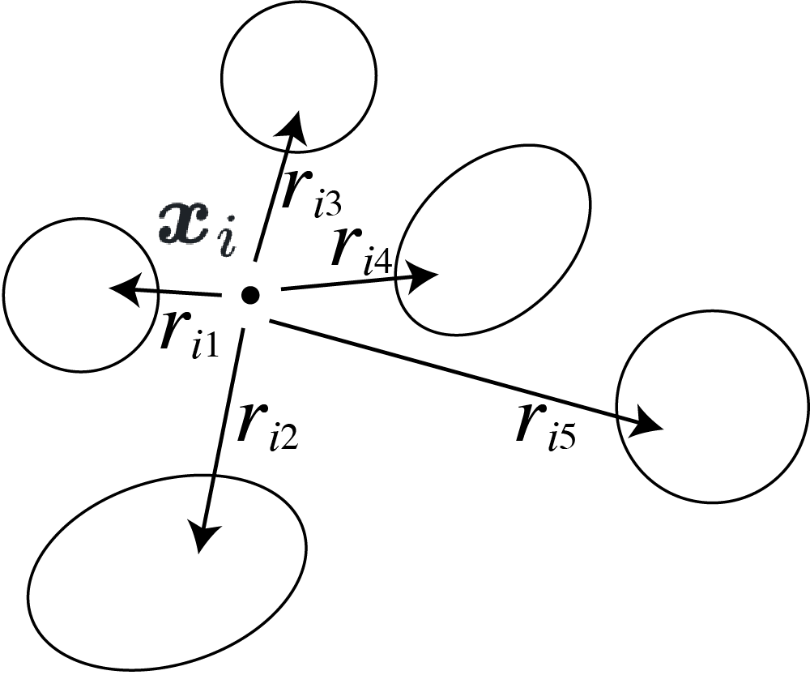
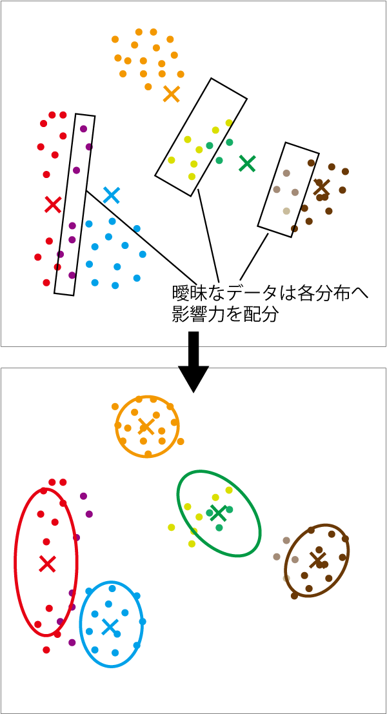
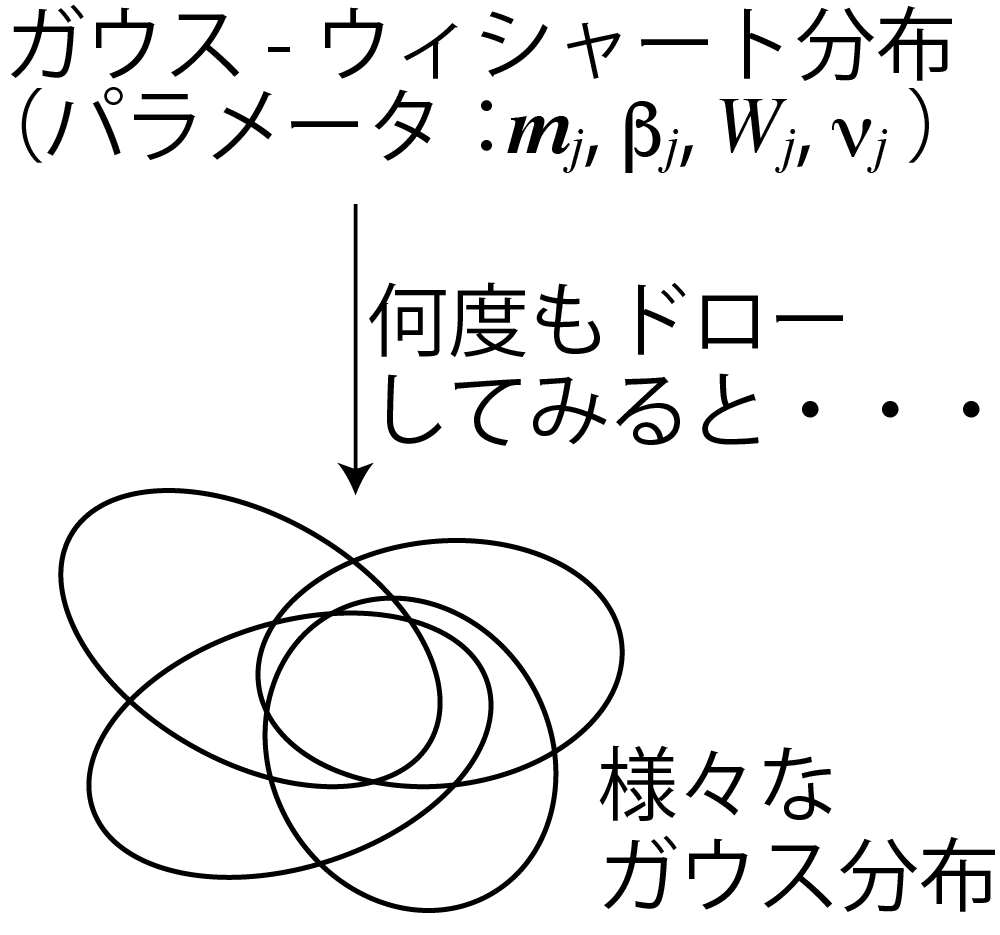
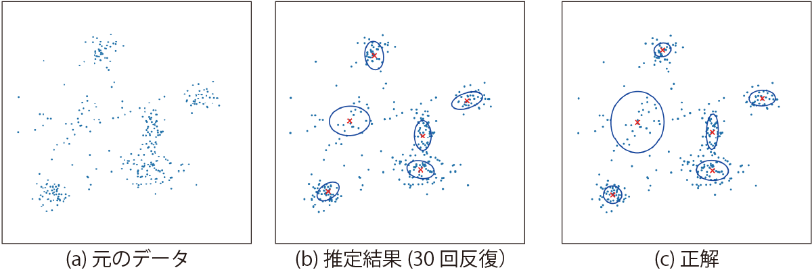
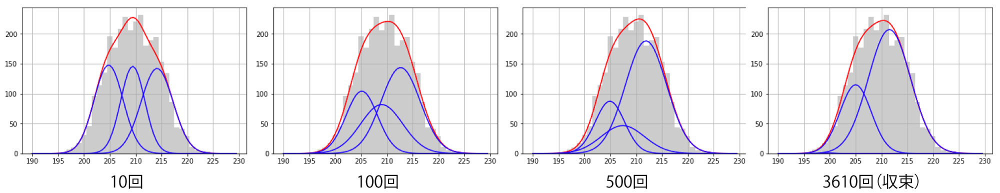
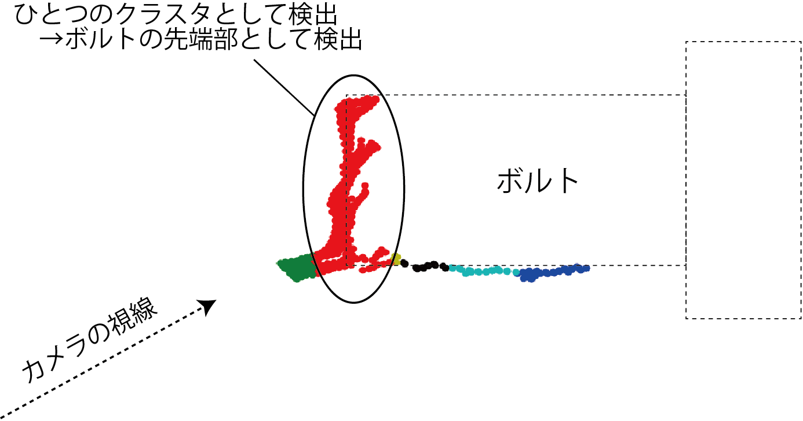
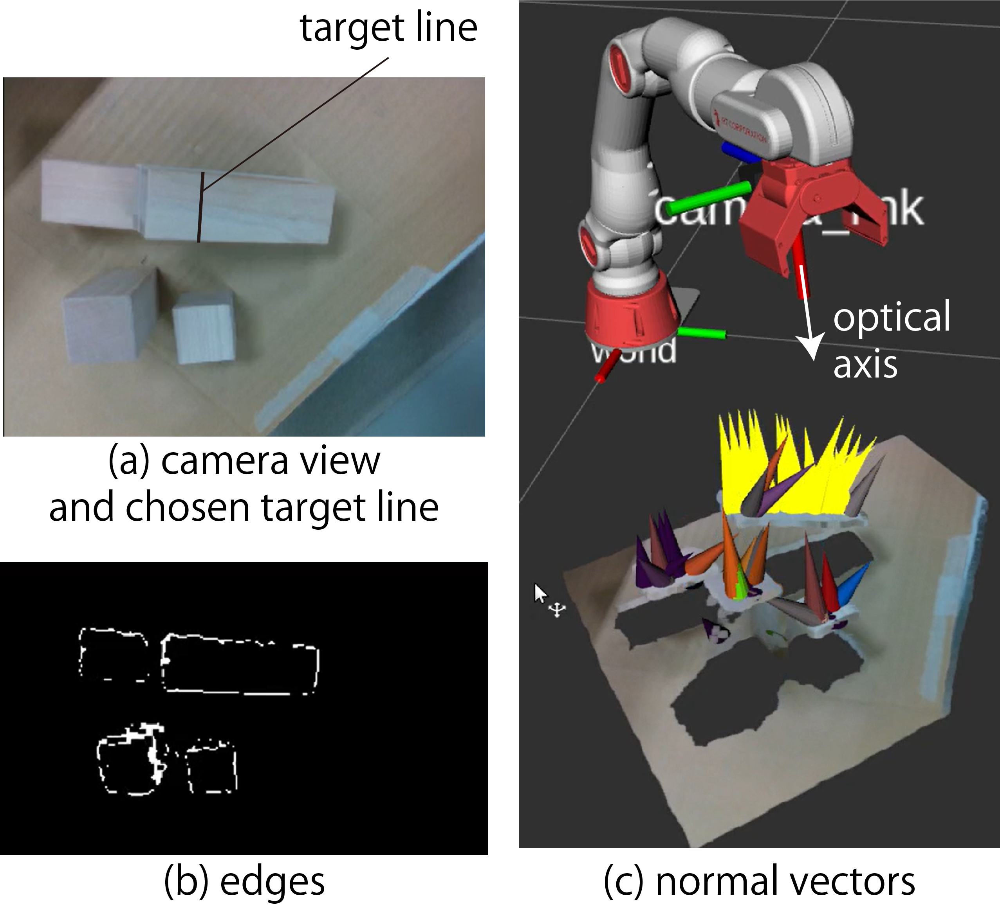

<!-- footer: 確率ロボティクス第8回 -->

# 確率ロボティクス第8回: 機械学習（その2）

千葉工業大学 上田 隆一

 

This work is licensed under a <a rel="license" href="http://creativecommons.org/licenses/by-sa/4.0/">Creative Commons Attribution-ShareAlike 4.0 International License</a>.

---

<!-- paginate: true -->

## 今回の内容

- クラスタリング
- EM法
- 変分推論

---

## クラスタリングの重要性

- アドバンストビジョンの第1回のおさらい
    - 右の図は何に見えますか
    - なんで猫に見えるのか？
- たぶん丸い部分1つと三角の部分2つに点をまとめている（クラスタリングしている）
    - [研究例](https://www.riken.jp/medialibrary/riken/pr/press/2001/20010727_1/20010727_1.pdf)

---

### まとめると何がわかるか

- たとえば目の前になにがあるかを知りたい場合
    - やらなければいけないこと: 視細胞の反応$\longrightarrow$認識対象（猫など）
        - 多数の刺激$\longrightarrow$「猫」という1単語
        - 「減らす」という作業が脳内で必要となる
            - 減らす=代表値（特徴量）にまとめる
- 左図: 実物の畑の作物と、茎と葉を分類した画像
    - ロボット用
    - いろんな色が3色に減っている
    - 人間は右のような分類結果を（時間をかければ）描ける

---

### クラスタリングの古典的手法

- ロボット分野で30年前から利用されてきたもの
    - k-means法
    - EM法
- 解く問題
    - 点が散らばっているときに、どれとどれが同じグループに属するか決める

---

## k-means法

- データを適当にクラスタに分けて、以下の繰り返しで収束させる
    - 各クラスタの中心を求める（図中の$\times$印）
    - 各データを最寄りの中心を基準に再度クラスタリング

---

## 数字をk-means法でクラスタリングしてみましょう

- 次の9個の数値を3つのクラスタに分けてみましょう
   - (8, 1, 3), (5, 5, 2), (6, 11, 7)
       - かっこは適当に分けた初期のクラス分けを表します
   - 答えは次のページ
- 注意
    - 平均値が同じになったら所属クラスタは適当に選択のこと
    - あるデータに対して近い平均値が2つ以上になったら（同じ距離になったら）
    元いたクラスを替えてみる

---

### こたえ

- 初期値: (8, 1, 3), (5, 5, 2), (6, 11, 7) $\rightarrow$ クラスタの平均値: 4, 4, 8
- 再配置: (1, 5, 2), (3, 5), (8, 6, 11, 7) $\rightarrow$ クラスタの平均値: 2.666..., 4, 8
- 再配置: (1, 2, 3), (5, 5), (8, 6, 11, 7) $\rightarrow$ クラスタの平均値: 2, 5, 8
- 再配置: (1, 2, 3), (5, 5, 6), (8, 7, 11) $\rightarrow$ クラスタの平均値: 2, 5.333..., 8.666...
- 再配置: (1, 2, 3), (5, 5, 6, 7), (8, 11) $\rightarrow$ クラスタの平均値: 2, 5.75, 9.5
- 再配置: (1, 2, 3), (5, 5, 6, 7), (8, 11) （変わらず。終了）

---

### k-means法の問題

- 最初からクラスタ数を決めていいのか?
    - センサやロボットのプログラミングのときに特に困る
        - たとえば画像に人が何人いるかが知りたい。最初から3人と分かることはあまりない。
- クラスタがいびつだったら?
    - これはいびつさを解消するようにデータを変換するか、別の方法を用いる（サポートベクターマシーンなど）
- もっと根本的な問題: データの発生した理由を考えていない（つまり場当たり的）

---

### EM法（最尤法）

- EM: expectation maximization
（どういう意味かはあとで説明）
 
- ある確率分布のモデル（数式）を考え、データを
最ももっともらしく説明するパラメータを求める
    - なんで右図のようなデータが発生したのか?
    $\rightarrow$ データの発生源がいくつかあって、
    そのまわりにデータが発生、と考える

---

### 「データの発生源がいくつかあって そのまわりにデータが発生」

この場合の基本的なモデル: 混合ガウス分布

- 複数のガウス分布を足して、
正規化（積分して1に）したもの
    - $p(\boldsymbol{x} | \boldsymbol{\mu}_{1:n}, \Sigma_{1:n}, \pi_{1:n}) = \pi_1 \mathcal{N}(\boldsymbol{\mu}_1, \Sigma_1)$
    $\qquad+ \pi_2 \mathcal{N}(\boldsymbol{\mu}_2, \Sigma_2) + \dots + \pi_n \mathcal{N}(\boldsymbol{\mu}_n, \Sigma_n)$
        - $\pi_1 + \pi_2 + \dots + \pi_n = 1$
        （注意: 円周率ではなく、混合比率）
- 絵に描くと右図のように
（ちょっと当てはまりは悪いです）

---

### データに対する「一番尤もらしい分布」

- 次の尤度を最大化するものが「一番尤もらしい」と考える
    - $p(\boldsymbol{x}_{1:N} | \boldsymbol{\mu}_{1:n}, \Sigma_{1:n}, \pi_{1:n}) = \prod_{j=1}^N p(\boldsymbol{x}_j | \boldsymbol{\mu}_{1:n}, \Sigma_{1:n}, \pi_{1:n})$
        - 左辺: データ$\boldsymbol{x}_{1:N}$が生成した確率の密度
        - 右辺: 各データ$\boldsymbol{x}_i$の密度の掛け算
        - データは既知なので、最も尤もらしい（最尤な）パラメータ$\boldsymbol{\mu}_{1:n}, \Sigma_{1:n}, \pi_{1:n}$や、その尤度を求める問題に
    - 具体的に書くと
        - 左辺$= \prod_{j=1}^N  \sum_{i=1}^n \pi_i \mathcal{N}(\boldsymbol{x}_j | \boldsymbol{\mu}_i, \Sigma_i)$
- 対数をとって掛け算を足し算にして、対数尤度を最大化する問題にする
    - $\log_e p(\boldsymbol{x}_{1:N} | \boldsymbol{\mu}_{1:n}, \Sigma_{1:n}, \pi_{1:n}) = \sum_{j=1}^N \log_e p(\boldsymbol{x}_j | \boldsymbol{\mu}_{1:n}, \Sigma_{1:n}, \pi_{1:n})$
        - 問題が等価で簡単なものに

---

### 対数尤度が最大になるパラメータの求め方（k-means法と似ている）

1. 最初に適当にクラスタリング
2. Mステップ（maximization step）
    - 尤度が最大となる各クラスタの$\boldsymbol{\mu}_{1:n}, \Sigma_{1:n}, \pi_{1:n}$を算出
3. Eステップ（expectation step）
    - $\boldsymbol{\mu}_{1:n}, \Sigma_{1:n}, \pi_{1:n}$に基づきデータをクラスタリング
        - その時点での各データのクラスタへの所属の確率を計算

---

### Eステップ

- 各データ$\boldsymbol{x}_i$について、どのクラスタにどれくらいの確率で所属しているのか求めたい
    - 混合ガウス分布のパラメータ$\boldsymbol{\mu}_{1:n}, \Sigma_{1:n}, \pi_{1:n}$は固定で
    - k-meansと違って、1つのクラスタへの所属に断定しない
        - 分からないのだから曖昧にしておく
- 数学的には
    - $\boldsymbol{x}_i$の属するクラスタ$k_i$が$j$番目のクラスタである確率$\text{Pr}\{ k_i = j |\boldsymbol{x}_i \} = k_{ij}$の値を求めたい
        - $k_i$が$1,2,\dots,n$の場合すべてに対して
    - $k_{ij}$のような変数は隠れているので潜在変数と呼ばれる

---

### $k_{ij}$の計算方法

- $k_{ij}$は、クラスタ$j$のガウス分布の密度に混合比率をかけたものになる
- 計算式の導出
    - $\text{Pr}\{ k_i = j |\boldsymbol{x}_i \} = \eta p(\boldsymbol{x}_i | k_i = j )\text{Pr}\{ k_i = j \}$（ベイズの定理）
        - $p(\boldsymbol{x}_i | k_i = j )$: $k_i$番目のクラスタのガウス分布
        - $\text{Pr}\{ k_i = j \}$: $\boldsymbol{x}_i$の情報がないときに$k$番目のクラスタにデータがいる確率（$=\pi_k$）
    - $k_{ij} = \eta \pi_k \mathcal{N}(\boldsymbol{x}_i | \boldsymbol{\mu}_j, \Sigma_j )$←計算できる
        - $\eta$は各クラスタに対する$k_{ij}$の値の和が$1$になるように決める

---

### Mステップ

- $k_{ij}$を固定して分布のパラメータを計算
- 方法（$k_{ij}$で重みをつけて統計をとる）
    - 補助のパラメータ$N_j = \sum_{i=1}^N k_{ij}$を考える
        - 各クラスタの要素の個数に相当
    - 各クラスタの大きさと、平均値、共分散行列を$N_j$と$k_{ij}$に基づいて計算
        - $\pi_j = \eta N_j = N_j / \sum_{j=1}^n N_j$
        - $\boldsymbol{\mu}_j = \dfrac{1}{N_j}\sum_{i=1}^N k_{ij}\boldsymbol{x}_i$
        - $\Sigma_j = \dfrac{1}{N_j-1} \sum_{i=1}^N k_{ij}(\boldsymbol{x}_i - \boldsymbol{\mu}_j)(\boldsymbol{x}_i - \boldsymbol{\mu}_j)^\top$

---

### EM法で可能となること/ならないこと

- 可能になること
    - 確率的な考え方の導入
        - （実例がなくて申し訳ないのですが）性能はk-meansより上がる
            - はっきりしないことは曖昧なままにしたほうが変な間違いが少ない
        - 「確率モデルに対して最尤」という基準ができる
        - 他の確率モデルにも適用できる
- 可能にならないこと
    - もっと確率的であってもよい
        - パラメータにも分布がある（混合ガウス分布も確率的にばらつく）
    - ガウス分布の個数が決まっている
        - 不要な個数の分布が消えるほどの性能はない

---

## 第5回のおさらい

- 実験の成功、失敗の結果から、「成功率の分布」を考えた
    - ベータ分布: $p(x) = \eta x^{\alpha-1}(1-x)^{\beta-1}$
    - 実験の結果を1つずつ反映していくと、成功率の分布が変化していった
        - 下図: 成功、成功、失敗、失敗の場合の分布の推移
            - 成功率1/2と決めつけない
    - 分布の変化はベイズの定理で計算できた

---

## 混合ガウス分布のベイズ推定

- 「混合分布の分布」を考える
    - 右図のように分布をドローできるもの
- EM法との違い
    - 最尤なものでなく、分布の分布自体を計算
    - データが入ると分布をベイズの定理で更新
- 問題: 事後確率がベイズの定理一発で計算できない
    - どうするか?$\rightarrow$EM法のように少しずつ分布の分布を変えていく

---

### 推定対象（混合ガウス分布）のパラメータ

「分布の分布」ではなく「分布」のほうの話

- 各ガウス分布のパラメータ: $\boldsymbol{\mu}_j, \Sigma_j, \pi_j$
    - （おさらい）混合ガウス分布:
        - $p(\boldsymbol{x} | \boldsymbol{\mu}_{1:K}, \Sigma_{1:K}, \pi_{1:K})$
        $=  \sum_{j=1}^n \pi_j \mathcal{N}(\boldsymbol{\mu}_j, \Sigma_j)$
        （$\pi_1 + \pi_2 + \dots + \pi_n = 1$）
- 各データ$\boldsymbol{x}_i$（$i=1,2,\dots,N$）の所属$k_{i}$
    - どのガウス分布に所属しているか
    - 潜在変数

---

### 変分推論による解法

- 推定対象の分布を、パラメータごとに独立な分布の積にして近似
    - $q(\pi_{1:K},\boldsymbol{\mu}_{1:K}, \Lambda_{1:K}, k_{1:N}) = q_1(k_{1:N})q_2(\pi_{1:K},\boldsymbol{\mu}_{1:K}, \Lambda_{1:K})$
         - $q$: 近似の分布
    - $q_1$と$q_2$のどちらかを固定、どちらかを動かして交互にデータに合わせていく
        - $q_1$を動かす: クラスタの再構成
        - $q_2$を動かす: 分布の再構成
        EM法と同じ（だけど計算はよりややこしく）
- 次ページから
    - $q_2 = q_3q_4$とさらに分解して$q_1, q_3, q_4$をモデル化
        - $q_2(\pi_{1:K},\boldsymbol{\mu}_{1:K}, \Lambda_{1:K}) = q_3(\pi_{1:K})q_4(\boldsymbol{\mu}_{1:K}, \Lambda_{1:K})$

---

### $q_1$のモデル化

- $i$番目のデータ$\boldsymbol{x}_i$が$j$番目のクラスタに所属する
（$k_i = j$となる）確率分布$q_1'$を考える
（添字$1$はデータやクラスタのものでないので注意）
    - $r_{ij}$と表しましょう
    - これは特定の式にせずにテーブル状のデータに
- 各データに対する$q_1'$の積を$q_1$とする

---

### $q_3$のモデル化

- ディリクレ分布を仮定
    - ベータ分布をコインの裏表だけでなく多変数に拡張したもの
        - 例: さいころなら6
    - $\text{Dir}(\pi_{1:K} | \alpha_{1:K})= \eta \pi_1^{\alpha_1-1}\pi_2^{\alpha_2-1}\dots\pi_n^{\alpha_n-1}$
    $= \eta \prod_{j=1}^n \pi_j^{\alpha_j - 1}$
        - $\alpha_{1:K}$: $\pi_{1:K}$のばらつきを決める
        パラメータ
            - $\alpha_{1:K}$の合計値が大きくなるほど値が定まってくる

---

### $q_4$のモデル化

- 各ガウス分布$\mathcal{N}(\boldsymbol{\mu}_j, \Lambda_j^{-1})$の分布:
ガウス-ウィシャート分布
    - $q_4'(\boldsymbol{\mu}_j, \Lambda_j) = \mathcal{N}(\boldsymbol{\mu}_j|\boldsymbol{m}_j, (\beta_j \Lambda_j)^{-1})\mathcal{W}(\Lambda_j | W_j, \nu_j)$
        - ウィシャート分布$\mathcal{W}$: 精度行列$\Lambda_j$の分布
        - 各ガウス分布の分布を決めるパラメータ: $\boldsymbol{m}_j, \beta_j, W_j, \nu_j$
- 各ガウス分布ごとの$q_4'$の積を$q_4$とする

---

### これまでの変数、パラメータ一覧表

|データ|推定したい分布のパラメータ|推定したい分布の分布のパラメータ|
|:---:|:---:|:---:|
|$\boldsymbol{x}_i$|$k_i, \boldsymbol{\mu}_j, \Lambda_j, \pi_j$|$r_{ij}, \boldsymbol{m}_j, \beta_j, W_j, \nu_j, \alpha_j$|
- $i=1,2,\dots,N$（$N$: データの数）
- $j=1,2,\dots,K$（$K$: ガウス分布の数）

---

### 変分推論の手続き

1. 適当に$q_1q_3q_4$の事前分布を決める
    - 確率$r_{ij}$を初期化（クラスタリングに相当）
    - パラメータ$\boldsymbol{m}_{1:K}, \beta_{1:K}, W_{1:K}, \nu_{1:K}, \alpha_{1:K}$の初期値を与える
        - $\boldsymbol{m}'_{1:K}, \beta'_{1:K}, W'_{1:K}, \nu'_{1:K}, \alpha'_{1:K}$としましょう
2. $q_1$を固定し、$q_3q_4$の事後分布のパラメータ$\boldsymbol{m}_{1:K}, \beta_{1:K}, W_{1:K}, \nu_{1:K}, \alpha_{1:K}$を計算
    - EM法のMステップに相当（変分Mステップ）
3. $q_3q_4$を固定し、$q_1$（つまり$r_{ij}$）を計算
    - EM法のEステップに相当（変分Eステップ）
- 注意: $\boldsymbol{m}'_{1:K}, \beta'_{1:K}, W'_{1:K}, \nu'_{1:K}, \alpha'_{1:K}$は固定
    - 事前分布を固定して、繰り返し事後分布の解を良くしていく

---

### 変分推論の威力（その1）

とても強力なので具体的な計算方法の前に例を見せます

- 例1: 2次元の点のクラスタリング
    - 右図: 6個のガウス分布を含む混合ガウス分布からランダムに選んだ点
    - このデータのクラスタリング（というより発生した混合ガウス分布の推論）に変分推論を適用するとどうなるか

---

### 推論の推移

- 混合ガウス分布の分布から平均値となる分布を描画
- 10の分布があることを仮定$\rightarrow$不要な分布が消えていく（$\pi_j$の値が0に収束）

---

### 正解との比較

- 共分散行列のずれは多少あるが、正確
    - 人間より正確かもしれない
    - （上限があるものの）数が数えられるのはかなり有用

---

### 変分推論の威力（その2）

- 例2: 1次元のデータの解析
    - 講師が本を書いていて偶然発見
    - 右の分布はガウス分布か?

---

### 変分推論してみると・・・

- もうひとつの分布が埋まっていた
    - このデータは、あるセンサの値を3秒ごとにとったもので、日が出ているときと出ていないときで平均値が違っていた
    - ある意味、人間よりもクラスタリングの解像度が高い

---

## 実世界での使用例1

- ボルトの先端の検出
    - 3次元の位置を1次元に変換してからクラスタリング

---

## 実世界での使用例2

- 物体表面の把持位置の
クラスタリング
    - 法線ベクトルの位置、向きの6次元空間

---

## 変分推論の具体的な計算

- 導出は難しすぎるので（教科書に解説あり）、
MステップとEステップでの作業だけ示します
    - $q_1, q_3, q_4$の事後分布をベイズの定理で導出
    - 導出された式に当てはめるだけで使用可能

---

### 変分Mステップ（各データの所属から分布のパラメータを計算）

- 補助の数値を計算
    - $N_j = \sum_{i=1}^N r_{ij}\qquad\qquad$（分布$j$の重み付きデータ数）
    - $\bar{\boldsymbol{x}}_j = \dfrac{1}{N_j} \sum_{i=1}^N r_{ij}\boldsymbol{x}_i\ \quad$（分布$j$の重み付き平均）
    - $\Sigma_j = \dfrac{1}{N_j} \sum_{i=1}^N r_{ij}(\boldsymbol{x}_i - \bar{\boldsymbol{x}}_j)(\boldsymbol{x}_i - \bar{\boldsymbol{x}}_j)^\top$（分布$j$の重み付き共分散行列）
- 事後分布のパラメータを計算
    - $(\alpha_j, \beta_j, \nu_j) =(\alpha_j', \beta_j', \nu_j') + (N_j, N_j, N_j)$（データの個数だけ増大） 
    - $\boldsymbol{m}_j = (\beta_j' \boldsymbol{m}_j' + N_j \bar{\boldsymbol{x}}_j ) /\beta_j\qquad\qquad\qquad$（$\boldsymbol{\mu}_j$の中心の調整）
    - $W^{-1}_j = W'^{-1}_j + N_j \Sigma_j + \dfrac{\beta'_j N_j}{\beta'_j+ N_j} (\bar{\boldsymbol{x}}_j - \boldsymbol{m}_j')(\bar{\boldsymbol{x}}_j - \boldsymbol{m}_j')^\top$
      　　　  （各ガウス分布の共分散行列の調整）

---

### 変分Eステップ（分布のパラメータから各データの所属を計算）

- $k_{1:N}$の分布: 次の計算で導出
    - $P(k_{1:N}) = \langle p(\boldsymbol{x}_i, k_{i,1:K}, \pi_{1:K}, \boldsymbol{\mu}_{1:K}, \Lambda_{1:K}) \rangle_{\pi_{1:K}, \boldsymbol{\mu}_{1:K}, \Lambda_{1:K}}$
- 計算結果: 次の$r_{ij}$が、$k_i = j$になる確率
    - $r_{ij} = \eta \rho_{ij}$
        - $\log_e \rho_{ij} = -\dfrac{1}{2} d \beta_j^{-1} -\dfrac{1}{2} \nu_j(\boldsymbol{x}_i - \boldsymbol{m}_j)^\top W_j (\boldsymbol{x}_i - \boldsymbol{m}_j)$
         $\quad+ \dfrac{1}{2} \sum_{j=1}^d \psi\left(\dfrac{\nu_j + 1 - j}{2}\right) + \dfrac{1}{2}\log_e | W_j | + \eta'$
        $\quad+\psi(\alpha_j) - \psi\left( \sum_{j=1}^K \alpha_j \right)$
        - 式中の変数はすべて一時的に値が決まっているか既知なので計算可能
            - $d$: $\boldsymbol{x}$の次元
            - $\psi$: ディガンマ関数という関数（高級な言語にはライブラリあり）

---

## まとめ

- k-means、EM法をまず勉強
    - 確率的な考えのないものと、ベイズ未満の確率的なもの
- 変分推論（変分ベイズ）
    - 混合分布の分布を考える
    - EM法とおなじく繰り返しでクラスタを形成していく
        - 計算方法が（扱わなかったけど）ベイズの定理に基づいている
    - 強力

---

## 補足資料

---

### EM法の一般的な導出

- p.13の対数尤度、p.14の潜在変数を次のように記述（記号を減らすため）
    - $p(\boldsymbol{x}_{1:N} | \boldsymbol{\mu}_{1:n}, \Sigma_{1:n}, \pi_{1:n}) = p(X | \boldsymbol{\Theta})$
    - $z_{1:N} = Z$
- $\log_e p(X,Z | \boldsymbol{\Theta})$ を変形
    - $\log_e p(X,Z | \boldsymbol{\Theta}) = \log_e p(Z | X, \boldsymbol{\Theta})p(X | \boldsymbol{\Theta})$
    $= \log_e p(Z | X, \boldsymbol{\Theta}) + \log_e p(X | \boldsymbol{\Theta})$（←最後の項は対数尤度）
- 対数尤度を右辺に移動し、各項に$q(Z)$をかけて$Z$で積分（$\int_Z q(Z) \text{d}Z= 1$）
    - $\int_Z q(Z) \log_e p(X | \boldsymbol{\Theta}) \text{d}Z = \int_Z q(Z) \log_e p(X,Z |  \boldsymbol{\Theta})\text{d}Z$
    $\qquad\qquad\qquad\qquad\qquad\quad - \int_Z q(Z) \log_e p(Z| X, \boldsymbol{\Theta}) \text{d}Z$
- 左辺の積分は$Z$が$\log_e p(X | \boldsymbol{\Theta})$内にないので外せる
    - $\log_e p(X | \boldsymbol{\Theta}) = \int_Z q(Z) \log_e p(X, Z | \boldsymbol{\Theta})\text{d}Z - \int_Z q(Z) \log_e p(Z |X, \boldsymbol{\Theta}) \text{d}Z$

---

### 潜在変数を考慮してEM法を導出（続き）

- 右辺に足して0になる2項を増やして配分
    - $\log_e p(X | \boldsymbol{\Theta}) = \int_Z q(Z)\log_e p(X, Z | \boldsymbol{\Theta})\text{d}Z - \int_Z q(Z) \log_e p(Z |X, \boldsymbol{\Theta}) \text{d}Z$
    $= \int_Z q(Z) \log_e p(X, Z | \boldsymbol{\Theta})\text{d}Z - \int_Z q(Z) \log_e p(Z |X, \boldsymbol{\Theta}) \text{d}Z$
    $\quad- \int_Z q(Z) \log_e q(Z) \text{d}Z + \int_Z q(Z) \log_e q(Z) \text{d}Z$
    $= \int_Z q(Z) \log_e \dfrac{ p(X, Z | \boldsymbol{\Theta}) }{q(Z)} \text{d}Z - \int_Z q(Z) \log_e \dfrac{p(Z |X, \boldsymbol{\Theta})}{q(Z)} \text{d}Z$
- 新たな関数を定義して整理
    - $\log_e p(X | \boldsymbol{\Theta}) = \mathcal{L}(q, \boldsymbol{\Theta}) + \text{KL}(q || p)$
        - $\mathcal{L}(q, \boldsymbol{\Theta}) = \int_Z q(Z) \log_e \dfrac{ p(X, Z | \boldsymbol{\Theta}) }{q(Z)} \text{d}Z$
        - $\text{KL}(q || p) = - \int_Z q(Z) \log_e \dfrac{p(Z |X, \boldsymbol{\Theta})}{q(Z)} \text{d}Z$

---

### できた式

- $\log_e p(\boldsymbol{x}_{1:N} | \boldsymbol{\mu}_{1:n}, \Sigma_{1:n}, \pi_{1:n}) = \mathcal{L}(q, \boldsymbol{\mu}_{1:n}, \Sigma_{1:n}, \pi_{1:n}) + \text{KL}(q || p)$
- $= \mathcal{L}(q, \boldsymbol{\Theta}) + \text{KL}(q || p)$
    - $q$（$q(Z)$）: 潜在変数の分布
    - $\text{KL}(q || p)$: カルバック・ライブラー距離
        - 分布$q$と$p(Z |X, \boldsymbol{\Theta})$の形状の違いを数値化したもの
        （一致すると$0$で、違うほどと正の大きな値に）
    - $\mathcal{L}$: 変分下界
        - 対数尤度（左辺はこれより値が下にならない。KLが0以上なので）

---

### できた式と使い方

- $\log_e p(X | \boldsymbol{\Theta}) = \mathcal{L}(q, \boldsymbol{\Theta}) + \text{KL}(q || p)$
    - $q$（$q(Z)$）: 潜在変数の分布
    - $\text{KL}(q || p)$: カルバック・ライブラー距離
        - 分布$q$と$p(Z |X, \boldsymbol{\Theta})$の形状の違いを数値化したもの
        （一致すると$0$で、違うほどと正の大きな値に）
    - $\mathcal{L}$: 変分下界
        - 対数尤度（左辺はこれより値が下にならない。KLが0以上なので）
- 使い方
    - $\boldsymbol{\Theta}$を$\boldsymbol{\Theta}_\text{old}$に固定して「良い」$q(Z)$を探す（Eステップ）
        - $\text{KL}$を$0$にするのがよさそう$\Rightarrow \mathcal{L}$が対数尤度に一致
    - $q(Z)$を固定して$\boldsymbol{\Theta}_\text{old}$を$\boldsymbol{\Theta}_\text{new}$に更新（Mステップ）
        - $\mathcal{L}$が最大になるように（対数尤度も大きくなってより良い結果に）

