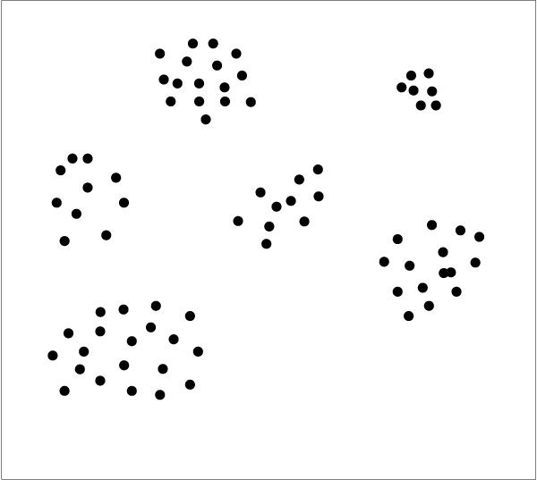

<!-- footer: Probabilistic Robotics Lesson 8 -->

# Probabilistic Robotics Lesson 8: Machine Learning (Part 2)

Ryuichi Ueda, Chiba Institute of Technology

 

This work is licensed under a <a rel="license" href="http://creativecommons.org/licenses/by-sa/4.0/">Creative Commons Attribution-ShareAlike 4.0 International License</a>.

---

<!-- paginate: true -->

## Contents

- Clustering
- EM Method
- Variational Inference

---

## The Importance of Clustering

- Review of the advanced vision
   - What do You see in the image on the right?
   - Why does it look like a cat?
- Probably grouping dots into one circle and two triangles (clustering).
   - [Research Example](https://www.riken.jp/medialibrary/riken/pr/press/2001/20010727_1/20010727_1.pdf)

---

### What can we recognize by summarizing?

- For example, if you want to know what is in front of you, what needs to be done?
   - Photoreceptor cell response$\longrightarrow$Object to recognize (e.g., cat)
   - Numerous stimuli$\longrightarrow$The single word "cat"
   - The brain needs to "reduce"
       - Reduce = Summarize to a representative value (feature)

---

- Left image: Image of actual crops in a field, with stems and leaves classified.
    - For robotics
    - The various colors have been reduced to three.
    - Humans can (with time) produce classification results like the one on the right.

---

### Classical Clustering Methods

- Used in the field of robotics for 30 years.
    - k-means algorithm
    - EM algorithm
- Problem to solve
    - Determine which points belong to the same group when points are scattered.

---

## k-means algorithm

- Divide the data into appropriate clusters and converge by repeating the following steps.
- Find the center of each cluster (denoted by the $\times$ symbol in the figure).
- Re-cluster each data set based on the nearest cluster center.

---

## Clustering numbers using k-means

- Divide the following nine numbers into three clusters:
- (8, 1, 3), (5, 5, 2), (6, 11, 7)
- The brackets indicate the initial classifications, which were randomly chosen.
- The answer is on the next page.
- Note
- If the mean values ​​are the same, select the cluster appropriately.
- If there are two or more close mean values ​​for a given data set (if they are the same distance),
Try changing the original class.

---

### Answer

- Initial values: (8, 1, 3), (5, 5, 2), (6, 11, 7) $\rightarrow$ Cluster means: 4, 4, 8
- Rearrangement: (1, 5, 2), (3, 5), (8, 6, 11, 7) $\rightarrow$ Cluster means: 2.666..., 4, 8
- Rearrangement: (1, 2, 3), (5, 5), (8, 6, 11, 7) $\rightarrow$ Cluster means: 2, 5, 8
- Rearrangement: (1, 2, 3), (5, 5, 6), (8, 7, 11) $\rightarrow$ Cluster means: 2, 5.333..., 8.666...
- Rearrangement: (1, 2, 3), (5, 5, 6, 7), (8, 11) $\rightarrow$ Cluster means: 2, 5.75, 9.5
- Rearrangement: (1, 2, 3), (5, 5, 6, 7), (8, 11) (No change. End)

---

### Problems with the k-means algorithm

- Is it okay to determine the number of clusters from the beginning?
- This is particularly problematic when programming sensors or robots.
- For example, I want to know how many people are in an image. It's rare to know from the beginning that there are three people.
- What if the clusters are distorted?
- In this case, you can either transform the data to eliminate the distorted data or use another method (such as a support vector machine).
- A more fundamental problem: You're not considering why the data is generated (i.e., ad hoc).

---

### EM Method (Maximum Likelihood Method)

- EM: Expectation Maximization
(We'll explain what this means later.)
 
- Consider a model (mathematical formula) of a certain probability distribution and find the parameters that best explain the data.
- Why did the data shown on the right come about?
$\rightarrow$ Imagine that there are several sources of data,
and that data is generated around them.

---

### "There are several sources of data, and that data is generated around them."

The basic model in this case: Gaussian Mixture Distribution

- Addition of multiple Gaussian distributions
and normalization (integration to 1)
- $p(\boldsymbol{x} | \boldsymbol{\mu}_{1:n}, \Sigma_{1:n}, \pi_{1:n}) = \pi_1 \mathcal{N}(\boldsymbol{\mu}_1, \Sigma_1)$
$\qquad+ \pi_2 \mathcal{N}(\boldsymbol{\mu}_2, \Sigma_2) + \dots + \pi_n \mathcal{N}(\boldsymbol{\mu}_n, \Sigma_n)$
- $\pi_1 + \pi_2 + \dots + \pi_n = 1$
(Note: This is the mixture ratio, not pi.)
- This can be illustrated as shown on the right.
(The fit is a bit poor.)

---

### "Most Likely Distribution" for Data

- The distribution that maximizes the following likelihood is considered "most likely."
- $p(\boldsymbol{x}_{1:N} | \boldsymbol{\mu}_{1:n}, \Sigma_{1:n}, \pi_{1:n}) = \prod_{j=1}^N p(\boldsymbol{x}_j | \boldsymbol{\mu}_{1:n}, \Sigma_{1:n}, \pi_{1:n})$
- Left-hand side: The probability density generated by the data $\boldsymbol{x}_{1:N}$
- Right-hand side: Multiplying the density of each data point $\boldsymbol{x}_i$
- Since the data is known, the problem is to find the most likely (maximum likelihood) parameters $\boldsymbol{\mu}_{1:n}, \Sigma_{1:n}, \pi_{1:n}$ and their likelihood
- Specifically,
- Left-hand side $= \prod_{j=1}^N \sum_{i=1}^n \pi_i \mathcal{N}(\boldsymbol{x}_j | \boldsymbol{\mu}_i, \Sigma_i)$
- Taking the logarithm, we turn multiplication into addition, making the problem the one of maximizing the log-likelihood
- $\log_e p(\boldsymbol{x}_{1:N} | \boldsymbol{\mu}_{1:n}, \Sigma_{1:n}, \pi_{1:n}) = \sum_{j=1}^N \log_e p(\boldsymbol{x}_j | \boldsymbol{\mu}_{1:n}, \Sigma_{1:n}, \pi_{1:n})$
- Making the problem equivalent and simpler

---

### Finding parameters that maximize the log-likelihood (similar to the k-means method)

1. First, perform appropriate clustering
2. M-step (maximization step)
- Calculate $\boldsymbol{\mu}_{1:n}, \Sigma_{1:n}, \pi_{1:n}$ for each cluster that maximizes the likelihood
3. E-step (expectation step)
- Cluster the data based on $\boldsymbol{\mu}_{1:n}, \Sigma_{1:n}, \pi_{1:n}$
- Calculate the probability that each data point belongs to a cluster at that time.

---

### Step E

- For each data point $\boldsymbol{x}_i$, we want to determine the probability of it belonging to which cluster.
- The Gaussian mixture parameters $\boldsymbol{\mu}_{1:n}, \Sigma_{1:n}, \pi_{1:n}$ are fixed.
- Unlike k-means, we do not determine that it belongs to a single cluster.
- We leave it vague because we don't know
- Mathematically,
- We want to find the probability that cluster $k_i$, to which $\boldsymbol{x}_i$ belongs, is the j$th cluster. $\text{Pr}\{ k_i = j |\boldsymbol{x}_i \} = k_{ij}$
- For all cases where $k_i$ is $1, 2, \dots, n$
- Variables like $k_{ij}$ are hidden and are called latent variables.

---
