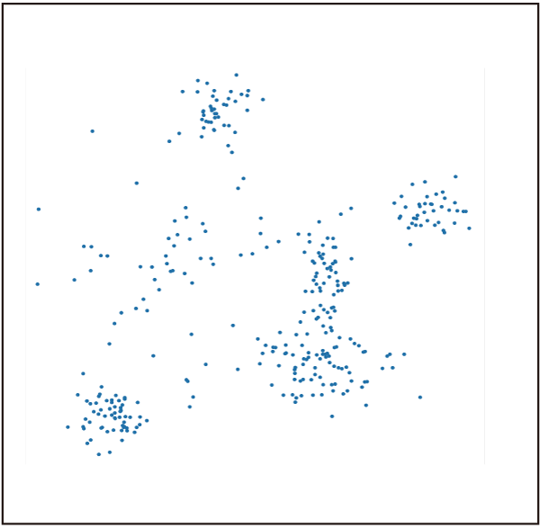

<!-- footer: Probabilistic Robotics Lesson 8 -->

# Probabilistic Robotics Lesson 8: Machine Learning (Part 2)

Ryuichi Ueda, Chiba Institute of Technology

 

This work is licensed under a <a rel="license" href="http://creativecommons.org/licenses/by-sa/4.0/">Creative Commons Attribution-ShareAlike 4.0 International License</a>.

---

<!-- paginate: true -->

## Contents

- Clustering
- EM Method
- Variational Inference

---

## The Importance of Clustering

- Review of the advanced vision
   - What do You see in the image on the right?
   - Why does it look like a cat?
- Probably grouping dots into one circle and two triangles (clustering).
   - [Research Example](https://www.riken.jp/medialibrary/riken/pr/press/2001/20010727_1/20010727_1.pdf)

---

### What can we recognize by summarizing?

- For example, if you want to know what is in front of you, what needs to be done?
   - Photoreceptor cell response$\longrightarrow$Object to recognize (e.g., cat)
   - Numerous stimuli$\longrightarrow$The single word "cat"
   - The brain needs to "reduce"
       - Reduce = Summarize to a representative value (feature)

---

- Left image: Image of actual crops in a field, with stems and leaves classified.
    - For robotics
    - The various colors have been reduced to three.
    - Humans can (with time) produce classification results like the one on the right.

---

### Classical Clustering Methods

- Used in the field of robotics for 30 years.
    - k-means algorithm
    - EM algorithm
- Problem to solve
    - Determine which points belong to the same group when points are scattered.

---

## k-means algorithm

- Divide the data into appropriate clusters and converge by repeating the following steps.
    - Find the center of each cluster (denoted by the $\times$ symbol in the figure).
    - Re-cluster each data set based on the nearest cluster center.

---

## Clustering numbers using k-means

- Divide the following nine numbers into three clusters:
    - (8, 1, 3), (5, 5, 2), (6, 11, 7)
        - The brackets indicate the initial classifications, which were randomly chosen.
    - The answer is on the next page.
- Note
    - If the mean values are the same, select the cluster randomly.
    - If there are two or more close mean values for a given data set (if they are the same distance), change the original class.

---

### Answer

- Initial values: (8, 1, 3), (5, 5, 2), (6, 11, 7) $\rightarrow$ Cluster means: 4, 4, 8
- Rearrangement: (1, 5, 2), (3, 5), (8, 6, 11, 7) $\rightarrow$ Cluster means: 2.666..., 4, 8
- Rearrangement: (1, 2, 3), (5, 5), (8, 6, 11, 7) $\rightarrow$ Cluster means: 2, 5, 8
- Rearrangement: (1, 2, 3), (5, 5, 6), (8, 7, 11) $\rightarrow$ Cluster means: 2, 5.333..., 8.666...
- Rearrangement: (1, 2, 3), (5, 5, 6, 7), (8, 11) $\rightarrow$ Cluster means: 2, 5.75, 9.5
- Rearrangement: (1, 2, 3), (5, 5, 6, 7), (8, 11) (No change. End)

---

### Problems of the k-means algorithm

- Is it okay to determine the number of clusters from the beginning?
    - This is particularly problematic when programming sensors or robots.
        - For example, we want to know how many people are in an image. It's rare to know from the beginning that there are three people.
- What if the clusters are distorted?
    - In this case, you can either transform the data to eliminate the distorted data or use another method (such as a support vector machine).
- A more fundamental problem: You're not considering why the data is generated (i.e., ad hoc).

---

### EM Method (Maximum Likelihood Method)

- EM: Expectation Maximization
(We'll explain what this means later.)
 
- Consider a model (mathematical formula) of a certain probability distribution and find the parameters that best explain the data.
    - Why did the data shown on the right come about?
$\rightarrow$ Imagine that there are several sources of data,
and that data is generated around them.

---

### "There are several sources of data, and that data is generated around them."

The basic model in this case: Gaussian Mixture Distribution

- Addition of multiple Gaussian distributions
and normalization (integration to 1)
    - $p(\boldsymbol{x} | \boldsymbol{\mu}_{1:n}, \Sigma_{1:n}, \pi_{1:n}) = \pi_1 \mathcal{N}(\boldsymbol{\mu}_1, \Sigma_1)$
$\qquad+ \pi_2 \mathcal{N}(\boldsymbol{\mu}_2, \Sigma_2) + \dots + \pi_n \mathcal{N}(\boldsymbol{\mu}_n, \Sigma_n)$
    - $\pi_1 + \pi_2 + \dots + \pi_n = 1$
(Note: This is the mixture ratio, not pi.)
- This can be illustrated as shown on the right.
(The fit is a bit poor.)

---

### "Most Likely Distribution" for Data

- The distribution that maximizes the following likelihood is considered "most likely."
    - $p(\boldsymbol{x}_{1:N} | \boldsymbol{\mu}_{1:n}, \Sigma_{1:n}, \pi_{1:n}) = \prod_{j=1}^N p(\boldsymbol{x}_j | \boldsymbol{\mu}_{1:n}, \Sigma_{1:n}, \pi_{1:n})$
        - Left-hand side: The probability density generated by the data $\boldsymbol{x}_{1:N}$
        - Right-hand side: Multiplying the density of each data point $\boldsymbol{x}_i$
        - Since the data is known, the problem is to find the most likely (maximum likelihood) parameters $\boldsymbol{\mu}_{1:n}, \Sigma_{1:n}, \pi_{1:n}$ and their likelihood
    - Specifically,
        - Left-hand side $= \prod_{j=1}^N \sum_{i=1}^n \pi_i \mathcal{N}(\boldsymbol{x}_j | \boldsymbol{\mu}_i, \Sigma_i)$

---

- Taking the logarithm, we turn multiplication into addition, making the problem the one of maximizing the log-likelihood
    - $\log_e p(\boldsymbol{x}_{1:N} | \boldsymbol{\mu}_{1:n}, \Sigma_{1:n}, \pi_{1:n}) = \sum_{j=1}^N \log_e p(\boldsymbol{x}_j | \boldsymbol{\mu}_{1:n}, \Sigma_{1:n}, \pi_{1:n})$
- Making the problem equivalent and simpler

---

### Finding parameters that maximize the log-likelihood (similar to the k-means method)

1. First, perform appropriate clustering
2. M-step (maximization step)
    - Calculate $\boldsymbol{\mu}_{1:n}, \Sigma_{1:n}, \pi_{1:n}$ for each cluster that maximizes the likelihood
3. E-step (expectation step)
    - Cluster the data based on $\boldsymbol{\mu}_{1:n}, \Sigma_{1:n}, \pi_{1:n}$
        - Calculate the probability that each data point belongs to a cluster at that time.

---

### Step E

- For each data point $\boldsymbol{x}_i$, we want to determine the probability of it belonging to which cluster.
    - The Gaussian mixture parameters $\boldsymbol{\mu}_{1:n}, \Sigma_{1:n}, \pi_{1:n}$ are fixed.
    - Unlike k-means, we do not determine that it belongs to a single cluster.
        - We leave it vague because we don't know
- Mathematically,
   - We want to find the probability that cluster $k_i$, to which $\boldsymbol{x}_i$ belongs, is the j$th cluster. $\text{Pr}\{ k_i = j |\boldsymbol{x}_i \} = k_{ij}$
       - For all cases where $k_i$ is $1, 2, \dots, n$
   - Variables like $k_{ij}$ are hidden and are called latent variables.

---

### How to Calculate $k_{ij}$

- $k_{ij}$ is the density of the Gaussian distribution for cluster $j$ multiplied by the mixture ratio.
- Derivation of the formula
    - $\text{Pr}\{ k_i = j |\boldsymbol{x}_i \} = \eta p(\boldsymbol{x}_i | k_i = j )\text{Pr}\{ k_i = j \}$ (Bayes' Theorem)
        - $p(\boldsymbol{x}_i | k_i = j )$: Gaussian distribution for the $k_i$th cluster
        - $\text{Pr}\{ k_i = j \}$: Probability of data being in the $k$th cluster when information on $\boldsymbol{x}_i$ is unavailable ($=\pi_k$)
    - $k_{ij} = \eta \pi_k \mathcal{N}(\boldsymbol{x}_i | \boldsymbol{\mu}_j, \Sigma_j)$←Can be calculated
        - Determine $\eta$ so that the sum of the $k_{ij}$ values ​​for each cluster equals $1$.

---

### M-step

- Calculate distribution parameters with $k_{ij}$ fixed.
- Method (weighted by $k_{ij}$ and perform statistics).
    - Consider the auxiliary parameter $N_j = \sum_{i=1}^N k_{ij}$.
        - Equivalent to the number of elements in each cluster.
    - Calculate the size, mean, and covariance matrix of each cluster based on $N_j$ and $k_{ij}$.
        - $\pi_j = \eta N_j = N_j / \sum_{j=1}^n N_j$.
        - $\boldsymbol{\mu}_j = \dfrac{1}{N_j}\sum_{i=1}^N k_{ij}\boldsymbol{x}_i$
        - $\Sigma_j = \dfrac{1}{N_j-1} \sum_{i=1}^N k_{ij}(\boldsymbol{x}_i - \boldsymbol{\mu}_j)(\boldsymbol{x}_i - \boldsymbol{\mu}_j)^\top$

---

### What the EM algorithm can/cannot do

- What it can do
    - Introduces a probabilistic approach
        - (I apologize for the lack of examples, but) Performance is better than k-means
            - Leaving unclear points vague reduces the chance of making strange mistakes
        - Establishes a criterion of "maximum likelihood" for a probabilistic model
        - Can be applied to other probabilistic models

---

- What is not possible
    - It could be more probabilistic
        - Parameters also have distributions (Gaussian mixtures also vary probabilistically)
    - The number of Gaussian distributions is fixed
        - It is not powerful enough to eliminate unnecessary distributions

---

## Variational Inference

---

### Review of Lesson 5

- Consider the "distribution of success rates" based on the success and failure of the experiment.
    - Beta distribution: $p(x) = \eta x^{\alpha-1}(1-x)^{\beta-1}$
    - As the results of each experiment are reflected one by one, the distribution of success rates changes.
        - Figure below: Evolution of the distribution for success, success, failure, and failure
            - Don't assume the success rate is 1/2
    - The distribution change was calculated using Bayes' theorem.

---
## Bayesian inference for Gaussian mixture distributions

- Consider the "distribution of mixture distributions"
    - The distribution can be drawn as shown in the right figure.
- Difference from EM method
    - Calculates the distribution of distributions themselves, not the maximum likelihood.
    - Updates the distribution using Bayes' theorem when data is received.
- Problem: Posterior probabilities cannot be calculated in one go using Bayes' theorem.
    - What to do? Gradually change the distribution, as in the EM method.

---

### Parameters of the target (Gaussian mixture distribution)

This is about the "distribution" rather than the "distribution of distributions"

- Parameters of each Gaussian distribution: $\boldsymbol{\mu}_j, \Sigma_j, \pi_j$
    - (Review) Gaussian mixture distribution:
        - $p(\boldsymbol{x} | \boldsymbol{\mu}_{1:K}, \Sigma_{1:K}, \pi_{1:K})$
$= \sum_{j=1}^n \pi_j \mathcal{N}(\boldsymbol{\mu}_j, \Sigma_j)$
($\pi_1 + \pi_2 + \dots + \pi_n = 1$)
- The position of each data $\boldsymbol{x}_i$ ($i=1,2,\dots,N$) $k_{i}$
    - Which Gaussian distribution does it belong to?
    - Latent Variable

---

### Solution using Variational Inference

- Approximate the target distribution as the product of independent distributions for each parameter.
    - $q(\pi_{1:K},\boldsymbol{\mu}_{1:K}, \Lambda_{1:K}, k_{1:N}) = q_1(k_{1:N})q_2(\pi_{1:K},\boldsymbol{\mu}_{1:K}, \Lambda_{1:K})$
        - $q$: Approximate distribution
    - Fix either $q_1$ or $q_2$, and alternately adjust the other to fit the data.
        - Adjust $q_1$: Reconstruct clusters
        - Adjust $q_2$: Reconstruct distributions
Same as EM (but more complicated)
- Next page
    - Further decompose $q_2 = q_3q_4$ to model $q_1, q_3, q_4$
        - $q_2(\pi_{1:K},\boldsymbol{\mu}_{1:K}, \Lambda_{1:K}) = q_3(\pi_{1:K})q_4(\boldsymbol{\mu}_{1:K}, \Lambda_{1:K})$

---

### Modeling $q_1$

- Consider the probability distribution $q_1'$ that the $i$th data $\boldsymbol{x}_i$ belongs to the $j$th cluster (where $k_i = j$).
(Note that the subscript $1$ does not refer to the data or cluster.)
    - Let's express this as $r_{ij}$
    - This applies to table-like data without a specific formula.
- Let $q_1$ be the product of $q_1'$ for each data point.

---

### Modeling $q_3$

- Assumes a Dirichlet distribution
    - An extension of the beta distribution to multivariate cases, not just heads and tails of a coin.
        - Example: 6 for dice
    - $\text{Dir}(\pi_{1:K} | \alpha_{1:K})= \eta \pi_1^{\alpha_1-1}\pi_2^{\alpha_2-1}\dots\pi_n^{\alpha_n-1}$
$= \eta \prod_{j=1}^n \pi_j^{\alpha_j - 1}$
        - $\alpha_{1:K}$: Parameter that determines the variability of $\pi_{1:K}$
            - The larger the total value of $\alpha_{1:K}$, the more stable the value becomes.

---

### Modeling $q_4$

- Distribution of each Gaussian distribution $\mathcal{N}(\boldsymbol{\mu}_j, \Lambda_j^{-1})$:
Gauss-Wishart distribution
- $q_4'(\boldsymbol{\mu}_j, \Lambda_j) = \mathcal{N}(\boldsymbol{\mu}_j|\boldsymbol{m}_j, (\beta_j \Lambda_j)^{-1})\mathcal{W}(\Lambda_j | W_j, \nu_j)$
- Wishart distribution $\mathcal{W}$: Distribution of precision matrix $\Lambda_j$
- Parameters determining the distribution of each Gaussian distribution: $\boldsymbol{m}_j, \beta_j, W_j, \nu_j$
- The product of $q_4'$ for each Gaussian distribution is defined as $q_4$

---

### List of variables and parameters so far

|Data|Parameters of the distribution to be estimated|Parameters of the distribution to be estimated|
|:---:|:---:|:---:|
|$\boldsymbol{x}_i$|$k_i, \boldsymbol{\mu}_j, \Lambda_j, \pi_j$|$r_{ij}, \boldsymbol{m}_j, \beta_j, W_j, \nu_j, \alpha_j$|
- $i=1,2,\dots,N$ ($N$: number of data points)
- $j=1,2,\dots,K$ ($K$: number of Gaussian distributions)

---

### Variational Inference Procedure

1. Determine the prior distribution for $q_1q_3q_4$ appropriately
- Initialize the probability $r_{ij}$ (equivalent to clustering)
- Set the initial values ​​of the parameters $\boldsymbol{m}_{1:K}, \beta_{1:K}, W_{1:K}, \nu_{1:K}, \alpha_{1:K}$.
- Let $\boldsymbol{m}'_{1:K}, \beta'_{1:K}, W'_{1:K}, \nu'_{1:K}, \alpha'_{1:K}$.
2. Fix $q_1$ and calculate the parameters $\boldsymbol{m}_{1:K}, \beta_{1:K}, W_{1:K}, \nu_{1:K}, \alpha_{1:K}$ of the posterior distribution of $q_3q_4$.
- This corresponds to the M-step in the EM algorithm (Variational M-step).
3. Fix $q_3q_4$ and calculate $q_1$ (i.e., $r_{ij}$).
- Equivalent to the E-step of the EM algorithm (Variational E-step).
- Note: $\boldsymbol{m}'_{1:K}, \beta'_{1:K}, W'_{1:K}, \nu'_{1:K}, \alpha'_{1:K}$ are fixed.
- Fix the prior distribution and iteratively improve the posterior distribution.

---

### The Power of Variational Inference (Part 1)

It's very powerful, so I'll show an example before explaining the specific calculation method.

- Example 1: Clustering 2-D Points
- Right: A point randomly selected from a Gaussian mixture distribution containing six Gaussian distributions.
- What happens when we apply variational inference to the clustering of this data (or rather, the inference of the Gaussian mixture distribution that has been generated)?

---

### Inference Progress

- Drawing the mean distribution from the Gaussian mixture distribution
- Assume there are 10 distributions $\rightarrow$. Unnecessary distributions disappear ($\pi_j$ values ​​converge to 0).

---

### Comparison with the correct answer

- There is some discrepancy in the covariance matrix, but it is accurate.
- It may be more accurate than humans.
- Being able to count numbers (although there is an upper limit) is very useful.

---

### The Power of Variational Inference (Part 2)

- Example 2: Analyzing One-Dimensional Data
- A lecturer discovered this by chance while writing a book.
- Is the distribution on the right a Gaussian distribution?

---

### Variational inference...

- Another distribution was found.
- This data was taken every 3 seconds from a certain sensor, and the average value was different during daylight and nighttime hours.
- In a sense, the clustering resolution is higher than that of humans.

---

## Real-World Use Case 1

- Bolt tip detection
- Converting 3D positions to 1D and then clustering

---

## Real-World Use Case 2

- Clustering of grip positions on an object surface
- 6-dimensional space of normal vector positions and orientations

---

## Specific calculations for variational inference

- Because the derivation is too difficult (explained in textbooks),
we will only show the M and E steps.
- Derive the posterior distribution of $q_1, q_3, q_4$ using Bayes' theorem.
- Simply apply the derived formula to use it.

---

### Variational M step (calculate distribution parameters from each data point's affiliation).

- Calculate auxiliary values.
- $N_j = \sum_{i=1}^N r_{ij}\qquad\qquad$ (number of weighted data points in distribution $j$).
- $\bar{\boldsymbol{x}}_j = \dfrac{1}{N_j} \sum_{i=1}^N r_{ij}\boldsymbol{x}_i\ \quad$ (weighted mean of distribution $j$)
- $\Sigma_j = \dfrac{1}{N_j} \sum_{i=1}^N r_{ij}(\boldsymbol{x}_i - \bar{\boldsymbol{x}}_j)(\boldsymbol{x}_i - \bar{\boldsymbol{x}}_j)^\top$ (weighted covariance matrix of distribution $j$)
- Calculate the parameters of the posterior distribution
- $(\alpha_j, \beta_j, \nu_j) =(\alpha_j', \beta_j', \nu_j') + (N_j, N_j, N_j)$ (increase by the number of data points)
- $\boldsymbol{m}_j = (\beta_j' \boldsymbol{m}_j' + N_j \bar{\boldsymbol{x}}_j ) /\beta_j\qquad\qquad\qquad$ (center adjustment of $\boldsymbol{\mu}_j$)
- $W^{-1}_j = W'^{-1}_j + N_j \Sigma_j + \dfrac{\beta'_j N_j}{\beta'_j+ N_j} (\bar{\boldsy

---

## Supplementary Materials

---

### General Derivation of the EM Method

- The log-likelihood on p. 13 and the latent variables on p. 14 are written as follows (to reduce the number of symbols):
- $p(\boldsymbol{x}_{1:N} | \boldsymbol{\mu}_{1:n}, \Sigma_{1:n}, \pi_{1:n}) = p(X | \boldsymbol{\Theta})$
- $z_{1:N} = Z$
- $\log_e p(X,Z | \boldsymbol{\Theta})$ is transformed
- $\log_e p(X,Z | \boldsymbol{\Theta}) = \log_e p(Z | X, \boldsymbol{\Theta})p(X | \boldsymbol{\Theta})$
$= \log_e p(Z | X, \boldsymbol{\Theta}) + \log_e p(X | \boldsymbol{\Theta})$ (← the last term is the log-likelihood)
- Move the log-likelihood to the right-hand side, multiply each term by $q(Z)$, and integrate with respect to $Z$ ($\int_Z q(Z) \text{d}Z= 1$)
- $\int_Z q(Z) \log_e p(X | \boldsymbol{\Theta}) \text{d}Z = \int_Z q(Z) \log_e p(X,Z | \boldsymbol{\Theta})\text{d}Z$
$\qquad\qquad\qquad\qquad\quad - \int_Z q(Z) \log_e p(Z| X, \boldsymbol{\Theta}) \text{d}Z$
- The integral on the left side can be removed because $Z$ is not within $\log_e p(X | \boldsymbol{\Theta})$.
- $\log_e p(X | \boldsymbol{\Theta}) = \int_Z q(Z) \log_e p(X, Z | \boldsymbol{\Theta})\text{d}Z - \int_Z q(Z) \log_e p(Z |X, \boldsymbol{\Theta}) \text{d}Z$

---

### Deriving the EM Method Considering Latent Variables (continued)

- Add two terms that become zero when added to the right side and distribute them.
- $\log_e p(X | \boldsymbol{\Theta}) = \int_Z q(Z)\log_e p(X, Z | \boldsymbol{\Theta})\text{d}Z - \int_Z q(Z) \log_e p(Z |X, \boldsymbol{\Theta}) \text{d}Z$
$= \int_Z q(Z) \log_e p(X, Z | \boldsymbol{\Theta})\text{d}Z - \int_Z q(Z) \log_e p(Z |X, \boldsymbol{\Theta}) \text{d}Z$
$\quad- \int_Z q(Z) \log_e q(Z) \text{d}Z + \int_Z q(Z) \log_e q(Z) \text{d}Z$
$= \int_Z q(Z) \log_e \dfrac{ p(X, Z | \boldsymbol{\Theta}) }{q(Z)} \text{d}Z - \int_Z q(Z) \log_e \dfrac{p(Z |X, \boldsymbol{\Theta})}{q(Z)} \text{d}Z$
- Define and organize new functions
- $\log_e p(X | \boldsymbol{\Theta}) = \mathcal{L}(q, \boldsymbol{\Theta}) + \text{KL}(q || p)$
- $\mathcal{L}(q, \boldsymbol{\Theta}) = \int_Z q(Z) \log_e \dfrac{ p(X, Z | \boldsymbol{\Theta}) }{q(Z)} \text{d}Z$
- $\text{KL}(q || p) = - \int_Z q(Z) \log_e \dfrac{p(Z |X, \boldsymbol{\Theta})}{q(Z)} \text{d}Z$

---

### The resulting equation

- $\log_e p(\boldsymbol{x}_{1:N} | \boldsymbol{\mu}_{1:n}, \Sigma_{1:n}, \pi_{1:n}) = \mathcal{L}(q, \boldsymbol{\mu}_{1:n}, \Sigma_{1:n}, \pi_{1:n}) + \text{KL}(q || p)$
- $= \mathcal{L}(q, \boldsymbol{\Theta}) + \text{KL}(q || p)$
- $q$($q(Z)$): Distribution of the latent variable
- $\text{KL}(q || p)$: Kullback-Leibler distance
- Quantifies the difference in shape between the distributions $q$ and $p(Z | X, \boldsymbol{\Theta})$
(If they match, it is $0$, and as they differ, it becomes a large positive value.)
- $\mathcal{L}$: Variational lower bound
- Log likelihood (The value of the left-hand side cannot be lower than this, because KL is greater than or equal to 0.)

---

### The resulting formula and how to use it

- $\log_e p(X | \boldsymbol{\Theta}) = \mathcal{L}(q, \boldsymbol{\Theta}) + \text{KL}(q || p)$
- $q$($q(Z)$): Distribution of the latent variable
- $\text{KL}(q || p)$: Kullback-Leibler distance
- Quantifies the difference in shape between the distributions $q$ and $p(Z |X, \boldsymbol{\Theta})$.
(If they match, it's $0$, and the more they differ, the larger the positive value becomes.)
- $\mathcal{L}$: Variational lower bound
- Log likelihood (The value of the left-hand side cannot be lower than this, because KL is greater than or equal to 0.)
- Usage
- Fix $\boldsymbol{\Theta}$ to $\boldsymbol{\Theta}_\text{old}$ and search for a "good" $q(Z)$ (E-step)
- Setting $\text{KL}$ to $0$ seems appropriate. $\Rightarrow \mathcal{L}$ matches the log likelihood.
- Fix $q(Z)$ and update $\boldsymbol{\Theta}_\text{old}$ to $\boldsymbol{\Theta}_\text{new}$ (M-step)
- To maximize $\mathcal{L}$ (the log likelihood also increases, resulting in a better result)

