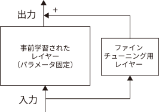
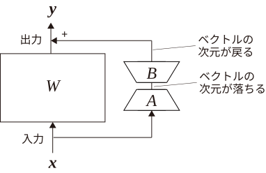

<!-- footer: "ロボットビジョン第10回" -->

# ロボットビジョン

## 第10回: 画像と言語、ロボット制御の融合II

千葉工業大学 上田 隆一

 

This work is licensed under a [Creative Commons Attribution-ShareAlike 4.0 International License](https://creativecommons.org/licenses/by-sa/4.0/).

---

<!-- paginate: true -->

## 今日やること

- 本題の前に
    - flow matching
    - LoRA（low-rank adaptation）
- VLA（vision-language-action model）、ロボット基盤モデル
    - [河原塚先生のスライド](https://speakerdeck.com/haraduka/miru2025-tiyutoriarujiang-yan-robotutoji-pan-moderunozui-qian-xian)も参考になります

---

## Low-Rank Adaptation（LoRA）[[Hu2021]](https://arxiv.org/abs/2106.09685)

- 高効率なファインチューニング方法
- アイデア（一般的にアダプターと呼ばれるもの）
    - 事前学習された行列状のパラメータを固定
    - 横にファインチューニング用のモデルを
    用意してパラメータの差分だけ計算
        - 下のモデルよりパラメータ数を小さく
            - 誤差逆伝搬の計算量が減る
        - どうやって少なくするかは次ページ

---

### パラメータの削減方法

- 事前学習された$\alpha \times \beta$行列$W$に対し
次の行列を準備
     - 行列$A$（$d\times \beta$）
     - 行列$B$（$\alpha \times d$）
- ファインチューニングされた行列: $W' = W + BA$
    - $W$のパラメータ数: $\alpha \beta$
    - $BA$のパラメータ数: $(\alpha + \beta)d$
        - 小さい$d$でパラメータ数削減
- 入力の次元が$A$で落ちて$B$で元通りに
    - 潜在空間による次元圧縮のようなもの

---

### Robotics Transformer 2（RT-2）[[Brohan2023]](https://arxiv.org/abs/2307.15818)（[サイト](https://robotics-transformer2.github.io/)）

- この論文の概要: "We refer to such category of models as vision-language-action models (VLA) and ..."ということで、ここでVLAという言葉が出現
- 構造（2種類ある）
    - PaLIにいろいろくっつけたもの（RT-2-PaLI-X）
    - PaLM-Eベースのもの（RT-2-PaLM-E）
        - 以後はPaLM-Eの使用を前提に話します
        - なんでもトークンにして突っ込めてトークンを話すモデル

だとしたらPaLM-EとRT-2の違いはなに？

---

### PaLM-Eとの違い（VLAと呼ぶ理由）

- ロボットの動作（言語レベルではなく数値レベルのもの）も一緒に学習
    - 数値レベル: 関節の回転角や移動量などのこと
        - 例: 論文の図1の訓練データのペア（一番下のやつ）
            - Q: What should the robot do to `<task>`?
            - A: 変位: $(0.1, -0.2, 0)$、回転: $(10^\degree, 25^\degree, -7^\degree)$
- $\Longrightarrow$ PaLM-Eと違って直接的にロボットの動作を出力可能
    - 制御のレイヤーを考えるとRT-1の後継と考えることが妥当

---

### OpenVLA[[Kim2024]](https://arxiv.org/abs/2406.09246)

- その名の通りオープンなVLA
- オープンにするときの要件
    - ユーザーのロボットが違うのでファインチューニングしやすくすると便利
$\Longrightarrow$LoRAが使えるようになっている
       - （補足: 多種のロボットの訓練データで学習したVLAは、ファインチューニングなしでも少しのロボットの違いをある程度吸収）

---

### 構造（[[論文]](https://arxiv.org/abs/2406.09246)の図2）

- 画像処理の部分: SigLIPとDINOv2という2つのモデルからそれぞれ独立にトークンを生成（詳細は論文の付録Dに）
    - SigLIP[[Zhai2023]](https://arxiv.org/abs/2303.15343): ゼロショットで画像分類するモデル
        - softmaxでの多数のものから物体を分類をするのではなく、画像と短文がどれだけ合っているか確率で出力
        - 画像全体の説明をトークンに
    - DINOv2[[Oquab2023]](https://arxiv.org/abs/2304.07193): 画像の基盤モデル
        - 画像の低レベルの特徴量を抽出してトークンに
- LLMのパート: Llama（Large Language Model Meta AI）
    - 下のAction De-tokenizerに入力するトークンを出力
- 行動の生成: 「Action De-tokenizer」（どんな実装か不明。コードを読め？）

---

### 訓練データ・訓練方法

- 事前学習の訓練データ: Open X-Embodiment dataset
    - 70台、200万のロボットの軌道
- ファインチューニング
    - 訓練データはユーザーが用意
    - 先述のようにLoRAが使える

---

### $\pi_0$[[Black 2024]](https://arxiv.org/html/2410.24164v1)（[サイト](https://www.physicalintelligence.company/blog/pi0)）

- Physical Intelligence社が開発したVLAモデル
- 片腕、双腕、移動マニピュレータなど多種のロボットのデータを一度に学習
    - 68種のタスクの独自データセットとOpen X-Embodiment dataset
        - それぞれ7種+22種のロボットのデータを含む
        - 1万時間超の長さ
- ACTで使われていたaction chunking architectureで50Hzの制御周期を達成
    - ただし、CVAEではなくconditional flow matching（CFM）を使用
- 使用例: 上記のサイトにいろいろ
    - 洗濯物を洗濯機から取り出して畳むなど複雑で細かい動作を実現

---

### 構造（[このページ](https://arxiv.org/html/2410.24164v3)の図3）

- PaliGemma
    - オープン、軽量なGoogleのVLM（30億パラメータ）
    - 入力: 画像と作業の指示
    - 出力: トークン
- action expert
    - ロボットの動作のシーケンスを出力（3億パラメータ）
    - 入力: PaliGemmaからのトークンとロボットの状態
    - 出力: 動作シーケンス
        - フローマッチングで

---

### フローマッチングの使い方

- ニューラルネットの作るベクトル場の変数に観測データも入れて学習
    - 損失関数: $\mathcal{L}_\text{CFM}(\boldsymbol{w}) = \big\langle \{ \boldsymbol{v}_{\boldsymbol{w}}(A_t^\tau,\boldsymbol{o}_t)  - \boldsymbol{u}(A_t^\tau | A_t) \}^2 \big\rangle_{q(A_t^\tau | A_t), p(A_t | \boldsymbol{o}_t ), \tau \sim \text{Beta}}$
        - $\tau$がFMの時刻（$0 \le \tau \le 1$）
            - $t$は実際の時刻（ロボットの動作のステップ）
            - $\tau$が小さいときの損失関数を重視したい
            $\rightarrow$ベータ分布でバイアスをかけて重み付き平均で評価
        - $A_t$（時刻$t$での動作シーケンス）が訓練データ
            - 観測や指示$\boldsymbol{o}_t$と対になっている
        - $q(A_t^\tau | A_t ) = \mathcal{N}[\tau A_t, (1-\tau)I]$（最適輸送パス）
- 使用（推論）時
    - $A_t^0$に雑音を入れると$\boldsymbol{o}_t$に条件づけられた$\boldsymbol{v}_\boldsymbol{w}$に導かれて$A_t^1$が生成される

---

## まとめ

- VLAというものができた
    - この2, 3年でロボットが人間の指示が分かるようになってしまった
    - しかも相当細かい作業もできる
    - 今は性能が出ないタスクでもそのうち出るようになる
- 今後
    - 自身の研究テーマについてもういっぺんよく考えてみましょう
        - 自身はロボットの何を解決したいのか、それは未解決なのかもういっぺん考えてみる
