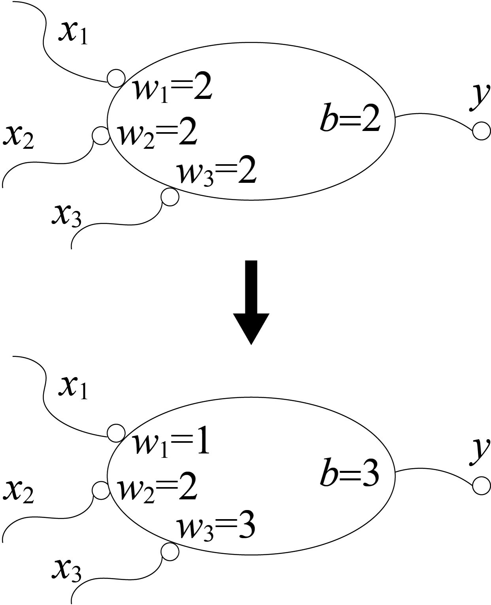
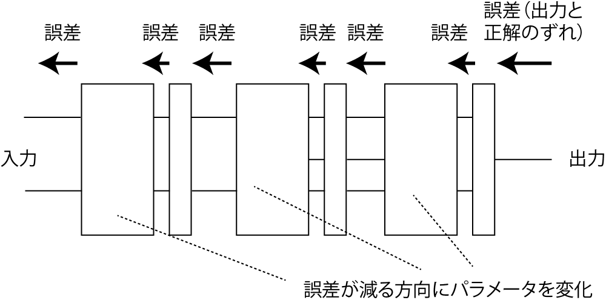
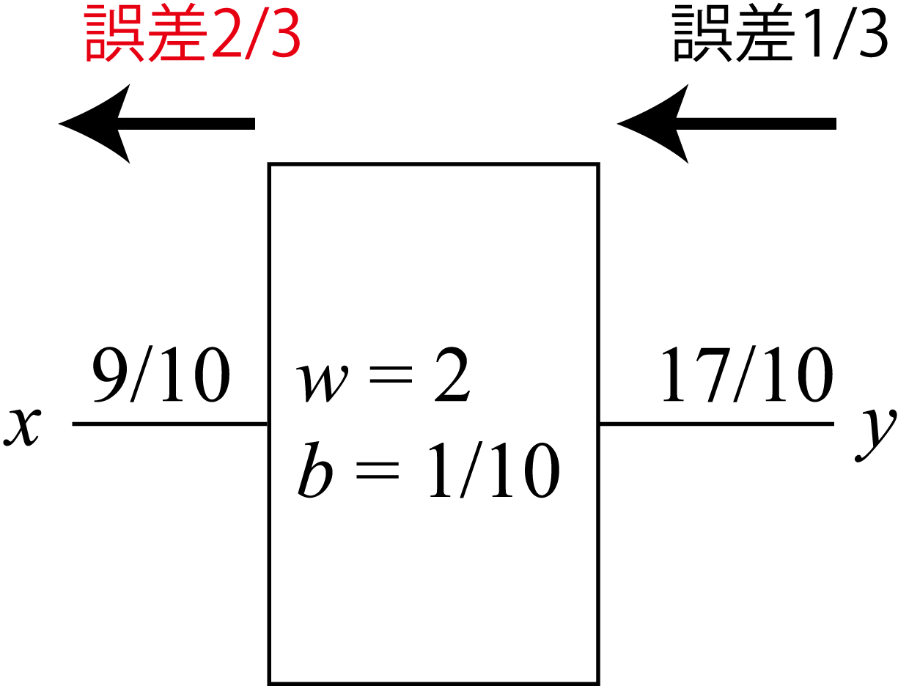
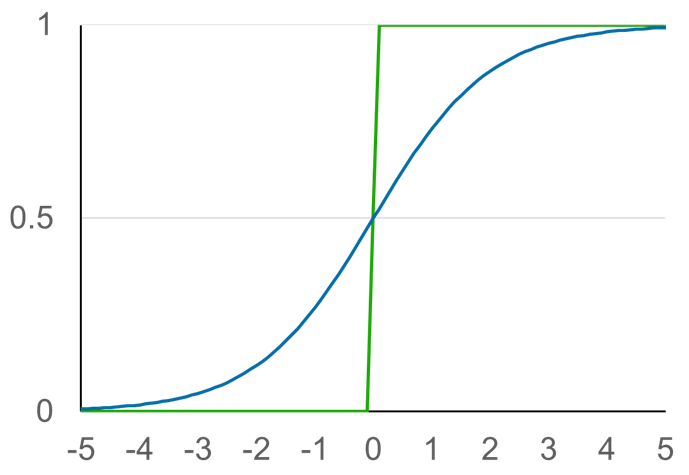
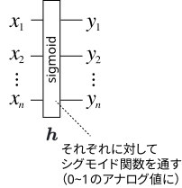
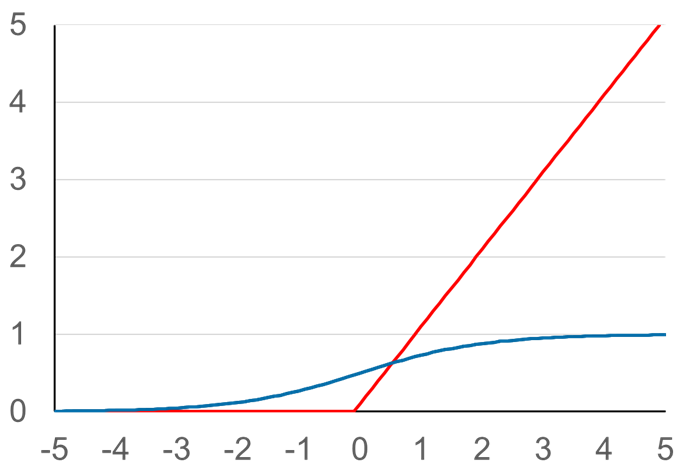
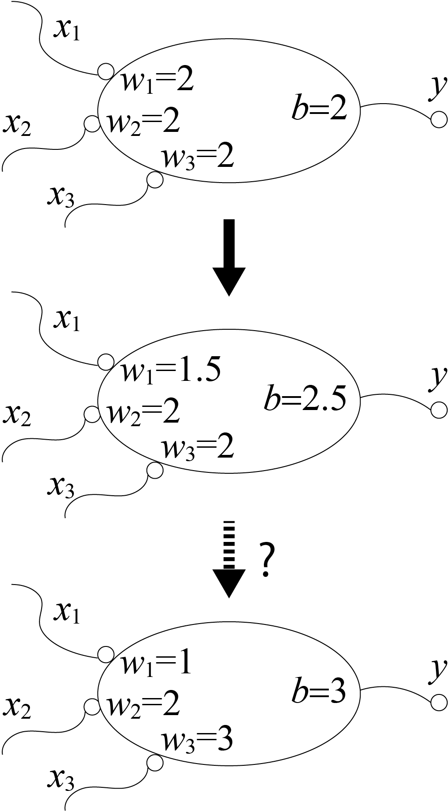
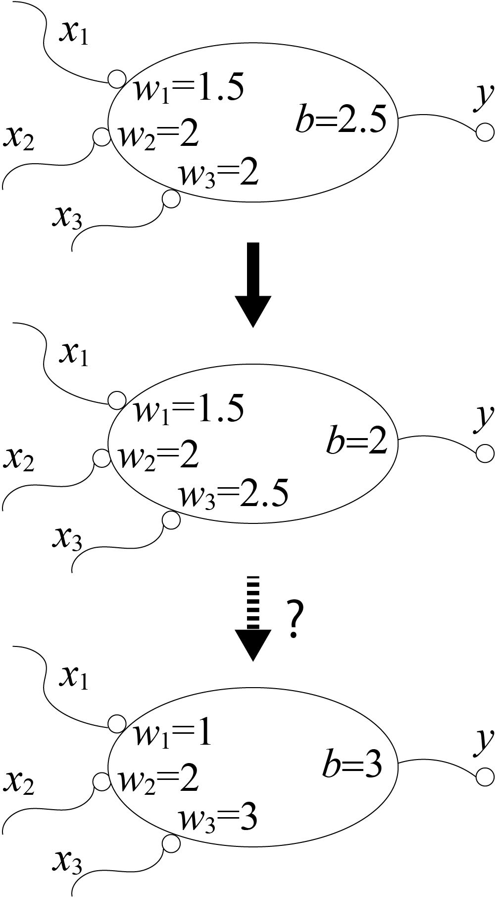
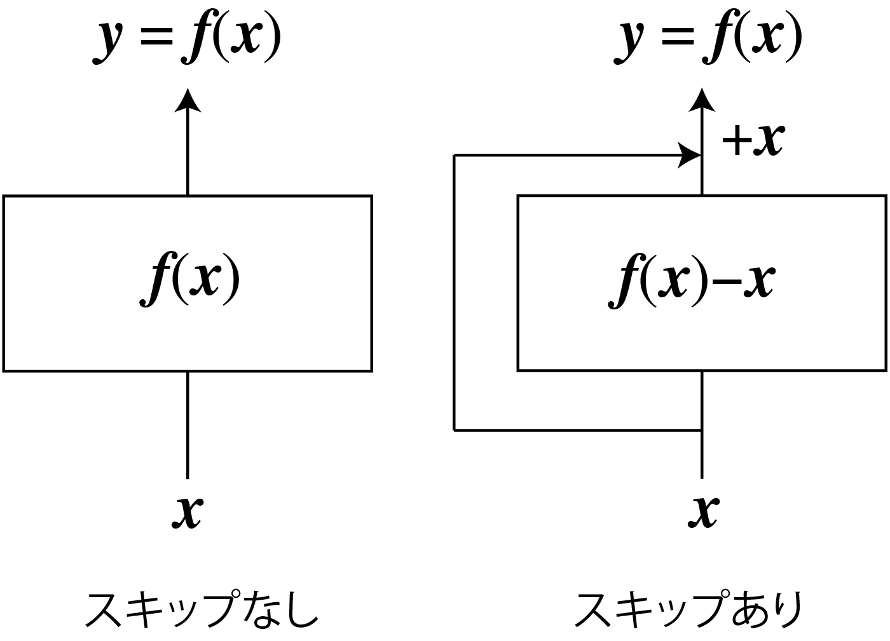

<!-- footer: "ロボットビジョン第2回" -->

# ロボットビジョン

## 第2回: 人工ニューラルネットワークの学習

千葉工業大学 上田 隆一

 

This work is licensed under a [Creative Commons Attribution-ShareAlike 4.0 International License](https://creativecommons.org/licenses/by-sa/4.0/).

---

<!-- paginate: true -->

## 今日やること

- 人工ニューラルネットワークをどのように学習させるか

---

### 前回残った問題: どう学習するか?

- 動物は生まれたときにある程度プログラミングされた状態だが・・・
- そのあと成長しても神経細胞は基本的に増えない
- 猫を識別するにはニューラルネットワークに変更を加えないといけない
- 頭を開けて配線するわけにはいかない

どうやるの?

---

### 学習の方法: パラメータを変える

- 例題: $x_1 + 2 x_2 + 3 x_3 \ge 3$なら$1$を出力、そうでなければ$0$を出力するように人工ニューロンを学習させたい
- 最初、パラメータはあてずっぽ（右図上）
- 基本的な方法
1. 何か入力して出力と正解の「ずれ」を観測する
    - 例えば上のニューロンに$(x_1, x_2, x_3) = (1, 0, 0)$を入れると$1$が出てくる（$0$が出てきてほしいのに）
2. ずれを小さくするようにパラメータを変える
    - この場合はたとえば$w_1 = 1.9$とすると$0$に

これを全ニューロンに対してやる

---

### ずれ: 損失関数

- 損失関数の定義$\mathcal{L}(w_{1:n} |$データ$)$
- $w_{1:n}$: パラメータ（前ページの例の場合は$b$も$w_4$などにして含める）
- ずれの減らし方
- 損失関数を微分すると増える方向がわかる
    - $\nabla \mathcal{L}(w_{1:n} |$データ$) = \left( \dfrac{\partial\mathcal{L}}{\partial w_0},  \dfrac{\partial\mathcal{L}}{\partial w_1}, \dots, \dfrac{\partial\mathcal{L}}{\partial w_n} \right)$
- $\Delta w_{1:n} = - \alpha \nabla \mathcal{L}(w_{1:n}|$データ$)$でパラメータを変更
    - $\alpha$は小さな正の値
- データは正解のものをたくさん準備
- 訓練データ

---

### 損失関数と損失関数の偏微分の例（2ページ前のニューロンについて）

閾値処理が入るのでややこしい（というか微分できないん）ですが

- 1つのデータの損失関数:
$\mathcal{L}(w_{1:3},b|x'_{1:3},y') =$誤差$^2$$=\{h( w_1x'_1 + w_2x'_2 + w_3x'_3 - b) - y'\}^2$
- $w_i (i=1,2,3)$で偏微分: $\dfrac{\partial \mathcal{L}}{\partial w_i} = 2\dfrac{\partial h}{\partial w_i}x_i'\cdot$誤差
- $b$で偏微分: $\dfrac{\partial \mathcal{L}}{\partial b} = -2\dfrac{\partial h}{\partial b}\cdot$誤差
- とりあえず$h$の偏微分を$1$として無視すると、
- $\nabla \mathcal{L}(w_{1:3},b | x'_{1:3}, y') = 2(x_1', x_2', x_3', -1)\cdot$誤差

---

### パラメータの更新（2ページ前のニューロンについて）

- パラメータを更新する際の増分は
- $\Delta( w_1, w_2, w_3, b) = - \alpha' \nabla \mathcal{L}$
$= - \alpha (x'_1, x'_2, x'_3, -1)\cdot$誤差
- 時間のあるときにやってみましょう
- 適当に$x_{1:3}$を選んで出力を観測
- 上の式でパラメータを変更

---

### いろいろ問題がある

- 閾値処理が微分できない
- ニューロンをたくさん連結すると計算が大変

どうしましょう

---

### 計算方法の導出（1/4）

とりあえず微分可能として、任意のパラメータ$w$をどう変化させるか考えてみましょう

- ANNの一般的な表記: $\boldsymbol{f}(\boldsymbol{x}) =
(\boldsymbol{f}^{(n)}\circ
\boldsymbol{f}^{(n-1)}\circ\dots\circ
\boldsymbol{f}^{(1)})(\boldsymbol{x})$
- $\boldsymbol{f}^{(m)}$: 入力から見て$m$層目
    - $\boldsymbol{y}^{(m)} = \boldsymbol{f}^{(m)}(\boldsymbol{x}^{(m)})$
        - $\boldsymbol{x}^{(m)}, \boldsymbol{y}^{(m)}$: $m$層目の入出力、$\boldsymbol{y}^{(m)} = \boldsymbol{x}^{(m+1)}$
- 損失関数を定義
- $\mathcal{L}(\boldsymbol{w}, \boldsymbol{x} | \boldsymbol{y}) = \dfrac{1}{2}\sum_{i=1}^k\{ f_i(\boldsymbol{x} | \boldsymbol{w}) - y_i \}^2$
    - $\boldsymbol{w}$: パラメータを並べたベクトル。ある時点である値が入っている。
    - $f_i, y_i$: それぞれ$\boldsymbol{f}, \boldsymbol{y}$の$i$番目の要素
    - $1/2$は計算の都合でつけただけ
    - あとから教示データの入出力ペア$(\boldsymbol{x}', \boldsymbol{y}')$を代入すると値が確定

---

### 計算方法の導出（2/4）

- $\boldsymbol{w}$のうち、ある層$m$にあるパラメータ$w$を動かしたい
- $\dfrac{\partial}{\partial w}\mathcal{L}(\boldsymbol{w} , \boldsymbol{x} | \boldsymbol{y}) = \sum_{i=1}^k \dfrac{\partial f_i(\boldsymbol{x} | \boldsymbol{w})}{\partial w}\{ f_i(\boldsymbol{x} | \boldsymbol{w}) - y_i \}$（$\leftarrow$内積）
$=\dfrac{\partial \boldsymbol{f}(\boldsymbol{x})}{\partial w}^\top  (\boldsymbol{f}(\boldsymbol{x}) - \boldsymbol{y})=\dfrac{\partial \boldsymbol{f}(\boldsymbol{x})}{\partial w}^\top  \boldsymbol{e}$
    - $\boldsymbol{e} = \boldsymbol{f}(\boldsymbol{x}) - \boldsymbol{y}$: 誤差のベクトル。縦ベクトルとしましょう
    - $\boldsymbol{f}(\boldsymbol{x}|\boldsymbol{w})$は$\boldsymbol{f}(\boldsymbol{x})$と省略
    - $\dfrac{\partial \boldsymbol{f}(\boldsymbol{x})}{\partial w}= \left( \dfrac{\partial{f}_1(\boldsymbol{x})}{\partial w} \ \dfrac{\partial{f}_2(\boldsymbol{x})}{\partial w} \dots \dfrac{\partial{f}_k(\boldsymbol{x})}{\partial w} \right)^\top$

---

### 計算方法の導出（3/4）

- $\dfrac{\partial\boldsymbol{f}(\boldsymbol{x})}{\partial w} =
\dfrac{\partial
(\boldsymbol{f}^{(n)}\circ \boldsymbol{f}^{(n-1)}\circ\dots\circ \boldsymbol{f}^{(m)})
(\boldsymbol{x}^{(m)})}{\partial w}$
- $\uparrow w$の存在する$m$層目の入力$\boldsymbol{x}^{(m)}$から後段の層だけ考える
- $= \dfrac{\partial \boldsymbol{f}^{(n)}}{\partial \boldsymbol{x}^{(n)}} \dfrac{\partial (\boldsymbol{f}^{(n-1)}\circ \boldsymbol{f}^{(n-2)}\circ\dots\circ \boldsymbol{f}^{(m)})(\boldsymbol{x}^{(m)}) }{\partial w}$
- $\uparrow \boldsymbol{x}^{(n)} = \boldsymbol{y}^{(n-1)} = (\boldsymbol{f}^{(n-1)}\circ \boldsymbol{f}^{(n-2)}\circ\dots\circ \boldsymbol{f}^{(m)})(\boldsymbol{x}^{(m)})$
- $= 
\dfrac{\partial \boldsymbol{f}^{(n)}}{\partial \boldsymbol{x}^{(n)}}
\dfrac{\partial \boldsymbol{f}^{(n-1)}}{\partial \boldsymbol{x}^{(n-1)}}
\dfrac{\partial (\boldsymbol{f}^{(n-2)}\circ \boldsymbol{f}^{(n-3)}\circ\dots\circ \boldsymbol{f}^{(m)})(\boldsymbol{x}^{(m)}) }{\partial w}$
- $= 
J_{\boldsymbol{f}^{(n)}}(\boldsymbol{x}^{(n)})
J_{\boldsymbol{f}^{(n-1)}}(\boldsymbol{x}^{(n-1)})
\cdots
J_{\boldsymbol{f}^{(m+1)}}(\boldsymbol{x}^{(m+1)})
\dfrac{\partial\boldsymbol{f}^{(m)}(\boldsymbol{x}^{(m)})}{\partial w}$
- ここで$J_{\boldsymbol{f}^{(a)}}(\boldsymbol{x}^{(a)}) = \dfrac{\partial \boldsymbol{f}^{(a)}(\boldsymbol{x}^{(a)})}{\partial \boldsymbol{x}^{(a)}}$（上の式では分母のカッコを省略）

---

### 計算方法の導出（4/4）

- $\dfrac{\partial}{\partial w}\mathcal{L}(\boldsymbol{w} , \boldsymbol{x} | \boldsymbol{y})$
$= \left\{ J_{\boldsymbol{f}^{(n)}}(\boldsymbol{x}^{(n)})J_{\boldsymbol{f}^{(n-1)}}(\boldsymbol{x}^{(n-1)})\cdots J_{\boldsymbol{f}^{(m+1)}}(\boldsymbol{x}^{(m+1)})\dfrac{\partial \boldsymbol{f}^{(m)}(\boldsymbol{x}^{(m)})}{\partial w}\right\}^\top \boldsymbol{e}$ 
$=
\dfrac{\partial \boldsymbol{f}^{(m)}(\boldsymbol{x}^{(m)})}{\partial w}^\top
J_{\boldsymbol{f}^{(m+1)}}(\boldsymbol{x}^{(m+1)})^\top
\cdots
J_{\boldsymbol{f}^{(n)}}(\boldsymbol{x}^{(n)})^\top
\boldsymbol{e}$ 
- $w$の更新は次のように可能
- Step 1: 誤差のベクトル$\boldsymbol{e}$に、最終層から$m+1$層までヤコビ行列をかけていく（$m$層の出力の次元の縦ベクトルに。これを$m$層の誤差とする）
    - 各ヤコビ行列の値は各層の入出力の値で決まる
- Step 2: $w \longleftarrow w - \alpha$($m$層の$w$での偏微分)$^\top$($m$層の誤差)

---

### 導出のまとめ

- 各層が微分可能なら誤差を減らすようにパラメータを更新可能
- 1つだけではなく、全パラメータ
- 微分不可能の問題はあとから解決します
- 誤差の値を出力側から入力側に送っていくと、出力側の層から順にパラメータを変更していける
- 誤差逆伝播と呼ばれる

---

## ANNのパラメータ更新: 誤差逆伝播法

- 出力側の誤差をどんどん入力側に送っていく
- 第$a$層が$a-1$層に送る誤差: $\boldsymbol{e}^{(a-1)} = J_\boldsymbol{f}^{(a)}(\boldsymbol{x}^{(a)})^\top \boldsymbol{e}^{(a)}$

---

### 誤差を送る具体例

- 右の層: $f(x) = wx - b$
- $J_f = w$
- つまり下流から誤差$e$が来たら$we$を上流へ 

---

### 多入力・多出力のアフィンレイヤーの場合

- $\boldsymbol{y} = \boldsymbol{f}(\boldsymbol{x}) = W\boldsymbol{x} - \boldsymbol{b}$
- 注意: $\boldsymbol{x}$と$\boldsymbol{y}$が縦ベクトル（前回と逆）
    - 式全体を転置すると前回の式に（$\boldsymbol{x}$と$W$の位置が入れ替わる）
- $J_\boldsymbol{f}(\boldsymbol{x})$を求める（自明ですが、確認のために$2\times 2$の場合で考えましょう）
    - $\boldsymbol{f}(\boldsymbol{x}) =
    \begin{pmatrix}
    w_{11} \ w_{12} \\
    w_{12} \ w_{22}
    \end{pmatrix}
    \begin{pmatrix}
    x_{1} \\ x_{2} 
    \end{pmatrix} - \boldsymbol{b}
    =
    \begin{pmatrix}
    w_{11}x_1 + w_{12}x_2 \\
    w_{12}x_1 +  w_{22}x_2
    \end{pmatrix} - \boldsymbol{b}
    $
    - $J_\boldsymbol{f}(\boldsymbol{x}) = 
    \begin{pmatrix}
    \partial f_1/\partial x_1  \  \partial f_1/\partial x_2 \\
    \partial f_2/\partial x_1 \ \partial f_2/\partial x_2
    \end{pmatrix} = W$
    - つまり$W\boldsymbol{e}$を上流へ送る

---

### 閾値処理の層の誤差逆伝播（シグモイドの場合1/2）

- 伝統的な方法: シグモイド関数を使って微分可能に
    - $y_i = h_i(x_i) = \dfrac{1}{1 + e^{-x_i}}$
        - $i=1,2,\dots,n$（$n$: 入出力の次元）
    - $\boldsymbol{h}(\boldsymbol{x}) = (h_1(x_1)\  \ h_2(x_2) \  \dots \ h_n(x_n))^\top$
- 下図青線: シグモイド関数のグラフ
    - 緑はこれまでのステップ関数
    

---

### 閾値処理の層の誤差逆伝播（シグモイドの場合2/2）

- シグモイド関数について、上流に送る誤差を計算してみましょう
    - $J_\boldsymbol{h}(\boldsymbol{x}) = \text{diag}(\partial h_1/\partial x_1 \ \ \partial h_2/\partial x_2 \ \cdots \ \partial h_n/\partial x_n)$
    - $h(x_i) = (1 + e^{-x_i})^{-1}$を偏微分
        - $\dfrac{\partial h}{\partial x_i} = -1\cdot(1 + e^{-x_i})^{-2}(-e^{-x_i})= (1+e^{-x_i})^{-2}e^{-x_i}$
    $= y_i^2(y_i^{-1}-1) =$$y_i(1 - y_i)$
            - $y_i^{-1} = 1+ e^{-x_i}$を利用
- 送る誤差の量: $\text{diag}\big(y_1(1-y_1) \ \ y_2(1-y_2) \ \cdots \ y_n(1-y_n) \big) \boldsymbol{e}$
    $=\big(y_1(1-y_1)e_1 \ \ y_2(1-y_2)e_2 \ \cdots \ y_n(1-y_n)e_n \big)^\top$
    - $x_i$と$y_i$のどっちの値を使ってもよいので計算しやすい$y_i$を利用
    - $y_i$の値がどっちつかずの$0.5$のときに一番大きくなる（あまりよくない）

---

### 閾値処理の層の誤差逆伝播（ReLU 1/2）

- ReLU（Rectified Liner Unit。右図赤線）
    - $h(x) = \begin{cases}
0 & (x<0) \\
x & (x \ge 0)
\end{cases}$
        - $x=0$での微分値は$0$など適当に近似
- これが2010年代はじめに使われ初めて大規模なANNが収束しだした

---

### パラメータをどう変えるか?

- 伝播してきた誤差$\Delta \mathcal{L}_y$が減る方向にパラメータを変える
- 1入力1出力の層の場合
    - ある層の計算: $y = f(x | w_{1:n})$のとき
    （$x$: 入力、$y$: 出力）
    - パラメータの変更: $w_i \longleftarrow w_i - \alpha \dfrac{\partial f}{\partial w_i}\Bigg|_x \Delta \mathcal{L}_y$
- 右のアフィンレイヤー（$y = wx - b$）の例
    - $w = 2$$- \alpha 9/10\cdot 1/3$（重みが減る）
    - $b = 1/10$$+ \alpha 1/3$（閾値が上がる）

---

### アフィンレイヤーでのパラメータ更新（一般的な式）

- アフィンレイヤー（再掲）: $\boldsymbol{y} = \boldsymbol{f}(\boldsymbol{x}) = \boldsymbol{x}W - \boldsymbol{b}$
    - $W  \longleftarrow  W -  \alpha\Delta \mathcal{L}_\boldsymbol{y} \dfrac{\partial \boldsymbol{f}}{\partial W} = W- \alpha\boldsymbol{x}^\top \Delta \mathcal{L}_\boldsymbol{y}$
    - $\boldsymbol{b} \longleftarrow \boldsymbol{b} - \alpha \Delta\mathcal{L}_\boldsymbol{y} \dfrac{\partial \boldsymbol{f}}{\partial \boldsymbol{b}} =  \boldsymbol{b} + \alpha \Delta \mathcal{L}_\boldsymbol{y}$

---

## まとめ

- 人工ニューラルネットワーク
    - ニューロンの組み合わせでプログラムできる
    - 誤差逆伝播で学習ができる
- 次回以降で応用を見ていきましょう

---

### 問題: 先述のANNのパラメータ修正

- $x_1 + 2 x_2 + 3 x_3 \ge 3$なら$1$を出力、そうでなければ$0$を出力させたい
    - 右図上の状態から右図下の状態にもっていきたい
- 修正のための式（p. 23のもの）: 
    - $w_i \leftarrow w_i- \alpha$入力値$\cdot$誤差
    - $b \leftarrow b+ \alpha$誤差
- $\alpha=0.5$で（早く収束させるため大きめ）
- $(x_1, x_2, x_3) = (1, 0, 0)$を入力してパラメータを修正してみましょう

---

### 答え

- 計算（再掲）
    - $w_i \leftarrow w_i- \alpha$入力値$\cdot$誤差
    - $b \leftarrow b+ \alpha$誤差

- $(x_1, x_2, x_3) = (1, 0, 0)$を入力$\rightarrow$出力$1$、誤差$1$
    - $w_1 = 2 - 1/2 \cdot 1 \cdot 1 = 1.5$（$1$に近づく）
    - $w_2 = w_3 = 2$（そのまま）
    - $b = 2 + \alpha1 = 2.5$（$3$に近づく）
- 次に$(x_1, x_2, x_3) = (0, 0, 1)$を入力すると？

---

### 答え

- 計算（再掲）
    - $w_i \leftarrow w_i- \alpha$入力値$\cdot$誤差
    - $b \leftarrow b+ \alpha$誤差

- $(x_1, x_2, x_3) = (0, 0, 1)$を入力$\rightarrow$出力$0$、誤差$-1$
    - $w_1, w_2$はそのまま
    - $w_3 = 2 - 0.5 \cdot 1 \cdot (-1) = 2.5$（$3$に近づく）
    - $b = 2.5 + 0.5 (-1) = 2$
        - $b$は$3$から遠ざかる。そういう場合もある。
- できる人は前方のニューロンに送る誤差も計算を

---

## 補足: スキップ（残差）接続

- あるレイヤーの出力を次の層だけでなく、
別の層にも入力する接続方法
    - 入力に挟まれた層は入出力の差分を
    学習することに
- スキップ接続の有無: 初期の学習の容易さに影響
    - スキップ接続なし: 最初は$\boldsymbol{y}$がランダム
    - スキップ接続あり: （途中の層の出力が最初ゼロだと）最初は$\boldsymbol{y}=\boldsymbol{x}$に
- ResNet（2015年）

