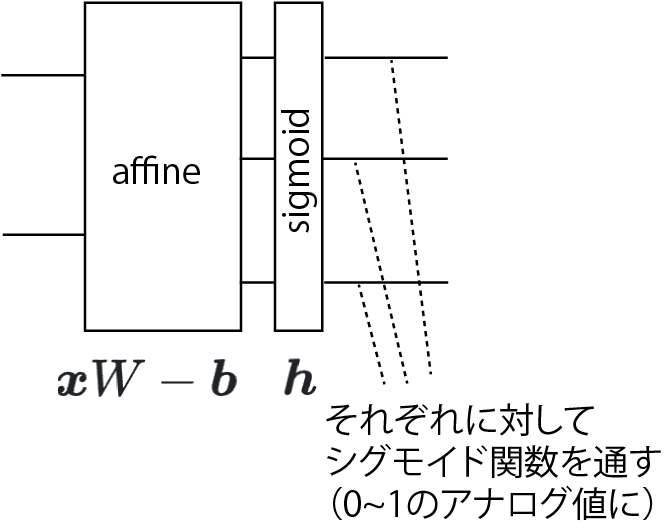

<!-- footer: "ロボットビジョン第2回" -->

# ロボットビジョン

## 第2回: 人工ニューラルネットワークの学習

千葉工業大学 上田 隆一

 

This work is licensed under a [Creative Commons Attribution-ShareAlike 4.0 International License](https://creativecommons.org/licenses/by-sa/4.0/).

---

<!-- paginate: true -->

## 今日やること

- 人工ニューラルネットワークをどのように学習させるか

---

### 前回残った問題: どう学習するか?

- 動物は生まれたときにある程度プログラミングされた状態だが・・・
    - そのあと成長しても神経細胞は基本的に増えない
    - 猫を識別するにはニューラルネットワークに変更を加えないといけない
    - 頭を開けて配線するわけにはいかない

どうやるの?

---

### 学習の方法: パラメータを変える

- 例題: $x_1 + 2 x_2 + 3 x_3 \ge 3$なら$1$を出力、そうでなければ$0$を出力するように人工ニューロンを学習させたい
    - 最初、パラメータはあてずっぽ（右図上）
- 基本的な方法
    1. 何か入力して出力と正解の「ずれ」を観測する
        - 例えば上のニューロンに$(x_1, x_2, x_3) = (1, 0, 0)$を入れると$1$が出てくる（$0$が出てきてほしいのに）
    2. ずれを小さくするようにパラメータを変える
        - この場合はたとえば$w_1 = 1.9$とすると$0$に

これを全ニューロンに対してやる

---

### ずれ: 損失関数

- 損失関数の定義$\mathcal{L}(w_{1:n} |$データ$)$
    - $w_{1:n}$: パラメータ（前ページの例の場合は$b$も$w_4$などにして含める）
- ずれの減らし方
    - 損失関数を微分すると増える方向がわかる
        - $\nabla \mathcal{L}(w_{1:n} |$データ$) = \left( \dfrac{\partial\mathcal{L}}{\partial w_0},  \dfrac{\partial\mathcal{L}}{\partial w_1}, \dots, \dfrac{\partial\mathcal{L}}{\partial w_n} \right)$
    - $\Delta w_{1:n} = - \alpha \nabla \mathcal{L}(w_{1:n}|$データ$)$でパラメータを変更
        - $\alpha$は小さな正の値
- データは正解のものをたくさん準備
    - 訓練データ

---

### 損失関数と損失関数の偏微分の例（2ページ前のニューロンについて）

閾値処理が入るのでややこしい（というか微分できないん）ですが

- 1つのデータの損失関数:
$\mathcal{L}(w_{1:3},b|x'_{1:3},y') =$誤差$^2$$=\{h( w_1x'_1 + w_2x'_2 + w_3x'_3 - b) - y'\}^2$
- $w_i (i=1,2,3)$で偏微分: $\dfrac{\partial \mathcal{L}}{\partial w_i} = 2\dfrac{\partial h}{\partial w_i}x_i'\cdot$誤差
- $b$で偏微分: $\dfrac{\partial \mathcal{L}}{\partial b} = -2\dfrac{\partial h}{\partial b}\cdot$誤差
- とりあえず$h$の偏微分を$1$として無視すると、
    - $\nabla \mathcal{L}(w_{1:3},b | x'_{1:3}, y') = 2(x_1', x_2', x_3', -1)\cdot$誤差

---

### パラメータの更新（2ページ前のニューロンについて）

- パラメータを更新する際の増分は
    - $\Delta( w_1, w_2, w_3, b) = - \alpha' \nabla \mathcal{L}$
    $= - \alpha (x'_1, x'_2, x'_3, -1)\cdot$誤差
- 時間のあるときにやってみましょう
    - 適当に$x_{1:3}$を選んで出力を観測
    - 上の式でパラメータを変更

---

### いろいろ問題がある

- 閾値処理が微分できない
- ニューロンをたくさん連結すると計算が大変

どうしましょう

---

### 計算方法の導出（1/3）

とりあえず微分可能として、任意のパラメータ$w$をどう変化させるか考えてみましょう

- ANNの一般的な表記: $\boldsymbol{f}(\boldsymbol{x}) =
(\boldsymbol{f}^{(n)}\circ
\boldsymbol{f}^{(n-1)}\circ\dots\circ
\boldsymbol{f}^{(1)})(\boldsymbol{x})$
    - $\boldsymbol{f}^{(m)}$: 入力から見て$m$層目
        - $\boldsymbol{y}^{(m)} = \boldsymbol{f}^{(m)}(\boldsymbol{x}^{(m)})$
            - $\boldsymbol{x}^{(m)}, \boldsymbol{y}^{(m)}$: $m$層目の入出力、$\boldsymbol{y}^{(m)} = \boldsymbol{x}^{(m+1)}$
- 損失関数を定義
    - $\mathcal{L}(\boldsymbol{w} | \boldsymbol{x}', \boldsymbol{y}') = \dfrac{1}{2}\sum_{i=1}^k\{ f_i(\boldsymbol{x}') - y'_i \}^2$
        - $f_i$: $\boldsymbol{f}$の$i$番目の要素
        - $1/2$は計算の都合でつけただけ

---

### 計算方法の導出（2/3）

- $\boldsymbol{w}$のうち、ある層$m$にあるパラメータ$w$を動かしたい
    - $\dfrac{\partial}{\partial w}\mathcal{L}(\boldsymbol{w} | \boldsymbol{x}', \boldsymbol{y}') = \sum_{i=1}^k \dfrac{\partial f_i(\boldsymbol{x})}{\partial w}\Big|_{\boldsymbol{x}'}\{ f_i(\boldsymbol{x}') - y'_i \}$（$\leftarrow$内積になっている）
    $= J_{\boldsymbol{f}}(\boldsymbol{x}')^\top (\boldsymbol{f}(\boldsymbol{x}') - \boldsymbol{y}') = J_{\boldsymbol{f}}(\boldsymbol{x}')^\top \boldsymbol{e}'$（$\boldsymbol{e}'$: 誤差のベクトル。縦ベクトル） 
        - $J_{\boldsymbol{f}}(\boldsymbol{x}') = \dfrac{\partial \boldsymbol{f}(\boldsymbol{x})}{\partial w}\Big|_{\boldsymbol{x} = \boldsymbol{x}'} = \left( \dfrac{\partial{f}_1(\boldsymbol{x})}{\partial w} \ \dfrac{\partial{f}_2(\boldsymbol{x})}{\partial w} \dots \dfrac{\partial{f}_k(\boldsymbol{x})}{\partial w} \right)^\top\Big|_{\boldsymbol{x} = \boldsymbol{x}'}$
- $J_\boldsymbol{f}(\boldsymbol{x}') =
    \dfrac{\partial
(\boldsymbol{f}^{(n)}\circ \boldsymbol{f}^{(n-1)}\circ\dots\circ \boldsymbol{f}^{(m)})
(\boldsymbol{x}^{(m)})
    }
    {\partial w}\Big|_{\boldsymbol{x}^{(m)} = \boldsymbol{x}'^{(m)}}$
    $= \dfrac{\partial \boldsymbol{f}^{(n)}}{\partial \boldsymbol{x}^{(n)}} \dfrac{\partial (\boldsymbol{f}^{(n-1)}\circ \boldsymbol{f}^{(n-2)}\circ\dots\circ \boldsymbol{f}^{(m)})(\boldsymbol{x}^{(m)}) }{\partial w}\Big|_{\boldsymbol{x}^{(n)}=\boldsymbol{x}'^{(n)}, \boldsymbol{x}^{(m)}=\boldsymbol{x}'^{(m)}}$
    $= J_{\boldsymbol{x}^{(n)}}(\boldsymbol{x}'^{(n)}) \dfrac{\partial (\boldsymbol{f}^{(n-1)}\circ \boldsymbol{f}^{(n-2)}\circ\dots\circ \boldsymbol{f}^{(m)})(\boldsymbol{x}^{(m)}) }{\partial w}\Big|_{\boldsymbol{x}^{(m)}=\boldsymbol{x}'^{(m)}}$
    $= J_{\boldsymbol{f}^{(n)}}(\boldsymbol{x}'^{(n)})J_{\boldsymbol{f}^{(n-1)}}(\boldsymbol{x}'^{(n-1)})\cdots J_{\boldsymbol{f}^{(m+1)}}(\boldsymbol{x}'^{(m+1)})\dfrac{\partial \boldsymbol{f}^{(m)}}{\partial w}\Big|_{\boldsymbol{x}^{(m)}=\boldsymbol{x}'^{(m)}}$

---

### 計算方法の導出（3/3）

- $\dfrac{\partial}{\partial w}\mathcal{L}(\boldsymbol{w} | \boldsymbol{x}', \boldsymbol{y}')$
$= \left\{ J_{\boldsymbol{f}^{(n)}}(\boldsymbol{x}'^{(n)})J_{\boldsymbol{f}^{(n-1)}}(\boldsymbol{x}'^{(n-1)})\cdots J_{\boldsymbol{f}^{(m+1)}}(\boldsymbol{x}'^{(m+1)})\dfrac{\partial \boldsymbol{f}^{(m)}}{\partial w}\Big|_{\boldsymbol{x}^{(m)}=\boldsymbol{x}'^{(m)}} \right\}^\top \boldsymbol{e}'$ 
$=
\dfrac{\partial \boldsymbol{f}^{(m)}}{\partial w}^\top\Big|_{\boldsymbol{x}^{(m)}=\boldsymbol{x}'^{(m)}}
J_{\boldsymbol{f}^{(m+1)}}(\boldsymbol{x}'^{(m+1)})^\top
\cdots
J_{\boldsymbol{f}^{(n)}}(\boldsymbol{x}'^{(n)})^\top
\boldsymbol{e}'$ 
- 重みを変えたときの誤差の変化について上の式から次のように計算できる
    - Step 1: 最終的な誤差のベクトル$\boldsymbol{e}'$に、最終層から$m+1$層までヤコビ行列をかけていく（$m$層の出力の次元の縦ベクトルに。これを$m$層の誤差とする）
    - Step 2: $m$層の誤差に、$m$層を$w$で偏微分した行列をかける（これも$m$層の出力の次元の縦ベクトルになるので、転置してかけるとスカラーになる）
- 重みの更新: $w \longleftarrow w - \alpha$($m$層の$w$での偏微分)$^\top$($m$層の誤差)

---

### 導出のまとめ

- あとは各層が微分可能なら誤差を減らすようにパラメータを更新可能
    - 1つだけではなく、全てのパラメータ
- 誤差の値を出力側から入力側に送っていくと、出力側の層から順にパラメータを変更していける
    - 誤差逆伝播と呼ばれる

---

## ANNのパラメータ更新: 誤差逆伝播法

- 出力側の誤差をどんどん入力側に送っていく
    - 第$a$層が$a-1$層に送る誤差: $\boldsymbol{e}'^{(a-1)} = J_\boldsymbol{f}^{(a)}(\boldsymbol{x}'^{(a)})^\top \boldsymbol{e}'^{(a)}$

---

### 誤差の送り方

- 1入力1出力の層の場合
    - ある層の計算: $y = f(x | w_{1:n})$のとき
    （$x$: 入力、$y$: 出力）
    - 上流に送る誤差: $\Delta\mathcal{L}_x = \dfrac{\partial f}{\partial x}\Delta\mathcal{L}_y$
        - 下流から来た誤差: $\Delta \mathcal{L}_y$
- アフィンレイヤーの例: $f(x) = w x - b \Longrightarrow \Delta\mathcal{L}_x = w \Delta\mathcal{L}_y$
    - 考え方: $w$倍になって出ていく層は入力の誤差の影響力が$w$倍

---

### 多入力・多出力のアフィンレイヤーの場合

- $\boldsymbol{y} = \boldsymbol{f}(\boldsymbol{x}) = \boldsymbol{x}W - \boldsymbol{b}$
- 行列の計算に
    - $\Delta\mathcal{L}_\boldsymbol{x} = \Delta\mathcal{L}_\boldsymbol{y} \dfrac{\partial \boldsymbol{f}}{\partial \boldsymbol{x}} = \Delta\mathcal{L}_\boldsymbol{y} W^\top$

---

### 閾値処理の層の誤差逆伝播（1/2）

- ステップ関数は微分できないので無理
- 代わりにシグモイド関数で微妙にアナログに
    - $y_i = \dfrac{1}{1 + e^{-x_i}}$（$i$: 入出力のインデックス）
- 下図青線: シグモイド関数のグラフ
    - 緑はこれまでのステップ関数
    
    - 注意: 現在は本来は微分できない関数も使用されることがある

---

### 閾値処理の層の誤差逆伝播（2/2）

- シグモイド関数について、上流に送る誤差を計算してみましょう
    - $y_i = f(x_i) = (1 + e^{-x_i})^{-1}$
    - 上流に送る誤差（再掲）: $\Delta\mathcal{L}_x = \dfrac{\partial f}{\partial x}\Delta\mathcal{L}_y$
- $f$を（偏）微分してみましょう
    - $\dfrac{\partial f}{\partial x} = -1\cdot(1 + e^{-x})^{-2}(-e^{-x})$
    $= (1+e^{-x})^{-2}e^{-x} = h^2(h^{-1}-1) = h(1 - h)$
- $y_i = h(x_i)$なので$\Delta\mathcal{L}_x = y_i(1 - y_i)\Delta\mathcal{L}_y$
    - $y$の値がどっちつかずの$0.5$のときに一番大きくなる

---

### パラメータをどう変えるか?

- 伝播してきた誤差$\Delta \mathcal{L}_y$が減る方向にパラメータを変える
- 1入力1出力の層の場合
    - ある層の計算: $y = f(x | w_{1:n})$のとき
    （$x$: 入力、$y$: 出力）
    - パラメータの変更: $w_i \longleftarrow w_i - \alpha \dfrac{\partial f}{\partial w_i}\Bigg|_x \Delta \mathcal{L}_y$
- 右のアフィンレイヤー（$y = wx - b$）の例
    - $w = 2$$- \alpha 9/10\cdot 1/3$（重みが減る）
    - $b = 1/10$$+ \alpha 1/3$（閾値が上がる）

---

### アフィンレイヤーでのパラメータ更新（一般的な式）

- アフィンレイヤー（再掲）: $\boldsymbol{y} = \boldsymbol{f}(\boldsymbol{x}) = \boldsymbol{x}W - \boldsymbol{b}$
    - $W  \longleftarrow  W -  \alpha\Delta \mathcal{L}_\boldsymbol{y} \dfrac{\partial \boldsymbol{f}}{\partial W} = W- \alpha\boldsymbol{x}^\top \Delta \mathcal{L}_\boldsymbol{y}$
    - $\boldsymbol{b} \longleftarrow \boldsymbol{b} - \alpha \Delta\mathcal{L}_\boldsymbol{y} \dfrac{\partial \boldsymbol{f}}{\partial \boldsymbol{b}} =  \boldsymbol{b} + \alpha \Delta \mathcal{L}_\boldsymbol{y}$

---

## まとめ

- 人工ニューラルネットワーク
    - ニューロンの組み合わせでプログラムできる
    - 誤差逆伝播で学習ができる
- 次回以降で応用を見ていきましょう

---

### 問題: 先述のANNのパラメータ修正

- $x_1 + 2 x_2 + 3 x_3 \ge 3$なら$1$を出力、そうでなければ$0$を出力させたい
    - 右図上の状態から右図下の状態にもっていきたい
- 修正のための式（p. 23のもの）: 
    - $w_i \leftarrow w_i- \alpha$入力値$\cdot$誤差
    - $b \leftarrow b+ \alpha$誤差
- $\alpha=0.5$で（早く収束させるため大きめ）
- $(x_1, x_2, x_3) = (1, 0, 0)$を入力してパラメータを修正してみましょう

---

### 答え

- 計算（再掲）
    - $w_i \leftarrow w_i- \alpha$入力値$\cdot$誤差
    - $b \leftarrow b+ \alpha$誤差

- $(x_1, x_2, x_3) = (1, 0, 0)$を入力$\rightarrow$出力$1$、誤差$1$
    - $w_1 = 2 - 1/2 \cdot 1 \cdot 1 = 1.5$（$1$に近づく）
    - $w_2 = w_3 = 2$（そのまま）
    - $b = 2 + \alpha1 = 2.5$（$3$に近づく）
- 次に$(x_1, x_2, x_3) = (0, 0, 1)$を入力すると？

---

### 答え

- 計算（再掲）
    - $w_i \leftarrow w_i- \alpha$入力値$\cdot$誤差
    - $b \leftarrow b+ \alpha$誤差

- $(x_1, x_2, x_3) = (0, 0, 1)$を入力$\rightarrow$出力$0$、誤差$-1$
    - $w_1, w_2$はそのまま
    - $w_3 = 2 - 0.5 \cdot 1 \cdot (-1) = 2.5$（$3$に近づく）
    - $b = 2.5 + 0.5 (-1) = 2$
        - $b$は$3$から遠ざかる。そういう場合もある。
- できる人は前方のニューロンに送る誤差も計算を

---

## 補足: スキップ（残差）接続

- あるレイヤーの出力を次の層だけでなく、
別の層にも入力する接続方法
    - 入力に挟まれた層は入出力の差分を
    学習することに
- スキップ接続の有無: 初期の学習の容易さに影響
    - スキップ接続なし: 最初は$\boldsymbol{y}$がランダム
    - スキップ接続あり: （途中の層の出力が最初ゼロだと）最初は$\boldsymbol{y}=\boldsymbol{x}$に
- ResNet（2015年）

