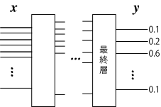
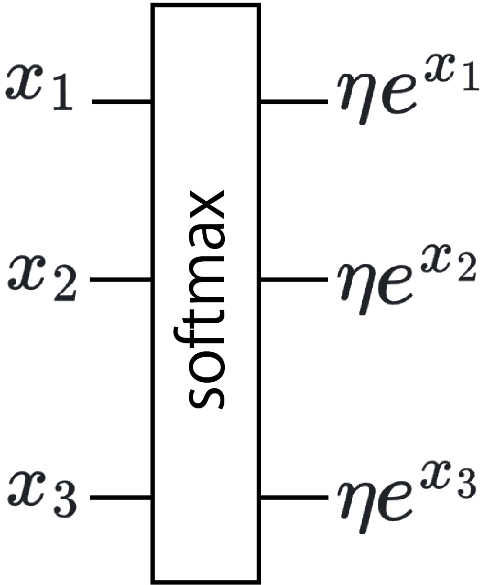
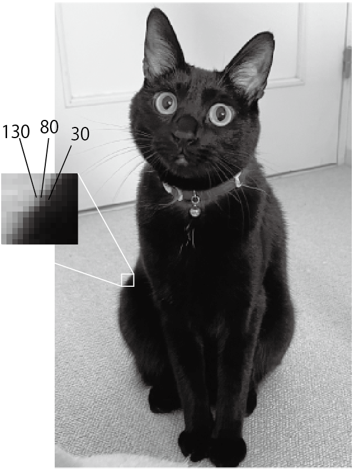
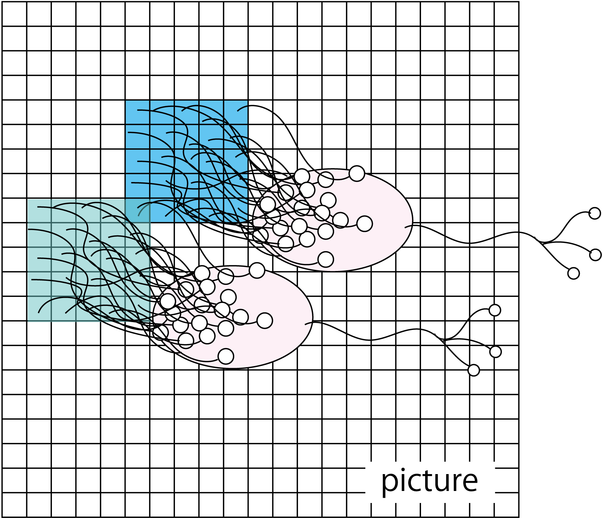
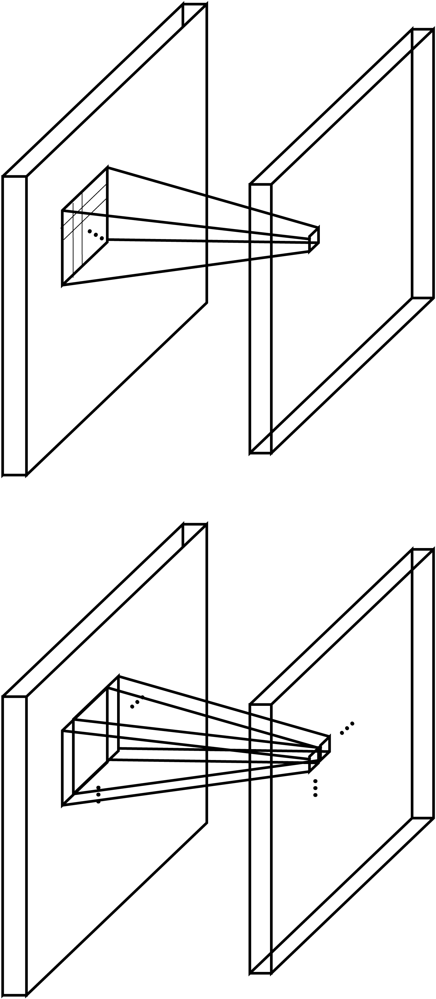
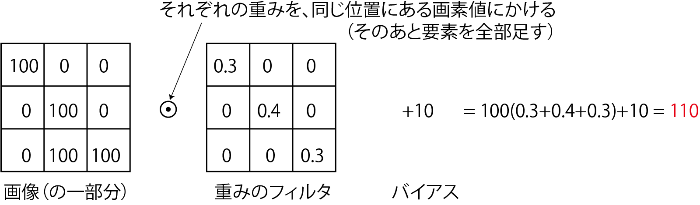
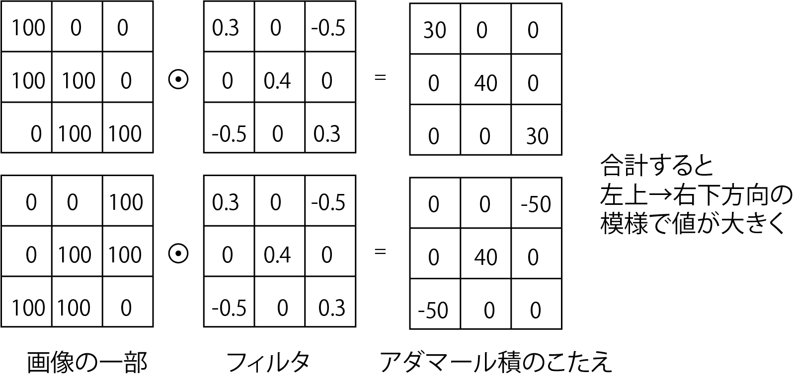
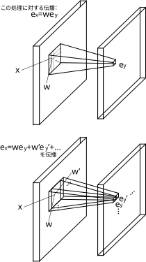
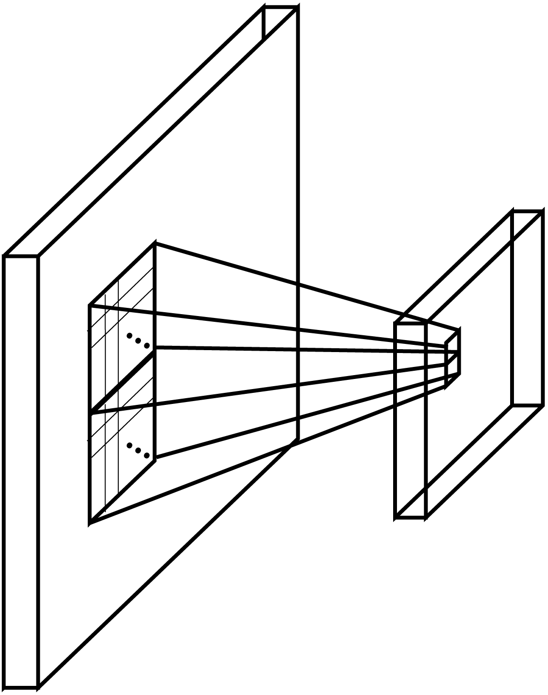
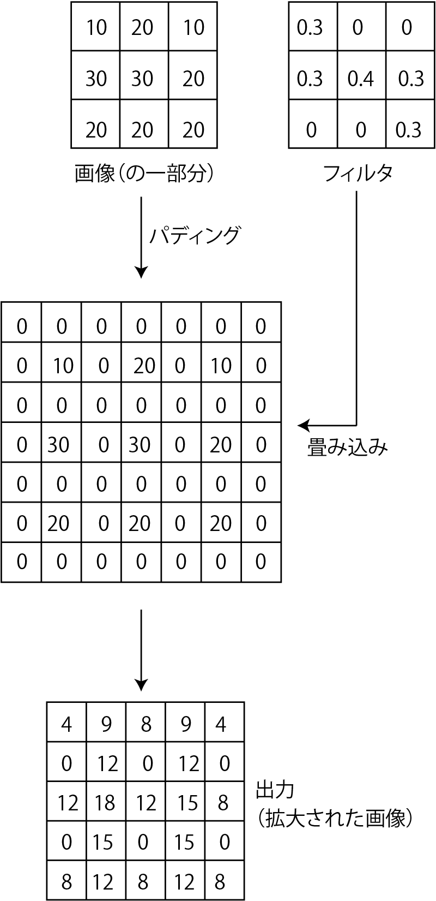

<!-- footer: "ロボットビジョン第3回" -->

# ロボットビジョン

## 第3回: 画像の識別とセグメンテーション

千葉工業大学 上田 隆一

 

This work is licensed under a [Creative Commons Attribution-ShareAlike 4.0 International License](https://creativecommons.org/licenses/by-sa/4.0/).

---

<!-- paginate: true -->

## 今日やること

- 識別の問題
- CNN
- U-Net

---

## 識別の問題

- データを数種類に分類する
    - 言葉の品詞
    - 感情（文章や表情から）
    - 動物
    - ...
- ANNでよく扱われてきた問題
    - かつては問題に応じて専用のANNを準備することが必須だった（今日はこの話）
- 問題: 識別のためのANNを数式で定義してみましょう
    - $\boldsymbol{x} = \boldsymbol{f}(\boldsymbol{x}|\boldsymbol{w})$
        - $\boldsymbol{x}$はデータだけど出力$\boldsymbol{y}$の形式は？

---

### 出力の例（1/2）

たとえば、「犬、猫、それ以外」を識別したい場合

- その0
    - 犬を1、猫を2、それ以外を3
        - 難点: 数字の差が意味を持ってしまう
- その1: ワンホット（one-hot）ベクトル（右図）
    - 犬を$(1,0,0)$、猫を$(0,1,0)$、その他を$(0,0,1)$
        - 難点: 犬か猫が分からないやつはその他？
        - 断定しないといけない場合はこれでいいが、曖昧さを許したい場合は使えない
    - ワンホットベクトル自体は随所で活用される

---

### 出力の例（2/2）

- $\boldsymbol{y} = (P_\text{猫}, P_\text{犬}, P_\text{それ以外})$
    - $P_\text{x}$は、対象が$\text{x}$である確率
    - $\boldsymbol{y}$は確率分布とみなせる
- 識別用のANNの出力はこの形式が一般的
    - ひとつに決めたければ確率最大のものを選択
- 確率分布を出力する専用のレイヤー（次ページ）

---

### ソフトマックス層

- softmax（softな最大値）: 1つに決めないということ
- 入力$\boldsymbol{x} = (x_1, x_2, \dots, x_n)$に対し$y_i = \eta e^{x_i}$を出力
    - $\eta$は正規化定数
        - $\sum_{i=1}^n y_i = 1$にするための定数（のようなもの）
- 損失関数: 交差エントロピーを使用
   - $\mathcal{L}(\boldsymbol{w}, \boldsymbol{x}|\boldsymbol{y}') = H(\boldsymbol{y}', \boldsymbol{y}) = -\sum_{i=1}^N y_i' \log y_i$
       - $\boldsymbol{y}$が出力、$\boldsymbol{y}'$が正解
       - 注意: $\boldsymbol{w}$はほかの層のパラメータ
       - 数学好きな人への補足: カルバック・ライブラー情報量を最小化するのと等価
    - 正解がワンホットベクトルだと$\mathcal{L}(\boldsymbol{w}, \boldsymbol{x}| \boldsymbol{y}') = - \log y_i$
        - $i$が正解の元

---

### クロスエントロピーを用いるときのパラメータ更新

- $\mathcal{L}(\boldsymbol{w}, \boldsymbol{x}|\boldsymbol{y}') = H(\boldsymbol{y}', \boldsymbol{f}(\boldsymbol{x}|\boldsymbol{w})) = -\sum_{i=1}^N y_i' \log f_i(\boldsymbol{x}|\boldsymbol{w})$
- $\dfrac{\partial}{\partial w}\mathcal{L}(\boldsymbol{w} , \boldsymbol{x} | \boldsymbol{y}') = \sum_{i=1}^k \dfrac{\partial f_i(\boldsymbol{x} | \boldsymbol{w})}{\partial w}\dfrac{y_i'}{f_i(\boldsymbol{x}|\boldsymbol{w})}=\dfrac{\partial \boldsymbol{f}(\boldsymbol{x}|\boldsymbol{w})}{\partial w}^\top  \boldsymbol{e}'$
    - $\boldsymbol{e}' = (
    y_1'/y_1 \  \ 
    y_2'/y_2 \  \ 
    \dots \ 
    y_k'/y_k
)^\top$
- 前回の2乗誤差のときと同じ式
    - $\boldsymbol{e}'$だけ形が違うが、各値が決まったベクトルなので問題ない
    - 同じ方法で誤差逆伝搬、パラメータ更新が可能

---

### ソフトマックス層の誤差逆伝搬（1/2）

- おさらい
    - 前の層に送る誤差: $J_{\boldsymbol{f}}(\boldsymbol{x})^\top\boldsymbol{e}'$
    - ソフトマックス層の$i$番目の出力の関数: $f_i(\boldsymbol{x}) = e^{x_i} (\sum_{j=1}^k e^{x_j}) ^{-1}$
- ヤコビ行列をつくるための偏微分（正規化定数の部分も偏微分しないといけないので大変です）
    - $\partial f_i(\boldsymbol{x}) / \partial x_i = e^{x_i} (\sum_{j=1}^k e^{x_j}) ^{-1} - e^{x_i} (\sum_{j=1}^k e^{x_j}) ^{-2}e^{x_i}= y_i - y_i^2$
    - $\partial f_i(\boldsymbol{x}) /\partial x_j = - e^{x_i} (\sum_{j=1}^k e^{x_j}) ^{-2}e^{x_j}= - y_i y_j$

---

### ソフトマックス層の誤差逆伝搬（2/2）

できたヤコビ行列を使って送る誤差を計算
- $J_{\boldsymbol{f}}(\boldsymbol{x})^\top \boldsymbol{e}' = \begin{pmatrix}
        y_1 - y_1^2 & -y_1y_2 & \dots & -y_1y_k \\
        -y_1y_2 & y_2 - y_2^2 & \dots & -y_2y_k  \\
        \vdots  & \vdots & \ddots & \vdots  \\
        -y_1y_k & -y_2y_k & \dots & y_k  - y_k^2 \end{pmatrix}
        \begin{pmatrix}
    y_1'/y_1 \\
    y_2'/y_2 \\ 
    \vdots \\ 
    y_k'/y_k
        \end{pmatrix}$
    $=\begin{pmatrix}
        y_1' - y_1(y_1' + y_2' + \cdots + y_k') \\
        y_2' - y_2(y_1' + y_2' + \cdots + y_k') \\
        \cdots \\
        y_k' - y_k(y_1' + y_2' + \cdots + y_k') 
    \end{pmatrix} =$$\begin{pmatrix}
        y_1' - y_1 \\
        y_2' - y_2 \\
        \cdots \\
        y_k' - y_k 
    \end{pmatrix}$
    - とてもスッキリ

---

## 視覚・画像とANN（CNN）

- いままでの講義: 入力をベクトル$\boldsymbol{x}$として扱ってきた
    - つまり1列に数値をならべたもの
    $\Longrightarrow$画像だともったいなくない？
- 画像
    - 2次元（以上）のデータ
    - 近いところの画素は互いに関係が深く模様を形成（しているのに1列にバラすともったいない）

ということでCNNというものがある
（次ページ）

---

### CNN（convolutional neural network）

- テレビ局ではないです
- convolutional: 「畳み込みの」
-  画像の近いところの画素値を入力して
出力するニューロンを多用（右図）
    - 画像の近いところ: $n\times n$画素の正方形領域
    - 小領域の画素の特徴や変化を出力
    - さらに下の層でも畳み込みすることで全体の特徴を捕捉
- 「畳み込み層」と他の層の組み合わせで画像を処理

---

### CNNの部品1: 畳み込み層

- 画像の一部（n$\times$n画素の「窓」）領域にフィルタをかけて出力を足し、ひとつの値に置き換えて下流に送る（右上図）
- フィルタを1つずつずらして適用（右下図）$\rightarrow$下流も画像に
    - 下流の画素数を変えたくない場合$\rightarrow$縁をパディング
    - 2つ以上ずらすこともあり（ずらす量のことをストライドという）
- 畳み込みの演算（下図）
    - $\odot$: アダマール積（要素ごとに掛け算）$\rightarrow$全要素を足す

$\qquad\qquad$

--- 

### フィルタの意味

- フィルタ: 従来の画像処理に使われてきたものと同じ
    - 局所的な特徴（エッジなど）を検出
    - 畳み込み層の学習=フィルタの学習

--- 

### 畳み込み層の誤差逆伝播

- $\odot$の両側の行列の要素をそれぞれ1列に並べてベクトルに
    - フィルタをベクトル$\boldsymbol{w} = (w_1\ \ w_2 \ \dots\ w_n)^\top$に
    - $\boldsymbol{w}$に対応する入力を$\boldsymbol{x} = (x_1 \ \ x_2 \ \dots \ x_n)^\top$に
- 出力の1画素$y$の値に対する誤差逆伝播
    - $y = f(\boldsymbol{x}| \boldsymbol{w}) = w_1x_1 + w_2x_2 + \cdots w_nx_n + b$
    - $J_{f}(\boldsymbol{x}) = (w_1 \ \  w_2 \ \cdots \  w_n)^\top$
    - この画素$y$の誤差$e_y$に関して送る量: $(x_1 \ \ x_2 \ \dots \ x_n)^\top = (w_1 \ \  w_2 \ \cdots \  w_n)^\top e_y$
- ある入力画素1画素の誤差逆伝播の量: 
    - 出力全画素分について$we_y$を足せばよい

---

### CNNの部品2: プーリング層（サブサンプリング層） 

- 窓のなかで特徴の高い画素だけを残して画素数を減らす層
    - 最大値を残す「maxプーリング」が主に使われる
- 学習はしない
- 画素が減って後段（ものを分類するネットワーク）が学習しやすく
- 写ってる物体の位置のズレに少し強くなる
    - 冒頭の「難しさ」についてはCNNではそんなに解決できてないので学習で様々な大きさ、位置、向きの画像を使う

---

### チャンネル

- カラー（RGB）画像を扱う場合
    - 画素の縦横方向の他に3つの「チャンネル」を持つ
        - 画素ごとにベクトルがあると考えても良い
    - RGBそれぞれにフィルタを用意すると出力も3chに
- 1つのチャンネルに複数のフィルタも適用可能
    - 下図[LeNet[LeCun1989]](https://direct.mit.edu/neco/article-abstract/1/4/541/5515/Backpropagation-Applied-to-Handwritten-Zip-Code)の構造（画像: Zhang et al. [CC BY-SA 4.0](https://creativecommons.org/licenses/by-sa/4.0/)）
        - 画像から手書きの数字を識別するCNN（1ch $\rightarrow$ 6ch $\rightarrow$ 16ch）
            

---

### 代表的なCNN

- LeNet: 前ページの構成で手書き文字を識別
    - 畳み込み・プーリング$\rightarrow$全結合層
        - シグモイド関数を活性化関数に使用
- AlexNet: 畳み込みを5層に深く
    - 右図: LeNet（左）とAlexNet（右）の比較
    - LeRUを活性化関数に使用
    - 1000種類の識別
    - [AlexNetの論文](https://proceedings.neurips.cc/paper_files/paper/2012/file/c399862d3b9d6b76c8436e924a68c45b-Paper.pdf)
        - 学習した中間層や認識結果が見られる

<a style="font-size:70%" href="https://commons.wikimedia.org/wiki/File:AlexNet_block_diagram.svg">右図: Zhang et al., CC BY-SA 4.0</a>

---

### CNNのまとめ

- 畳み込み層で模様の特徴を抽出
- LeNet、AlexNet: 画像から物体を識別 
    - CNNにはさらなる用途が

---

## U-Netと潜在空間

- U-Net: CNNの後ろに逆向きのCNNをつけたもの
    - 当初の用途: セグメンテーション
        - 画像に写っているものごとに画像の領域を分割
        （右図: [[三上他 2022]](https://www.jstage.jst.go.jp/article/jrsj/40/2/40_40_143/_article/-char/ja)）
- 「逆向きのCNN」
    - 「転置畳み込み（後から説明）」という操作で画像を大きくしていく（構造は次ページ）

---

### U-Netの構造

- 左半分: CNN（物体の識別のような処理）
- 右半分: 逆向きのCNN（識別結果からの画像の構築）
- スキップ接続を使用
    - 途中で次元が落ちているので単なる差分学習以上の意味

<a style="font-size:70%" href="https://commons.wikimedia.org/wiki/File:Example_architecture_of_U-Net_for_producing_k_256-by-256_image_masks_for_a_256-by-256_RGB_image.png">画像: Mehrdad Yazdani, CC BY-SA 4.0</a>

---

### 転置畳み込み

- 画像の解像度を上げる操作
    - 画像をパディングして大きくし、フィルタを適用$\rightarrow$画像が大きく
    - この操作とスキップ接続で得た元の画像の情報からセグメンテーション
- U-Netについての説明はこれで終わりだが、単にセグメンテーションができる以上にこの構造は重要

---

## オートエンコーダと潜在空間

---

### オートエンコーダ

- 入力と出力を一致させるように学習されたANN [[Hinton 2006]](chrome-extension://efaidnbmnnnibpcajpcglclefindmkaj/https://www.cs.toronto.edu/~hinton/absps/science.pdf)
    - 損失関数: 入出力の平均二乗誤差（MSE, mean square error）
        - 学習のためのラベル付けは不要（教師無し）
    - 構成はCNNでも全結合でもよいが、U-Net状に中間の次元を小さく
        - 入力側: どんどん情報を落としていく
        - 出力側: どんどん情報を増やしていく
    - 疑問: 何の意味があるの？

---

### 入力側（エンコーダ）のやっていること

- 入力されたデータの分類
    - （学習がうまくいった場合は）似たような画像から似たような出力が得られる
    - うしろに全結合層（とソフトマックス層）をくっつけて追加で学習させると分類器に
- 右図の例: 出力を2次元まで縮小した場合の
出力の分布の例
（注意: 実用的なものはもっと高次元）
    - 分布している空間を潜在空間と言う

---

### 出力側（デコーダ）のやっていること

- 潜在空間のベクトルからデータを復元
    - 例: 「犬」のベクトルが来たら犬の写真や絵を描画
    - 復元方法（絵の描き方）を学習
        - 転置畳み込みのフィルタなどのパラメータに
    - 復元しやすいようにエンコーダ側が学習される
        - 潜在空間でのベクトルの分布が決まる

---

### オートエンコーダの利用

- エンコーダとデコーダを分離して利用
- エンコーダ
    - 先に前結合層などを取り付けて分類器に
    - 先に別のデコーダを取り付けると別のものが生成される
- デコーダ
    - 学習に用いたもの以外のエンコーダを取り付けると変換器に
        - 例「犬」と入力$\rightarrow$犬の絵を生成

ちまたで生成AIと言われるものの原型

---

## まとめ

- CNNからオートエンコーダまで学習
    - 画像の識別から生成までの流れを見てきた
        - CNNによる物体の識別: エンコーダ+識別器
        - U-Netによるセグメンテーション: オートエンコーダに似た構造
    - 次回以降にいくつかの応用
        - 台形の図がよく出てくる

