<!-- footer: "ロボットビジョン第4回" -->

# ロボットビジョン

## 第4回: 画像の記憶と再生・生成

千葉工業大学 上田 隆一

 

This work is licensed under a [Creative Commons Attribution-ShareAlike 4.0 International License](https://creativecommons.org/licenses/by-sa/4.0/).

---

<!-- paginate: true -->

## 今日やること

- 敵対的生成ネットワーク（GAN）
- オートエンコーダ（AE）
- 変分オートエンコーダ（VAE）
- 拡散モデル（DDPM）
- フローマッチング（FM）

---

## GAN（generative adversarial networks）[[Goodfellow2014]](https://papers.nips.cc/paper_files/paper/2014/file/f033ed80deb0234979a61f95710dbe25-Paper.pdf)

- 敵対的生成ネットワーク
    - 「絵を描く人工ニューラルネットワーク」のブームの発端
    - それ以外にも音声やソフトウェアを作り出すなどの用途
- 「敵対的」とは何?（人類の敵ではない）
    - ふたつのANNを準備
        - 生成ネットワーク（generator）: 何かを作るANN
        - 識別ネットワーク（discriminator）: 入力が生成ネットワークの生成物かどうかを判断するANN
    - 生成ネットワークと識別ネットワークが互いに競う

---

### ネットワーク構造の例（DCGAN）

- Deep Convlutional GAN（DCGAN）[[Radford 2015]](https://arxiv.org/pdf/1511.06434) <a href="https://www.researchgate.net/figure/The-architecture-of-the-generator-and-the-discriminator-in-a-DCGAN-model-FSC-is-the_fig4_343597759">画像: Zhang et al. CC-BY 4.0</a>
    - 上: 生成ネットワーク（FSC: fractionally-strided convolution、つまり転置畳み込み)
    - 下: 識別ネットワーク
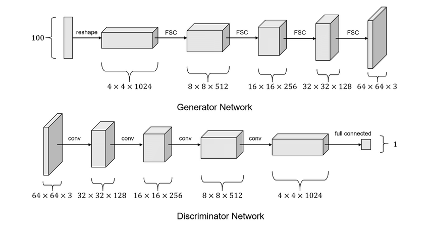

---

### DCGANの生成ネットワーク（右図の上）

- 構造: U-Netの出力側
    - 入力: ランダムなベクトル（100次元）
        - つまり雑音を入力
            - なんで？？（講義後半で）
    - 出力: 画像
- 出力の画像は最初はでたらめ
    - ある訓練をすると画像が生成されるように

---

### DCGANの識別ネットワーク

- 構造: エンコーダに似ているが出力は1bit
    - 入力: 次のどちらか
        - 生成画像: 生成ネットワークから
        - 訓練画像: 顔なら顔、風景なら風景の画像セット数千枚〜
    - 出力: 訓練画像である確率
        - 偽物: 生成画像
        - 最終層（シグモイド）が$0\sim 1$を出力
        - 最初は当てずっぽう

---

### 生成/識別ネットワークを競わせる

- 損失関数（次ページで詳しく）
    - 識別ネットワークが正解したら生成ネットワークの損失
    - 識別ネットワークが不正解だったら識別ネットワークの損失
- 学習の進行
    - 生成ネットワーク: ノイズ画像$\rightarrow$識別ネットワークの確率を下げる模様を生成
$\rightarrow$精緻な画像
    - 識別ネットワーク: 模様に負けない識別性能を得ようとする 
    - [学習が進んでいく様子](https://qiita.com/miya_ppp/items/f1348e9e73dd25ca6fb5)

これで生成ネットワークが画像を出力できるようになる <a href="https://arxiv.org/pdf/1511.06434">例</a>

---

### GANの損失関数

- 生成ネットワークの評価関数（損失関数に$-1$をかけたもの）
    - $V_D(G) = \frac{1}{m}\sum_{i=1}^m \log \{ 1 - D[G(\boldsymbol{z}^{(m)})]\ \}$
        - $G(\boldsymbol{z}^{(i)})$: 生成画像（$m$個用意）
        - $D(\boldsymbol{x})$: 識別ネットワークの識別結果（確率）
            - 識別ネットワークが間違えるほど評価が高く
- 識別ネットワークの評価関数
    - $V_G(D)= \frac{1}{m}\sum_{i=1}^m \Big[ \log\{ D(\boldsymbol{\boldsymbol{x}}^{(m)}) \} + \log \{ 1 - D[G(\boldsymbol{z}^{(m)})]\ \} \Big]$
        - $\boldsymbol{x}^{(i)}$: 訓練画像（こちらも$m$個用意）
        - $V_D(G)$に訓練データに対する識別の成績の項も加算

---

### 条件付きGAN（Conditional GAN、CGAN）[[Mirza+ 2014]](https://arxiv.org/abs/1411.1784)

- GANの生成ネットワークはランダムにデータを出力するだけ
    - 何を出力するかコントロールしたい
- 条件付きGAN [図](https://www.researchgate.net/figure/Architecture-of-the-Conditional-adversarial-net_fig3_366684170)
    - 生成ネットワークに何を作って欲しいかラベルで指示
        - データのもとになるベクトル$\boldsymbol{z}$と共にラベル$\boldsymbol{y}$を入力
            - $\boldsymbol{y}$はワンホットベクトル
                - $\boldsymbol{y} = (0 \ \ 0 \ \dots 1 \dots \ 0)$という形で対応するラベルを$1$に
    - 識別ネットワークにも、生成ネットワークの出力と共に$\boldsymbol{y}$を入力
        - 条件$\boldsymbol{y}$に合った生成データか判定

---

### pix2pix

- CGANの一種とみなせる
- pix2pix[[Isora 2016]](https://arxiv.org/abs/1611.07004)（構造は論文のFigure 2に）
    - 生成ネットワーク: 入力にノイズではなく画像を入力し、画像を出力させる
        - U-Netがベース
        - 入力をX、出力をYとしましょう
    - 識別ネットワーク: XとYのペア、あるいはXと対応する学習用画像Y'のペアを入力して真贋を識別
    $\rightarrow$画像を変換するように学習
- どんなことができるか
    - 線画をカラーの絵や写真のように（図: [[Isora 2016]](https://arxiv.org/abs/1611.07004)）
    - 葉に隠れた枝をつなぐ[[三上2022]](https://www.jstage.jst.go.jp/article/jrsj/40/2/40_40_143/_article/-char/ja)

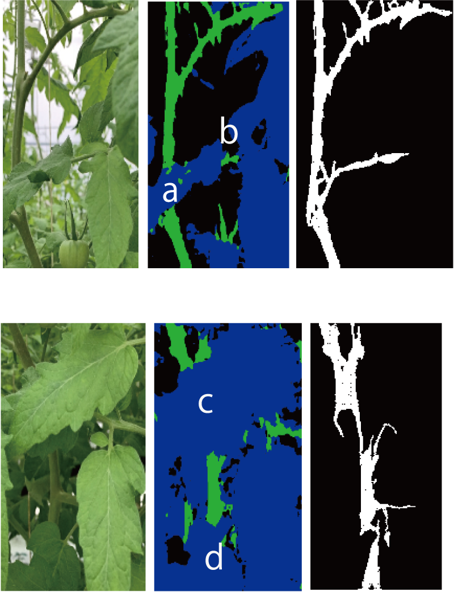

---

### GANのまとめ

- GAN
    - 2つのネットワークを競わせる
    - 入力がノイズのことがある
    - 画像を生成（生成モデルと呼ばれるものの先祖の1つ）
        - 基本、画像やベクトルにできるデータならなんでも出力可能
- CGAN
    - 出力させたいものをラベルや下書きで提示
    - （もうちょい言葉で指示が出せるとよい）

---

## オートエンコーダと潜在空間

---

### 疑問

- なんで我々はSSDがついてないのに風景をたくさん覚えていられるのか？
    - 前来た場所を懐かしいと思える（たまに忘れる）
    - 自分のいた教室と違う教室でも懐かしいと思う
- 頭のなかで風景や動きを再生できる
    - 見たことのあるもの
    - 見たことのないものの空想/夢や病気での幻想

話し合ってみましょう

---

### オートエンコーダ（autoencoder、AE）

- 入力と出力を一致させるように学習されたANN [[Hinton 2006]](https://www.cs.toronto.edu/~hinton/absps/science.pdf)
    - 損失関数: 入出力の平均二乗誤差（MSE, mean square error）
        - 学習のためのラベル付けは不要（教師無し）
    - 構成はCNNでも全結合でもよいが、U-Net状に中間の次元を小さく
        - 入力側: どんどん情報を落としていく
        - 出力側: どんどん情報を増やしていく
    - 疑問: 何の意味があるの？
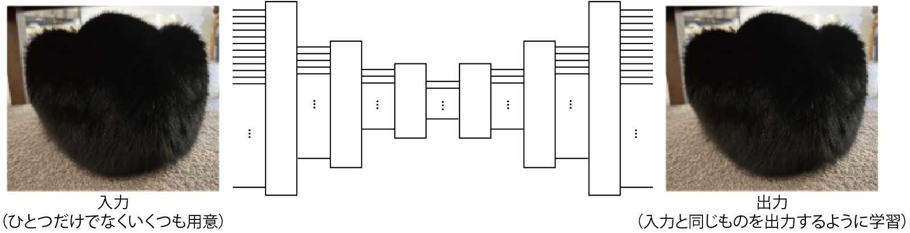

---

### 入力側（エンコーダ）のやっていること

- 入力されたデータの分類
    - （学習がうまくいった場合は）似たような画像から似たような出力が得られる
    - うしろに全結合層（とソフトマックス層）をくっつけて追加で学習させると分類器に
- 右図の例: 出力を2次元まで縮小した場合の
出力の分布の例
    - 注意: 実用的なものはもっと高次元
        - [Hinton 2026]は30次元
    - 分布している空間を潜在空間と言う

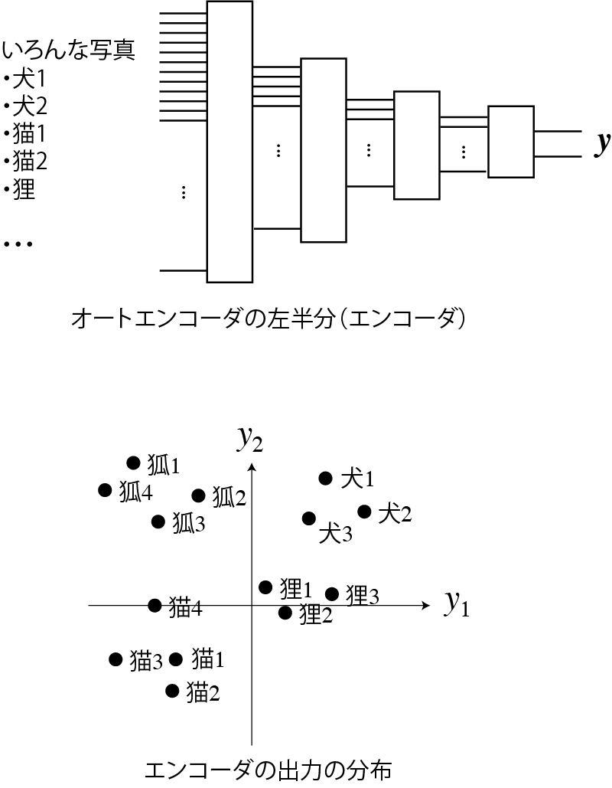

---

### 出力側（デコーダ）のやっていること

- 潜在空間のベクトルからデータを復元
    - 例: 「犬」のベクトルが来たら犬の写真や絵を描画
    - 復元方法（絵の描き方）を学習
        - 転置畳み込みのフィルタなどのパラメータに
    - 復元しやすいようにエンコーダ側が学習される
        - 潜在空間でのベクトルの分布が決まる

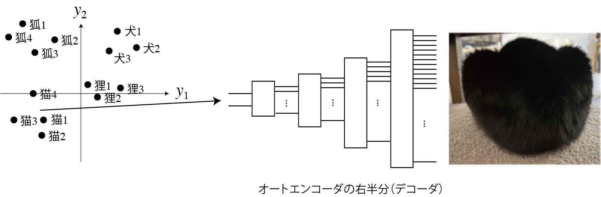

---

### オートエンコーダの利用

- エンコーダとデコーダを分離して利用
- エンコーダ
    - 先に前結合層などを取り付けて分類器に
    - 先に別のデコーダを取り付けると別のものが生成される
- デコーダ
    - 学習に用いたもの以外のエンコーダを取り付けると変換器に
        - 例「犬」と入力$\rightarrow$犬の絵を生成

GANとともに、ちまたで生成AIと言われるものの原型

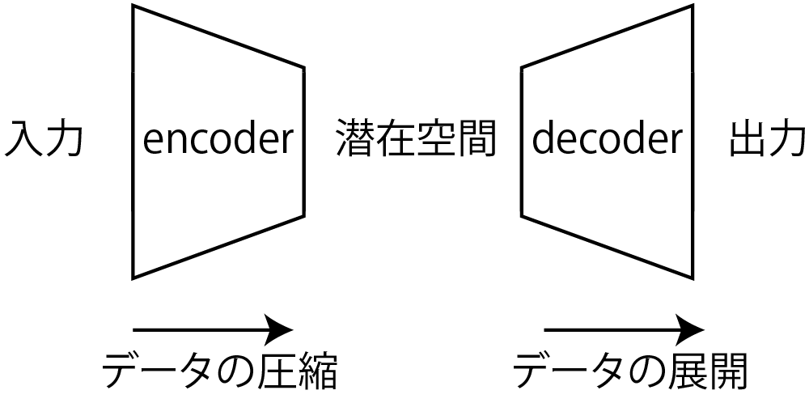

---

### オートエンコーダのまとめ

- 画像（数百万次元の画素値のベクトル）を数十次元のベクトルに圧縮
    - 人間もそうしてる？
- 潜在空間のベクトルを狙って/適当にデコードすると画像になる
    - 人間もそうやって風景を思い出したり幻想を見たりする？
- まだこれでは不完全
    - 風景にも統計的な性質（確率分布）があるが、生かしきれていない
        - 潜在空間に点を打っているだけ
        - 点と点の間は「なにもない」ことに
    - 統計的な性質
        - 同じ漫画家の書く人の絵は似ているとか猫の画像は互いに似ているとか

---

### 確率・統計で考える画像の分布

- こういう仮定を考える: 訓練画像はなんらかの確率分布Pにしたがって選ばれる
    - 訓練画像を選ぶ人の嗜好や置かれた環境を反映した確率分布
- Pの性質: 確率（の密度）の高いところに、訓練に適切だが選ばれなかった画像が無数に存在
    - 選べると新しい画像が生成可能
        - サイコロを振るように
    - 問題: Pの分布の形が不明で選べない
        - 超多次元空間の超絶にスパース（疎）な分布

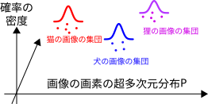

---

### 分布の変換・逆変換の試み

- Pを簡単な分布Q（ガウス分布）に変換
    - Pの点$\boldsymbol{p}$をQの点$\boldsymbol{q}$に対応づけ
    - 重要: Qからは確率の高いデータが選びやすい
    - 補足: QがPの原因と考えることも可能（後述のVAEの論文など）
- Qから高確率のデータ$\boldsymbol{q}'$を選んでPの空間へ逆変換（$\boldsymbol{p}'$を得る）
    - $\boldsymbol{p}'$はPで確率の高い点で、意味のある画像になっている

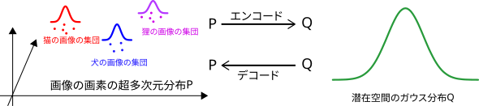

そんなことできるの？→できる

---

## 変分オートエンコーダ[[Kingma 2013]](https://arxiv.org/abs/1312.6114)（variational AE、VAE）

- 仮定を置く
    - 潜在空間のベクトル$\boldsymbol{z}$の分布は標準正規分布（ガウス分布）$Q$に従う
    - $\boldsymbol{z}$を画像$\boldsymbol{x}$の原因と考え、原因の不確かさの正規分布$P_{\boldsymbol{\phi}}(\boldsymbol{z}|\boldsymbol{x})$を考える
- 仮定に基づいて学習$\rightarrow Q(\boldsymbol{z})$の分布のなかに$Q(\boldsymbol{z}|$物の種別$)$のような分布

$\qquad\qquad\qquad$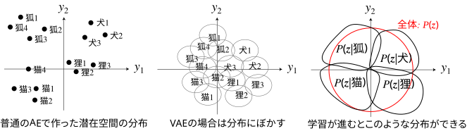

---

### VAEのエンコーダ/デコーダ

- エンコーダ（パラメータ$\boldsymbol{\phi}$）: 
    - $\boldsymbol{z} \sim P_{\boldsymbol{\phi}}(\boldsymbol{z}|\boldsymbol{x}) = \mathcal{N}[\boldsymbol{\mu}(\boldsymbol{x}), \boldsymbol{\sigma}^2(\boldsymbol{x}) I]$を出力
    - 具体的には
        - $\boldsymbol{z}$の平均値$\boldsymbol{\mu}$、各元の分散$\boldsymbol{\sigma}^2$（の対数）を出力し、
        - 次の層で$\boldsymbol{z} = \boldsymbol{\mu} + \boldsymbol{\sigma} \odot \boldsymbol{\varepsilon}$を出力
            - $\boldsymbol{\varepsilon} \sim \mathcal{N}(\boldsymbol{0}, I)$
- デコーダ（パラメータ$\boldsymbol{\theta}$）: $P_{\boldsymbol{\theta}}(\boldsymbol{x}|\boldsymbol{z})$
    - 理論上は確率的な表現となるが、$\hat{\boldsymbol{x}} = \boldsymbol{f}_\boldsymbol{\theta}(\boldsymbol{z})$のように決定論的にもできる

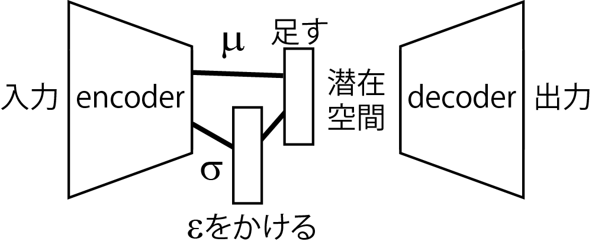

---

### VAEの損失関数

ベイズ推定の式を解いていくと次のようになる（らしいがまだ把握してません）

- ある1つの訓練画像$\boldsymbol{x}$に対して、次の値が大きいほうがよい
    - $\mathcal{L}(\boldsymbol{\phi}, \boldsymbol{\theta} | \boldsymbol{x}) = \dfrac{1}{2}\sum_{j=1}^m ( 1 + \log \sigma_j^2 - \mu_j^2 - \sigma_j^2 ) + \dfrac{1}{L}\sum_{\ell=1}^L \log P_\boldsymbol{\theta}(\boldsymbol{x} | \boldsymbol{z}^{(\ell)})$
        - $m$: $\boldsymbol{z}$の次元
        - $\boldsymbol{z}^{(\ell)} = \boldsymbol{\mu} + \boldsymbol{\sigma}\odot\boldsymbol{\varepsilon}^{(\ell)} \ (\ell = 1,2,\dots,L)$
            - $L$回試行を繰り返すということ
            - バッチで学習するなら$L=1$でよさそう
    - 最初の項: 平均値も分散も小さい方がよい$\rightarrow Q$の分布が中央に集まる
    - 次の項: デコーダの$\hat{\boldsymbol{x}}$と元の$\boldsymbol{x}$の比較の項
        - 具体的にどう計算するのかはまだ未調査（すんません）

---

### 隙間の問題の解決

- デコーダで生成されるデータに隙間ができにくい
    - [[Kingma 2013]](https://arxiv.org/abs/1312.6114)の中の図4
    - [Kingma氏のデモサイトの例](https://dpkingma.com/sgvb_mnist_demo/demo.html)
- ただしGANよりぼやけやすい

---

### Denoising Diffusion Probabilistic Models（DDPM）[[Ho+ 2020]](https://arxiv.org/abs/2006.11239)

- 一般に（機械学習の文脈で）「拡散モデル」と呼ばれるもの
- 拡散モデル（拡散過程）
    - 集まっているものや模様がだんだん散らばっていく過程を定式化したもの
    - 下の例: 各画素に対し、同じガウス分布に従う雑音を繰り返し足したもの
    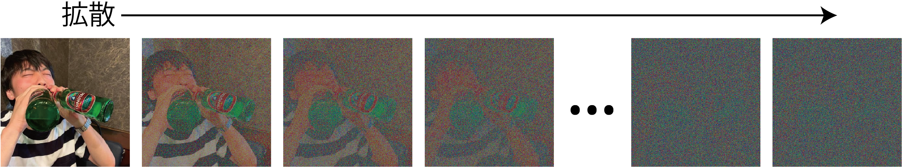

これがなんで生成と関係あるの？

---

### 拡散モデルを使った生成の考え方

- 同じ次元の空間で$P \Leftrightarrow Q$の変換をする
- 拡散過程: $P$をガウス分布$Q$に近づけていくこと
    - 雑音を加えていく=特徴のないガウス分布にしていく
    - 注意: エンコーダはなく、雑音を加えた訓練画像を人が準備
- 逆拡散過程: $Q$から$\boldsymbol{z}$を取り出して$P$のどこかに写像
    - デコーダを訓練
 

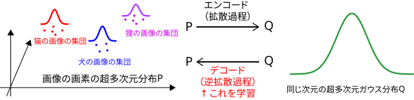

---

### DDPMの学習方法（概要）

- 注意: デコーダしか学習しない
    - [Ho+ 2020]のデコーダはU-Netベースのもの
- 訓練画像$\boldsymbol{x}_0^{(j)} \ (j=1,2,\dots)$を集め、拡散過程を計算するプログラムを準備
    - いつでも$i$回雑音を加えた画像$\boldsymbol{x}_i^{(j)}\ (i=1,2,\dots,T)$を作れるようにしておく
- デコーダに時刻$i$の画像から時刻$i-1$の画像を復元させる（$i=1,2,\dots,T$）
    - 時刻$i$の画像と時刻を入力$\longrightarrow$出力を当該の訓練画像と比較

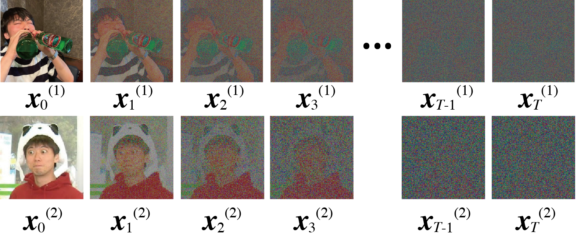$\qquad$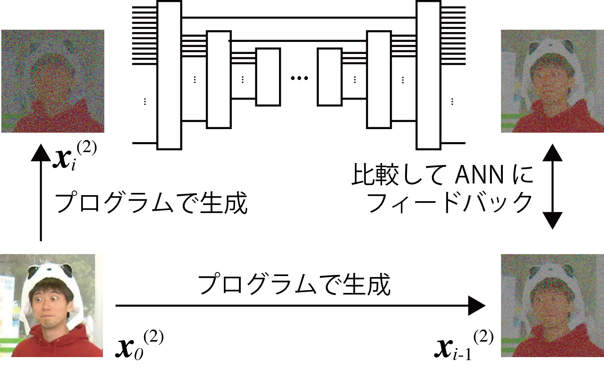

---

### 拡散過程の計算

- 学習データ: 様々な画像$\boldsymbol{x}^{(j)}_0$$\ (j=1,2,\dots,N)$を準備
- 拡散させかたの定義
    - 各画素にガウス分布にしたがうノイズを付加
        - $x_{i+1}^{(j)} \sim \mathcal{N}(\sqrt{1-\beta_i}x_{i}^{(j)}, \beta_i)$
            - $x_{i+1}^{(j)}$: $\boldsymbol{x}_{i+1}^{(j)}$の任意の画素
            - $\beta_i$: 拡散率（原著では$T=1000$までに$0.0001$から$0.02$まで線形に増加）
- 上の定義から任意の段階の雑音画像を作れる（のでDDPMが実用できる）
    - $x_{i}^{(j)} \leftarrow \sqrt{\bar{\alpha_i}}x_0^{(j)} + \sqrt{1-\bar{\alpha_i}}\ \varepsilon$
        - $\alpha_i = 1-\beta_i$、$\bar\alpha_i = \prod_{k=1}^i \alpha_k$
        - $\varepsilon \sim \mathcal{N}(0, 1)$

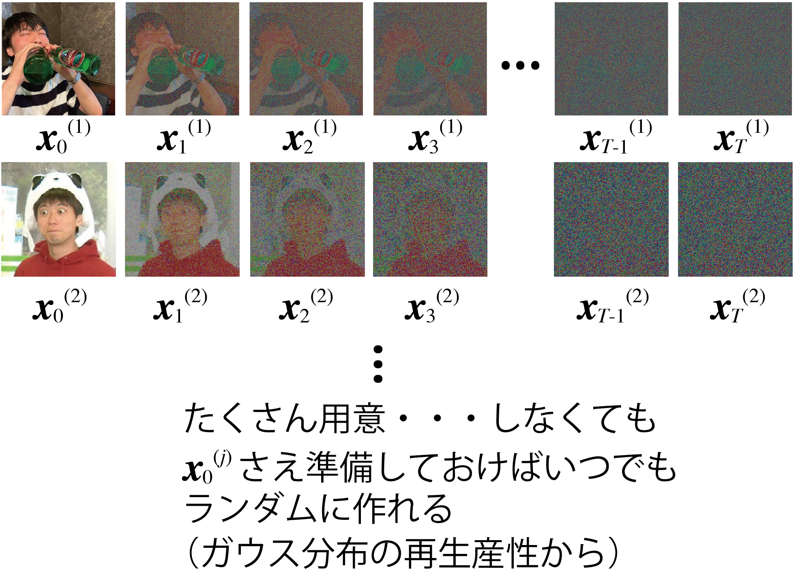

---

### DDPMの学習方法（ANN）

- U-Netを拡張したものを準備
（Transformerを使ったものについては後日）
    - 元の画像からどれだけ拡散したか（時刻）も入力できるように
    - 他にも仕掛け
- 損失関数と学習
    - ノイズ画像の1ステップ前を出力するよう学習
    - 前ページのプログラムで作ったノイズ画像と↑を比較（二乗誤差）
        - 互いに$\boldsymbol{x}_0^{(j)}$の値を引くとノイズ同士の比較に
        - ベイズ推論の難しい式からに二乗誤差がよいと導出される

---

### 例

- [実装例](https://qiita.com/pocokhc/items/5a015ee5b527a357dd67)
- 出力例
    - [[Ho+ 2020]](https://arxiv.org/abs/2006.11239)の図14など
    - https://learnopencv.com/denoising-diffusion-probabilistic-models/

---

## GAN、VAEの応用

- CGAN
- pix2pix
- cVAE

---

### 条件つき変分オートエンコーダ （Conditional VAE、CVAE）

- CGANと同様、エンコーダとデコーダにラベルも入力
    - デコーダはラベルにしたがってデータを生成できる
- 入力の識別情報が、潜在空間内で必要なくなる
    - [VAEとCVAEの分布の比較の例](https://towardsdatascience.com/conditional-variational-autoencoders-for-text-to-image-generation-1996da9cefcb/)
    - 画像の生成の場合、画像の描き方に関する情報が潜在空間内に分布
    $\rightarrow$より出力にバリエーション

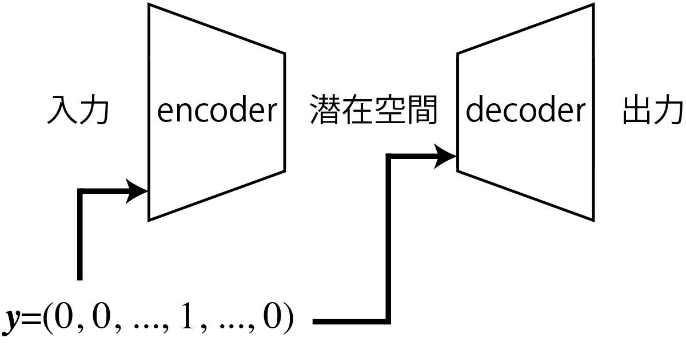

---

## まとめ

- 様々な生成方法
    - 敵対的生成ネットワーク（GAN）
    - 変分オートエンコーダと拡散モデル$\rightarrow$確率分布の利用
- GAN、VAEの応用
    - ラベル付けして生成したいものを指示できる
    - 画像から画像への変換ができる
