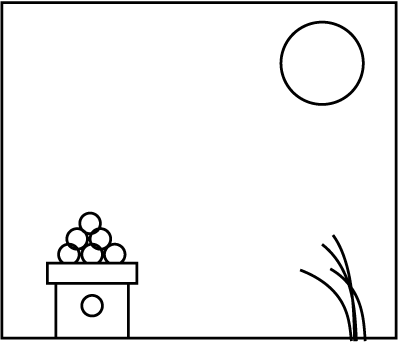
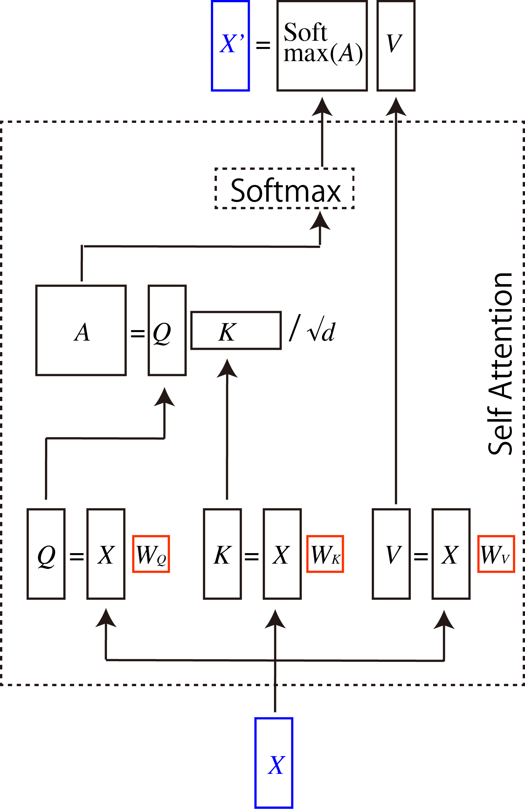
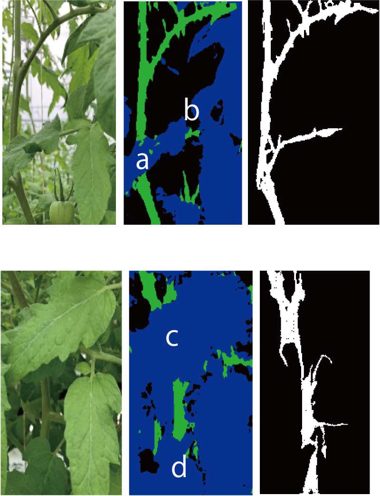
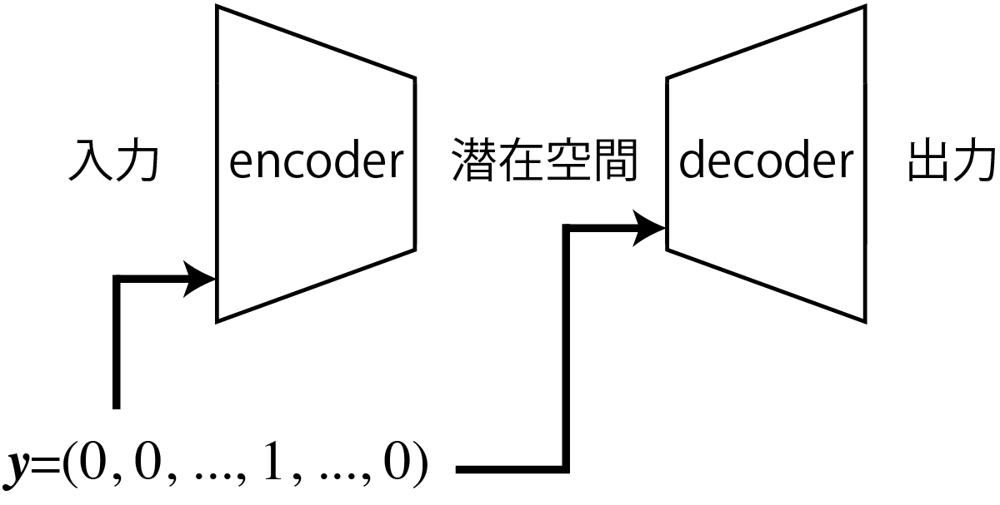
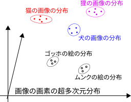
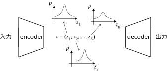
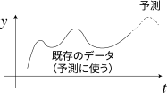
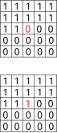
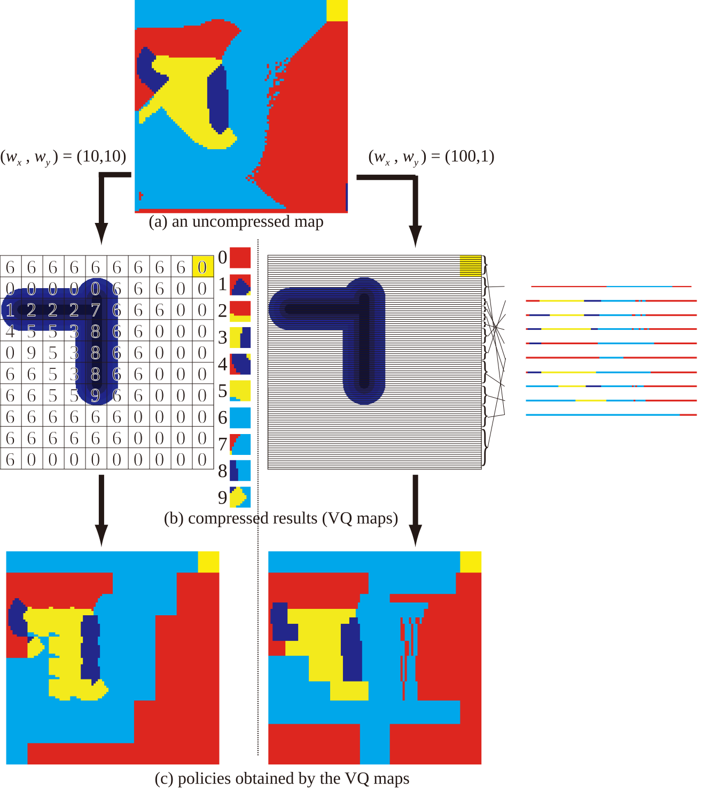
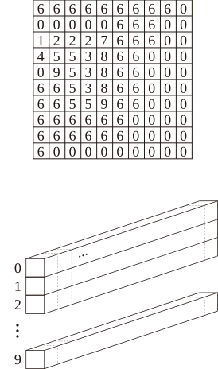

<!-- footer: "ロボットビジョン第4.5回" -->

# ロボットビジョン

## 第5回: 想起・生成の制御

千葉工業大学 上田 隆一

 

This work is licensed under a [Creative Commons Attribution-ShareAlike 4.0 International License](https://creativecommons.org/licenses/by-sa/4.0/).

---

<!-- paginate: true -->

## 内容

- オリジナルのDDPMの要素について補足
- 生成モデルの出力をコントロールしたい
    - 条件付きGAN
    - 条件付きVAE
    - 分類器なしガイダンス

---

### DDPMの構造

- [この図](https://vizuara.substack.com/i/203080645/17-why-u-nets-became-the-classic-denoiser)が分かりやすい
- ポイント
    - U-Net状
    - 畳み込み層と残差接続層
    - 時刻の「Sin/Cos Time Embedding (=sinusoidal embedding)」（後述）
    - 「Self Attention（自己注意機構）」（後述）
- 今はU-Netでないものも使われる（何回か先の講義で）

---

### sinusoidal embedding、正弦波エンコーディング（[図](https://www.m1ke.org/p/transformer%E3%81%AEpositional-encoding%E3%81%AE%E8%A7%A3%E9%87%88/)）

- $\boldsymbol{p}_t = (p_{t,0} \quad p_{t,1} \quad \cdots \quad p_{t,D})^\top$
   - $p_{t,i} = \begin{cases}
        \sin ( t \beta^{-i/D})  & (i\%2 = 0) \\
        \cos ( t \beta^{-(i-1)/D}) & (i\%2 = 1) 
\end{cases}$
        - $D$はベクトルの次元（前ページの図では64）、$\beta$の値は$10,000$など
- 例（$D=5, \beta=10000$）
    - $\boldsymbol{p}_0 = (0.00 \ \ \ \ \ \   \ 1.00 \ \ 0.00  \ \ 1.00 \ \ 0.00)^\top$
    - $\boldsymbol{p}_1 = (0.91 \ \ -0.42 \ \ 0.00  \ \ 1.00 \ \ 0.00)^\top$
    - $\boldsymbol{p}_2 = (0.14 \ \ -0.99 \ \ 0.00  \ \ 1.00 \ \ 0.00)^\top$
    - $\cdots$
- 性質: 内積$p_i\cdot p_{i+j}$の値が
    - 相対位置$j$だけに依存（$j=0$$\rightarrow$ $2$、$j=1$、$1.54$、$j=2$$\rightarrow$ $0.58$、$j=3$$\rightarrow$ $0.01$, $j=4$$\rightarrow$ $0.35$）
    - $j$の値が大きくなると増減するものの減少していく

---

### DDPMでのsinusoidal embeddingの使い方

- 手順
    - sinusoidal embeddingで作ったベクトルを作る
    - 全結合層に通して各残差接続のところで足す
        - 詳細は未調査（だれかー！）
- DDPM関係ないけど補足
    - 文章の解析の場合、単語の位置（語順）を表すのに使われる
    - 様々な時刻・位置のエンコーディング方法がある
        - 参考: https://qiita.com/AITLND/items/cbc9441285b6eaa65c11

---

### 自己注意機構（役割）

- 問題を解きやすいように入力に強弱をつけて出力する層
    - 作文の処理や画像処理で使用される
    - 語順や場所の遠いところ同士を関連づけ可能
        - CNNには苦手なこと
- 例（例なのであからさまに分かりやすいもの）
    - 問題:「次の文で掘られたのは何？『私は彼のために穴を掘りました。』」
        - 質問から遠い「穴」を私、彼よりも強調
    - 問題: 右図は何の絵？
        - 3隅にある団子、笹、月が強調される

---

### 自己注意機構の入出力

- 入力: $d$次元の横ベクトルを長さ$n$個だけ積んだ行列$X$
    - 先述の図のDDPMの場合（U-Netの谷底で使用）
        - $d$次元: チャネルの数（$128$）
        - 「$n$個の入力」: 各画素
        （$14\times 14= 196$個）
- 出力: 同じ大きさの行列$X'$
    - 問題が解きやすい値に変化

- $X$の形
    - 下の表がそのまま行列に
    - 画素は1列に並べる
        ||ch1|ch2|...|ch128|
        |:---:|:---:|:---:|:---:|:---:|
        |画素(1,1)|||...||
        |画素(1,2)|||...||
        |画素(1,3)|||...||
        |...|||...||
        |画素(14,14)|||...||

---

### 自己注意機構のパラメータと計算

- パラメータ: $d\times d$次元の3つの行列$W_Q,W_K, W_V$
    - 「$Q, K, V$」: それぞれクエリ、キー、バリュー
- 計算
    - $Q= XW_Q$、$K= XW_K$、$V= XW_V$
        （いずれも$n$行$d$列の行列に）
    - $A = QK^\top / \sqrt{d}$を計算（$n$行$n$列行列に）
    - 出力: $X'=$Softmax$(A)V$
        - Softmaxは$A$の行単位で適用
        - $V$の各要素をSoftmax$(A)$で重み付け

$n$個のデータの行列中の位置に関係なく重み付け可能

---

### 例・補足

- 言葉を反映した画像の注意の例（先取り）
    - https://wazalabo.com/vlm-attention-visualization.html
- マルチヘッド注意機構（細かいことは未調査）
    - $Q, K, V$を$h$分割してあとから結果を重み付けの行列$W_0$にかけて連結
    - それぞれの分割（ヘッド）で別の切り口で各データの関連性を計算
    - $W_0$の分だけパラメータが増える

---

## 条件付きGAN（Conditional GAN、CGAN）[[Mirza+ 2014]](https://arxiv.org/abs/1411.1784)

- GANの生成ネットワークはランダムにデータを出力するだけ
    - 何を出力するかコントロールしたい
- 条件付きGAN [図](https://www.researchgate.net/figure/Architecture-of-the-Conditional-adversarial-net_fig3_366684170)
    - 生成ネットワークに何を作って欲しいかラベルで指示
        - データのもとになるベクトル$\boldsymbol{z}$と共にラベル$\boldsymbol{y}$を入力
            - $\boldsymbol{y}$はワンホットベクトル
                - $\boldsymbol{y} = (0 \ \ 0 \ \dots 1 \dots \ 0)$という形で対応するラベルを$1$に
    - 識別ネットワークにも、生成ネットワークの出力と共に$\boldsymbol{y}$を入力
        - 条件$\boldsymbol{y}$に合った生成データか判定

---

### pix2pix

- CGANの一種とみなせる
- pix2pix[[Isora 2016]](https://arxiv.org/abs/1611.07004)（構造は論文のFigure 2に）
    - 生成ネットワーク: 入力にノイズではなく画像を入力し、画像を出力させる
        - U-Netがベース
        - 入力をX、出力をYとしましょう
    - 識別ネットワーク: XとYのペア、あるいはXと対応する学習用画像Y'のペアを入力して真贋を識別
    $\rightarrow$画像を変換するように学習
- どんなことができるか
    - 線画をカラーの絵や写真のように（図: [[Isora 2016]](https://arxiv.org/abs/1611.07004)）
    - 葉に隠れた枝をつなぐ[[三上2022]](https://www.jstage.jst.go.jp/article/jrsj/40/2/40_40_143/_article/-char/ja)

---

### 条件つき変分オートエンコーダ （Conditional VAE、CVAE）

- CGANと同様、エンコーダとデコーダにラベルも入力
    - デコーダはラベルにしたがってデータを生成できる
- 入力の識別情報が、潜在空間内で必要なくなる
    - [VAEとCVAEの分布の比較の例](https://towardsdatascience.com/conditional-variational-autoencoders-for-text-to-image-generation-1996da9cefcb/)
    - 画像の生成の場合、画像の描き方に関する情報が潜在空間内に分布
    $\rightarrow$より出力にバリエーション

---

### CVAEの数理

- VAEの確率モデルの条件にラベル$\boldsymbol{y}$が入るだけで計算は基本的に変わらない
    - エンコーダ: $\boldsymbol{z} \sim P_\boldsymbol{\theta}(\boldsymbol{x}|\boldsymbol{y})$
    - デコーダ: $\boldsymbol{x} \sim P_\boldsymbol{\phi}(\boldsymbol{z}|\boldsymbol{y})$
    - $\mathcal{L}(\boldsymbol{\phi}, \boldsymbol{\theta} | \boldsymbol{x}, \boldsymbol{y}) = \dfrac{1}{2}\sum_{j=1}^m ( 1 + \log \sigma_j^2 - \mu_j^2 - \sigma_j^2 )$
    $\qquad\qquad\qquad\qquad+\dfrac{1}{L}\sum_{\ell=1}^L \log P_\boldsymbol{\theta}(\boldsymbol{x} | \boldsymbol{z}^{(\ell)}, \boldsymbol{y})$

---

## 拡散モデルの誘導

- 拡散モデルでも出力をコントロールしたい
- 生成したいものが生成されるようにノイズを誘導
    - 分類器あり
    - 分類器なし
- （[講師が参考というかカンニングした動画](https://www.youtube.com/watch?v=90GlJcpMrm8) ）

---

### 分類器ありガイダンス[[Dhariwal 2021]](https://arxiv.org/abs/2105.05233): 考え方

- 逆拡散過程をラベル$y$で条件付けしてベイズの定理で分解
    - $p(\boldsymbol{x}_i | \boldsymbol{x}_{i+1}, y) = \eta p(y| \boldsymbol{x}_i, \boldsymbol{x}_{i+1})p(\boldsymbol{x}_i | \boldsymbol{x}_{i+1})$
    $= \eta p(y| \boldsymbol{x}_{i+1})p(\boldsymbol{x}_i | \boldsymbol{x}_{i+1})$
        - 論文は$p(y|\boldsymbol{x}_i)$と書いてあるがたぶん$p(y| \boldsymbol{x}_{i+1})$
- 分解された確率分布をANNと考える
    - $p(\boldsymbol{x}_i | \boldsymbol{x}_{i+1}, y) =
    = \eta p_\boldsymbol{\phi}(y| \boldsymbol{x}_{i+1})p_\boldsymbol{\theta}(\boldsymbol{x}_i | \boldsymbol{x}_{i+1})$
        - $p_\boldsymbol{\phi}(y| \boldsymbol{x}_{i+1})$: 雑音画像からラベルを推定する分類器
        - $p_\boldsymbol{\theta}(\boldsymbol{x}_i | \boldsymbol{x}_{i+1})$: 拡散モデルのデコーダ

雑音画像からラベルを推定する分類器が（難しいけど）でき、上の式をアルゴリズムに落とし込めれば逆拡散過程をコントロールできそう

---

### 分類器ありガイダンス[[Dhariwal 2021]](https://arxiv.org/abs/2105.05233): アルゴリズム導出の準備

- 分類器の分布の式の対数をテイラー展開
    - $\log p_\boldsymbol{\phi}(y | \boldsymbol{x}_{i+1}) = \log p_\boldsymbol{\phi}(y | \boldsymbol{x}_{i+1})|_{\boldsymbol{x}_{i+1}=\boldsymbol{\mu}}$
    $+ (\boldsymbol{x}_{i+1}- \boldsymbol{\mu})\nabla_{\boldsymbol{x}_{i+1}} \log p_\boldsymbol{\phi}(y | \boldsymbol{x}_{i+1})|_{\boldsymbol{x}_{i+1}=\boldsymbol{\mu}}$
    $= C + (\boldsymbol{x}_{i+1}- \boldsymbol{\mu})^\top g$
        - $C$: 定数
        - $\boldsymbol{\mu}$: $\boldsymbol{x}_{i+1}$の分布の平均値（縦ベクトル）
        - $g = \nabla_{\boldsymbol{x}_{i+1}} \log p_\boldsymbol{\phi}(y | \boldsymbol{x}_{i+1})|_{\boldsymbol{x}_{i+1}=\boldsymbol{\mu}}$: $\boldsymbol{x}_{i+1}$を入力したときにラベル$y$に対して識別器が出す確率の対数の勾配ベクトル

---

- $\log p(\boldsymbol{x}_i | \boldsymbol{x}_{i+1}, y) = \log \eta + \log p(y| \boldsymbol{x}_{i+1}) + \log p(\boldsymbol{x}_i | \boldsymbol{x}_{i+1})$
$= \log \eta + \log p(y| \boldsymbol{x}_{i+1}) - \dfrac{1}{2}(\boldsymbol{x}_t - \boldsymbol{\mu} - \Sigma$

---

- 準備: 訓練データ（雑音入り）を分類してラベルを出力する分類器を学習
    - $\log$
- 分類器が出力するラベルに応じてデコーダに入力するノイズを少しいじる
    - ラベルに対応する画像が生成されやすくなる（ように学習）

---

- ADM-G[[Dhariwal 2021]](https://arxiv.org/abs/2105.05233)
    - ADM: ablated diffusion model; G: with classifier guidance
    - 生成の例: 論文の図3, 6
        - ラベルをどれだけ反映するかをパラメータで指定可能
    - U-Netを大きくしたり各部分を改良したりして
    当時のGANより良い画像を生成

---

### 分類器なしガイダンス[[Ho 2022]](https://arxiv.org/abs/2207.12598)

- 前ページの分類器を使わない（不要にする）
- 方法
    1. ラベルを入力できる拡散モデルを用意
    2. ラベルがない（ゼロベクトルを入れる）場合とある場合を学習
    $\Rightarrow$ラベルがある/ない場合の雑音除去量の差$\times$係数で、
    ラベルの影響を制御可能（と、ベイズの定理から導出できる）
- 係数を$\lambda$としましょう（$0 \le \lambda \le 1$）
    - $\lambda = 0$: 画像をランダムに生成
    - $\lambda = 1$: ラベルに対応する画像を生成
    - $0 < \lambda < 1$: 中間的な画像を生成
- 出力: 論文の図1

---

## discrete VAE[[Rolfe 2017]](https://arxiv.org/abs/1609.02200)

現在の画像生成技術に使用される

- 動機: VAEの出力はぼやけやすい$\rightarrow$そもそも1つのガウス分布にするのが悪いのではないか？
- 混合分布を使う
    - 分布が$K$個ある
        - 右図の場合: 5個の分布
    - 入力は$K$個ある分布のどれかから発生
- 出力の例（[[Rolfe 2017]](https://arxiv.org/abs/1609.02200)）の図5
    - ラベルを入力しなくても分類

---

### 画像$\boldsymbol{x}$が訓練データに選ばれるという事象の数理モデル

- $K$個の分布: $p_{1:K}$
- 画像$\boldsymbol{x}$が訓練データに選ばれるという事象: 
    - $\boldsymbol{x} \sim p_k$
        - ここで$k \sim \text{Cat}(\textbf{w}_\text{cat})$
- $\text{Cat}$: カテゴリカル分布
    - ベルヌーイ分布の多値版
    - 要は出目の確率が全部違うサイコロ

---

### 潜在空間の構成

- 潜在空間のベクトル$\boldsymbol{z}$がone-hot-vectorに
    - $\boldsymbol{z} = (0 \ 0 \ 0 \dots 1 \dots 0)$
       - $k$番目の要素が1に
- デコーダには$\boldsymbol{z}$と分布ぜんぶ（のパラメータ）を入力
    - 学習方法については未調査（ごめんなさい）

---

## PixelCNN（PixcelRNN）[[Oord 2016]](https://arxiv.org/abs/1601.06759)

- 途中までの画像から次のピクセルを推定
    - 利用例
        - 画像の補完: 上記論文の図1
        - 画像の生成: 同論文図7, 8
- 自己回帰モデルをCNN/RNNで実現
    - 自己回帰モデル: いままでの時系列データ
    $y=f(t)$から次の時刻の値を予測（右図）
        - 株価の予測などに使われてきた

---

### PixelCNNの構成

- いくつかの実装例あり
- 基本的な構成（画像の大きさは変わらず）
    - 最初の畳み込み層のフィルタに上のようなマスク
        - 上・左の画素から真ん中のピクセルの画素値を予想
    - あとの複数の畳み込み層（残差接続）のフィルタで下のようなマスク
        - 予想した画素値を利用して画像を復元
    - 出力: 画素値であったり画素値の分布であったり
- 学習: 出力と元の画像を比較
- 使用: 左上から1ピクセルごとに出力

---

### VQ-VAE[[Oord 2017]](https://arxiv.org/abs/1711.00937)（Vector Quantizatized Variational Autoencoder）

- 構造: VQ-VAE[[Oord 2017]](https://arxiv.org/abs/1711.00937)の図1
    - discrete VAEの一種
- ベクトル量子化（Vector Quantization、VQ）を利用
- 出力の画像をぼやけさせずシャープに
    - 例: [[Oord 2017]](https://arxiv.org/abs/1711.00937)の図2

---

### ベクトル量子化

- 画像をパッチワーク状に区切って似たものをまとめて圧縮する方法
    - 講師の博士論文でも使った
- 画像は次の2つのデータで表現される
    - コードブック
        - 全パッチを記録したデータ
            - 図の2段目にある色付きの正方形や棒状の画像の切れ端
    - 符号列
        - どこにどのパッチを当てはめるかを指示する配列
            - 図の2段目左にある数字の表

図: [上田博論2007]から

---

### 潜在空間とコードブック

- 潜在空間: 符号列の空間
    - 右上の画像状の配列をベクトル$\boldsymbol{z}$とみなす
- コードブックに相当するものはPixelCNNで作成
    - 畳み込み層から、各パッチの領域に対応する画素のパラメータを集めてベクトルに（右下の棒）
        - つまり、そのパッチの画素を予測する分布のパラメータでベクトルを構成

---

## まとめ

- 拡散モデルの誘導、discrete VAE、PixelCNN、VQ-VAEをざっと見た
- 第8回に続く

---

## ボツ

- ラベル付きで雑音をとるときの$\boldsymbol{x}$の変化量を求める
- 前提: 通常のDDPMの雑音の予測器には次の性質（講師は未検証）
    - $\nabla_{\boldsymbol{x}_i} \log p_{\boldsymbol{\theta}}(\boldsymbol{x}_i) = - \dfrac{1}{\sqrt{1 - \bar\alpha_i}}\boldsymbol{\varepsilon}_\boldsymbol{\theta}(\boldsymbol{x}_i)$

